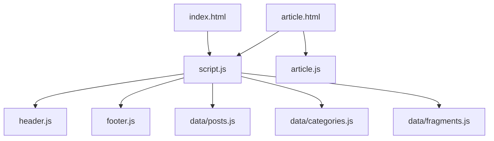
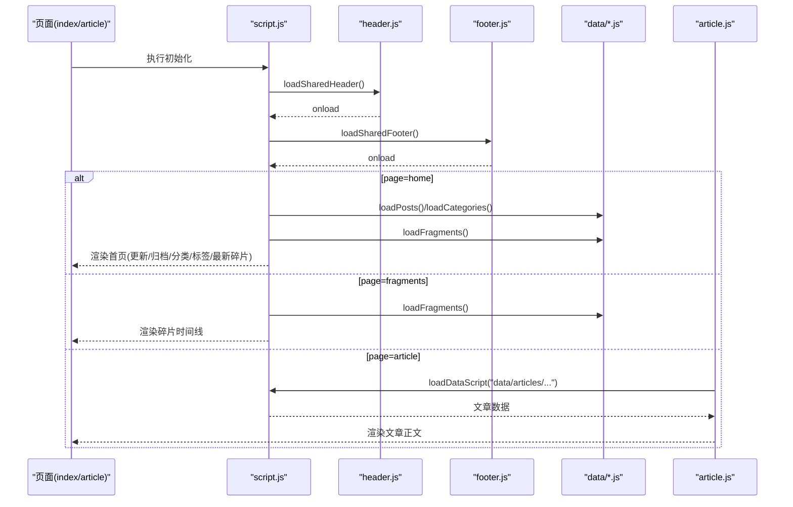
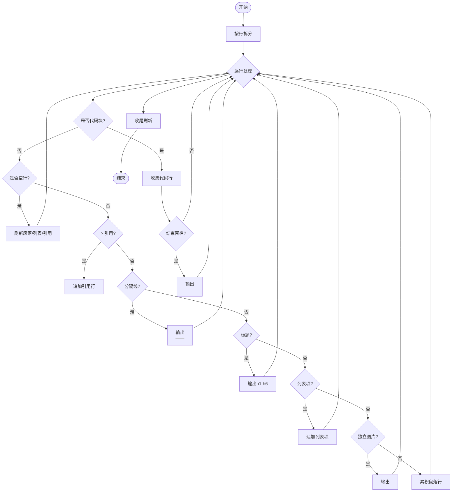
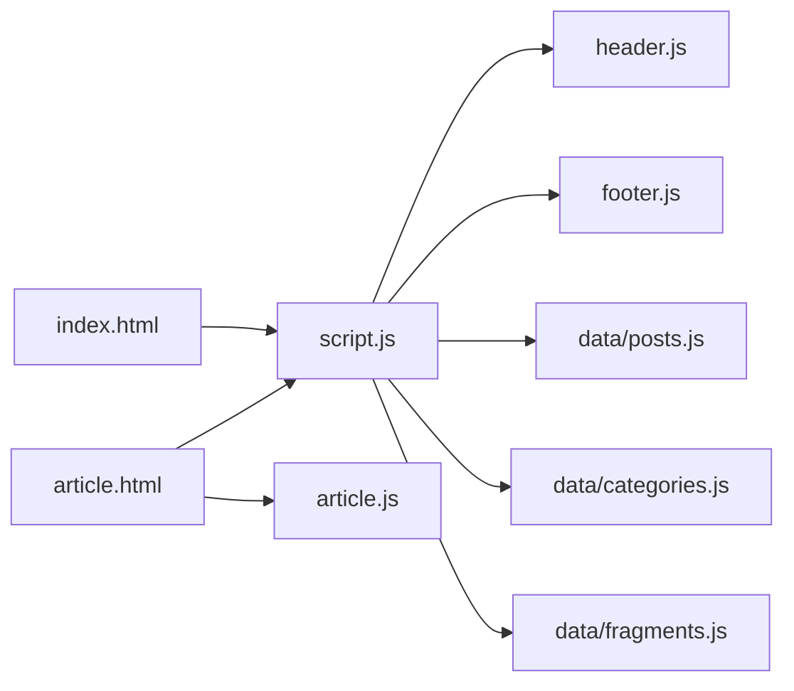

# API参考文档

<cite>
**本文引用的文件**   
- [script.js](file://script.js)
- [article.js](file://article.js)
- [header.js](file://header.js)
- [footer.js](file://footer.js)
- [index.html](file://index.html)
- [article.html](file://article.html)
- [data/posts.js](file://data/posts.js)
- [data/categories.js](file://data/categories.js)
- [data/fragments.js](file://data/fragments.js)
</cite>

## 目录
1. [简介](#简介)
2. [项目结构](#项目结构)
3. [核心组件](#核心组件)
4. [架构总览](#架构总览)
5. [详细组件分析](#详细组件分析)
6. [依赖关系分析](#依赖关系分析)
7. [性能考虑](#性能考虑)
8. [故障排查指南](#故障排查指南)
9. [结论](#结论)
10. [附录：集成与示例](#附录集成与示例)

## 简介
本API参考文档面向博客系统的前端运行时，系统化记录所有公共接口与渲染能力。重点覆盖以下方面：
- 数据加载函数 loadDataScript()
- 路径解析方法 resolveAssetPath()
- 安全过滤函数 escapeHtml()
- 全局工具对象 window.BlogShared 的属性和方法
- 渲染API：renderMarkdown()、renderArticle()、renderFragments()
- 错误处理机制、异步操作模式与性能优化建议
- 实际代码示例与集成指南（以“片段引用”形式给出）

## 项目结构
前端由若干脚本与页面组成：
- script.js：提供数据加载、路径解析、HTML转义、分类/标签/碎片渲染等通用能力，并挂载到 window.BlogShared
- article.js：文章页专用逻辑，包含 Markdown 解析器 renderMarkdown() 与文章渲染器 renderArticle()
- header.js / footer.js：动态注入站点头尾模板
- index.html / article.html：页面入口，通过 data-page 标识不同页面行为



图表来源
- [index.html:1-93](file://index.html#L1-L93)
- [article.html:1-29](file://article.html#L1-L29)
- [script.js:1-701](file://script.js#L1-L701)
- [article.js:1-346](file://article.js#L1-L346)
- [header.js:1-110](file://header.js#L1-L110)
- [footer.js:1-36](file://footer.js#L1-L36)
- [data/posts.js:1-95](file://data/posts.js#L1-L95)
- [data/categories.js:1-19](file://data/categories.js#L1-L19)
- [data/fragments.js:1-14](file://data/fragments.js#L1-L14)

章节来源
- [index.html:1-93](file://index.html#L1-L93)
- [article.html:1-29](file://article.html#L1-L29)
- [script.js:1-701](file://script.js#L1-L701)
- [article.js:1-346](file://article.js#L1-L346)
- [header.js:1-110](file://header.js#L1-L110)
- [footer.js:1-36](file://footer.js#L1-L36)

## 核心组件
本节聚焦公共API与全局工具集，说明其职责、参数、返回值与使用方式。

### 全局工具集 window.BlogShared
- 暴露内容
  - loadDataScript(relativePath, globalName, isValid?)
  - escapeHtml(value)
  - sanitizeSegment(value)
  - normalizePath(path)
  - isSpecialUrl(url)
  - resolveAssetPath(relativePath, baseDir?)
- 典型用途
  - 在任意页面按需加载数据脚本或共享模块
  - 统一进行路径解析与安全转义
  - 为自定义渲染逻辑提供基础工具

章节来源
- [script.js:188-195](file://script.js#L188-L195)

### 数据加载函数 loadDataScript()
- 作用
  - 动态插入 <script> 标签加载指定相对路径的数据脚本
  - 校验目标全局变量是否存在且满足验证器
  - 返回 Promise，成功时解析为全局变量值
- 参数
  - relativePath: string，数据脚本相对路径（如 "data/posts.js"）
  - globalName: string，期望的全局变量名（如 "__BLOG_POSTS__"）
  - isValid?: (value) => boolean，可选校验函数，默认恒真
- 返回值
  - Promise<T>，T 为全局变量的类型
- 错误处理
  - 当全局变量缺失或不满足校验时，拒绝并抛出错误
  - 当脚本加载失败时，拒绝并抛出错误
- 使用示例（片段引用）
  - 加载文章列表：[loadPosts:39-45](file://script.js#L39-L45)
  - 加载分类列表：[loadCategories:47-53](file://script.js#L47-L53)
  - 加载碎片列表：[loadFragments:55-61](file://script.js#L55-L61)

章节来源
- [script.js:12-37](file://script.js#L12-L37)
- [script.js:39-61](file://script.js#L39-L61)

### 路径解析方法 resolveAssetPath()
- 作用
  - 将相对路径规范化为可访问的URL
  - 支持特殊协议、绝对路径、受控目录前缀以及 HTML 链接
- 参数
  - relativePath: string，待解析的路径
  - baseDir?: string，可选的基础目录（如 sourceDir、imageDir）
- 返回值
  - string，规范化后的路径；若输入为空则返回空字符串
- 规则要点
  - 空值直接返回空串
  - 特殊URL（含协议、根路径或锚点）原样返回
  - 受控目录前缀 assets|data|posts|image 开头的路径直接规范化
  - 形如 xxx.html 的链接直接返回
  - 其他情况拼接 baseDir 后规范化
- 使用示例（片段引用）
  - 文章封面路径解析：[resolvePostCoverPath:197-199](file://script.js#L197-L199)
  - 文章图片路径解析：[resolveImagePath:47-49](file://article.js#L47-L49)
  - 文章源路径解析：[resolveSourcePath:43-45](file://article.js#L43-L45)

章节来源
- [script.js:168-186](file://script.js#L168-L186)
- [script.js:197-199](file://script.js#L197-L199)
- [article.js:43-49](file://article.js#L43-L49)

### 安全过滤函数 escapeHtml()
- 作用
  - 对字符串进行HTML实体转义，防止XSS
- 参数
  - value: any，将被转为字符串并转义
- 返回值
  - string，已转义的字符串
- 使用示例（片段引用）
  - 多处用于输出用户可控文本，例如文章标题、摘要、标签等：[renderPostGrid:301-327](file://script.js#L301-L327)、[renderArchive:329-370](file://script.js#L329-L370)、[renderCategories:372-406](file://script.js#L372-L406)、[renderTags:408-436](file://script.js#L408-L436)、[renderFragments:600-635](file://script.js#L600-L635)

章节来源
- [script.js:129-136](file://script.js#L129-L136)

### 辅助工具（BlogShared 内部）
- sanitizeSegment(value): 清理URL段，仅保留字母数字、下划线和连字符
- normalizePath(path): 规范化路径，处理 .. 与 . 段，统一斜杠
- isSpecialUrl(url): 判断是否为特殊URL（协议、根路径或锚点）

章节来源
- [script.js:138-166](file://script.js#L138-L166)

## 架构总览
整体运行流程如下：
- 页面初始化时加载 header.js 与 footer.js 动态注入头尾
- 根据 data-page 决定页面行为：
  - home：加载 posts、categories、fragments，渲染最近更新、归档、分类、标签与最新碎片
  - fragments：加载 fragments 并渲染时间线
  - article：加载文章数据并渲染正文



图表来源
- [script.js:63-87](file://script.js#L63-L87)
- [script.js:666-701](file://script.js#L666-L701)
- [article.js:322-345](file://article.js#L322-L345)
- [header.js:1-110](file://header.js#L1-L110)
- [footer.js:1-36](file://footer.js#L1-L36)

## 详细组件分析

### 渲染API：renderMarkdown()
- 作用
  - 将Markdown文本转换为HTML片段
  - 支持段落、标题、无序/有序列表、引用块、水平分割线、行内代码、粗体、斜体、删除线、图片与链接
  - 自动识别 .md 链接并转换为文章路由
- 参数
  - markdown: string，原始Markdown文本
  - article: object，文章元信息，用于解析图片与链接路径
- 返回值
  - string，生成的HTML片段
- 关键实现细节
  - 行内渲染 renderInlineMarkdown() 负责图片、链接、行内标记
  - 代码块使用 ``` 围栏语法，支持语言类名
  - 链接解析：
    - 匹配 posts/<category>/<slug>.md 时生成 article.html?category=&slug= 路由
    - 其他链接走 resolveSourcePath() 或 resolveImagePath()
- 使用示例（片段引用）
  - 文章正文渲染调用处：[renderArticle](file://article.js#L280-L320)



图表来源
- [article.js:96-L266](file://article.js#L96-L266)

章节来源
- [article.js:65-L94](file://article.js#L65-L94)
- [article.js:96-L266](file://article.js#L96-L266)
- [article.js:280-L320](file://article.js#L280-L320)

### 渲染API：renderArticle()
- 作用
  - 渲染文章详情页，包括标题、元信息、标签、封面与正文
  - 更新页面标题与描述
- 参数
  - article: object，文章数据对象（来自 data/articles/<folder>/<slug>.js）
- 行为
  - 设置 document.title 与 meta description
  - 组装元信息（日期、字数、阅读时长）、标签、封面图
  - 调用 renderMarkdown() 渲染正文
- 使用示例（片段引用）
  - 文章加载成功后渲染：[mountArticlePage](file://article.js#L322-L345)

章节来源
- [article.js:268-L320](file://article.js#L268-L320)
- [article.js:322-L345](file://article.js#L322-L345)

### 渲染API：renderFragments()
- 作用
  - 渲染碎片时间线，按时间倒序排列
  - 支持多段落文本与图片集合
- 参数
  - fragments: array，碎片数组（来自 data/fragments.js）
- 行为
  - 排序：优先使用 date/timeLabel，降序
  - 段落归一化：支持 paragraphs、content 字段
  - 图片渲染：支持字符串或对象（src/path、alt、caption），自动解析图片路径
- 使用示例（片段引用）
  - 碎片页加载与渲染：[loadFragments().then(renderFragments)](file://script.js#L693-L700)

章节来源
- [script.js:532-L549](file://script.js#L532-L549)
- [script.js:551-L598](file://script.js#L551-L598)
- [script.js:600-L635](file://script.js#L600-L635)
- [script.js:693-L700](file://script.js#L693-L700)

### 全局工具集 window.BlogShared 方法与属性
- 方法清单
  - loadDataScript(relativePath, globalName, isValid?)
  - escapeHtml(value)
  - sanitizeSegment(value)
  - normalizePath(path)
  - isSpecialUrl(url)
  - resolveAssetPath(relativePath, baseDir?)
- 使用场景
  - 在任意页面按需加载数据脚本
  - 统一路径解析与安全转义
  - 构建自定义渲染逻辑时的基础工具

章节来源
- [script.js:188-L195](file://script.js#L188-L195)

## 依赖关系分析
- 页面脚本依赖
  - index.html 引入 script.js
  - article.html 引入 script.js 与 article.js
- 运行时依赖
  - script.js 动态加载 header.js 与 footer.js
  - script.js 按需加载 data/posts.js、data/categories.js、data/fragments.js
  - article.js 依赖 window.BlogShared 提供的工具



图表来源
- [index.html:1-93](file://index.html#L1-L93)
- [article.html:1-29](file://article.html#L1-L29)
- [script.js:1-701](file://script.js#L1-L701)
- [article.js:1-346](file://article.js#L1-L346)
- [header.js:1-110](file://header.js#L1-L110)
- [footer.js:1-36](file://footer.js#L1-L36)
- [data/posts.js:1-95](file://data/posts.js#L1-L95)
- [data/categories.js:1-19](file://data/categories.js#L1-L19)
- [data/fragments.js:1-14](file://data/fragments.js#L1-L14)

章节来源
- [index.html:1-93](file://index.html#L1-L93)
- [article.html:1-29](file://article.html#L1-L29)
- [script.js:1-701](file://script.js#L1-L701)
- [article.js:1-346](file://article.js#L1-L346)

## 性能考虑
- 资源加载
  - 使用 async=false 确保脚本顺序执行，避免竞态条件
  - 为数据脚本添加版本号查询参数，强制浏览器缓存失效
- DOM操作
  - 批量渲染时使用 innerHTML 一次性替换，减少重排重绘
  - 图片使用 loading="lazy" 延迟加载
- 计算复杂度
  - 分类与标签统计采用单次遍历聚合，时间复杂度 O(n)
  - 排序基于日期与自定义顺序，注意大数据量时可考虑分页或虚拟滚动
- 内存占用
  - 避免重复创建大字符串，尽量复用中间结果
  - 及时释放不再使用的DOM节点引用

## 故障排查指南
- 常见问题
  - 共享工具不可用：检查 script.js 是否正确加载，window.BlogShared 是否存在
  - 文章加载失败：确认 data/articles/<folder>/<slug>.js 存在且导出对象非空
  - 图片无法显示：检查 resolveAssetPath() 拼接的 baseDir 是否正确
- 错误处理
  - loadDataScript() 在加载失败或校验失败时抛出错误，建议在调用链中捕获并降级展示
  - 文章页在缺少参数或加载失败时渲染占位提示
- 调试建议
  - 打开控制台查看错误堆栈
  - 检查网络请求是否成功，关注响应状态码与CORS策略

章节来源
- [article.js:13-16](file://article.js#L13-L16)
- [article.js:322-345](file://article.js#L322-L345)
- [script.js:666-701](file://script.js#L666-L701)

## 结论
本博客系统通过统一的 window.BlogShared 工具集与模块化渲染API，实现了数据加载、路径解析、安全转义与多种渲染能力。借助 loadDataScript() 的动态加载机制与完善的错误处理，系统在保持轻量化的同时具备良好的可扩展性与稳定性。

## 附录：集成与示例
- 在任意页面使用 loadDataScript() 加载数据
  - 示例路径：[loadPosts:39-45](file://script.js#L39-L45)、[loadCategories:47-53](file://script.js#L47-L53)、[loadFragments:55-61](file://script.js#L55-L61)
- 使用 resolveAssetPath() 解析资源路径
  - 示例路径：[resolvePostCoverPath:197-199](file://script.js#L197-L199)、[resolveImagePath:47-49](file://article.js#L47-L49)
- 使用 escapeHtml() 进行安全输出
  - 示例路径：[renderPostGrid:301-327](file://script.js#L301-L327)、[renderArchive:329-370](file://script.js#L329-L370)、[renderCategories:372-406](file://script.js#L372-L406)、[renderTags:408-436](file://script.js#L408-L436)、[renderFragments:600-635](file://script.js#L600-L635)
- 使用 renderMarkdown() 渲染文章内容
  - 示例路径：[renderArticle:280-320](file://article.js#L280-L320)
- 使用 renderFragments() 渲染碎片时间线
  - 示例路径：[renderFragments:600-635](file://script.js#L600-L635)