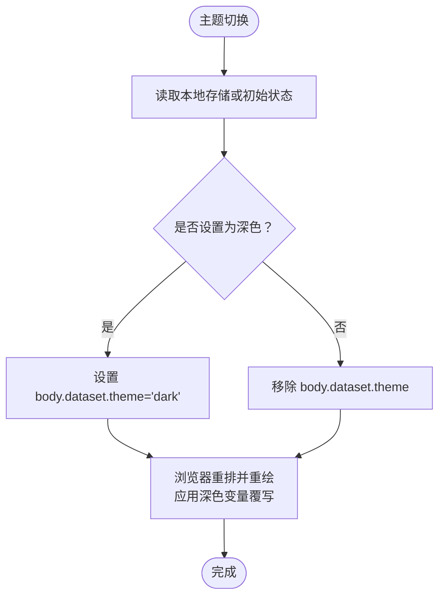
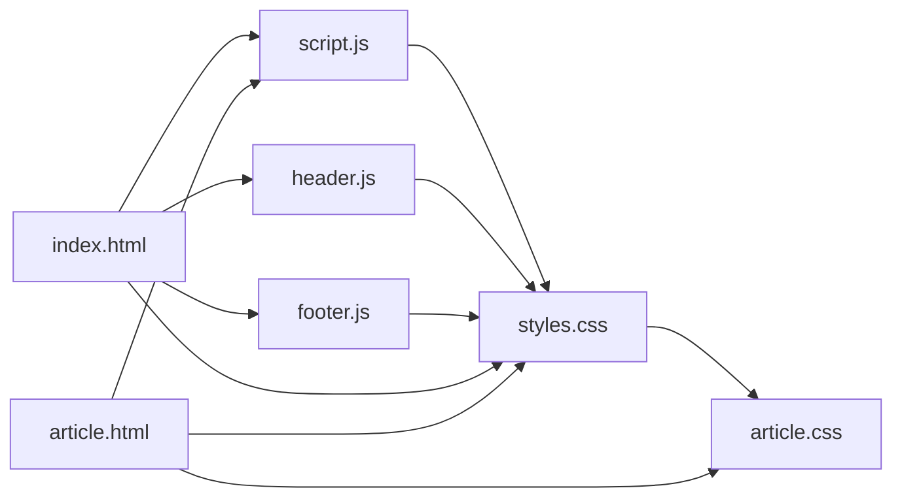

# CSS变量系统

<cite>
**本文引用的文件**
- [styles.css](file://styles.css)
- [article.css](file://article.css)
- [script.js](file://script.js)
- [header.js](file://header.js)
- [footer.js](file://footer.js)
- [index.html](file://index.html)
- [article.html](file://article.html)
</cite>

## 目录
1. [简介](#简介)
2. [项目结构](#项目结构)
3. [核心组件](#核心组件)
4. [架构总览](#架构总览)
5. [详细组件分析](#详细组件分析)
6. [依赖关系分析](#依赖关系分析)
7. [性能考量](#性能考量)
8. [故障排查指南](#故障排查指南)
9. [结论](#结论)
10. [附录](#附录)

## 简介
本技术文档聚焦博客的CSS变量系统，系统性梳理自定义属性的架构设计、命名约定、主题映射与使用规范。内容覆盖颜色令牌（背景、面板、文本、强调色等）、字体配置、间距与圆角、阴影效果、响应式断点以及浅色/深色主题的完整调色板映射。同时提供在组件中正确使用变量的最佳实践、调试技巧与性能优化建议，帮助团队保持视觉一致性与可维护性。

## 项目结构
本项目采用“样式集中 + 页面级扩展”的组织方式：
- 全局样式与变量定义集中在 styles.css
- 文章页专用样式在 article.css 中扩展
- 主题切换由 script.js 驱动，通过 body 上的 data-theme 属性控制
- header.js 与 footer.js 负责动态注入头部与尾部结构，不直接参与变量定义
- HTML 入口 index.html 与 article.html 引入对应样式并挂载脚本

```mermaid
graph TB
A["HTML入口<br/>index.html / article.html"] --> B["全局样式<br/>styles.css"]
A --> C["文章页样式<br/>article.css"]
A --> D["主题与数据脚本<br/>script.js"]
A --> E["共享头部脚本<br/>header.js"]
A --> F["共享尾部脚本<br/>footer.js"]
D --> |设置 body[data-theme]| B
D --> |设置 body[data-theme]| C
```

图表来源
- [index.html:1-93](file://index.html#L1-L93)
- [article.html:1-29](file://article.html#L1-L29)
- [styles.css:1-31](file://styles.css#L1-L31)
- [article.css:1-20](file://article.css#L1-L20)
- [script.js:1-11](file://script.js#L1-L11)
- [header.js:1-110](file://header.js#L1-L110)
- [footer.js:1-36](file://footer.js#L1-L36)

章节来源
- [index.html:1-93](file://index.html#L1-L93)
- [article.html:1-29](file://article.html#L1-L29)
- [styles.css:1-31](file://styles.css#L1-L31)
- [article.css:1-20](file://article.css#L1-L20)
- [script.js:1-11](file://script.js#L1-L11)
- [header.js:1-110](file://header.js#L1-L110)
- [footer.js:1-36](file://footer.js#L1-L36)

## 核心组件
本节从变量维度解构系统的核心组成，包括颜色令牌、字体与排版、间距与圆角、阴影与层级、布局宽度与响应式断点。

- 颜色令牌
  - 基础色板：--bg（背景）、--text（主文本）、--muted（次要文本）
  - 面板与边框：--panel（半透明面板）、--panel-strong（强面板）、--line（分割线）
  - 强调色族：--accent（强调）、--accent-soft（弱化强调）、--accent-glow（光晕）
  - 辅助色：--olive（橄榄绿）
  - 阴影：--shadow（统一投影）
  - 这些变量在 :root 下定义默认值，并在 body[data-theme="dark"] 下覆写为深色值，形成完整的浅/深双主题映射。

- 字体与排版
  - 全局字体栈在 body 上声明，包含西文与中文回退，确保跨平台可读性
  - 标题与品牌文字使用衬线体以增强气质，正文使用无衬线体提升可读性

- 间距与圆角
  - 圆角变量 --radius-lg、--radius-md、--radius-sm 用于卡片、按钮、图片容器等
  - 间距主要通过类选择器中的 padding/margin/gap 实现，配合变量构建一致的节奏

- 阴影与层级
  - --shadow 统一卡片与模块的投影强度，深色模式下加深阴影以增强层次

- 布局宽度与响应式断点
  - --content-width 作为内容最大宽度变量，在媒体查询中按屏幕尺寸调整
  - 断点策略：1180px、860px、768px、560px，逐步收紧布局与字号

章节来源
- [styles.css:1-31](file://styles.css#L1-L31)
- [styles.css:37-50](file://styles.css#L37-L50)
- [styles.css:1000-1002](file://styles.css#L1000-L1002)
- [styles.css:1035-1038](file://styles.css#L1035-L1038)
- [styles.css:1093-1134](file://styles.css#L1093-L1134)
- [styles.css:1136-1203](file://styles.css#L1136-L1203)

## 架构总览
CSS变量系统采用“根级定义 + 主题覆写 + 组件引用”的三层架构：
- 根级定义：在 :root 中声明所有语义化变量，保证单一事实源
- 主题覆写：在 body[data-theme="dark"] 中覆写变量值，实现一键换肤
- 组件引用：各组件通过 var(--xxx) 引用变量，避免硬编码颜色与尺寸

```mermaid
classDiagram
class RootVariables {
"+--bg"
"+--panel"
"+--panel-strong"
"+--line"
"+--text"
"+--muted"
"+--accent"
"+--accent-soft"
"+--accent-glow"
"+--olive"
"+--shadow"
"+--radius-lg"
"+--radius-md"
"+--radius-sm"
"+--content-width"
}
class DarkThemeOverrides {
"+--bg"
"+--panel"
"+--panel-strong"
"+--line"
"+--text"
"+--muted"
"+--accent"
"+--accent-soft"
"+--accent-glow"
"+--olive"
"+--shadow"
}
class Components {
"+Header"
"+Hero"
"+PostCard"
"+ArchiveCard"
"+SidebarCard"
"+ArticleDetail"
}
RootVariables <.. Components : "var(--xxx)"
DarkThemeOverrides <.. RootVariables : "覆写"
```

图表来源
- [styles.css:1-31](file://styles.css#L1-L31)
- [styles.css:82-110](file://styles.css#L82-L110)
- [styles.css:355-413](file://styles.css#L355-L413)
- [styles.css:436-456](file://styles.css#L436-L456)
- [styles.css:614-620](file://styles.css#L614-L620)
- [article.css:1-14](file://article.css#L1-L14)

章节来源
- [styles.css:1-31](file://styles.css#L1-L31)
- [styles.css:82-110](file://styles.css#L82-L110)
- [styles.css:355-413](file://styles.css#L355-L413)
- [styles.css:436-456](file://styles.css#L436-L456)
- [styles.css:614-620](file://styles.css#L614-L620)
- [article.css:1-14](file://article.css#L1-L14)

## 详细组件分析

### 颜色令牌与主题映射
- 浅色主题（默认）
  - 背景：--bg 使用浅色暖灰
  - 面板：--panel 与 --panel-strong 使用高透明度白色渐变
  - 文本：--text 为深蓝黑，--muted 为中灰色
  - 强调：--accent 为冷蓝，--accent-soft 为淡蓝背景，--accent-glow 为低饱和光晕
  - 辅助：--olive 为柔和绿色
  - 线条：--line 为浅灰分隔线
  - 阴影：--shadow 为轻投影
- 深色主题（body[data-theme="dark"]）
  - 背景：--bg 转为深蓝黑
  - 面板：--panel 与 --panel-strong 使用深色半透明层
  - 文本：--text 为亮白，--muted 为浅灰
  - 强调：--accent 为亮蓝，--accent-soft 为低饱和强调背景，--accent-glow 为更亮的蓝色光晕
  - 辅助：--olive 为偏暗的绿色
  - 线条：--line 为低对比度灰线
  - 阴影：--shadow 加深以增强层次



图表来源
- [script.js:7-10](file://script.js#L7-L10)
- [script.js:95-106](file://script.js#L95-L106)
- [styles.css:19-31](file://styles.css#L19-L31)

章节来源
- [styles.css:1-31](file://styles.css#L1-L31)
- [script.js:7-10](file://script.js#L7-L10)
- [script.js:95-106](file://script.js#L95-L106)

### 字体配置与排版
- 全局字体栈在 body 上定义，优先使用现代无衬线字体，回退到 PingFang SC 与 Microsoft YaHei 以确保中文显示质量
- 标题与品牌区域使用 STSong/Songti SC/SimSun 等衬线体，营造人文感
- 代码块使用 Cascadia Code/Consolas 等等宽字体，提升可读性

章节来源
- [styles.css:43-50](file://styles.css#L43-L50)
- [styles.css:142-147](file://styles.css#L142-L147)
- [article.css:128-134](file://article.css#L128-L134)

### 间距与圆角规范
- 圆角变量
  - --radius-lg：大圆角（如卡片、封面）
  - --radius-md：中等圆角（如图片容器、标签）
  - --radius-sm：小圆角（如内嵌元素）
- 间距
  - 通过类选择器中的 padding、margin、gap 组合实现
  - 列表与网格使用 gap 控制元素间距，保持一致的视觉节奏

章节来源
- [styles.css:12-16](file://styles.css#L12-L16)
- [styles.css:355-371](file://styles.css#L355-L371)
- [styles.css:436-456](file://styles.css#L436-L456)

### 阴影与层级
- --shadow 统一卡片与模块的投影，浅色模式较柔和，深色模式更深
- 头部与卡片在 hover 或激活态时，通过背景与边框变化强化交互反馈

章节来源
- [styles.css:12](file://styles.css#L12)
- [styles.css:106-110](file://styles.css#L106-L110)
- [styles.css:751-758](file://styles.css#L751-L758)

### 布局宽度与响应式断点
- --content-width 在 :root 中定义默认值，并在媒体查询中根据屏幕宽度调整
- 断点策略
  - 1180px：缩小内容宽度，调整头部网格与侧边栏布局
  - 860px：进一步收缩，移动端友好
  - 768px：启用移动端导航折叠
  - 560px：最小屏适配，调整字号与间距

章节来源
- [styles.css:16](file://styles.css#L16)
- [styles.css:1000-1002](file://styles.css#L1000-L1002)
- [styles.css:1035-1038](file://styles.css#L1035-L1038)
- [styles.css:1093-1134](file://styles.css#L1093-L1134)
- [styles.css:1136-1203](file://styles.css#L1136-L1203)

### 文章详情页变量使用
- 文章容器使用 --line 作为边框、--panel-strong 与 --panel 做渐变背景、--shadow 统一投影
- 元信息与标签使用 --muted，正文使用 --text，链接与引用在深色模式下有独立配色

章节来源
- [article.css:9-14](file://article.css#L9-L14)
- [article.css:27-30](file://article.css#L27-L30)
- [article.css:44-47](file://article.css#L44-L47)
- [article.css:58-62](file://article.css#L58-L62)
- [article.css:167-196](file://article.css#L167-L196)

## 依赖关系分析
- 样式依赖
  - styles.css 定义全局变量与通用样式
  - article.css 依赖 styles.css 的变量进行文章页定制
- 脚本依赖
  - script.js 初始化主题与数据加载，影响 body.data-theme，从而触发样式变量覆写
  - header.js 与 footer.js 仅负责 DOM 注入，不直接操作变量



图表来源
- [styles.css:1-31](file://styles.css#L1-L31)
- [article.css:1-20](file://article.css#L1-L20)
- [script.js:1-11](file://script.js#L1-L11)
- [header.js:1-110](file://header.js#L1-L110)
- [footer.js:1-36](file://footer.js#L1-L36)
- [index.html:1-93](file://index.html#L1-L93)
- [article.html:1-29](file://article.html#L1-L29)

章节来源
- [styles.css:1-31](file://styles.css#L1-L31)
- [article.css:1-20](file://article.css#L1-L20)
- [script.js:1-11](file://script.js#L1-L11)
- [header.js:1-110](file://header.js#L1-L110)
- [footer.js:1-36](file://footer.js#L1-L36)
- [index.html:1-93](file://index.html#L1-L93)
- [article.html:1-29](file://article.html#L1-L29)

## 性能考量
- 变量覆写开销
  - 使用 body[data-theme] 覆写变量属于轻量级样式变更，浏览器会高效重排与重绘
- 过渡动画
  - 文本颜色与背景存在 transition，切换主题时有平滑体验；注意避免过度动画导致卡顿
- 资源加载
  - 样式与脚本均带版本参数，利于缓存更新；按需加载 header/footer 脚本减少首屏负担
- 渲染路径
  - 尽量复用变量，避免重复计算复杂表达式；将常用尺寸与颜色抽象为变量，减少冗余规则

[本节为通用指导，无需具体文件分析]

## 故障排查指南
- 主题未生效
  - 检查 body 是否设置了 data-theme 属性
  - 确认 script.js 是否正确写入 localStorage 并设置 dataset
- 变量未生效
  - 确认样式文件中是否存在对应的变量定义
  - 检查选择器优先级与媒体查询覆盖范围
- 深色模式异常
  - 核对 body[data-theme="dark"] 下的变量覆写是否完整
  - 检查特定组件是否有硬编码颜色覆盖了变量

章节来源
- [script.js:7-10](file://script.js#L7-L10)
- [script.js:95-106](file://script.js#L95-L106)
- [styles.css:19-31](file://styles.css#L19-L31)

## 结论
该博客的CSS变量系统以语义化命名与主题覆写为核心，实现了清晰的颜色体系、统一的排版与间距规范、良好的响应式适配与稳定的主题切换体验。通过集中定义与组件引用，系统在可维护性与一致性方面表现良好。建议在后续迭代中继续完善变量分层与文档化，进一步提升团队协作效率与视觉一致性。

[本节为总结性内容，无需具体文件分析]

## 附录

### 变量命名约定与组织结构
- 前缀与语义
  - 颜色：--bg、--text、--muted、--accent、--accent-soft、--accent-glow、--olive
  - 面板与边框：--panel、--panel-strong、--line
  - 阴影与层级：--shadow
  - 圆角：--radius-lg、--radius-md、--radius-sm
  - 布局：--content-width
- 组织原则
  - 在 :root 中统一定义，保持单一事实源
  - 在 body[data-theme="dark"] 中覆写，形成主题映射
  - 组件通过 var(--xxx) 引用，避免硬编码

章节来源
- [styles.css:1-31](file://styles.css#L1-L31)

### 变量使用示例与最佳实践
- 在组件中使用变量
  - 背景与面板：使用 --panel 与 --panel-strong 构建半透明卡片
  - 文本与强调：使用 --text 与 --accent 控制主文本与强调元素
  - 边框与分割：使用 --line 统一分割线风格
  - 圆角与阴影：使用 --radius-* 与 --shadow 统一视觉语言
- 避免硬编码
  - 不要直接使用十六进制颜色值，应引用变量
  - 对复杂渐变或阴影，考虑封装为变量或派生变量
- 保持设计一致性
  - 新增组件时优先复用现有变量
  - 如需新增变量，遵循命名约定并补充主题覆写

章节来源
- [styles.css:82-110](file://styles.css#L82-L110)
- [styles.css:355-413](file://styles.css#L355-L413)
- [styles.css:436-456](file://styles.css#L436-L456)
- [styles.css:614-620](file://styles.css#L614-L620)
- [article.css:9-14](file://article.css#L9-L14)

### 变量调试技巧
- 在浏览器开发者工具中查看 computed 值，确认变量解析结果
- 临时在 :root 或 body[data-theme="dark"] 中修改变量值，快速验证视觉效果
- 使用媒体查询断点观察 --content-width 的变化是否符合预期

章节来源
- [styles.css:1000-1002](file://styles.css#L1000-L1002)
- [styles.css:1035-1038](file://styles.css#L1035-L1038)