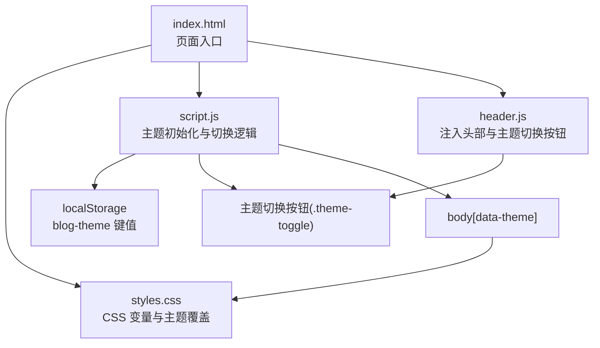
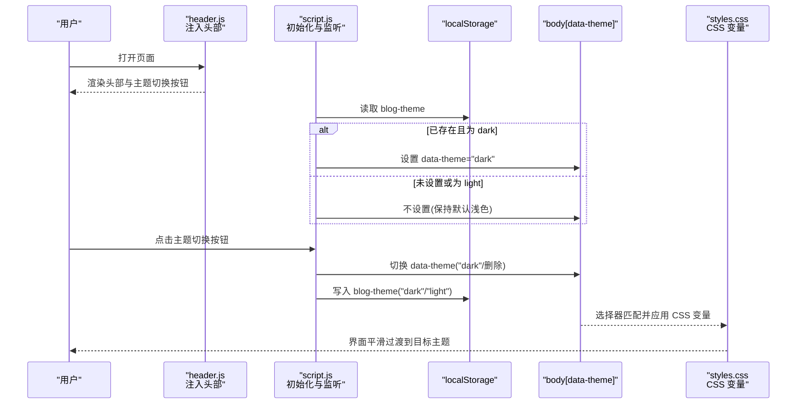
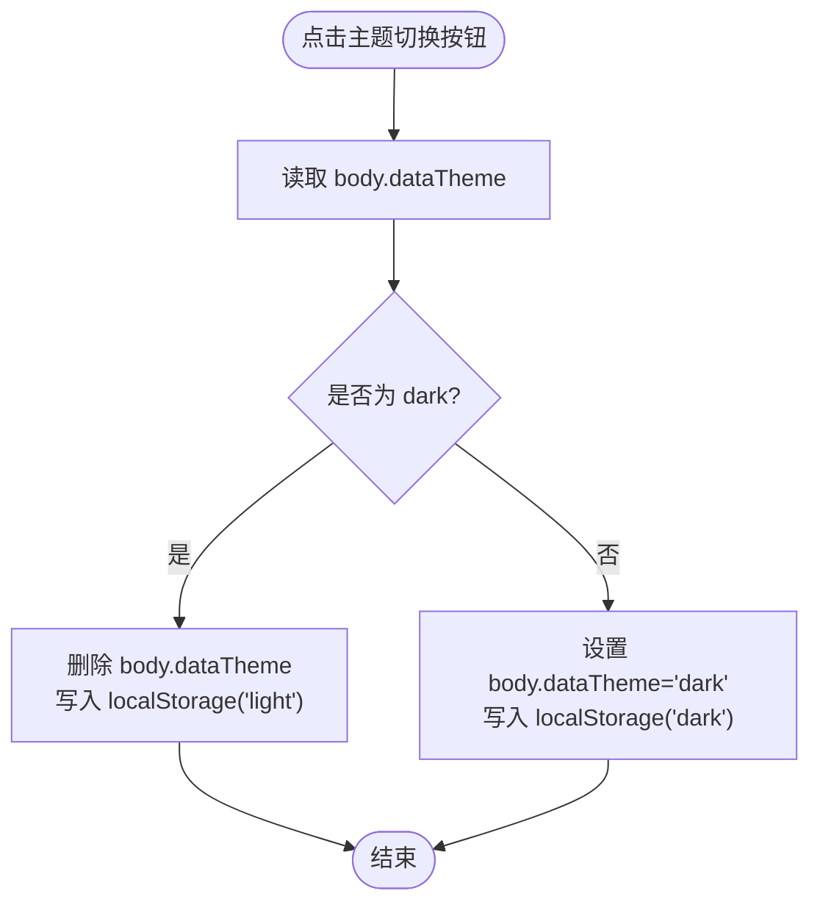
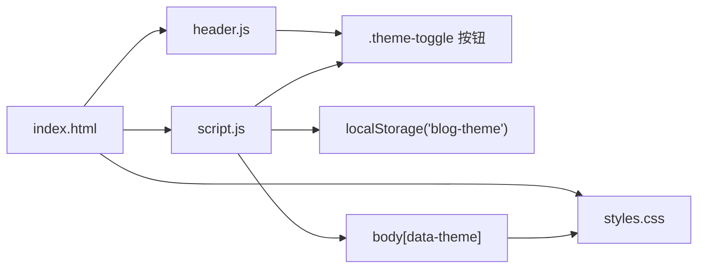

# 主题切换机制

<cite>
**本文引用的文件**
- [script.js](file://script.js)
- [styles.css](file://styles.css)
- [header.js](file://header.js)
- [index.html](file://index.html)
</cite>

## 目录
1. [简介](#简介)
2. [项目结构](#项目结构)
3. [核心组件](#核心组件)
4. [架构总览](#架构总览)
5. [详细组件分析](#详细组件分析)
6. [依赖关系分析](#依赖关系分析)
7. [性能与优化建议](#性能与优化建议)
8. [故障排查指南](#故障排查指南)
9. [结论](#结论)
10. [附录：API 使用指南](#附录api-使用指南)

## 简介
本技术文档围绕博客的主题切换机制，系统性阐述深色/浅色主题的切换逻辑、DOM 属性驱动样式匹配、本地存储持久化、初始主题设置策略、动画过渡效果以及编程式 API 的使用方式。该实现以 CSS 自定义属性为核心，通过 body 的 data-theme 属性进行主题选择器匹配，结合 localStorage 保存用户偏好，并在页面加载时恢复状态。

## 项目结构
主题相关的关键文件与职责如下：
- script.js：负责主题初始化、切换交互、事件绑定与状态持久化。
- styles.css：定义默认（浅色）与深色两套 CSS 变量及主题覆盖规则，并配置过渡动画。
- header.js：动态注入包含“主题切换按钮”的头部模板。
- index.html：页面入口，引入样式与脚本，提供数据挂载点。

图表来源
- [index.html:1-93](file://index.html#L1-L93)
- [styles.css:1-80](file://styles.css#L1-L80)
- [script.js:1-110](file://script.js#L1-L110)
- [header.js:30-86](file://header.js#L30-L86)

章节来源
- [index.html:1-93](file://index.html#L1-L93)
- [script.js:1-110](file://script.js#L1-L110)
- [header.js:30-86](file://header.js#L30-L86)
- [styles.css:1-80](file://styles.css#L1-L80)

## 核心组件
- DOM 属性驱动：通过 body.dataset.theme 的值控制主题选择器生效。
- CSS 变量体系：在 :root 中定义浅色变量，在 body[data-theme="dark"] 中覆盖为深色变量。
- 本地存储持久化：使用 window.localStorage 的 blog-theme 键保存用户偏好。
- 初始化与恢复：页面启动时读取 localStorage，若值为 "dark" 则设置 body 的 data-theme 为 "dark"。
- 切换交互：点击 .theme-toggle 按钮触发切换，更新 body 的 data-theme 并同步写入 localStorage。

章节来源
- [script.js:7-10](file://script.js#L7-L10)
- [script.js:95-106](file://script.js#L95-L106)
- [styles.css:1-31](file://styles.css#L1-L31)
- [header.js:56-72](file://header.js#L56-L72)

## 架构总览
主题切换的整体流程由“用户交互 → 状态变更 → 样式匹配 → 持久化”构成。

图表来源
- [header.js:30-86](file://header.js#L30-L86)
- [script.js:7-10](file://script.js#L7-L10)
- [script.js:95-106](file://script.js#L95-L106)
- [styles.css:1-31](file://styles.css#L1-L31)

## 详细组件分析

### 1) DOM 属性操作与 CSS 选择器匹配
- 主题标记：body.dataset.theme 作为主题开关。当值为 "dark" 时，CSS 中 body[data-theme="dark"] 的规则生效；否则回退到 :root 定义的浅色变量。
- 变量覆盖：在 :root 中声明一组 CSS 变量（背景、文本、强调色等），在 body[data-theme="dark"] 中覆盖这些变量，从而全局切换配色。
- 伪元素适配：背景图与渐变叠加层在深色模式下通过 filter 与新的渐变背景进行适配，确保视觉一致性。

章节来源
- [script.js:7-10](file://script.js#L7-L10)
- [styles.css:1-31](file://styles.css#L1-L31)
- [styles.css:72-80](file://styles.css#L72-L80)

### 2) 本地存储持久化机制
- 保存位置：window.localStorage 的键名为 "blog-theme"。
- 数据格式：字符串 "dark" 或 "light"。当前实现仅在切换时写入这两个值之一；在未显式设置为 "dark" 的情况下，视为浅色。
- 跨会话恢复：页面加载时读取 "blog-theme"，若为 "dark" 则立即设置 body 的 data-theme 为 "dark"，从而实现跨会话的状态恢复。

章节来源
- [script.js:7-10](file://script.js#L7-L10)
- [script.js:95-106](file://script.js#L95-L106)

### 3) 系统主题检测与初始主题设置策略
- 当前实现未使用 prefers-color-scheme 媒体查询进行系统主题检测，而是采用“显式保存优先”的策略：仅当 localStorage 中存在 "dark" 时才启用深色模式，否则默认浅色。
- 这意味着首次访问或清除缓存后，将始终回到浅色主题，除非用户主动切换到深色并保存。

章节来源
- [script.js:7-10](file://script.js#L7-L10)

### 4) 主题切换的动画过渡效果
- 颜色过渡：body 设置了 color 的 transition，使文字颜色在主题切换时平滑变化。
- 交互反馈：按钮、导航项、卡片等普遍配置了 transform、background、color 的过渡，提升切换时的视觉反馈。
- 时序与缓动：多数过渡时长在 180ms–260ms 之间，缓动函数为 ease，保证自然流畅。

章节来源
- [styles.css:48-50](file://styles.css#L48-L50)
- [styles.css:159-184](file://styles.css#L159-L184)
- [styles.css:202-215](file://styles.css#L202-L215)
- [styles.css:377-384](file://styles.css#L377-L384)

### 5) 主题切换 API 与事件监听
- 按钮元素：头部模板中包含 class 为 ".theme-toggle" 的按钮，用于触发切换。
- 事件绑定：在 initSharedHeader 中为 ".theme-toggle" 绑定 click 事件，内部根据当前 body 的 data-theme 判断并执行切换逻辑。
- 编程式切换：可通过直接修改 body.dataset.theme 并同步写入 localStorage 的方式实现程序化切换。

图表来源
- [header.js:56-72](file://header.js#L56-L72)
- [script.js:95-106](file://script.js#L95-L106)

章节来源
- [header.js:56-72](file://header.js#L56-L72)
- [script.js:95-106](file://script.js#L95-L106)

## 依赖关系分析
- 页面入口 index.html 引入 styles.css 与 script.js，并通过 data-shared-header 占位符等待 header.js 注入头部。
- header.js 负责创建并插入包含 ".theme-toggle" 的头部结构。
- script.js 在加载完成后查找 ".theme-toggle" 并绑定事件，同时完成主题初始化与持久化。
- styles.css 通过 CSS 变量与选择器响应 body[data-theme] 的变化。

图表来源
- [index.html:1-93](file://index.html#L1-L93)
- [header.js:30-86](file://header.js#L30-L86)
- [script.js:1-110](file://script.js#L1-L110)
- [styles.css:1-31](file://styles.css#L1-L31)

章节来源
- [index.html:1-93](file://index.html#L1-L93)
- [header.js:30-86](file://header.js#L30-L86)
- [script.js:1-110](file://script.js#L1-L110)
- [styles.css:1-31](file://styles.css#L1-L31)

## 性能与优化建议
- 减少重排重绘：当前实现通过 CSS 变量与选择器切换，避免频繁操作内联样式，有利于性能。
- 过渡时长控制：颜色过渡较短（约 240ms），可兼顾即时反馈与流畅度。
- 背景滤镜成本：深色模式下对背景伪元素使用 filter，可能带来一定渲染开销。建议在低端设备上谨慎使用或降级处理。
- 扩展性建议：如需支持系统主题检测，可在初始化阶段增加对 prefers-color-scheme 的监听，并在系统主题变化时同步更新 body 的 data-theme 与 localStorage。

[本节为通用建议，无需具体文件引用]

## 故障排查指南
- 问题：切换后刷新页面仍为浅色
  - 原因：localStorage 中未保存 "dark" 或已被清除。
  - 排查：检查浏览器开发者工具的应用面板中的 localStorage 是否包含 "blog-theme" 键且值为 "dark"。
  - 参考路径：[script.js:7-10](file://script.js#L7-L10)、[script.js:95-106](file://script.js#L95-L106)
- 问题：点击按钮无反应
  - 原因：头部未成功注入或 ".theme-toggle" 按钮不存在。
  - 排查：确认 header.js 已成功运行并插入了头部模板；检查页面是否存在 ".theme-toggle" 元素。
  - 参考路径：[header.js:30-86](file://header.js#L30-L86)
- 问题：部分元素颜色未跟随切换
  - 原因：对应元素未使用 CSS 变量或未在 body[data-theme="dark"] 下覆盖。
  - 排查：检查样式文件中是否使用了 var(--text)、var(--bg) 等变量，并确保深色覆盖规则完整。
  - 参考路径：[styles.css:1-31](file://styles.css#L1-L31)

章节来源
- [script.js:7-10](file://script.js#L7-L10)
- [script.js:95-106](file://script.js#L95-L106)
- [header.js:30-86](file://header.js#L30-L86)
- [styles.css:1-31](file://styles.css#L1-L31)

## 结论
该博客的主题切换机制简洁可靠：以 body.dataset.theme 为状态源，配合 CSS 变量实现全局配色切换；通过 localStorage 持久化用户偏好，并在页面加载时恢复；通过合理的过渡配置提供顺滑的视觉反馈。当前实现未集成系统主题检测，但易于扩展。整体方案具备良好的可维护性与可扩展性。

[本节为总结性内容，无需具体文件引用]

## 附录：API 使用指南
- 编程式切换主题
  - 切换为深色：设置 body.dataset.theme = "dark"，并将 localStorage 的 "blog-theme" 设为 "dark"。
  - 切换为浅色：删除 body.dataset.theme，并将 localStorage 的 "blog-theme" 设为 "light"。
- 监听主题变化
  - 可在外部代码中监听 body 的 data-theme 变化，或在切换逻辑中派发自定义事件以实现状态同步。
- 事件绑定
  - 主题切换按钮类名为 ".theme-toggle"，可直接为其绑定 click 事件调用上述切换逻辑。

章节来源
- [script.js:95-106](file://script.js#L95-L106)
- [header.js:56-72](file://header.js#L56-L72)