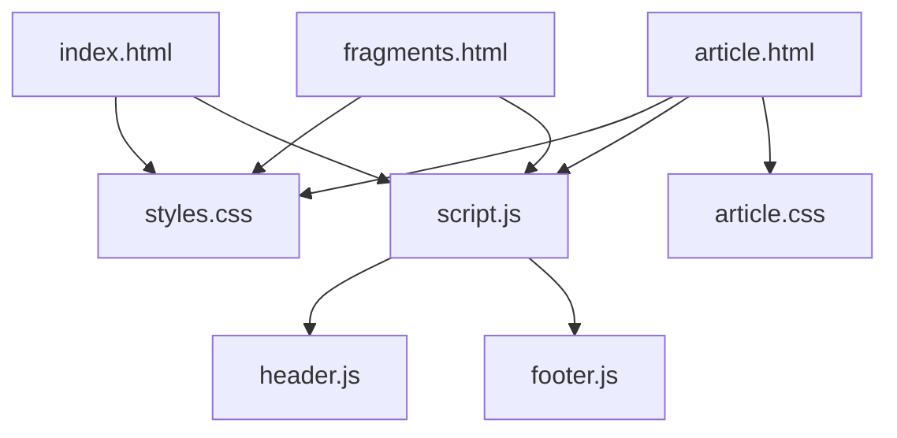
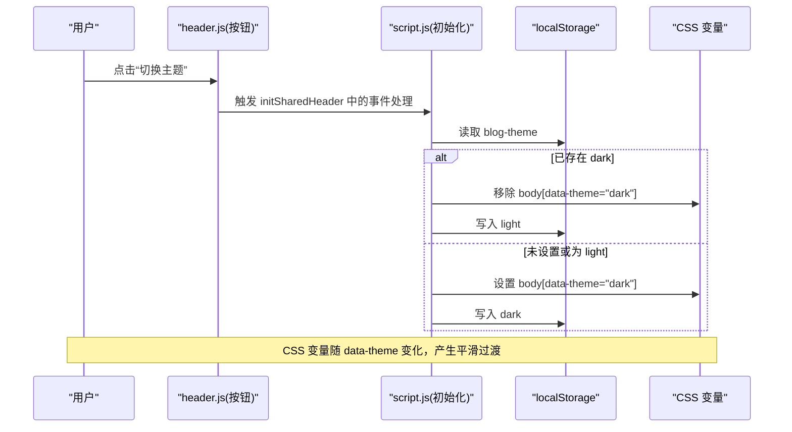
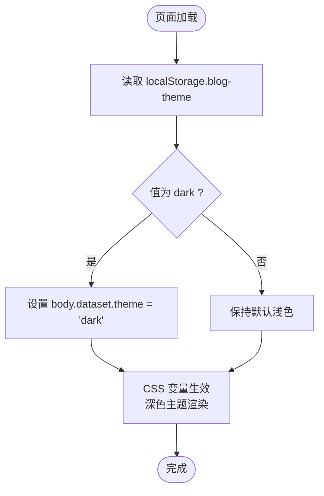
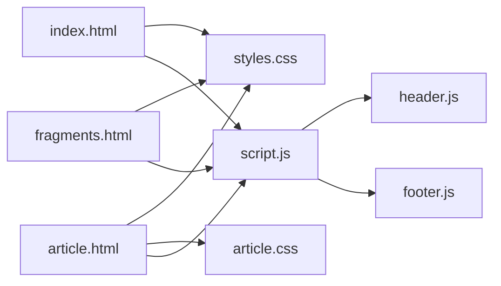

# 主题系统

<cite>
**本文引用的文件**   
- [styles.css](file://styles.css)
- [script.js](file://script.js)
- [header.js](file://header.js)
- [footer.js](file://footer.js)
- [index.html](file://index.html)
- [article.css](file://article.css)
- [article.html](file://article.html)
- [fragments.html](file://fragments.html)
</cite>

## 目录
1. [简介](#简介)
2. [项目结构](#项目结构)
3. [核心组件](#核心组件)
4. [架构总览](#架构总览)
5. [详细组件分析](#详细组件分析)
6. [依赖关系分析](#依赖关系分析)
7. [性能考量](#性能考量)
8. [故障排查指南](#故障排查指南)
9. [结论](#结论)
10. [附录：主题定制指南](#附录主题定制指南)

## 简介
本文件面向博客的主题系统，系统性阐述 CSS 变量体系、深色/浅色主题切换机制、响应式与移动端适配策略、以及无障碍访问与跨浏览器兼容实践。文档同时提供可视化图示与可操作的定制指引，帮助读者快速理解并扩展主题能力。

## 项目结构
主题相关代码主要分布在以下文件中：
- 样式层：全局样式与主题变量定义在 styles.css；文章页专用样式在 article.css
- 交互层：主题切换、导航、数据加载与渲染逻辑集中在 script.js；共享头部与尾部由 header.js 和 footer.js 注入
- 页面骨架：index.html、article.html、fragments.html 通过 data-page 标识页面类型，挂载共享区域

图表来源
- [index.html:1-93](file://index.html#L1-L93)
- [article.html:1-29](file://article.html#L1-L29)
- [fragments.html:1-23](file://fragments.html#L1-L23)
- [styles.css:1-1203](file://styles.css#L1-L1203)
- [article.css:1-215](file://article.css#L1-L215)
- [script.js:1-701](file://script.js#L1-L701)
- [header.js:1-110](file://header.js#L1-L110)
- [footer.js:1-36](file://footer.js#L1-L36)

章节来源
- [index.html:1-93](file://index.html#L1-L93)
- [article.html:1-29](file://article.html#L1-L29)
- [fragments.html:1-23](file://fragments.html#L1-L23)

## 核心组件
- CSS 变量系统（颜色令牌、字体、间距、圆角、阴影、内容宽度）
- 主题切换机制（本地存储持久化、DOM 状态驱动、过渡动画）
- 响应式布局与断点（网格、流式尺寸、移动端折叠菜单）
- 共享 UI 注入（动态头部/尾部）
- 无障碍支持（语义标签、ARIA 属性、视觉隐藏文本）

章节来源
- [styles.css:1-1203](file://styles.css#L1-L1203)
- [script.js:1-701](file://script.js#L1-L701)
- [header.js:1-110](file://header.js#L1-L110)
- [footer.js:1-36](file://footer.js#L1-L36)

## 架构总览
主题系统采用“CSS 变量 + DOM 数据属性”的轻量方案：通过 body[data-theme] 控制变量集，JS 负责读取/写入本地存储并在点击时切换。响应式通过媒体查询调整布局与字号，移动端使用折叠菜单提升可用性。

图表来源
- [script.js:95-106](file://script.js#L95-L106)
- [script.js:7-10](file://script.js#L7-L10)
- [styles.css:19-31](file://styles.css#L19-L31)

## 详细组件分析

### CSS 变量系统与主题设计
- 颜色令牌
  - 背景与面板：--bg、--panel、--panel-strong
  - 文字与辅助色：--text、--muted、--accent、--accent-soft、--accent-glow、--olive
  - 边框与分割线：--line
  - 阴影：--shadow
- 排版与布局
  - 字体栈：body 使用多字体回退，标题使用衬线体
  - 圆角：--radius-lg/md/sm
  - 内容宽度：--content-width 配合媒体查询自适应
- 主题覆盖
  - 默认浅色在 :root 中定义
  - 深色模式通过 body[data-theme="dark"] 覆盖变量
  - 背景图与渐变在两种模式下分别定义，确保对比度与层次

图表来源
- [script.js:7-10](file://script.js#L7-L10)
- [styles.css:1-31](file://styles.css#L1-L31)

章节来源
- [styles.css:1-1203](file://styles.css#L1-L1203)

### 主题切换机制
- 持久化
  - 启动时从 localStorage 读取 blog-theme，若为 dark 则立即应用
  - 切换时将新值写回 localStorage，保证刷新后保持一致
- 交互流程
  - 共享头部注入 theme-toggle 按钮
  - 点击后根据当前状态切换 body.dataset.theme，并更新本地存储
- 过渡效果
  - body 文本颜色与部分组件设置了 transition，切换时有平滑过渡
  - 背景图在深色模式下通过滤镜降低亮度与饱和度，避免刺眼

章节来源
- [script.js:95-106](file://script.js#L95-L106)
- [script.js:7-10](file://script.js#L7-L10)
- [styles.css:43-50](file://styles.css#L43-L50)
- [styles.css:72-80](file://styles.css#L72-L80)

### 响应式设计与移动端适配
- 断点策略
  - 1180px：缩小内容宽度，头部网格改为两列，归档侧栏变为三列卡片
  - 860px：进一步收缩内容与内边距，主网格与侧栏单列化
  - 768px：显示汉堡菜单，主导航默认隐藏，展开后全宽垂直排列
  - 560px：品牌字号与间距微调，时间轴与卡片内边距适配小屏
- 弹性布局
  - 使用 Grid/Flex 组合实现自适应卡片与侧栏
  - 使用 clamp() 与 min()/calc() 实现流式字号与宽度
- 触摸优化
  - 导航项在移动端增大点击区域与行高，便于触控
  - 图标按钮具备 hover 态与焦点态，键盘可达性良好

章节来源
- [styles.css:999-1203](file://styles.css#L999-L1203)
- [styles.css:1093-1134](file://styles.css#L1093-L1134)

### 共享头部与尾部注入
- 动态注入
  - header.js 将模板化的头部插入 .page-shell，优先替换已有占位节点
  - footer.js 同理注入底部备案信息
- 功能要点
  - 自动设置 favicon
  - 提供搜索与主题切换按钮
  - 提供移动端折叠菜单开关

章节来源
- [header.js:1-110](file://header.js#L1-L110)
- [footer.js:1-36](file://footer.js#L1-L36)

### 文章页样式与可读性
- 文章容器使用玻璃拟态风格，引用块、代码块、图片等均有独立样式
- 深色模式下对链接、引用、代码块进行对比度增强
- 在小屏幕下减少内边距与字号，保障阅读体验

章节来源
- [article.css:1-215](file://article.css#L1-L215)

### 无障碍访问支持
- 语义化标签：header/nav/main/footer/article/time 等
- ARIA 属性：aria-label、aria-expanded、aria-current、aria-pressed
- 视觉隐藏：.visually-hidden 用于仅读给屏幕阅读器
- 键盘可达：按钮与链接具备清晰的焦点态与交互反馈

章节来源
- [header.js:42-86](file://header.js#L42-L86)
- [script.js:108-127](file://script.js#L108-L127)
- [styles.css:987-997](file://styles.css#L987-L997)
- [fragments.html:14-16](file://fragments.html#L14-L16)

## 依赖关系分析
- 页面到脚本
  - index.html 引入 styles.css 与 script.js
  - article.html 额外引入 article.css 与 article.js（主题相关仍由 script.js 与 styles.css 承担）
  - fragments.html 引入 styles.css 与 script.js
- 脚本间协作
  - script.js 负责主题切换、数据加载与页面渲染
  - header.js 与 footer.js 作为共享模块被 script.js 异步加载并执行

图表来源
- [index.html:1-93](file://index.html#L1-L93)
- [article.html:1-29](file://article.html#L1-L29)
- [fragments.html:1-23](file://fragments.html#L1-L23)
- [styles.css:1-1203](file://styles.css#L1-L1203)
- [article.css:1-215](file://article.css#L1-L215)
- [script.js:1-701](file://script.js#L1-L701)
- [header.js:1-110](file://header.js#L1-L110)
- [footer.js:1-36](file://footer.js#L1-L36)

章节来源
- [index.html:1-93](file://index.html#L1-L93)
- [article.html:1-29](file://article.html#L1-L29)
- [fragments.html:1-23](file://fragments.html#L1-L23)

## 性能考量
- 资源加载
  - 样式与脚本均带版本参数，利于缓存更新
  - 共享头部/尾部通过动态脚本加载，避免重复 HTML 体积
- 渲染优化
  - 使用 CSS 变量减少重复声明，提高维护性与一致性
  - 列表渲染前进行过滤与排序，减少不必要的 DOM 操作
- 过渡与动画
  - 仅在必要属性上启用 transition，避免重排重绘开销过大

[本节为通用指导，不直接分析具体文件]

## 故障排查指南
- 主题未持久化
  - 检查 localStorage 是否可用或被清除
  - 确认 script.js 是否在页面加载早期执行
- 切换无动画
  - 检查 body 及受影响元素是否设置了 transition
  - 确认浏览器是否支持 backdrop-filter 与 CSS 变量
- 移动端菜单无法打开
  - 检查 nav-toggle 是否存在且 aria-expanded 是否正确更新
  - 确认 main-nav 的 is-open 类是否被正确添加/移除
- 深色模式对比度异常
  - 检查 body[data-theme="dark"] 下的变量覆盖是否完整
  - 确认背景图滤镜是否导致内容不可读

章节来源
- [script.js:7-10](file://script.js#L7-L10)
- [script.js:95-106](file://script.js#L95-L106)
- [styles.css:43-50](file://styles.css#L43-L50)
- [styles.css:72-80](file://styles.css#L72-L80)
- [styles.css:1093-1134](file://styles.css#L1093-L1134)

## 结论
该主题系统以 CSS 变量为核心，结合 body[data-theme] 的状态驱动与 localStorage 持久化，实现了简洁高效的深浅色切换。响应式策略清晰，断点划分合理，移动端交互友好。无障碍支持完善，适合在多设备与多场景下稳定运行。

[本节为总结性内容，不直接分析具体文件]

## 附录：主题定制指南

### 修改颜色方案
- 在 :root 中调整浅色变量，或在 body[data-theme="dark"] 中覆盖深色变量
- 建议遵循现有命名约定：--bg/--panel/--text/--muted/--accent 等，确保组件一致
- 如需新增颜色，请同步在浅色与深色两套变量中定义

章节来源
- [styles.css:1-31](file://styles.css#L1-L31)

### 调整字体样式
- 全局字体在 body 中定义，标题使用衬线体族
- 可通过覆盖 --font-* 变量或直接修改 font-family/font-size 来定制
- 注意在不同断点下使用 clamp() 或媒体查询控制字号缩放

章节来源
- [styles.css:43-50](file://styles.css#L43-L50)
- [styles.css:1093-1134](file://styles.css#L1093-L1134)

### 自定义组件外观
- 卡片、标签、归档条目等组件广泛使用 --line/--panel/--shadow 等变量
- 修改这些变量即可统一改变组件风格
- 针对特定组件可在对应选择器下追加覆盖规则

章节来源
- [styles.css:355-414](file://styles.css#L355-L414)
- [styles.css:517-608](file://styles.css#L517-L608)
- [styles.css:614-702](file://styles.css#L614-L702)

### 新增主题模式
- 在 CSS 中新增选择器（如 body[data-theme="custom"]），定义一套变量
- 在 script.js 的切换逻辑中添加对新模式的判断与持久化键值
- 在 header.js 的按钮处增加对应的切换入口

章节来源
- [script.js:95-106](file://script.js#L95-L106)
- [styles.css:19-31](file://styles.css#L19-L31)

### 无障碍最佳实践
- 为所有交互控件提供 aria-label 与合适的 role
- 使用 .visually-hidden 隐藏纯装饰性文本
- 确保键盘可导航与焦点可见

章节来源
- [header.js:42-86](file://header.js#L42-L86)
- [styles.css:987-997](file://styles.css#L987-L997)

### 跨浏览器兼容性处理
- 使用现代特性（CSS 变量、backdrop-filter、clamp）时，建议提供降级方案
- 对不支持 backdrop-filter 的浏览器，可回退为纯色背景
- 对旧版浏览器，考虑 polyfill 或渐进增强策略

[本节为通用指导，不直接分析具体文件]