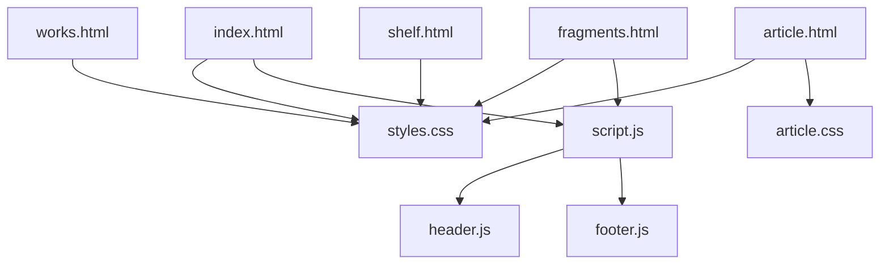
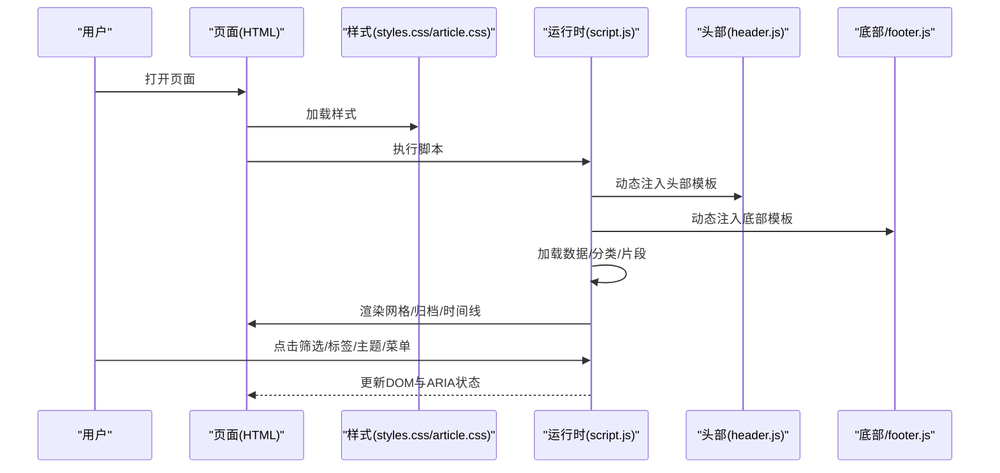
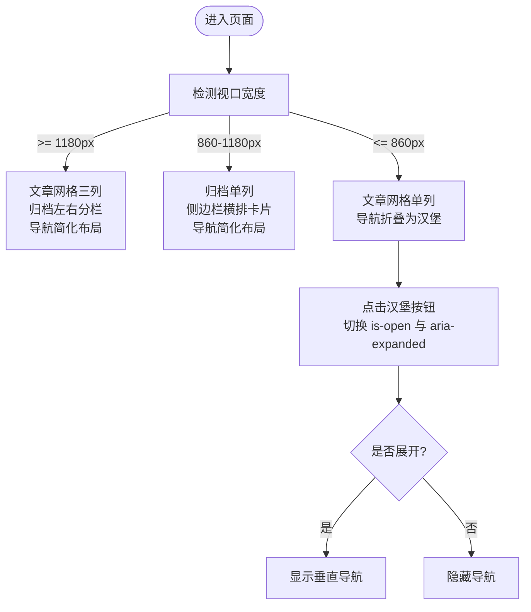
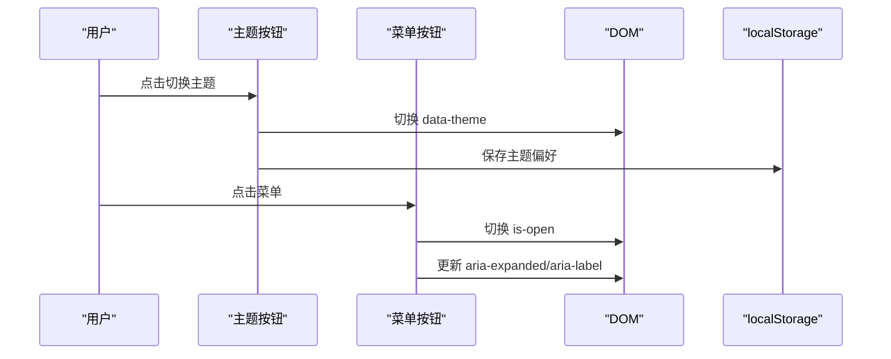
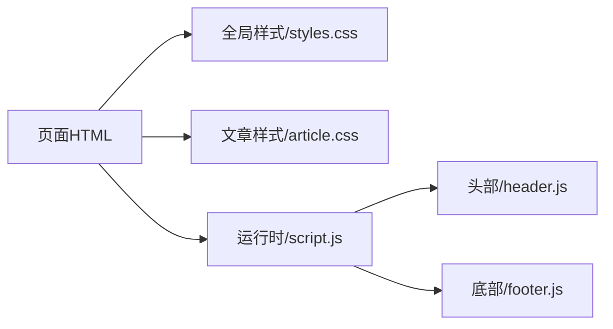

# 响应式设计

<cite>
**本文引用的文件**   
- [styles.css](file://styles.css)
- [article.css](file://article.css)
- [index.html](file://index.html)
- [fragments.html](file://fragments.html)
- [works.html](file://works.html)
- [shelf.html](file://shelf.html)
- [script.js](file://script.js)
- [header.js](file://header.js)
- [footer.js](file://footer.js)
</cite>

## 更新摘要
**变更内容**   
- 简化了导航栏的响应式布局逻辑，移除了桌面和平板设备上的特定CSS规则
- 优化了grid-template-columns配置，统一了不同屏幕尺寸下的导航行为
- 清理了main-nav定位规则和间距设置，提升了代码可维护性
- 保持了移动端汉堡菜单功能的完整性

## 目录
1. [简介](#简介)
2. [项目结构](#项目结构)
3. [核心组件](#核心组件)
4. [架构总览](#架构总览)
5. [详细组件分析](#详细组件分析)
6. [依赖关系分析](#依赖关系分析)
7. [性能考量](#性能考量)
8. [故障排查指南](#故障排查指南)
9. [结论](#结论)
10. [附录](#附录)

## 简介
本技术文档围绕博客的响应式设计系统，系统性梳理移动端适配策略、布局实现（CSS Grid/Flexbox）、断点体系、字体与间距的响应式处理、图片资源加载优化、无障碍访问支持以及性能优化实践。文档以仓库中的实际源码为依据，提供可视化图示与可追溯的来源定位，帮助读者快速理解并落地相关方案。

## 项目结构
本项目采用"页面 + 共享脚本 + 样式"的轻量静态站点结构：
- 页面入口：index.html、fragments.html、works.html、shelf.html、article.html
- 全局样式：styles.css、article.css
- 运行时逻辑：script.js（数据加载/渲染/交互）、header.js（动态注入头部）、footer.js（动态注入底部）

图表来源
- [index.html:1-93](file://index.html#L1-L93)
- [fragments.html:1-23](file://fragments.html#L1-L23)
- [works.html:1-23](file://works.html#L1-L23)
- [shelf.html:1-23](file://shelf.html#L1-L23)
- [article.html:1-29](file://article.html#L1-L29)
- [styles.css:1-1186](file://styles.css#L1-L1186)
- [article.css:1-215](file://article.css#L1-L215)
- [script.js:1-701](file://script.js#L1-L701)
- [header.js:1-110](file://header.js#L1-L110)
- [footer.js:1-36](file://footer.js#L1-L36)

章节来源
- [index.html:1-93](file://index.html#L1-L93)
- [styles.css:1-1186](file://styles.css#L1-L1186)
- [script.js:1-701](file://script.js#L1-L701)
- [header.js:1-110](file://header.js#L1-L110)
- [footer.js:1-36](file://footer.js#L1-L36)

## 核心组件
- 视口与基础排版
  - 所有页面统一设置 viewport，确保移动端正确缩放与布局基准。
  - 使用 CSS 变量定义主题色、圆角、阴影与内容宽度，便于多端一致性与暗色模式切换。
- 响应式布局
  - 首页文章网格使用 CSS Grid 三列自适应；侧边栏在中等屏幕下堆叠为单列。
  - 碎片时间线使用 Grid 自动换行与最小宽度约束，实现流式卡片排列。
  - 头部导航在小屏下折叠为汉堡菜单，通过 JS 控制展开状态与无障碍属性。
- 字体与间距
  - 标题字号使用 clamp() 进行弹性缩放，避免固定断点导致的生硬跳变。
  - 行高、内边距、外边距采用相对单位与变量，保证在不同密度下的可读性。
- 图片与媒体
  - 文章封面与碎片图片使用懒加载属性降低首屏压力。
  - 背景图使用 cover 与渐变叠加，提升视觉层次。
- 无障碍
  - 关键按钮与导航提供 aria-label、aria-expanded、aria-current 等语义化属性。
  - 隐藏标题使用 .visually-hidden 类，保障屏幕阅读器可访问。
- 主题与交互
  - 通过 data-theme 切换明暗主题，持久化到 localStorage。
  - 导航开关按钮具备键盘可达性与焦点可见性。

章节来源
- [index.html:1-93](file://index.html#L1-L93)
- [fragments.html:1-23](file://fragments.html#L1-L23)
- [styles.css:1-1186](file://styles.css#L1-L1186)
- [article.css:1-215](file://article.css#L1-L215)
- [script.js:1-701](file://script.js#L1-L701)
- [header.js:1-110](file://header.js#L1-L110)
- [footer.js:1-36](file://footer.js#L1-L36)

## 架构总览
下图展示了页面、样式与脚本之间的依赖关系，以及运行时如何动态注入头部与底部、渲染数据与处理交互。

图表来源
- [index.html:1-93](file://index.html#L1-L93)
- [fragments.html:1-23](file://fragments.html#L1-L23)
- [styles.css:1-1186](file://styles.css#L1-L1186)
- [article.css:1-215](file://article.css#L1-L215)
- [script.js:1-701](file://script.js#L1-L701)
- [header.js:1-110](file://header.js#L1-L110)
- [footer.js:1-36](file://footer.js#L1-L36)

## 详细组件分析

### 视口与基础排版
- 视口设置
  - 各页面均包含标准 viewport meta，确保移动端按设备宽度渲染，禁止不必要的缩放。
- 基础样式
  - 使用 border-box 盒模型，统一计算行为。
  - 根级 CSS 变量集中管理颜色、圆角、阴影与内容最大宽度，配合 body[data-theme="dark"] 覆盖实现暗色模式。
  - 滚动行为平滑，提升阅读体验。

章节来源
- [index.html:1-12](file://index.html#L1-L12)
- [fragments.html:1-9](file://fragments.html#L1-L9)
- [works.html:1-9](file://works.html#L1-L9)
- [shelf.html:1-9](file://shelf.html#L1-L9)
- [styles.css:1-50](file://styles.css#L1-L50)

### 响应式布局：Grid 与 Flexbox
- 首页文章网格
  - 使用 CSS Grid 定义三列等宽布局，配合 gap 控制间距；在小屏断点下回退为单列，保证可读性与触控区域。
- 归档布局
  - 中屏以上采用左右两列（侧边栏+主列表），小屏时侧边栏转为顶部横向卡片或单列堆叠。
- 碎片时间线
  - 使用 auto-fit 与 minmax 实现卡片自适应换行，图片容器限制最大高度与对象适配，保持比例与清晰度。
- 头部导航
  - **更新** 简化了导航栏的响应式逻辑，移除了桌面和平板设备上的复杂布局规则。现在导航在不同屏幕尺寸下采用更统一的布局策略，减少了特定的 grid-template-columns 配置和定位规则。

图表来源
- [styles.css:999-1033](file://styles.css#L999-L1033)
- [styles.css:1035-1091](file://styles.css#L1035-L1091)
- [styles.css:1093-1134](file://styles.css#L1093-L1134)
- [script.js:108-127](file://script.js#L108-L127)

章节来源
- [styles.css:355-359](file://styles.css#L355-L359)
- [styles.css:436-441](file://styles.css#L436-L441)
- [styles.css:928-933](file://styles.css#L928-L933)
- [styles.css:999-1033](file://styles.css#L999-L1033)
- [styles.css:1035-1091](file://styles.css#L1035-L1091)
- [styles.css:1093-1134](file://styles.css#L1093-L1134)
- [script.js:108-127](file://script.js#L108-L127)

### 断点系统设计
- 移动优先策略
  - 默认样式面向小屏，逐步增强至大屏。例如导航在小屏隐藏，在大屏展示；归档布局从单列逐步过渡到双列。
- 关键断点
  - 1180px：调整内容宽度、头部网格列数、归档布局与侧边栏排列。
  - 860px：头部改为静态定位、导航换行、文章网格与侧边栏单列、正文字号微调。
  - 768px：启用汉堡菜单，导航默认隐藏，is-open 控制显示。
  - 560px：进一步缩小字号与间距，优化极小屏可读性。
- 渐进增强
  - 在小屏上优先保证内容与导航可用性，在大屏上增加装饰性效果（如粘性头部、更大留白）。

**更新** 移除了桌面和平板设备上的特定导航布局规则，简化了响应式设计逻辑，包括清理了约17行CSS代码，主要涉及grid-template-columns配置、main-nav定位规则和间距设置。

章节来源
- [styles.css:999-1033](file://styles.css#L999-L1033)
- [styles.css:1035-1091](file://styles.css#L1035-L1091)
- [styles.css:1093-1134](file://styles.css#L1093-L1134)
- [styles.css:1136-1186](file://styles.css#L1136-L1186)

### 字体与间距的响应式处理
- 弹性字号
  - 使用 clamp() 对标题与正文进行弹性缩放，避免固定断点造成的跳跃。
- 相对单位
  - 行高、内边距、外边距使用 rem/em 与百分比，结合 CSS 变量，确保在不同 DPI 与缩放级别下保持一致的比例。
- 可读性优化
  - 正文行高适中，段落间距合理，代码块与引用区块在暗色模式下对比度良好。

章节来源
- [styles.css:288-295](file://styles.css#L288-L295)
- [styles.css:430-434](file://styles.css#L430-L434)
- [styles.css:630-637](file://styles.css#L630-L637)
- [article.css:16-21](file://article.css#L16-L21)

### 图片资源的响应式加载
- 懒加载
  - 碎片图片在渲染时添加懒加载属性，减少首屏请求与内存占用。
- 尺寸与适配
  - 图片容器使用 aspect-ratio 与 object-fit 控制比例与裁剪，避免布局抖动。
- 背景图与渐变
  - Hero 区域使用背景图与渐变叠加，提升视觉层次且不阻塞文本渲染。

章节来源
- [script.js:583-598](file://script.js#L583-L598)
- [styles.css:373-379](file://styles.css#L373-L379)
- [styles.css:257-261](file://styles.css#L257-L261)

说明：当前仓库未使用 srcset/picture 元素进行多分辨率图片选择，建议后续在封面与大图场景引入以提升带宽利用率。

### 无障碍访问支持
- 语义化与标签
  - 导航与按钮提供 aria-label，主题切换与菜单按钮维护 aria-expanded 状态。
  - 页面主标题使用 .visually-hidden 类隐藏但保留给屏幕阅读器读取。
- 键盘可达性
  - 导航项与筛选按钮均为原生 button/a 元素，天然支持键盘操作与焦点顺序。
- 当前页标识
  - 根据当前页面动态设置 aria-current，辅助工具可识别当前位置。

章节来源
- [header.js:30-86](file://header.js#L30-L86)
- [script.js:108-127](file://script.js#L108-L127)
- [fragments.html:14-16](file://fragments.html#L14-L16)
- [works.html:14-16](file://works.html#L14-L16)
- [shelf.html:14-16](file://shelf.html#L14-L16)

### 主题与交互流程
- 主题切换
  - 通过 data-theme 切换明暗主题，并将偏好保存到 localStorage，下次访问保持一致。
- 导航菜单
  - 点击汉堡按钮切换 is-open 类，同时更新 aria-expanded 与 aria-label，确保可访问性。

图表来源
- [script.js:95-114](file://script.js#L95-L114)
- [header.js:56-84](file://header.js#L56-L84)

章节来源
- [script.js:95-114](file://script.js#L95-L114)
- [header.js:56-84](file://header.js#L56-L84)

## 依赖关系分析
- 页面与脚本
  - index.html、fragments.html 等页面通过 script.js 加载数据与渲染内容。
  - header.js 与 footer.js 由 script.js 动态注入，复用同一套模板与路径解析逻辑。
- 样式与组件
  - styles.css 提供全局与通用组件样式；article.css 专注文章详情页排版。
  - 响应式断点集中在 styles.css 的 @media 规则中，按移动优先策略组织。

图表来源
- [index.html:1-93](file://index.html#L1-L93)
- [fragments.html:1-23](file://fragments.html#L1-L23)
- [styles.css:1-1186](file://styles.css#L1-L1186)
- [article.css:1-215](file://article.css#L1-L215)
- [script.js:1-701](file://script.js#L1-L701)
- [header.js:1-110](file://header.js#L1-L110)
- [footer.js:1-36](file://footer.js#L1-L36)

章节来源
- [script.js:666-701](file://script.js#L666-L701)
- [header.js:1-110](file://header.js#L1-L110)
- [footer.js:1-36](file://footer.js#L1-L36)

## 性能考量
- 减少重排重绘
  - 使用 transform 与 opacity 做动画，避免触发布局重排。
  - 将导航展开/收起通过类名切换，批量更新 DOM。
- 首屏优化
  - 图片懒加载减少初始请求；Hero 背景图使用 fixed 与 cover，避免阻塞文本渲染。
- 资源体积
  - 样式与脚本按需加载，公共部分通过模板注入，避免重复代码。
- 渲染路径
  - 数据加载完成后一次性渲染列表，减少多次 innerHTML 写入。

[本节为通用指导，不直接分析具体文件]

## 故障排查指南
- 导航无法展开
  - 检查汉堡按钮是否存在且绑定点击事件；确认 is-open 类是否正确切换；验证 aria-expanded 值是否与 UI 一致。
- 主题切换无效
  - 检查 data-theme 是否被正确设置；确认 localStorage 中是否保存了主题键值；查看控制台是否有错误输出。
- 图片未显示或模糊
  - 检查图片路径解析函数是否正确拼接 baseDir；确认懒加载是否生效；必要时补充 srcset/picture 以提升清晰度。
- 断点异常
  - 核对 @media 条件与断点阈值；确认内容宽度变量是否被覆盖；检查父容器 overflow 与 grid 列配置。

**更新** 由于简化了导航栏的响应式逻辑，如果遇到问题，请重点检查以下方面：
- 确认移除了多余的 grid-template-columns 配置
- 验证 main-nav 的定位规则是否已简化
- 检查间距设置是否影响了整体布局

章节来源
- [script.js:108-127](file://script.js#L108-L127)
- [script.js:95-114](file://script.js#L95-L114)
- [script.js:583-598](file://script.js#L583-L598)
- [styles.css:999-1033](file://styles.css#L999-L1033)

## 结论
该博客的响应式设计以移动优先为核心，借助 CSS Grid/Flexbox 构建灵活的布局体系，并通过 clamp() 与相对单位实现平滑的字体与间距缩放。断点设计清晰，交互与无障碍支持完善。**最新更新** 通过移除导航栏在桌面和平板设备上的特定CSS布局规则，进一步简化了响应式导航设计逻辑，提升了代码的可维护性和一致性。当前图片加载主要依赖懒加载，未来可在封面与大图场景引入 srcset/picture 进一步优化带宽与清晰度。整体架构简洁、可扩展性强，适合持续迭代与维护。

## 附录
- 术语
  - 视口：浏览器可视区域的逻辑像素宽度与缩放基准。
  - 断点：触发样式变化的特定视口宽度阈值。
  - 懒加载：仅在元素接近可视区域时加载资源。
  - ARIA：用于增强网页可访问性的语义属性集合。

[本节为概念性说明，不直接分析具体文件]