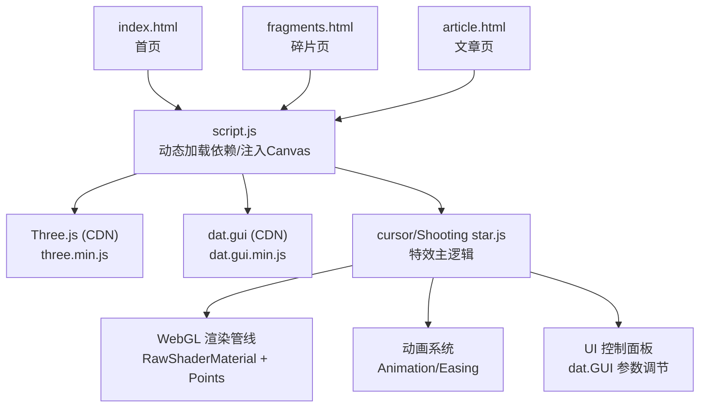
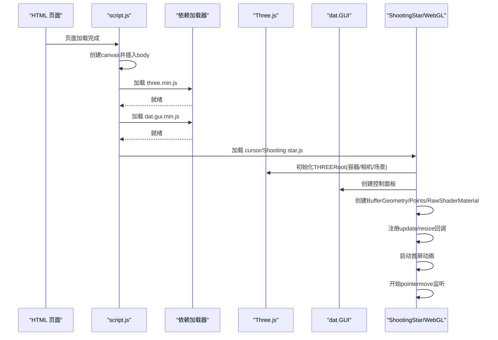
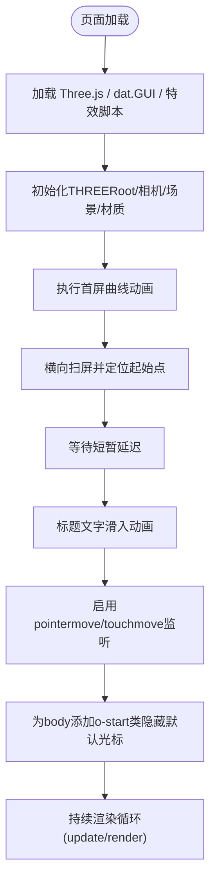
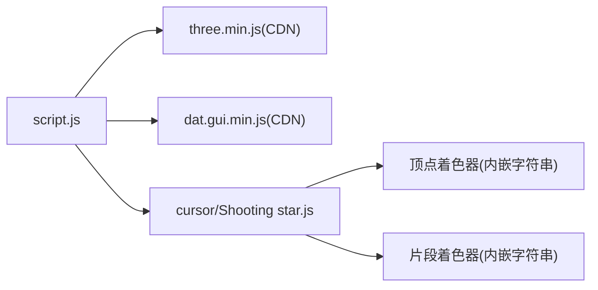

# 流星光标效果系统

<cite>
**本文引用的文件**   
- [cursor/Shooting star.js](file://cursor/Shooting star.js)
- [script.js](file://script.js)
- [index.html](file://index.html)
- [fragments.html](file://fragments.html)
- [article.html](file://article.html)
- [styles.css](file://styles.css)
</cite>

## 目录
1. [简介](#简介)
2. [项目结构](#项目结构)
3. [核心组件](#核心组件)
4. [架构总览](#架构总览)
5. [详细组件分析](#详细组件分析)
6. [依赖关系分析](#依赖关系分析)
7. [性能考量](#性能考量)
8. [故障排查指南](#故障排查指南)
9. [结论](#结论)
10. [附录](#附录)

## 简介
本仓库包含一个基于 Three.js 的“流星光标”视觉特效，用于在博客页面中提供沉浸式鼠标跟随粒子轨迹。该特效通过动态加载 Three.js 与 dat.GUI，使用自定义顶点/片段着色器实现高性能点精灵渲染，并在首帧播放一段入场动画后进入交互模式：鼠标移动时产生流星拖尾，同时隐藏默认光标以提升沉浸感。

## 项目结构
与流星光标效果直接相关的文件如下：
- 入口与样式：index.html、fragments.html、article.html、styles.css
- 运行时脚本：script.js（负责动态加载依赖并注入 canvas）
- 特效实现：cursor/Shooting star.js（Three.js 场景、粒子系统、动画与 UI 控制器）



图表来源
- [script.js:714-736](file://script.js#L714-L736)
- [cursor/Shooting star.js:1620-1747](file://cursor/Shooting star.js#L1620-L1747)

章节来源
- [index.html:1-93](file://index.html#L1-L93)
- [fragments.html:1-23](file://fragments.html#L1-L23)
- [article.html:1-29](file://article.html#L1-L29)
- [script.js:12-22](file://script.js#L12-L22)
- [script.js:714-736](file://script.js#L714-L736)

## 核心组件
- 动态加载器与 Canvas 注入
  - script.js 在页面初始化时创建全屏 canvas，并追加全局样式以支持隐藏原生光标。
  - 随后按顺序从 CDN 加载 Three.js 与 dat.GUI，最后加载本地特效脚本。
- 特效主模块（Shooting Star）
  - 基于 Three.js 的 RawShaderMaterial 与 BufferGeometry.Points 实现高性能粒子。
  - 使用自定义顶点/片段着色器计算粒子的位置、扩散、闪烁与透明度。
  - 维护鼠标轨迹历史，将轨迹采样为多段线段，驱动粒子发射。
- 动画与 UI 控制
  - 内置缓动函数库与 Animation 类，用于首屏入场动画与文本滑入。
  - dat.GUI 暴露大量可调参数（大小、速度、扩散、模糊等），便于调试与演示。

章节来源
- [script.js:12-22](file://script.js#L12-L22)
- [script.js:714-736](file://script.js#L714-L736)
- [cursor/Shooting star.js:1145-1150](file://cursor/Shooting star.js#L1145-L1150)
- [cursor/Shooting star.js:1239-1405](file://cursor/Shooting star.js#L1239-L1405)
- [cursor/Shooting star.js:997-1136](file://cursor/Shooting star.js#L997-L1136)

## 架构总览
整体运行流程分为三个阶段：
1) 资源准备阶段：注入 canvas、加载 Three.js 与 dat.GUI、加载特效脚本。
2) 初始化阶段：构建 WebGL 根容器、相机、场景、材质与几何体；注册更新回调与尺寸变化回调。
3) 交互阶段：监听 pointermove/touchmove，更新鼠标轨迹缓冲区，逐帧渲染粒子。



图表来源
- [script.js:714-736](file://script.js#L714-L736)
- [cursor/Shooting star.js:1620-1747](file://cursor/Shooting star.js#L1620-L1747)

## 详细组件分析

### 动态加载与 Canvas 注入（script.js）
- 行为要点
  - 在 body 最前插入 id="canvas" 的全屏画布，并通过 CSS 将其置于内容下方。
  - 当 body 拥有 o-start 类时隐藏默认光标，提升沉浸体验。
  - 依次从 CDN 加载 Three.js 与 dat.GUI，再加载本地特效脚本。
- 关键路径
  - 注入 canvas 与样式：[script.js:12-22](file://script.js#L12-L22)
  - 动态加载依赖链：[script.js:714-736](file://script.js#L714-L736)

章节来源
- [script.js:12-22](file://script.js#L12-L22)
- [script.js:714-736](file://script.js#L714-L736)

### 特效主模块（cursor/Shooting star.js）
- 模块组成
  - 基础工具：缓动函数集合、Animation 类、简易动画器 animate(fn, options)。
  - 渲染层：THREERoot 封装（场景、相机、渲染循环、事件、射线检测、后处理接口）。
  - 特效层：ShootingStar（粒子系统）、Text（标题文字平面）。
  - 控制层：Controller（基于 dat.GUI 的参数面板）。
  - 顶层协调：WebGL（组合 Text 与 ShootingStar，管理首屏动画与交互切换）。
- 数据与常量
  - 每鼠标最大采样点数 PER_MOUSE=800，总粒子数 COUNT=PER_MOUSE*400。
  - 属性缓冲：position、mouse、aFront、random。
  - Uniforms：size、minSize、speed、fadeSpeed、shortRangeFadeSpeed、blur、spread、maxSpread、far、maxDiff、diffPow、resolution、pixelRatio、timestamp 等。
- 着色器
  - 顶点着色器：根据鼠标时间戳、速度、随机因子与扩散参数计算粒子当前位置与大小。
  - 片段着色器：基于距离场生成圆形点，叠加随机闪烁与深度衰减，输出颜色与透明度。
- 交互与动画
  - 首屏动画：先绘制一段曲线轨迹，再横向扫过屏幕，随后开启用户交互。
  - 交互模式：监听 pointermove/touchmove，将连续坐标插值到 PER_MOUSE 个采样点，写入 mouse/aFront 属性，触发 GPU 计算。
- 可配置项（部分）
  - size/minSize：控制点大小范围。
  - speed：粒子沿轨迹推进速度。
  - fadeSpeed/shortRangeFadeSpeed：近/远端淡出速率。
  - blur：边缘柔化程度。
  - spread/maxSpread：扩散强度与最大扩散。
  - far：尾部长度。
  - maxDiff/diffPow：速度差对亮度/大小的影响。

```mermaid
classDiagram
class THREERoot {
+start()
+tick()
+update()
+render()
+addUpdateCallback(cb)
+addResizeCallback(cb)
+initPostProcessing(passes)
+checkPointer(point, meshes, handler, nohandler)
}
class Controller {
+addData(data, options)
+addUniformData(data, uniforms, options)
+addFolder(name, isClosed)
}
class Animation {
+start()
+reverse()
+play()
+stop()
+easing
}
class ShootingStar {
+start()
+draw({clientX, clientY})
+update(timestamp)
-geometry
-material
-oldPosition
}
class Text {
+update(progress)
-mesh
-material
}
class WebGL {
+start()
+textStart()
+setSize()
-root
-shootingStar
-text
}
WebGL --> THREERoot : "使用"
WebGL --> ShootingStar : "组合"
WebGL --> Text : "组合"
THREERoot --> Controller : "可选"
ShootingStar --> Animation : "可选"
Text --> Animation : "可选"
```

图表来源
- [cursor/Shooting star.js:107-411](file://cursor/Shooting star.js#L107-L411)
- [cursor/Shooting star.js:473-592](file://cursor/Shooting star.js#L473-L592)
- [cursor/Shooting star.js:997-1136](file://cursor/Shooting star.js#L997-L1136)
- [cursor/Shooting star.js:1239-1405](file://cursor/Shooting star.js#L1239-L1405)
- [cursor/Shooting star.js:1506-1586](file://cursor/Shooting star.js#L1506-L1586)
- [cursor/Shooting star.js:1620-1747](file://cursor/Shooting star.js#L1620-L1747)

章节来源
- [cursor/Shooting star.js:1145-1150](file://cursor/Shooting star.js#L1145-L1150)
- [cursor/Shooting star.js:1239-1405](file://cursor/Shooting star.js#L1239-L1405)
- [cursor/Shooting star.js:1506-1586](file://cursor/Shooting star.js#L1506-L1586)
- [cursor/Shooting star.js:1620-1747](file://cursor/Shooting star.js#L1620-L1747)

### 首屏动画与交互切换流程


图表来源
- [cursor/Shooting star.js:1679-1732](file://cursor/Shooting star.js#L1679-L1732)
- [script.js:12-22](file://script.js#L12-L22)

## 依赖关系分析
- 外部依赖
  - Three.js：通过 CDN 引入，版本固定为 0.118.0。
  - dat.GUI：通过 CDN 引入，版本固定为 0.7.7。
- 内部依赖
  - script.js 负责依赖加载顺序与错误处理。
  - Shooting star.js 内部自包含缓动函数与动画器，不依赖第三方动画库。
- 耦合与内聚
  - 特效模块通过全局对象 $mrfc$export$default 共享分辨率、像素比、半宽高等信息，降低显式传参成本但增加隐式耦合。
  - 渲染管线集中在 RawShaderMaterial，便于统一调整 uniform 与属性。



图表来源
- [script.js:714-736](file://script.js#L714-L736)
- [cursor/Shooting star.js:1145-1150](file://cursor/Shooting star.js#L1145-L1150)

章节来源
- [script.js:714-736](file://script.js#L714-L736)
- [cursor/Shooting star.js:1145-1150](file://cursor/Shooting star.js#L1145-L1150)

## 性能考量
- 渲染策略
  - 使用 BufferGeometry.Points 与 RawShaderMaterial，避免复杂几何体开销，适合大规模点精灵。
  - 采用 AdditiveBlending 混合模式，增强发光效果。
- 内存与带宽
  - 每帧仅更新 mouse 与 aFront 两个 Float32BufferAttribute，减少 GPU 上传量。
  - 纹理仅在 Text 组件中创建一次，后续复用。
- 动画频率
  - 由 THREERoot.tick 使用 requestAnimationFrame 驱动，保证与显示器刷新同步。
- 移动端适配
  - 监听 touchmove 事件，确保移动端可用。
  - 通过 rate 与 resolution 缩放，适配不同设备像素比与窗口尺寸。
- 潜在优化点
  - 可根据设备能力动态调整 COUNT 与 PER_MOUSE，平衡流畅度与视觉效果。
  - 在低性能设备上关闭或降低 blur、spread、maxZ 等昂贵 uniform。
  - 考虑使用 InstancedMesh 替代 Points 以支持更复杂的形状与光照（需权衡复杂度）。

[本节为通用性能建议，无需特定文件引用]

## 故障排查指南
- 现象：无流星效果或控制台报错
  - 可能原因：Three.js 或 dat.GUI 加载失败。
  - 排查步骤：检查网络连通性与 CDN 可用性；确认 script.js 中的加载顺序与 onload 回调是否执行。
  - 参考路径：[script.js:714-736](file://script.js#L714-L736)
- 现象：鼠标移动无响应
  - 可能原因：未进入交互阶段（o-start 类未添加）或 pointermove/touchmove 监听未绑定。
  - 排查步骤：检查 body 是否包含 o-start 类；确认 shootingStar.start() 已调用。
  - 参考路径：[cursor/Shooting star.js:1378-1402](file://cursor/Shooting star.js#L1378-L1402)、[cursor/Shooting star.js:1729-1732](file://cursor/Shooting star.js#L1729-L1732)
- 现象：画面撕裂或错位
  - 可能原因：窗口 resize 后分辨率未更新。
  - 排查步骤：确认 setSize 与 root.addResizeCallback 是否正确更新 resolution 与 pixelRatio。
  - 参考路径：[cursor/Shooting star.js:1669-1677](file://cursor/Shooting star.js#L1669-L1677)
- 现象：性能卡顿
  - 可能原因：COUNT/PER_MOUSE 过大或 blur/spread 过高。
  - 排查步骤：通过 dat.GUI 面板调小相关参数；必要时降低 COUNT。
  - 参考路径：[cursor/Shooting star.js:1174-1236](file://cursor/Shooting star.js#L1174-L1236)

章节来源
- [script.js:714-736](file://script.js#L714-L736)
- [cursor/Shooting star.js:1378-1402](file://cursor/Shooting star.js#L1378-L1402)
- [cursor/Shooting star.js:1669-1677](file://cursor/Shooting star.js#L1669-L1677)
- [cursor/Shooting star.js:1174-1236](file://cursor/Shooting star.js#L1174-L1236)

## 结论
该流星光标效果系统以轻量方式集成到博客页面中，通过动态加载与自定义着色器实现了高表现力的粒子拖尾效果。其模块化设计使得首屏动画与交互模式清晰分离，配合 dat.GUI 提供了良好的调试体验。在保持良好视觉的同时，也兼顾了跨设备兼容性与可扩展性。

[本节为总结性内容，无需特定文件引用]

## 附录
- 关键样式说明
  - #canvas 全屏覆盖且 z-index 较低，确保不影响正文交互。
  - body.o-start 下隐藏默认光标，提升沉浸感。
  - 参考路径：[script.js:12-22](file://script.js#L12-L22)、[styles.css](file://styles.css)

章节来源
- [script.js:12-22](file://script.js#L12-L22)
- [styles.css:1-800](file://styles.css#L1-L800)