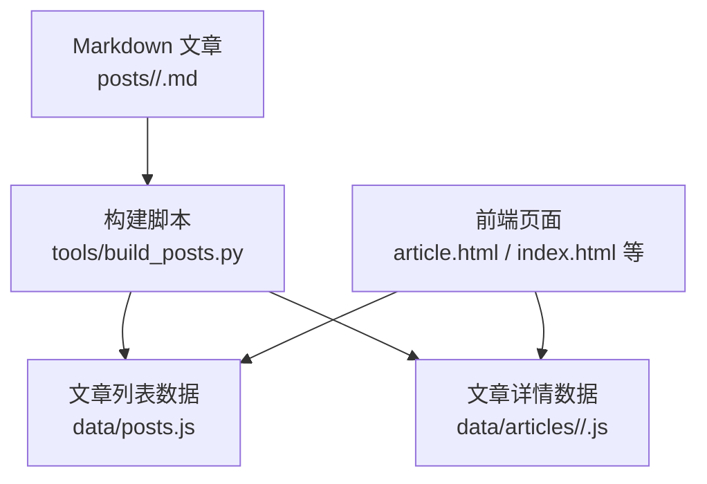
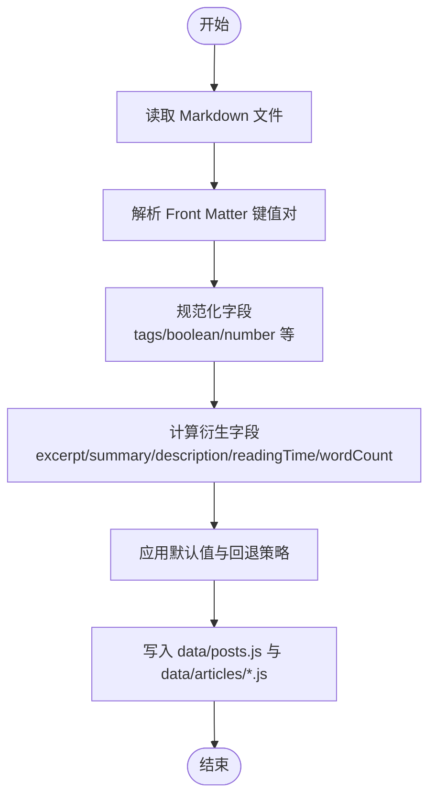
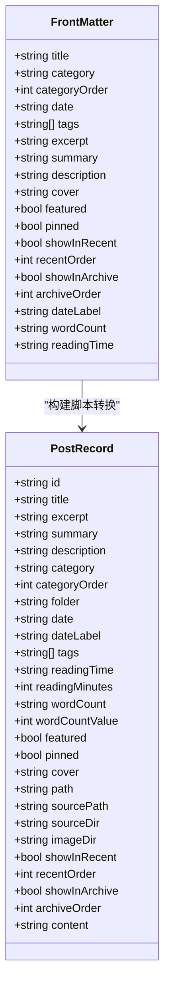

# Front Matter元数据语法

<cite>
**本文引用的文件**
- [posts/default/about-site.md](file://posts/default/about-site.md)
- [posts/fragments/fragments.md](file://posts/fragments/fragments.md)
- [tools/build_posts.py](file://tools/build_posts.py)
- [data/posts.js](file://data/posts.js)
- [data/articles/default/blog-intro.js](file://data/articles/default/blog-intro.js)
- [data/articles/default/about-site.js](file://data/articles/default/about-site.js)
</cite>

## 目录
1. [简介](#简介)
2. [项目结构](#项目结构)
3. [核心组件](#核心组件)
4. [架构总览](#架构总览)
5. [详细组件分析](#详细组件分析)
6. [依赖关系分析](#依赖关系分析)
7. [性能与默认值处理](#性能与默认值处理)
8. [故障排查指南](#故障排查指南)
9. [结论](#结论)
10. [附录：字段规范与最佳实践](#附录字段规范与最佳实践)

## 简介
本文件为博客的 Front Matter 元数据语法提供完整技术说明。Front Matter 采用 YAML 风格，位于 Markdown 文件的顶部，使用三短横线分隔符包裹键值对。构建脚本会解析这些元数据，生成站点所需的数据结构，并输出到前端可加载的 JS 文件中。本文覆盖所有支持的字段、数据类型、优先级规则与默认值机制，并提供示例路径与最佳实践。

## 项目结构
- 文章源文件位于 posts 目录下，按分类组织（如 default、works）。
- 构建工具 tools/build_posts.py 负责解析 Front Matter、计算衍生字段、生成 data 目录下的 JSON/JS 数据文件。
- 前端通过 data/posts.js 和 data/articles/*/xxx.js 获取文章列表与详情数据。

图表来源
- [tools/build_posts.py:146-197](file://tools/build_posts.py#L146-L197)
- [data/posts.js:1-95](file://data/posts.js#L1-L95)
- [data/articles/default/blog-intro.js:1-32](file://data/articles/default/blog-intro.js#L1-L32)

章节来源
- [tools/build_posts.py:146-197](file://tools/build_posts.py#L146-L197)
- [data/posts.js:1-95](file://data/posts.js#L1-L95)
- [data/articles/default/blog-intro.js:1-32](file://data/articles/default/blog-intro.js#L1-L32)

## 核心组件
- Front Matter 解析器：从 Markdown 头部提取键值对，支持标量、数组、布尔、数字等类型。
- 字段规范化与默认值：将原始元数据转换为统一的结构，并为缺失字段设置合理默认值。
- 衍生字段计算：根据正文内容自动计算阅读时间、字数、摘要等。
- 数据输出：生成供前端使用的 JS 数据结构。

章节来源
- [tools/build_posts.py:25-88](file://tools/build_posts.py#L25-L88)
- [tools/build_posts.py:100-144](file://tools/build_posts.py#L100-L144)
- [tools/build_posts.py:146-197](file://tools/build_posts.py#L146-L197)

## 架构总览
下图展示了 Front Matter 解析与数据生成的关键流程，包括字段优先级与默认值处理。

图表来源
- [tools/build_posts.py:52-88](file://tools/build_posts.py#L52-L88)
- [tools/build_posts.py:100-144](file://tools/build_posts.py#L100-L144)
- [tools/build_posts.py:146-197](file://tools/build_posts.py#L146-L197)

## 详细组件分析

### Front Matter 语法与数据类型
- 分隔符：以三短横线开头和结尾，中间为键值对。
- 键名：小驼峰或普通英文命名，区分大小写。
- 值类型：
  - 字符串：直接书写或使用单/双引号包裹。
  - 数组：行首短横线加空格，逐行列出；也支持内联方括号逗号分隔形式。
  - 布尔：true/false（不区分大小写），以及 1/0 作为真/假。
  - 数字：整数与浮点数。
- 注释：以 # 开头的行会被忽略。
- 空值：若键后无值，则视为空数组。

章节来源
- [tools/build_posts.py:25-88](file://tools/build_posts.py#L25-L88)

### 字段定义与行为

- 标题 title
  - 类型：字符串
  - 必填：是（未提供时回退为文件名 slug）
  - 用途：文章标题、页面标题、SEO 描述回退链的一部分
  - 参考实现路径：[tools/build_posts.py:152](file://tools/build_posts.py#L152)

- 分类 category
  - 类型：字符串
  - 必填：否（未提供时回退为所在文件夹名称）
  - 用途：归类展示、URL 参数
  - 参考实现路径：[tools/build_posts.py:153](file://tools/build_posts.py#L153)

- 分类排序 categoryOrder
  - 类型：数字
  - 必填：否（默认 999）
  - 用途：控制分类顺序
  - 参考实现路径：[tools/build_posts.py:154](file://tools/build_posts.py#L154)

- 日期 date
  - 类型：字符串（建议 YYYY-MM-DD）
  - 必填：否（可为空）
  - 用途：文章时间标识
  - 参考实现路径：[tools/build_posts.py:155](file://tools/build_posts.py#L155)

- 标签 tags
  - 类型：字符串数组或逗号分隔字符串
  - 必填：否（默认为空数组）
  - 用途：文章标签展示与过滤
  - 参考实现路径：[tools/build_posts.py:91-98](file://tools/build_posts.py#L91-L98)

- 摘要 excerpt
  - 类型：字符串
  - 必填：否（未提供时从正文第一段提取，最多约 96 字符）
  - 用途：列表页摘要展示
  - 参考实现路径：[tools/build_posts.py:158](file://tools/build_posts.py#L158), [tools/build_posts.py:116-129](file://tools/build_posts.py#L116-L129)

- 简介 summary
  - 类型：字符串
  - 必填：否（未提供时回退为 excerpt）
  - 用途：更详细的简介文本
  - 参考实现路径：[tools/build_posts.py:159](file://tools/build_posts.py#L159)

- 描述 description
  - 类型：字符串
  - 必填：否（未提供时回退链：excerpt → summary → title）
  - 用途：SEO 描述、元信息
  - 参考实现路径：[tools/build_posts.py:160](file://tools/build_posts.py#L160)

- 封面图 cover
  - 类型：字符串（相对路径）
  - 必填：否（默认为空）
  - 用途：文章封面图片
  - 参考实现路径：[tools/build_posts.py:165](file://tools/build_posts.py#L165)

- 精选 featured
  - 类型：布尔
  - 必填：否（默认 false）
  - 用途：标记精选文章
  - 参考实现路径：[tools/build_posts.py:183](file://tools/build_posts.py#L183)

- 置顶 pinned
  - 类型：布尔
  - 必填：否（默认 false）
  - 用途：置顶显示
  - 参考实现路径：[tools/build_posts.py:184](file://tools/build_posts.py#L184)

- 显示在近期 showInRecent
  - 类型：布尔
  - 必填：否（默认 true）
  - 用途：是否出现在“近期”列表
  - 参考实现路径：[tools/build_posts.py:190](file://tools/build_posts.py#L190)

- 近期排序 recentOrder
  - 类型：数字
  - 必填：否（默认 999）
  - 用途：控制近期列表排序
  - 参考实现路径：[tools/build_posts.py:191](file://tools/build_posts.py#L191)

- 显示在归档 showInArchive
  - 类型：布尔
  - 必填：否（默认 true）
  - 用途：是否出现在归档列表
  - 参考实现路径：[tools/build_posts.py:192](file://tools/build_posts.py#L192)

- 归档排序 archiveOrder
  - 类型：数字
  - 必填：否（默认 999）
  - 用途：控制归档列表排序
  - 参考实现路径：[tools/build_posts.py:193](file://tools/build_posts.py#L193)

- 自定义日期标签 dateLabel
  - 类型：字符串
  - 必填：否（未提供时回退为 date）
  - 用途：自定义日期显示格式
  - 参考实现路径：[tools/build_posts.py:177](file://tools/build_posts.py#L177)

- 自定义字数 wordCount
  - 类型：字符串
  - 必填：否（未提供时基于可见字符数自动生成，格式为“X 字”）
  - 用途：显示字数统计
  - 参考实现路径：[tools/build_posts.py:162](file://tools/build_posts.py#L162)

- 自定义阅读时间 readingTime
  - 类型：字符串
  - 必填：否（未提供时基于可见字符数计算，格式为“X 分钟”）
  - 用途：显示阅读时长
  - 参考实现路径：[tools/build_posts.py:164](file://tools/build_posts.py#L164)

- 内置衍生字段（由构建脚本计算）
  - readingMinutes：数值型阅读分钟数
  - wordCountValue：可见字符数
  - path/sourcePath/sourceDir/imageDir：路径与资源目录
  - content：正文内容
  - 参考实现路径：[tools/build_posts.py:161-195](file://tools/build_posts.py#L161-L195)

章节来源
- [tools/build_posts.py:91-98](file://tools/build_posts.py#L91-L98)
- [tools/build_posts.py:116-129](file://tools/build_posts.py#L116-L129)
- [tools/build_posts.py:132-144](file://tools/build_posts.py#L132-L144)
- [tools/build_posts.py:146-197](file://tools/build_posts.py#L146-L197)

### 字段优先级与默认值处理机制
- 显式优先：Front Matter 中提供的值优先于默认值。
- 回退链：
  - title：未提供时使用文件名 slug。
  - category：未提供时使用分类文件夹名。
  - excerpt：未提供时从正文第一段提取（去除代码块与 Markdown 标记）。
  - summary：未提供时回退为 excerpt。
  - description：未提供时回退链为 excerpt → summary → title。
  - wordCount：未提供时基于可见字符数生成“X 字”。
  - readingTime：未提供时基于可见字符数计算“X 分钟”。
  - boolean 字段：未提供时使用各自默认值（featured/pinned 默认 false；showInRecent/showInArchive 默认 true）。
  - 数字排序字段：未提供时使用 999。
- 布尔解析：支持 true/false、True/False、1/0。
- 标签规范化：支持数组或逗号分隔字符串，最终统一为字符串数组。

章节来源
- [tools/build_posts.py:152-165](file://tools/build_posts.py#L152-L165)
- [tools/build_posts.py:183-193](file://tools/build_posts.py#L183-L193)
- [tools/build_posts.py:136-143](file://tools/build_posts.py#L136-L143)
- [tools/build_posts.py:91-98](file://tools/build_posts.py#L91-L98)

### 示例与最佳实践
- 基础示例（包含核心字段）
  - 参考路径：[posts/default/about-site.md:1-17](file://posts/default/about-site.md#L1-L17)
- 精简示例（仅标题）
  - 参考路径：[posts/fragments/fragments.md:1-3](file://posts/fragments/fragments.md#L1-L3)
- 最佳实践
  - 明确提供 excerpt/summary/description，避免过长回退导致 SEO 不佳。
  - 合理使用 featured/pinned 突出重要内容。
  - 使用 showInRecent/showInArchive 控制展示范围。
  - 使用 recentOrder/archiveOrder 精细控制排序。
  - 标签建议使用数组形式，保持语义清晰。
  - 封面图路径使用相对路径，确保构建后能正确解析。

章节来源
- [posts/default/about-site.md:1-17](file://posts/default/about-site.md#L1-L17)
- [posts/fragments/fragments.md:1-3](file://posts/fragments/fragments.md#L1-L3)

### 数据模型与关系
下图展示了 Front Matter 字段到构建产物的映射关系。

图表来源
- [tools/build_posts.py:146-197](file://tools/build_posts.py#L146-L197)

## 依赖关系分析
- 构建脚本依赖正则表达式进行 Front Matter 解析与正文清洗。
- 前端依赖 data/posts.js 与 data/articles/*.js 中的全局变量进行渲染。
- 字段间的依赖关系主要体现在默认值回退链与衍生字段计算上。

图表来源
- [tools/build_posts.py:52-88](file://tools/build_posts.py#L52-L88)
- [tools/build_posts.py:100-144](file://tools/build_posts.py#L100-L144)
- [tools/build_posts.py:146-197](file://tools/build_posts.py#L146-L197)
- [data/posts.js:1-95](file://data/posts.js#L1-L95)
- [data/articles/default/blog-intro.js:1-32](file://data/articles/default/blog-intro.js#L1-L32)

章节来源
- [tools/build_posts.py:52-88](file://tools/build_posts.py#L52-L88)
- [tools/build_posts.py:100-144](file://tools/build_posts.py#L100-L144)
- [tools/build_posts.py:146-197](file://tools/build_posts.py#L146-L197)
- [data/posts.js:1-95](file://data/posts.js#L1-L95)
- [data/articles/default/blog-intro.js:1-32](file://data/articles/default/blog-intro.js#L1-L32)

## 性能与默认值处理
- 解析复杂度：线性扫描 Front Matter 行，时间复杂度 O(n)。
- 正文清洗：正则替换较多，但针对单篇文章规模较小，整体开销可控。
- 默认值策略：尽可能减少前端判断逻辑，提升渲染效率。
- 优化建议：
  - 尽量提供 excerpt/summary/description，避免运行时计算。
  - 控制标签数量，避免过多 DOM 操作。
  - 合理使用排序字段，减少前端二次排序成本。

[本节为通用指导，无需具体文件引用]

## 故障排查指南
- 问题：Front Matter 未被识别
  - 检查分隔符是否为三短横线且独占一行。
  - 确认键值对格式正确，冒号后有空格。
  - 参考路径：[tools/build_posts.py:52-88](file://tools/build_posts.py#L52-L88)
- 问题：布尔值无效
  - 使用 true/false 或 1/0，注意大小写兼容。
  - 参考路径：[tools/build_posts.py:136-143](file://tools/build_posts.py#L136-L143)
- 问题：标签未生效
  - 检查数组格式或逗号分隔是否正确。
  - 参考路径：[tools/build_posts.py:91-98](file://tools/build_posts.py#L91-L98)
- 问题：摘要/描述为空
  - 提供 excerpt/summary/description，或确保正文有有效段落。
  - 参考路径：[tools/build_posts.py:116-129](file://tools/build_posts.py#L116-L129), [tools/build_posts.py:158-160](file://tools/build_posts.py#L158-L160)

章节来源
- [tools/build_posts.py:52-88](file://tools/build_posts.py#L52-L88)
- [tools/build_posts.py:91-98](file://tools/build_posts.py#L91-L98)
- [tools/build_posts.py:116-129](file://tools/build_posts.py#L116-L129)
- [tools/build_posts.py:136-143](file://tools/build_posts.py#L136-L143)
- [tools/build_posts.py:158-160](file://tools/build_posts.py#L158-L160)

## 结论
Front Matter 提供了简洁而强大的元数据定义能力，结合构建脚本的规范化与默认值处理，能够稳定地支撑博客的展示与 SEO 需求。遵循本文的字段规范与最佳实践，可以显著提升内容维护效率与用户体验。

[本节为总结性内容，无需具体文件引用]

## 附录：字段规范与最佳实践

- 字段清单与类型
  - 标题 title：字符串，必填（回退为 slug）
  - 分类 category：字符串，可选（回退为文件夹名）
  - 分类排序 categoryOrder：数字，可选（默认 999）
  - 日期 date：字符串，可选
  - 标签 tags：字符串数组或逗号分隔字符串，可选（默认空数组）
  - 摘要 excerpt：字符串，可选（回退为正文第一段）
  - 简介 summary：字符串，可选（回退为 excerpt）
  - 描述 description：字符串，可选（回退链：excerpt → summary → title）
  - 封面图 cover：字符串，可选（默认空）
  - 精选 featured：布尔，可选（默认 false）
  - 置顶 pinned：布尔，可选（默认 false）
  - 显示在近期 showInRecent：布尔，可选（默认 true）
  - 近期排序 recentOrder：数字，可选（默认 999）
  - 显示在归档 showInArchive：布尔，可选（默认 true）
  - 归档排序 archiveOrder：数字，可选（默认 999）
  - 自定义日期标签 dateLabel：字符串，可选（回退为 date）
  - 自定义字数 wordCount：字符串，可选（自动生成）
  - 自定义阅读时间 readingTime：字符串，可选（自动生成）

- 数据类型与写法
  - 字符串：直接书写或加引号
  - 数组：多行短横线或内联方括号逗号分隔
  - 布尔：true/false 或 1/0
  - 数字：整数或浮点数

- 优先级与默认值
  - 显式值优先于默认值
  - 回退链保证字段始终可用
  - 布尔与数字字段具备明确的默认值

- 示例路径
  - 完整示例：[posts/default/about-site.md:1-17](file://posts/default/about-site.md#L1-L17)
  - 精简示例：[posts/fragments/fragments.md:1-3](file://posts/fragments/fragments.md#L1-L3)

章节来源
- [tools/build_posts.py:146-197](file://tools/build_posts.py#L146-L197)
- [posts/default/about-site.md:1-17](file://posts/default/about-site.md#L1-L17)
- [posts/fragments/fragments.md:1-3](file://posts/fragments/fragments.md#L1-L3)