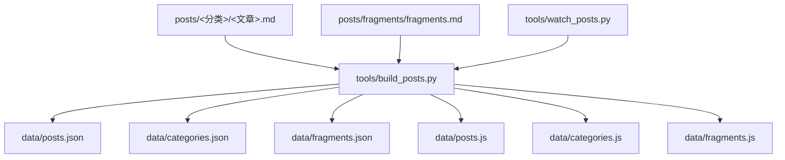
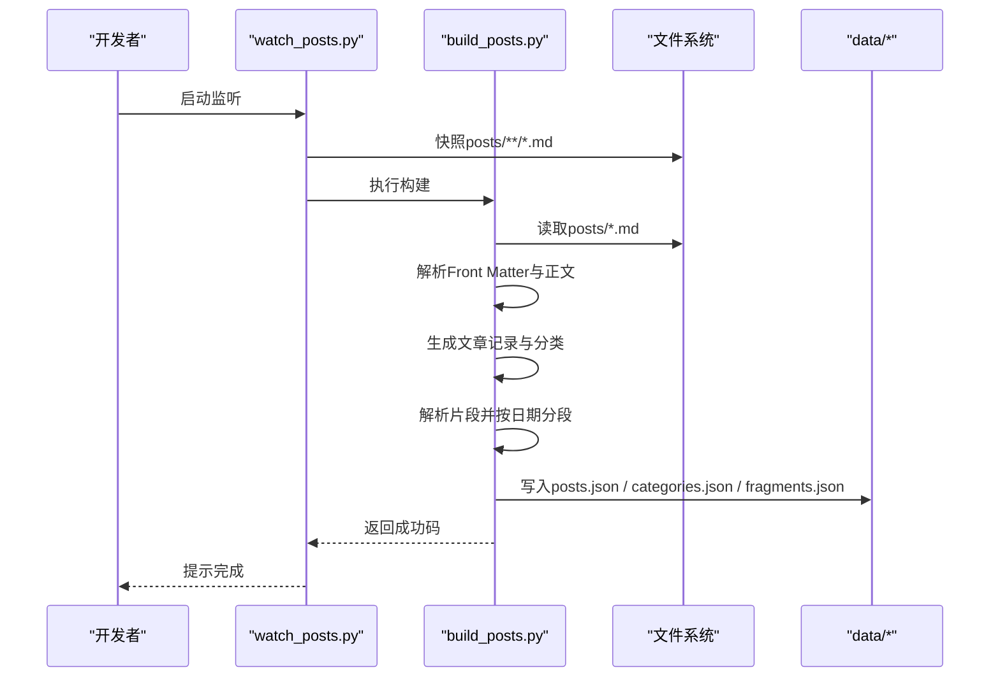
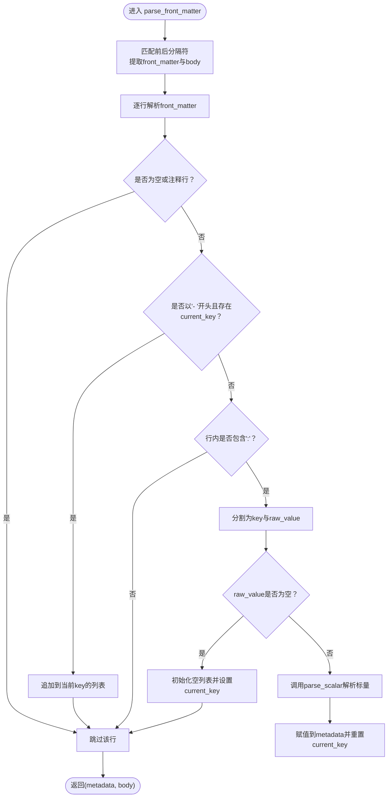
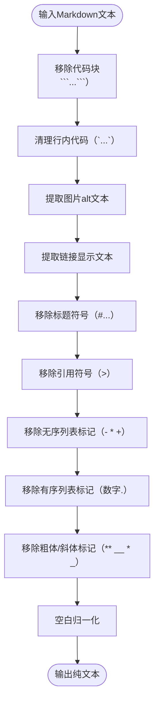
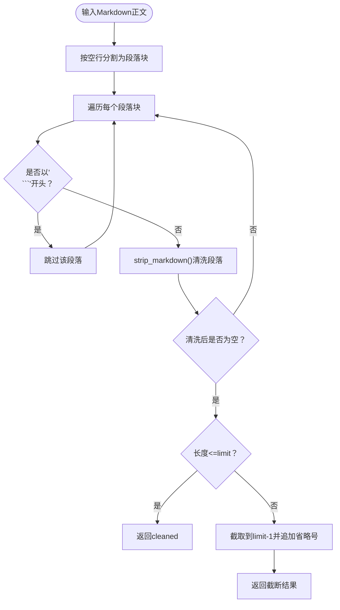
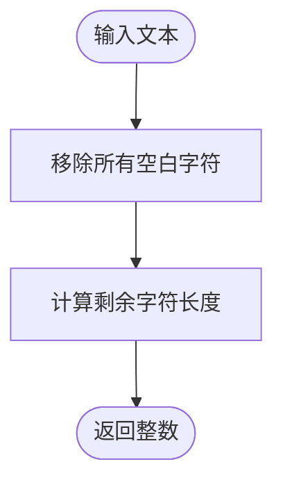
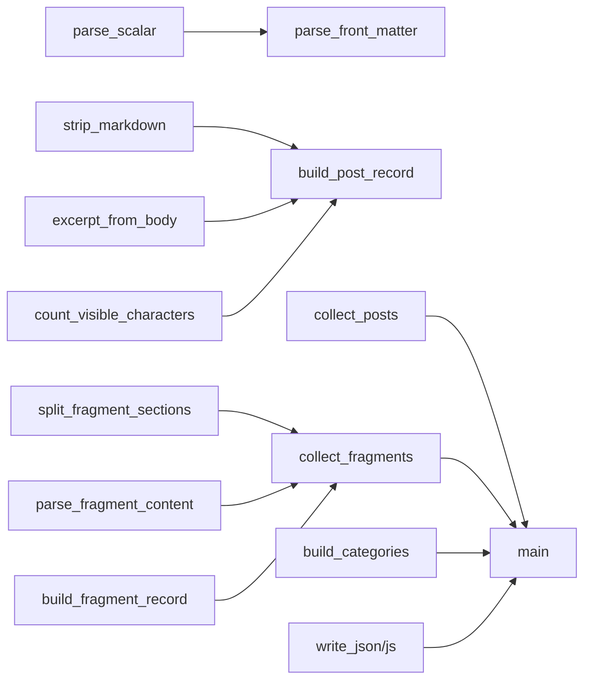

# Markdown内容处理

<cite>
**本文引用的文件**   
- [tools/build_posts.py](file://tools/build_posts.py)
- [tools/watch_posts.py](file://tools/watch_posts.py)
- [tools/README.md](file://tools/README.md)
- [posts/default/about-site.md](file://posts/default/about-site.md)
- [posts/fragments/fragments.md](file://posts/fragments/fragments.md)
- [data/posts.json](file://data/posts.json)
- [data/fragments.json](file://data/fragments.json)
</cite>

## 目录
1. [简介](#简介)
2. [项目结构](#项目结构)
3. [核心组件](#核心组件)
4. [架构总览](#架构总览)
5. [详细组件分析](#详细组件分析)
6. [依赖关系分析](#依赖关系分析)
7. [性能考量](#性能考量)
8. [故障排查指南](#故障排查指南)
9. [结论](#结论)
10. [附录：Markdown编写规范与扩展语法](#附录markdown编写规范与扩展语法)

## 简介
本技术文档聚焦于博客的Markdown内容处理系统，重点解释Python构建脚本如何解析和处理Markdown文件，包括内容提取、格式转换和统计计算过程。文档将深入剖析以下关键函数与流程：
- strip_markdown()：从Markdown文本中移除格式标记，提取纯文本
- excerpt_from_body()：基于段落分割与代码块过滤生成摘要
- count_visible_characters()：统计可见字符数用于字数与阅读时长估算
同时提供实际写作规范与扩展语法说明，帮助作者高效产出符合系统预期的内容。

## 项目结构
仓库采用“源文件+数据产物”的组织方式：
- posts：存放所有文章与碎片的Markdown源文件，按分类目录组织
- tools：包含构建与监听脚本，负责解析Markdown并输出JSON/JS数据
- data：由构建脚本生成的结构化数据（posts.json、categories.json、fragments.json等）
- image：按分类与标题组织图片资源，供文章与碎片引用



图表来源
- [tools/build_posts.py:380-414](file://tools/build_posts.py#L380-L414)
- [tools/watch_posts.py:38-71](file://tools/watch_posts.py#L38-L71)

章节来源
- [tools/build_posts.py:10-23](file://tools/build_posts.py#L10-L23)
- [tools/watch_posts.py:9-12](file://tools/watch_posts.py#L9-L12)
- [tools/README.md:1-22](file://tools/README.md#L1-L22)

## 核心组件
- 前导元数据解析：支持键值对、列表、布尔、数字、浮点等标量类型；支持多行列表项
- 正文处理：去除Markdown标记、提取链接与图片alt文本、清理标题符号、格式化列表项
- 摘要生成：按段落切分、跳过代码块、限制长度并追加省略号
- 统计计算：可见字符计数、阅读分钟估算、标签规范化
- 片段处理：按二级日期标题分段、提取段落与图片信息、标准化时间字段
- 数据输出：写入JSON与JS全局变量，便于前端消费

章节来源
- [tools/build_posts.py:25-88](file://tools/build_posts.py#L25-L88)
- [tools/build_posts.py:91-134](file://tools/build_posts.py#L91-L134)
- [tools/build_posts.py:146-197](file://tools/build_posts.py#L146-L197)
- [tools/build_posts.py:200-298](file://tools/build_posts.py#L200-L298)
- [tools/build_posts.py:337-414](file://tools/build_posts.py#L337-L414)

## 架构总览
构建流程从扫描posts目录开始，逐篇解析Markdown，生成文章记录与分类聚合，同时将片段文件按日期标题拆分并生成片段记录。最终统一输出到data目录，供前端页面加载。



图表来源
- [tools/watch_posts.py:38-71](file://tools/watch_posts.py#L38-L71)
- [tools/build_posts.py:337-414](file://tools/build_posts.py#L337-L414)

## 详细组件分析

### 前导元数据解析（parse_front_matter）
- 使用正则匹配以“---”包裹的前导元数据块，分离出metadata与正文body
- 支持键值对与多行列表项（以“- ”开头），自动识别字符串、布尔、整数、浮点与数组
- 空值键会初始化空列表，后续行以“- ”开头的元素会被追加到该列表
- 注释行（以“#”开头）与空白行被忽略



图表来源
- [tools/build_posts.py:52-88](file://tools/build_posts.py#L52-L88)
- [tools/build_posts.py:25-49](file://tools/build_posts.py#L25-L49)

章节来源
- [tools/build_posts.py:52-88](file://tools/build_posts.py#L52-L88)
- [tools/build_posts.py:25-49](file://tools/build_posts.py#L25-L49)

### 正文处理与纯文本提取（strip_markdown）
strip_markdown()负责将Markdown转换为可读纯文本，具体步骤如下：
- 代码块移除：使用非贪婪匹配移除三反引号包围的代码块，替换为空格以避免粘连
- 行内代码清理：保留反引号内的内容，去除反引号本身
- 图片处理：提取alt文本作为替代内容
- 链接处理：提取显示文本，丢弃URL
- 标题清理：移除1至6级标题符号及紧随的空格
- 引用块清理：移除行首的“>”引用标记
- 列表项格式化：移除无序列表（- * +）与有序列表（数字加点）的起始标记
- 粗体与斜体清理：移除加粗与下划线标记
- 空白归一化：将多个空白合并为单个空格，并去除首尾空白



图表来源
- [tools/build_posts.py:101-113](file://tools/build_posts.py#L101-L113)

章节来源
- [tools/build_posts.py:101-113](file://tools/build_posts.py#L101-L113)

### 摘要生成算法（excerpt_from_body）
excerpt_from_body()根据正文生成简短摘要，核心逻辑：
- 段落分割：按连续换行（空行）将正文拆分为若干段落块
- 代码块过滤：跳过以“```”开头的段落块
- 文本清洗：对每个段落调用strip_markdown()得到干净文本
- 长度控制：若段落长度不超过limit则直接返回；否则截取到limit-1位置，去除尾部空白后追加省略号
- 默认限制：limit默认为96个字符



图表来源
- [tools/build_posts.py:116-129](file://tools/build_posts.py#L116-L129)

章节来源
- [tools/build_posts.py:116-129](file://tools/build_posts.py#L116-L129)

### 可见字符统计（count_visible_characters）
count_visible_characters()通过移除所有空白字符（空格、制表符、换行等）来计算可见字符数量，用于：
- 生成wordCount显示（如“xxx 字”）
- 计算readingMinutes（每300字约1分钟，向上取整，最小为1）



图表来源
- [tools/build_posts.py:132-133](file://tools/build_posts.py#L132-L133)

章节来源
- [tools/build_posts.py:132-133](file://tools/build_posts.py#L132-L133)

### 文章记录构建（build_post_record）
该函数整合元数据与正文，生成文章记录对象，关键步骤：
- 读取原始Markdown文本，解析前导元数据与正文
- 填充基础字段：id、title、category、date、tags等
- 生成纯文本与摘要：优先使用显式excerpt，否则调用excerpt_from_body()
- 计算统计：visible_characters、wordCount、readingTime、readingMinutes
- 生成路径与目录：path、sourcePath、imageDir等
- 布尔字段规范化：featured、pinned、showInRecent、showInArchive等

章节来源
- [tools/build_posts.py:146-197](file://tools/build_posts.py#L146-L197)

### 片段处理（split_fragment_sections、parse_fragment_content、build_fragment_record）
片段系统以二级标题中的日期时间作为分组依据：
- split_fragment_sections()：按“## YYYY-MM-DD HH:MM:SS”标题将正文划分为多个片段段
- parse_fragment_content()：对每个片段提取段落与图片信息，图片alt作为caption
- build_fragment_record()：标准化时间字段（ISO格式与本地显示）、生成唯一id、组装输出对象

章节来源
- [tools/build_posts.py:230-298](file://tools/build_posts.py#L230-L298)

### 数据输出（write_json、write_js、main）
- write_json()：将Python对象序列化为JSON并写入文件
- write_js()：将对象序列化为JS全局变量赋值语句
- main()：协调收集文章、片段与分类，写入data目录下的JSON与JS文件，并打印构建统计

章节来源
- [tools/build_posts.py:323-414](file://tools/build_posts.py#L323-L414)

## 依赖关系分析
- 模块内部依赖：
  - parse_front_matter() 依赖 parse_scalar() 进行标量解析
  - build_post_record() 依赖 strip_markdown()、excerpt_from_body()、count_visible_characters()
  - collect_fragments() 依赖 split_fragment_sections()、parse_fragment_content()、build_fragment_record()
  - main() 依赖 collect_posts()、collect_fragments()、build_categories() 以及写文件工具
- 外部依赖：
  - re：正则表达式处理
  - json：序列化
  - math：向上取整计算阅读时间
  - pathlib.Path：路径操作
  - shutil：清理输出目录



图表来源
- [tools/build_posts.py:25-49](file://tools/build_posts.py#L25-L49)
- [tools/build_posts.py:101-134](file://tools/build_posts.py#L101-L134)
- [tools/build_posts.py:146-197](file://tools/build_posts.py#L146-L197)
- [tools/build_posts.py:230-298](file://tools/build_posts.py#L230-L298)
- [tools/build_posts.py:337-414](file://tools/build_posts.py#L337-L414)

章节来源
- [tools/build_posts.py:10-23](file://tools/build_posts.py#L10-L23)
- [tools/build_posts.py:380-414](file://tools/build_posts.py#L380-L414)

## 性能考量
- 正则表达式优化：strip_markdown()与excerpt_from_body()使用预编译模式与一次性替换，避免重复开销
- 段落级处理：excerpt_from_body()在首个有效段落即返回，减少不必要的遍历
- 字符统计简化：count_visible_characters()仅做空白移除与长度计算，复杂度O(n)
- 文件I/O批量化：main()批量写入JSON/JS，减少多次磁盘操作
- 增量构建：watch_posts.py通过快照比较变更，仅在必要时触发重建

[本节为通用指导，不直接分析具体文件]

## 故障排查指南
- 前导元数据未生效
  - 检查是否以“---”正确包裹，键值对是否包含冒号，列表项是否以“- ”开头
  - 参考示例：[posts/default/about-site.md:1-17](file://posts/default/about-site.md#L1-L17)
- 摘要为空或过短
  - 确认正文存在非代码块段落；excerpt_from_body()会跳过代码块段落
  - 调整limit参数或提供更短的显式excerpt
- 图片未显示
  - 确保图片路径相对文章目录，遵循image/<分类>/<slug>/规则
  - 参考说明：[tools/README.md:23-49](file://tools/README.md#L23-L49)
- 片段未按日期分组
  - 确认二级标题格式为“YYYY-MM-DD HH:MM:SS”，可带可选秒与时区
  - 参考示例：[posts/fragments/fragments.md:5-11](file://posts/fragments/fragments.md#L5-L11)
- 构建失败
  - 查看watch日志输出的退出码与错误信息
  - 手动运行构建脚本定位问题：py tools\build_posts.py

章节来源
- [tools/README.md:1-22](file://tools/README.md#L1-L22)
- [tools/watch_posts.py:23-35](file://tools/watch_posts.py#L23-L35)
- [posts/default/about-site.md:1-17](file://posts/default/about-site.md#L1-L17)
- [posts/fragments/fragments.md:5-11](file://posts/fragments/fragments.md#L5-L11)

## 结论
本Markdown内容处理系统通过轻量化的Python脚本实现了从源文件到结构化数据的完整流水线。其核心优势在于：
- 明确的元数据约定与灵活的标量解析
- 稳健的正文清洗与摘要生成策略
- 直观的片段分组与时间标准化
- 高效的构建与监听机制，便于开发迭代

遵循本文档提供的编写规范与最佳实践，可显著提升内容生产与站点维护效率。

[本节为总结性内容，不直接分析具体文件]

## 附录：Markdown编写规范与扩展语法

### 文章元数据（Front Matter）
- 必须位于文件顶部，以“---”包裹
- 支持字段：
  - title：文章标题（可选，默认使用文件名）
  - category：分类名称（可选，默认使用文件夹名）
  - categoryOrder：分类排序（可选，默认999）
  - date：日期（可选，支持多种格式）
  - tags：标签（支持逗号分隔或列表）
  - cover：封面图路径（可选）
  - featured/pinned/showInRecent/showInArchive：布尔开关（可选）
  - recentOrder/archiveOrder：排序权重（可选）
  - excerpt/summary/description：摘要与描述（可选，未提供则自动生成）
  - wordCount/readingTime：自定义字数与阅读时间（可选）
- 示例参考：[posts/default/about-site.md:1-17](file://posts/default/about-site.md#L1-L17)

### 正文格式
- 标题：使用1-6级“#”符号
- 列表：支持无序（- * +）与有序（数字.）
- 引用：使用“>”
- 链接：[显示文本](URL)
- 图片：，路径相对于image/<分类>/<slug>/
- 代码块：使用“```”包裹，将在摘要与纯文本中被移除
- 行内代码：使用反引号包裹，将在纯文本中保留内容

### 片段格式
- 文件位置：posts/fragments/fragments.md
- 分组标题：二级标题“## YYYY-MM-DD HH:MM:SS”
- 内容：任意Markdown段落与图片
- 图片存储：image/Fragment/YYYY/文件名
- 示例参考：[posts/fragments/fragments.md:5-11](file://posts/fragments/fragments.md#L5-L11)

### 输出数据结构
- 文章索引：data/posts.json（不含content字段）
- 分类索引：data/categories.json
- 片段索引：data/fragments.json
- JS全局变量：data/posts.js、data/categories.js、data/fragments.js
- 单篇文章数据：data/articles/<分类>/<slug>.json 与 .js

章节来源
- [tools/README.md:23-83](file://tools/README.md#L23-L83)
- [data/posts.json:1-95](file://data/posts.json#L1-L95)
- [data/fragments.json:1-14](file://data/fragments.json#L1-L14)