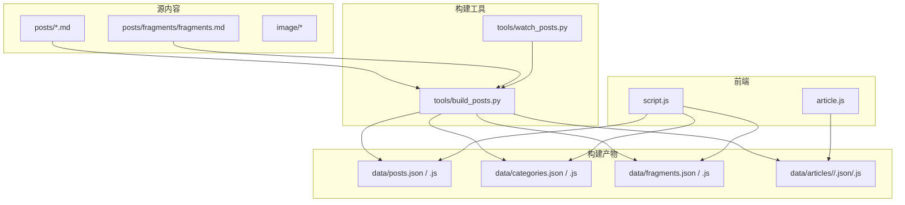
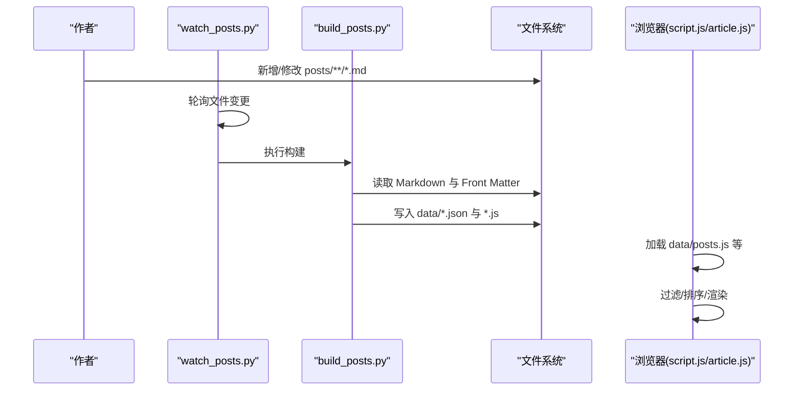
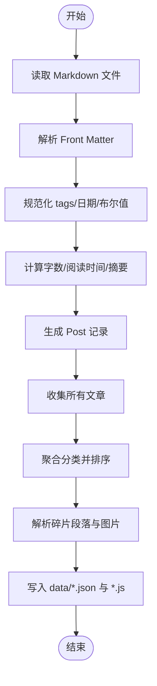
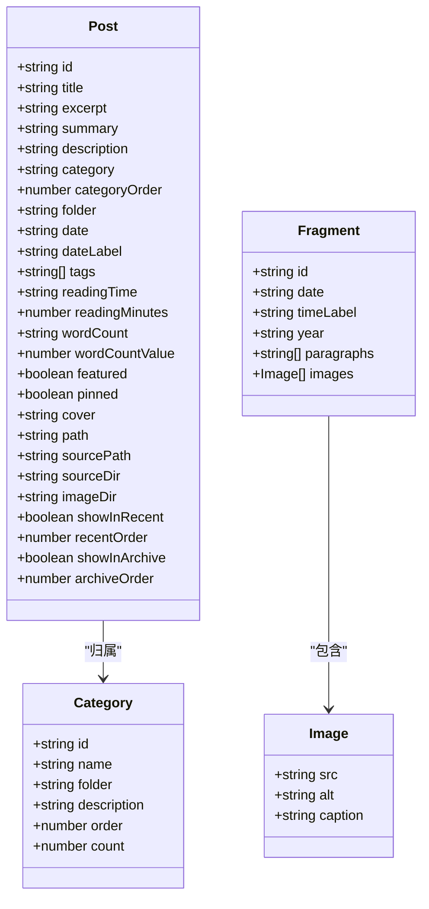
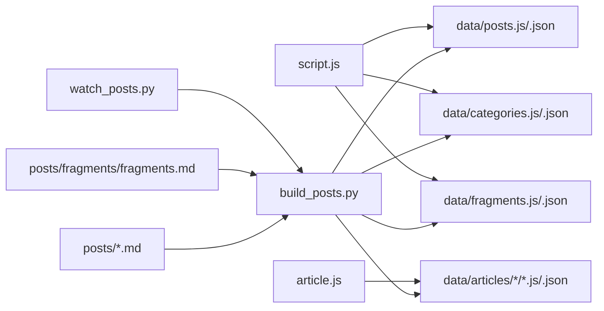

# 内容管理系统

<cite>
**本文引用的文件**   
- [tools/build_posts.py](file://tools/build_posts.py)
- [tools/watch_posts.py](file://tools/watch_posts.py)
- [tools/README.md](file://tools/README.md)
- [posts/default/about-site.md](file://posts/default/about-site.md)
- [posts/fragments/fragments.md](file://posts/fragments/fragments.md)
- [data/posts.json](file://data/posts.json)
- [data/categories.json](file://data/categories.json)
- [data/fragments.json](file://data/fragments.json)
- [data/posts.js](file://data/posts.js)
- [data/categories.js](file://data/categories.js)
- [data/fragments.js](file://data/fragments.js)
- [script.js](file://script.js)
- [article.js](file://article.js)
</cite>

## 目录
1. [简介](#简介)
2. [项目结构](#项目结构)
3. [核心组件](#核心组件)
4. [架构总览](#架构总览)
5. [详细组件分析](#详细组件分析)
6. [依赖关系分析](#依赖关系分析)
7. [性能与扩展性](#性能与扩展性)
8. [故障排查指南](#故障排查指南)
9. [结论](#结论)
10. [附录：Front Matter 语法与字段说明](#附录front-matter-语法与字段说明)

## 简介
本系统是一个基于 Markdown 的博客内容管理系统。作者以 Markdown 编写文章与碎片（Fragments），通过 Python 构建脚本解析 Front Matter 元数据、统计字数与阅读时长，并生成前端可直接消费的数据文件（JSON 与 JS）。前端在页面加载时动态拉取数据，完成分类筛选、标签过滤、排序与渲染。

## 项目结构
- 源内容
  - posts：按分类组织 Markdown 文章；fragments 子目录存放碎片记录
  - image：按文章或年份组织图片资源
- 构建产物
  - data：构建生成的 JSON/JS 数据文件
  - data/articles：每篇文章的独立 JSON/JS 数据
- 工具
  - tools：构建与监听脚本
- 前端
  - script.js、article.js：数据加载、过滤、排序与渲染逻辑

图示来源
- [tools/build_posts.py:380-414](file://tools/build_posts.py#L380-L414)
- [tools/watch_posts.py:38-71](file://tools/watch_posts.py#L38-L71)
- [script.js:39-61](file://script.js#L39-L61)
- [article.js:26-41](file://article.js#L26-L41)

章节来源
- [tools/README.md:1-83](file://tools/README.md#L1-L83)

## 核心组件
- 构建器（Python）
  - 解析 Front Matter 与正文
  - 计算字数、阅读时间、摘要等
  - 生成 posts、categories、fragments 及单篇文章数据
- 监听器（Python）
  - 轮询 posts 下 Markdown 变更，自动触发构建
- 前端数据层（JavaScript）
  - 动态加载 data/*.js 数据
  - 实现分类、标签过滤与多策略排序
  - 渲染首页、归档、碎片与文章详情

章节来源
- [tools/build_posts.py:146-197](file://tools/build_posts.py#L146-L197)
- [tools/build_posts.py:337-396](file://tools/build_posts.py#L337-L396)
- [tools/watch_posts.py:15-36](file://tools/watch_posts.py#L15-L36)
- [script.js:257-299](file://script.js#L257-L299)
- [article.js:96-266](file://article.js#L96-L266)

## 架构总览
从“Markdown 源”到“前端渲染”的端到端流程如下：

图示来源
- [tools/watch_posts.py:38-71](file://tools/watch_posts.py#L38-L71)
- [tools/build_posts.py:380-414](file://tools/build_posts.py#L380-L414)
- [script.js:39-61](file://script.js#L39-L61)
- [article.js:26-41](file://article.js#L26-L41)

## 详细组件分析

### 构建器：build_posts.py
- 职责
  - 解析 Front Matter 键值对与列表
  - 规范化 tags、日期、布尔值
  - 计算可见字符数、阅读分钟、摘要
  - 拆分碎片段落与图片
  - 输出 posts、categories、fragments 与单篇文章数据
- 关键流程
  - 收集所有非 fragments 分类下的 Markdown，生成 Post 记录
  - 聚合分类信息，按 order 与名称排序
  - 遍历 fragments.md，按二级标题中的日期切分片段
  - 将 content 字段剔除后生成索引数据，避免首屏过大
- 复杂度与优化点
  - 正则匹配与文本清洗为线性扫描，整体 O(N)
  - 可考虑增量构建（仅处理变更文件）以提升大规模站点性能

图示来源
- [tools/build_posts.py:52-88](file://tools/build_posts.py#L52-L88)
- [tools/build_posts.py:91-99](file://tools/build_posts.py#L91-L99)
- [tools/build_posts.py:101-144](file://tools/build_posts.py#L101-L144)
- [tools/build_posts.py:146-197](file://tools/build_posts.py#L146-L197)
- [tools/build_posts.py:337-396](file://tools/build_posts.py#L337-L396)

章节来源
- [tools/build_posts.py:17-22](file://tools/build_posts.py#L17-L22)
- [tools/build_posts.py:25-49](file://tools/build_posts.py#L25-L49)
- [tools/build_posts.py:116-134](file://tools/build_posts.py#L116-L134)
- [tools/build_posts.py:200-223](file://tools/build_posts.py#L200-L223)
- [tools/build_posts.py:230-253](file://tools/build_posts.py#L230-L253)
- [tools/build_posts.py:256-283](file://tools/build_posts.py#L256-L283)
- [tools/build_posts.py:300-321](file://tools/build_posts.py#L300-L321)
- [tools/build_posts.py:353-377](file://tools/build_posts.py#L353-L377)
- [tools/build_posts.py:380-414](file://tools/build_posts.py#L380-L414)

### 监听器：watch_posts.py
- 职责
  - 轮询 posts 目录下所有 Markdown 文件的 mtime/size
  - 检测新增、删除、变更事件
  - 调用 build_posts.py 重新构建
- 注意事项
  - 使用简单快照对比，跨平台兼容性好
  - 可通过 start_post_watch.bat 快速启动

章节来源
- [tools/watch_posts.py:15-36](file://tools/watch_posts.py#L15-L36)
- [tools/watch_posts.py:38-71](file://tools/watch_posts.py#L38-L71)

### 前端数据模型与渲染：script.js 与 article.js
- 数据加载
  - 通过 loadDataScript 动态注入 data/posts.js、categories.js、fragments.js
  - 校验全局变量类型，确保数据结构正确
- 数据模型
  - Post：包含 id、title、excerpt、summary、description、category、tags、date、readingTime、wordCount、cover、path、showInRecent、recentOrder、showInArchive、archiveOrder、pinned、featured 等
  - Category：id、name、folder、order、count
  - Fragment：id、date、timeLabel、year、paragraphs、images
- 过滤与排序
  - 分类过滤：按 folder 匹配
  - 标签过滤：多选交集
  - 排序策略：最近优先（recentOrder + date）、归档排序（archiveOrder + pinned + date）、全量按日期倒序
- 渲染
  - 首页：展示精选卡片、分类与标签筛选、归档列表
  - 碎片页：按时间倒序渲染条目与图片
  - 文章页：动态加载 data/articles/<category>/<slug>.js，渲染标题、元信息、标签、封面与正文

图示来源
- [data/posts.json:1-95](file://data/posts.json#L1-L95)
- [data/categories.json:1-19](file://data/categories.json#L1-L19)
- [data/fragments.json:1-14](file://data/fragments.json#L1-L14)

章节来源
- [script.js:12-37](file://script.js#L12-37)
- [script.js:257-299](file://script.js#L257-L299)
- [script.js:301-436](file://script.js#L301-L436)
- [script.js:497-664](file://script.js#L497-L664)
- [article.js:26-41](file://article.js#L26-L41)
- [article.js:96-266](file://article.js#L96-L266)

### 文章正文渲染：article.js
- 支持的内联语法
  - 粗体、斜体、删除线、行内代码
  - 图片与链接（含相对路径与站内文章跳转）
- 块级语法
  - 标题、无序/有序列表、引用块、代码块、分割线
- 安全与路径解析
  - HTML 转义、路径归一化、特殊 URL 判断
  - 根据 article.sourceDir/imageDir 解析资源路径

章节来源
- [article.js:65-94](file://article.js#L65-L94)
- [article.js:96-266](file://article.js#L96-L266)
- [script.js:129-186](file://script.js#L129-L186)

## 依赖关系分析
- 构建期依赖
  - build_posts.py 依赖 posts 与 fragments 源文件
  - watch_posts.py 依赖 build_posts.py
- 运行期依赖
  - script.js 依赖 data/posts.js、data/categories.js、data/fragments.js
  - article.js 依赖 data/articles/<category>/<slug>.js

图示来源
- [tools/build_posts.py:380-414](file://tools/build_posts.py#L380-L414)
- [tools/watch_posts.py:38-71](file://tools/watch_posts.py#L38-L71)
- [script.js:39-61](file://script.js#L39-L61)
- [article.js:26-41](file://article.js#L26-L41)

章节来源
- [tools/build_posts.py:380-414](file://tools/build_posts.py#L380-L414)
- [script.js:39-61](file://script.js#L39-L61)
- [article.js:26-41](file://article.js#L26-L41)

## 性能与扩展性
- 构建性能
  - 当前为全量构建，适合中小规模站点；未来可按文件哈希增量构建
- 前端性能
  - 首屏仅加载索引数据（不含 content），按需加载单篇文章数据
  - 图片懒加载与惰性渲染有助于提升体验
- 可扩展点
  - 在前端增加搜索功能（基于 tags/title/excerpt 的本地检索）
  - 在构建期引入缓存与并行处理

[本节为通用建议，不直接分析具体文件]

## 故障排查指南
- 常见问题
  - 文章未显示：确认已运行构建脚本，检查 data/posts.js 是否存在且格式正确
  - 图片无法加载：确认图片路径与 image 目录一致，注意相对路径解析规则
  - 碎片未渲染：检查 fragments.md 中是否使用二级标题带日期格式
- 定位方法
  - 查看控制台错误信息（如 Shared 脚本未加载、数据脚本加载失败）
  - 验证 data 目录产物是否与 posts 源保持一致

章节来源
- [script.js:12-37](file://script.js#L12-37)
- [article.js:13-16](file://article.js#L13-L16)
- [tools/README.md:23-49](file://tools/README.md#L23-L49)

## 结论
本系统以 Markdown 为中心，通过轻量 Python 构建脚本生成结构化数据，前端再基于这些数据实现灵活的分类、标签与排序能力。整体架构清晰、耦合度低，易于维护与扩展。

[本节为总结性内容，不直接分析具体文件]

## 附录：Front Matter 语法与字段说明

### Front Matter 语法
- 包裹方式：以 --- 分隔的 YAML 风格键值对
- 标量类型支持：字符串、布尔、整数、浮点数、数组（逗号分隔或逐行 - 列表）
- 注释：以 # 开头的行会被忽略
- 示例参考
  - 文章示例：[posts/default/about-site.md](file://posts/default/about-site.md)
  - 碎片示例：[posts/fragments/fragments.md](file://posts/fragments/fragments.md)

章节来源
- [tools/build_posts.py:25-49](file://tools/build_posts.py#L25-L49)
- [posts/default/about-site.md:1-17](file://posts/default/about-site.md#L1-L17)
- [posts/fragments/fragments.md:1-11](file://posts/fragments/fragments.md#L1-L11)

### 支持的 Front Matter 字段（Post）
- 基础信息
  - title：文章标题（默认使用文件名）
  - category：分类名（默认使用文件夹名）
  - categoryOrder：分类排序权重（默认 999）
  - date：发布日期（YYYY-MM-DD 或带时分秒）
  - dateLabel：日期展示标签（可选，默认同 date）
- 内容与摘要
  - excerpt：摘要（若未提供则从正文提取）
  - summary：摘要别名（若未提供则复用 excerpt）
  - description：描述（SEO 用，优先级：description > excerpt > summary > title）
- 标签
  - tags：字符串或数组（支持逗号分隔或逐行 - 列表）
- 统计与阅读
  - wordCount：字数（若未提供则自动计算）
  - readingTime：阅读时长（若未提供则自动计算）
  - readingMinutes：阅读分钟数（自动计算）
- 展示控制
  - featured：是否精选
  - pinned：是否置顶（归档排序）
  - cover：封面图路径
  - showInRecent：是否在“最近”展示（默认 true）
  - recentOrder：最近排序权重（默认 999）
  - showInArchive：是否在归档展示（默认 true）
  - archiveOrder：归档排序权重（默认 999）
- 路径与来源
  - path：文章详情页链接（由构建器自动生成）
  - sourcePath/sourceDir/imageDir：源码与图片目录（由构建器自动生成）

章节来源
- [tools/build_posts.py:146-197](file://tools/build_posts.py#L146-L197)
- [data/posts.json:1-95](file://data/posts.json#L1-L95)

### Markdown 正文规范与支持
- 块级元素
  - 标题（h1-h6）、无序/有序列表、引用块、代码块、水平分割线
- 行内元素
  - 粗体、斜体、删除线、行内代码
- 图片与链接
  - 图片：，src 支持相对路径与绝对路径
  - 链接：[label](href)，支持站内文章跳转（.md 自动转换为 article.html?category=...&slug=...）
- 路径解析
  - 文章图片默认位于 image/<category>/<slug>/ 下
  - 碎片图片默认位于 image/Fragment/<year>/ 下

章节来源
- [article.js:65-94](file://article.js#L65-L94)
- [article.js:96-266](file://article.js#L96-L266)
- [tools/README.md:23-49](file://tools/README.md#L23-L49)
- [tools/README.md:51-83](file://tools/README.md#L51-L83)

### 碎片（Fragment）记录格式
- 来源文件：posts/fragments/fragments.md
- 分段规则：以 ## 二级标题携带日期作为分段标记
- 字段说明
  - id：由标题标准化生成
  - date/timeLabel/year：时间相关字段
  - paragraphs：段落数组
  - images：图片数组（src、alt、caption）
- 图片存储：image/Fragment/<year>/

章节来源
- [tools/build_posts.py:200-223](file://tools/build_posts.py#L200-L223)
- [tools/build_posts.py:230-253](file://tools/build_posts.py#L230-L253)
- [tools/build_posts.py:256-283](file://tools/build_posts.py#L256-L283)
- [tools/build_posts.py:300-321](file://tools/build_posts.py#L300-L321)
- [data/fragments.json:1-14](file://data/fragments.json#L1-L14)

### 分类系统与数据生成
- 分类聚合
  - 按文件夹 id 聚合，name 取自文章 category，order 取最小值
  - 计数：每个分类的文章数量
- 输出
  - categories.json/.js：分类列表
  - posts.json/.js：文章索引（不含 content）
  - fragments.json/.js：碎片列表
  - data/articles/<category>/<slug>.{json,js}：单篇文章完整数据

章节来源
- [tools/build_posts.py:353-377](file://tools/build_posts.py#L353-L377)
- [tools/build_posts.py:380-414](file://tools/build_posts.py#L380-L414)
- [data/categories.json:1-19](file://data/categories.json#L1-L19)
- [data/posts.json:1-95](file://data/posts.json#L1-L95)
- [data/fragments.json:1-14](file://data/fragments.json#L1-L14)

### 内容过滤、排序与搜索机制
- 过滤
  - 分类：按 folder 精确匹配
  - 标签：多选交集（同时满足所选标签）
- 排序
  - 最近：showInRecent=true，按 recentOrder 升序，其次按 date 降序
  - 归档：showInArchive=true，按 archiveOrder 升序，其次 pinned 置顶，最后 date 降序
  - 全量：按 date 降序
- 搜索
  - 当前仓库未内置全文搜索；可在前端基于 title/excerpt/tags 进行本地检索扩展

章节来源
- [script.js:257-299](file://script.js#L257-L299)

### 实际操作示例（步骤指引）
- 创建新文章
  - 在 posts/<category>/<slug>.md 新建文件，添加 Front Matter 与正文
  - 如需图片，放入 image/<category>/<slug>/ 并在正文中使用相对路径
  - 运行构建脚本或开启监听模式
- 添加分类与标签
  - 分类：在 posts 下新建分类目录，或在 Front Matter 指定 category 与 categoryOrder
  - 标签：在 Front Matter 中设置 tags（数组或逗号分隔）
- 管理内容元数据
  - 调整 featured/pinned/showInRecent/recentOrder/showInArchive/archiveOrder 控制展示与排序
  - 自定义 excerpt/summary/description 控制摘要与 SEO 描述

章节来源
- [tools/README.md:23-49](file://tools/README.md#L23-L49)
- [tools/README.md:51-83](file://tools/README.md#L51-L83)
- [tools/build_posts.py:146-197](file://tools/build_posts.py#L146-L197)
- [script.js:257-299](file://script.js#L257-L299)