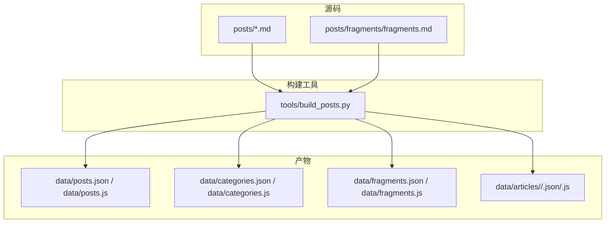
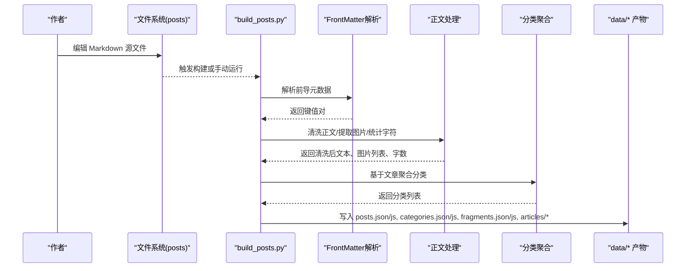
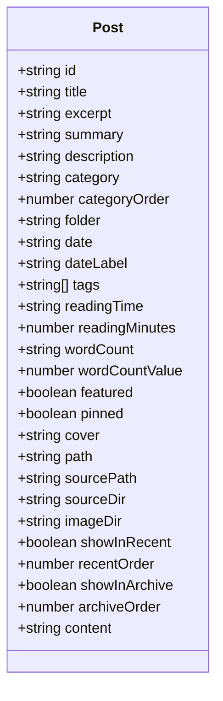
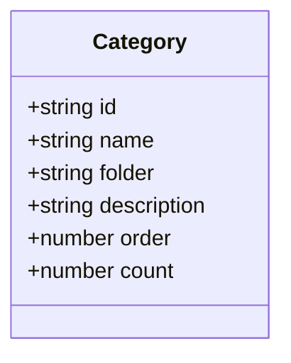
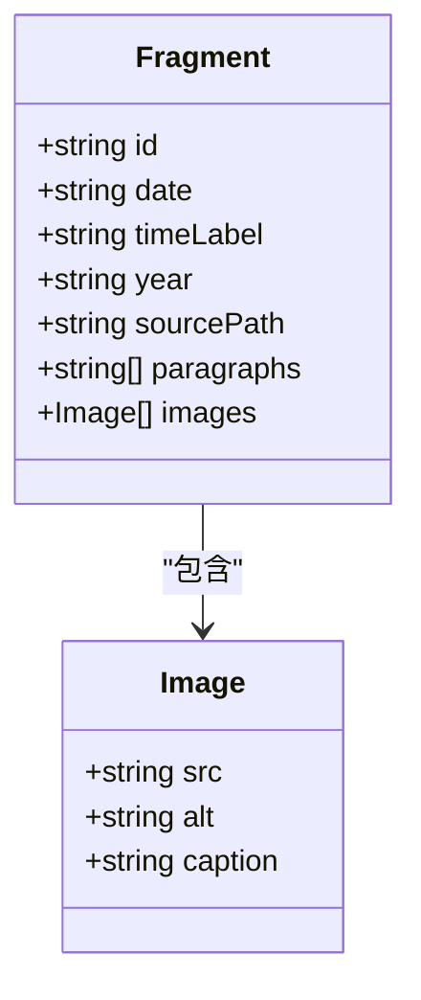
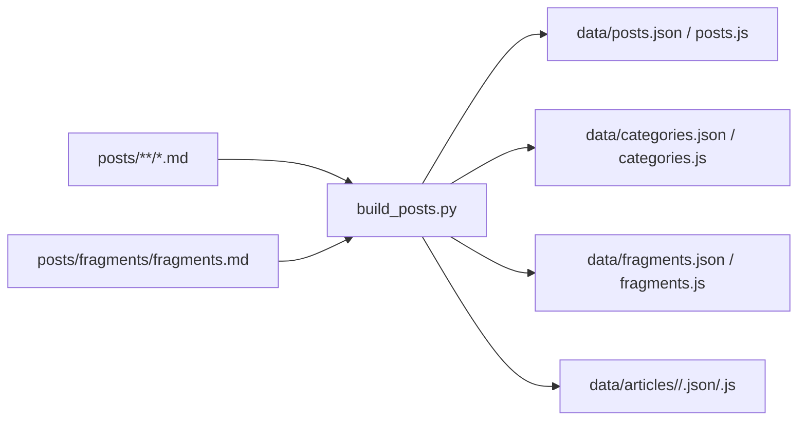

# 数据模型设计

<cite>
**本文引用的文件**   
- [data/posts.js](file://data/posts.js)
- [data/categories.js](file://data/categories.js)
- [data/fragments.js](file://data/fragments.js)
- [data/posts.json](file://data/posts.json)
- [data/categories.json](file://data/categories.json)
- [data/fragments.json](file://data/fragments.json)
- [tools/build_posts.py](file://tools/build_posts.py)
- [posts/default/about-site.md](file://posts/default/about-site.md)
- [posts/fragments/fragments.md](file://posts/fragments/fragments.md)
- [data/articles/default/about-site.js](file://data/articles/default/about-site.js)
- [tools/README.md](file://tools/README.md)
</cite>

## 目录
1. [简介](#简介)
2. [项目结构](#项目结构)
3. [核心组件](#核心组件)
4. [架构总览](#架构总览)
5. [详细组件分析](#详细组件分析)
6. [依赖关系分析](#依赖关系分析)
7. [性能与可扩展性](#性能与可扩展性)
8. [故障排查指南](#故障排查指南)
9. [结论](#结论)
10. [附录：字段校验规则与示例](#附录：字段校验规则与示例)

## 简介
本技术文档聚焦博客的数据模型系统，围绕三类核心实体展开：Post（文章）、Category（分类）、Fragment（碎片）。文档将深入解释各实体的属性定义、数据类型、默认值与推导逻辑，并完整说明从 Markdown 源文件到 JSON/JS 数据文件的构建流程。同时提供字段校验规则与实际数据结构示例路径，帮助读者快速理解与扩展该数据模型。

## 项目结构
仓库采用“源码在 posts，产物在 data”的静态站点模式：
- 源码层：Markdown 文章位于 posts 目录下，按分类文件夹组织；碎片统一放在 posts/fragments。
- 产物层：构建脚本生成 data 下的 posts.json、categories.json、fragments.json 以及对应的 JS 全局变量文件 posts.js、categories.js、fragments.js；每篇文章还会生成 articles/<folder>/<slug>.json 和 .js。

图表来源
- [tools/build_posts.py:380-414](file://tools/build_posts.py#L380-L414)
- [tools/README.md:1-83](file://tools/README.md#L1-L83)

章节来源
- [tools/build_posts.py:380-414](file://tools/build_posts.py#L380-L414)
- [tools/README.md:1-83](file://tools/README.md#L1-L83)

## 核心组件
本节概述三大数据模型及其职责：
- Post：单篇文章的元数据与展示信息，包含标题、摘要、标签、阅读时长、字数等。
- Category：文章分类的元数据，用于聚合与排序。
- Fragment：碎片化记录，支持时间戳、段落与图片集合。

章节来源
- [data/posts.js:1-95](file://data/posts.js#L1-L95)
- [data/categories.js:1-19](file://data/categories.js#L1-L19)
- [data/fragments.js:1-14](file://data/fragments.js#L1-L14)

## 架构总览
下图展示了从 Markdown 到最终数据产物的端到端流程，包括前导元数据解析、正文清洗、统计计算、分类聚合与输出。

图表来源
- [tools/build_posts.py:52-88](file://tools/build_posts.py#L52-L88)
- [tools/build_posts.py:101-114](file://tools/build_posts.py#L101-L114)
- [tools/build_posts.py:116-134](file://tools/build_posts.py#L116-L134)
- [tools/build_posts.py:146-197](file://tools/build_posts.py#L146-L197)
- [tools/build_posts.py:353-377](file://tools/build_posts.py#L353-L377)
- [tools/build_posts.py:380-414](file://tools/build_posts.py#L380-L414)

## 详细组件分析

### Post 对象模型
Post 是文章的核心数据载体，既包含展示所需元数据，也包含构建期计算的衍生字段。

- 标识与定位
  - id: 字符串，来源于文件名 slug，作为唯一标识。
  - folder: 字符串，来源于所属分类目录名。
  - path: 字符串，由构建器根据 category 与 slug 拼接生成的前端路由。
  - sourcePath/sourceDir/imageDir: 字符串，分别指向 Markdown 源文件、源目录与图片目录。

- 内容描述
  - title: 字符串，来自前导元数据或回退为 slug。
  - excerpt: 字符串，优先使用元数据中的 excerpt，否则从正文自动抽取。
  - summary: 字符串，优先使用元数据中的 summary，否则回退至 excerpt。
  - description: 字符串，优先使用元数据中的 description，否则回退至 excerpt/summary/title。

- 分类与标签
  - category: 字符串，来自元数据或回退为 folder。
  - categoryOrder: 整数，用于分类排序，默认较大值。
  - tags: 字符串数组，支持逗号分隔或 YAML 式列表，空项会被过滤。

- 时间与展示控制
  - date/dateLabel: 字符串，date 来自元数据，dateLabel 可自定义或回退为 date。
  - featured/pinned: 布尔值，控制是否精选与置顶。
  - showInRecent/recentOrder/showInArchive/archiveOrder: 布尔与整数组合，控制是否在近期与归档中显示及排序。

- 统计与媒体
  - wordCount: 字符串，如“415 字”，可由元数据覆盖，否则基于可见字符数计算。
  - wordCountValue: 整数，可见字符计数，用于排序与统计。
  - readingTime: 字符串，如“2 分钟”，可由元数据覆盖，否则基于字数估算。
  - readingMinutes: 整数，分钟数，用于排序与展示。
  - cover: 字符串，封面图路径。

- 内容主体
  - content: 字符串，原始正文（仅出现在单篇文章产物中，不在列表产物里）。

字段类型与默认值要点
- 字符串类字段若缺失，会按优先级回退（title→slug，excerpt→正文抽取，summary→excerpt，description→excerpt/summary/title）。
- 布尔类字段若缺失，默认 false（featured/pinned），showInRecent/showInArchive 默认 true。
- 数值类字段若缺失，categoryOrder/recentOrder/archiveOrder 默认较大值以沉底。
- 数组类字段 tags 为空时返回空数组。

章节来源
- [tools/build_posts.py:146-197](file://tools/build_posts.py#L146-L197)
- [data/posts.js:1-95](file://data/posts.js#L1-L95)
- [data/posts.json:1-95](file://data/posts.json#L1-L95)
- [data/articles/default/about-site.js:1-33](file://data/articles/default/about-site.js#L1-L33)
- [posts/default/about-site.md:1-39](file://posts/default/about-site.md#L1-L39)

#### Post 字段关系图

图表来源
- [tools/build_posts.py:146-197](file://tools/build_posts.py#L146-L197)

### Category 对象模型
Category 由构建器根据所有文章聚合生成，用于导航与统计。

- 字段说明
  - id: 字符串，对应文章所在目录名（folder）。
  - name: 字符串，取第一篇同目录文章的 category 字段作为名称。
  - folder: 字符串，与 id 一致，便于定位。
  - description: 字符串，默认格式为“{name}分类”。
  - order: 整数，取该分类下所有文章的 categoryOrder 最小值。
  - count: 整数，该分类下的文章数量。

- 排序策略
  - 先按 order 升序，再按 name 字典序。

章节来源
- [tools/build_posts.py:353-377](file://tools/build_posts.py#L353-L377)
- [data/categories.js:1-19](file://data/categories.js#L1-L19)
- [data/categories.json:1-19](file://data/categories.json#L1-L19)

#### Category 字段关系图

图表来源
- [tools/build_posts.py:353-377](file://tools/build_posts.py#L353-L377)

### Fragment 对象模型
Fragment 用于承载短小、带时间的碎片化内容，支持多段文本与图片。

- 字段说明
  - id: 字符串，由时间标题规范化而来，确保稳定且可读。
  - date: 字符串，标准化后的 ISO 时间（含时区偏移）。
  - timeLabel: 字符串，本地化展示用的“YYYY-MM-DD HH:mm:ss”。
  - year: 字符串，年份片段，用于分组展示。
  - sourcePath: 字符串，指向 fragments 源文件。
  - paragraphs: 字符串数组，正文段落（去除图片占位与多余空白）。
  - images: 对象数组，每个元素包含 src、alt，可选 caption。

- 时间解析与 ID 生成
  - 时间标题需匹配“YYYY-MM-DD HH:mm:ss”格式，缺失时分秒则补零。
  - 若无法匹配，则回退为原字符串，并从任意位置提取年份。
  - id 通过正则清理非字母数字字符并用连字符连接，必要时回退为“fragment-{index+1}”。

- 正文与图片处理
  - 段落按双换行分割，去除图片标记后保留纯文本段落。
  - 图片按 Markdown 语法提取，alt 存在时作为 caption。

章节来源
- [tools/build_posts.py:200-297](file://tools/build_posts.py#L200-L297)
- [data/fragments.js:1-14](file://data/fragments.js#L1-L14)
- [data/fragments.json:1-14](file://data/fragments.json#L1-L14)
- [posts/fragments/fragments.md:1-11](file://posts/fragments/fragments.md#L1-L11)

#### Fragment 字段关系图

图表来源
- [tools/build_posts.py:256-297](file://tools/build_posts.py#L256-L297)

## 依赖关系分析
- 构建脚本依赖 Python 标准库（json、re、math、pathlib、shutil）进行解析与文件操作。
- 输入依赖 Markdown 前导元数据与二级标题的时间格式约定。
- 输出依赖 data 目录结构与前端读取的全局变量命名约定。

图表来源
- [tools/build_posts.py:380-414](file://tools/build_posts.py#L380-L414)

章节来源
- [tools/build_posts.py:380-414](file://tools/build_posts.py#L380-L414)

## 性能与可扩展性
- 构建复杂度
  - 遍历 posts 与 fragments 目录，逐文件解析与统计，整体 O(N) 线性于文件数量。
  - 正文清洗与统计涉及正则替换与字符计数，单次文章处理开销较小。
- 优化建议
  - 对大体积正文可考虑增量构建（watcher 已提供变更监听）。
  - 若未来引入更复杂的统计（如外链去重、图片尺寸），可在 build 阶段缓存中间结果。
- 可扩展点
  - 新增字段时，建议在 parse_front_matter 与 build_post_record 两处同步处理，保持前后端一致性。
  - 分类聚合逻辑可按需增加更多维度（如标签聚合、作者聚合）。

[本节为通用指导，不直接分析具体文件]

## 故障排查指南
- 前导元数据未生效
  - 检查是否被正确包裹在 --- 之间，键名大小写与空格是否符合预期。
  - 确认布尔值、数组写法符合解析器期望（true/false、YAML 列表或逗号分隔）。
- 日期格式不正确
  - 碎片时间标题必须遵循“YYYY-MM-DD HH:mm:ss”，否则将无法生成标准 date/timeLabel/year。
- 图片路径问题
  - 文章图片应放置在 image/<folder>/<slug>/ 下，并在正文中使用相对路径引用。
  - 碎片图片按年存放于 image/Fragment/<year>/。
- 构建产物缺失
  - 确认执行了构建命令，或 watcher 正常运行。
  - 检查 data 目录权限与磁盘空间。

章节来源
- [tools/build_posts.py:52-88](file://tools/build_posts.py#L52-L88)
- [tools/build_posts.py:200-223](file://tools/build_posts.py#L200-L223)
- [tools/README.md:23-49](file://tools/README.md#L23-L49)
- [tools/README.md:51-83](file://tools/README.md#L51-L83)

## 结论
该数据模型以简洁清晰的 Post/Category/Fragment 三实体为核心，配合构建脚本完成从 Markdown 到结构化数据的自动化转换。字段设计兼顾可读性与可用性，并通过合理的默认值与回退机制提升鲁棒性。遵循本文档的字段规范与校验规则，可高效维护与扩展博客数据体系。

[本节为总结性内容，不直接分析具体文件]

## 附录：字段校验规则与示例

### 字段校验规则速查
- Post
  - id: 必填，字符串，来源于文件名 slug。
  - title: 必填，字符串，缺省回退为 slug。
  - excerpt/summary/description: 字符串，按优先级回退。
  - category: 字符串，缺省回退为 folder。
  - categoryOrder: 整数，缺省为较大值。
  - tags: 字符串数组，空项过滤。
  - date/dateLabel: 字符串，dateLabel 可自定义或回退为 date。
  - featured/pinned: 布尔，缺省 false。
  - showInRecent/showInArchive: 布尔，缺省 true。
  - recentOrder/archiveOrder: 整数，缺省为较大值。
  - wordCountValue: 整数，可见字符计数。
  - readingMinutes: 整数，基于字数估算。
  - cover/path/sourcePath/sourceDir/imageDir: 字符串。
- Category
  - id/folder: 字符串，来源于目录名。
  - name: 字符串，取首篇同目录文章的 category。
  - description: 字符串，默认“{name}分类”。
  - order: 整数，取最小值。
  - count: 整数，文章数量。
- Fragment
  - id: 字符串，由时间标题规范化。
  - date/timeLabel/year: 字符串，ISO 时间、本地化时间、年份。
  - sourcePath: 字符串。
  - paragraphs: 字符串数组。
  - images: 对象数组，包含 src、alt、可选 caption。

章节来源
- [tools/build_posts.py:146-197](file://tools/build_posts.py#L146-L197)
- [tools/build_posts.py:353-377](file://tools/build_posts.py#L353-L377)
- [tools/build_posts.py:200-297](file://tools/build_posts.py#L200-L297)

### 实际数据结构示例路径
- Post 列表与详情
  - 列表：[data/posts.json](file://data/posts.json)、[data/posts.js](file://data/posts.js)
  - 详情：[data/articles/default/about-site.js](file://data/articles/default/about-site.js)
- Category 列表
  - [data/categories.json](file://data/categories.json)、[data/categories.js](file://data/categories.js)
- Fragment 列表
  - [data/fragments.json](file://data/fragments.json)、[data/fragments.js](file://data/fragments.js)
- Markdown 源示例
  - 文章：[posts/default/about-site.md](file://posts/default/about-site.md)
  - 碎片：[posts/fragments/fragments.md](file://posts/fragments/fragments.md)

章节来源
- [data/posts.json:1-95](file://data/posts.json#L1-L95)
- [data/posts.js:1-95](file://data/posts.js#L1-L95)
- [data/categories.json:1-19](file://data/categories.json#L1-L19)
- [data/categories.js:1-19](file://data/categories.js#L1-L19)
- [data/fragments.json:1-14](file://data/fragments.json#L1-L14)
- [data/fragments.js:1-14](file://data/fragments.js#L1-L14)
- [data/articles/default/about-site.js:1-33](file://data/articles/default/about-site.js#L1-L33)
- [posts/default/about-site.md:1-39](file://posts/default/about-site.md#L1-L39)
- [posts/fragments/fragments.md:1-11](file://posts/fragments/fragments.md#L1-L11)