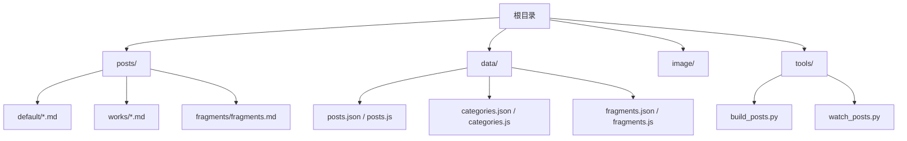
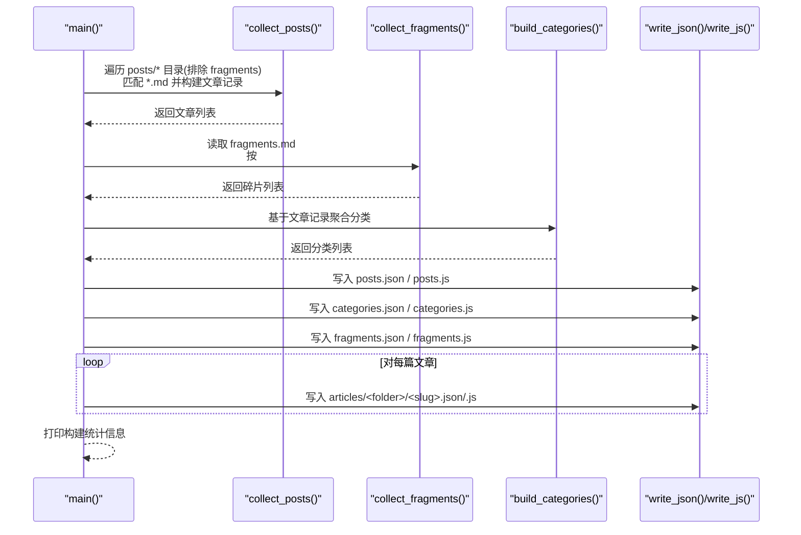
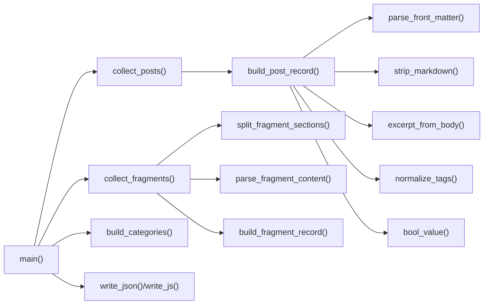

# 构建脚本逻辑

<cite>
**本文引用的文件**   
- [tools/build_posts.py](file://tools/build_posts.py)
- [tools/watch_posts.py](file://tools/watch_posts.py)
- [tools/README.md](file://tools/README.md)
- [posts/default/about-site.md](file://posts/default/about-site.md)
- [posts/fragments/fragments.md](file://posts/fragments/fragments.md)
- [data/posts.json](file://data/posts.json)
- [data/categories.json](file://data/categories.json)
- [data/fragments.json](file://data/fragments.json)
</cite>

## 目录
1. [简介](#简介)
2. [项目结构](#项目结构)
3. [核心组件](#核心组件)
4. [架构总览](#架构总览)
5. [详细组件分析](#详细组件分析)
6. [依赖关系分析](#依赖关系分析)
7. [性能与扩展性](#性能与扩展性)
8. [故障排查指南](#故障排查指南)
9. [结论](#结论)
10. [附录：配置与约定](#附录：配置与约定)

## 简介
本技术文档围绕博客的 Python 构建脚本，系统性解析其整体构建流程、文件扫描与解析机制、输出生成逻辑、错误处理与日志格式，以及可自定义的配置项与扩展点。重点覆盖 main() 函数的执行顺序与依赖关系，包括 collect_posts() 文章收集、collect_fragments() 碎片收集、build_categories() 分类构建等关键步骤；并解释 write_json() 与 write_js() 的输出行为（JSON 格式化与 JavaScript 全局变量注入）。

## 项目结构
构建脚本位于 tools 目录，负责将 posts 目录下的 Markdown 源文件编译为 data 目录中的 JSON/JS 数据产物，并在 articles 子目录中生成每篇文章的独立数据文件。watch 工具用于监听 Markdown 变更并自动触发构建。

图表来源
- [tools/build_posts.py:10-14](file://tools/build_posts.py#L10-L14)
- [tools/watch_posts.py:9-12](file://tools/watch_posts.py#L9-L12)

章节来源
- [tools/build_posts.py:10-14](file://tools/build_posts.py#L10-L14)
- [tools/watch_posts.py:9-12](file://tools/watch_posts.py#L9-L12)

## 核心组件
- 入口函数 main()：编排构建流程，协调文章收集、碎片收集、分类聚合与数据写入。
- 文章收集 collect_posts()：遍历 posts 下除 fragments 外的所有分类目录，匹配 *.md 文件，逐篇构建文章记录。
- 碎片收集 collect_fragments()：读取 posts/fragments/fragments.md，按二级标题日期切分段落，生成碎片列表。
- 分类构建 build_categories()：基于文章记录的 folder/categoryOrder 聚合分类信息并排序。
- 输出写入 write_json()/write_js()：统一 JSON 序列化与 JS 全局变量注入。
- 辅助解析器：parse_front_matter()、strip_markdown()、excerpt_from_body()、normalize_tags()、bool_value() 等。

章节来源
- [tools/build_posts.py:380-409](file://tools/build_posts.py#L380-L409)
- [tools/build_posts.py:337-350](file://tools/build_posts.py#L337-L350)
- [tools/build_posts.py:300-320](file://tools/build_posts.py#L300-L320)
- [tools/build_posts.py:353-377](file://tools/build_posts.py#L353-L377)
- [tools/build_posts.py:323-334](file://tools/build_posts.py#L323-L334)
- [tools/build_posts.py:52-88](file://tools/build_posts.py#L52-L88)
- [tools/build_posts.py:101-113](file://tools/build_posts.py#L101-L113)
- [tools/build_posts.py:116-129](file://tools/build_posts.py#L116-L129)
- [tools/build_posts.py:91-98](file://tools/build_posts.py#L91-L98)
- [tools/build_posts.py:136-143](file://tools/build_posts.py#L136-L143)

## 架构总览
main() 的执行顺序与依赖关系如下：先收集文章与碎片，再根据文章构建分类；随后生成 posts、categories、fragments 的全局数据文件，并为每篇文章生成独立的 JSON/JS 文件。

图表来源
- [tools/build_posts.py:380-409](file://tools/build_posts.py#L380-L409)
- [tools/build_posts.py:337-350](file://tools/build_posts.py#L337-L350)
- [tools/build_posts.py:300-320](file://tools/build_posts.py#L300-L320)
- [tools/build_posts.py:353-377](file://tools/build_posts.py#L353-L377)
- [tools/build_posts.py:323-334](file://tools/build_posts.py#L323-L334)

## 详细组件分析

### main() 构建流程
- 调用 collect_posts() 获取文章列表。
- 调用 collect_fragments() 获取碎片列表。
- 调用 build_categories(posts) 生成分类列表。
- 生成不含正文内容的 posts_index（剔除 content 字段）用于列表页展示。
- 清理并重建 articles 目录，避免历史残留。
- 使用 write_json()/write_js() 输出 posts、categories、fragments 的数据文件。
- 为每篇文章在 articles/<folder>/<slug>.json/.js 生成独立数据文件。
- 最后打印构建统计信息（文章数、分类数、碎片数）。

章节来源
- [tools/build_posts.py:380-409](file://tools/build_posts.py#L380-L409)

### collect_posts() 文章收集
- 遍历 POSTS_DIR 下所有子目录，跳过 FRAGMENTS_DIR。
- 在每个分类目录内匹配 *.md 文件，逐个调用 build_post_record() 构建文章记录。
- 返回文章列表。

章节来源
- [tools/build_posts.py:337-350](file://tools/build_posts.py#L337-L350)

#### build_post_record() 文章记录构建
- 读取 Markdown 文本，解析 front matter 元数据与正文。
- 计算 slug、title、category、date、tags、plain_text、excerpt、summary、description、可见字符数、字数、阅读时间等。
- 生成路径与资源目录信息（path、sourcePath、sourceDir、imageDir）。
- 支持 featured/pinned/showInRecent/recentOrder/showInArchive/archiveOrder 等显示控制字段。
- 返回标准化后的文章记录字典。

章节来源
- [tools/build_posts.py:146-197](file://tools/build_posts.py#L146-L197)

### collect_fragments() 碎片收集
- 若不存在 FRAGMENTS_DIR 则直接返回空列表。
- 遍历 fragments.md，解析 front matter 与正文。
- 使用 split_fragment_sections() 按二级标题（## YYYY-MM-DD HH:MM:SS）切分内容块。
- 若无显式日期标题但存在正文，则以元数据或文件名作为标签，形成单段。
- 对每个片段调用 build_fragment_record() 生成碎片记录。

章节来源
- [tools/build_posts.py:300-320](file://tools/build_posts.py#L300-L320)

#### split_fragment_sections() 与 parse_fragment_content()
- split_fragment_sections()：识别以日期为标签的二级标题，将后续行合并为对应片段内容。
- parse_fragment_content()：从片段正文中提取图片（alt/caption/src）与纯文本段落，剥离 Markdown 语法。

章节来源
- [tools/build_posts.py:230-253](file://tools/build_posts.py#L230-L253)
- [tools/build_posts.py:256-282](file://tools/build_posts.py#L256-L282)

#### normalize_fragment_datetime() 与 fragment_id_from_label()
- normalize_fragment_datetime()：规范化日期字符串，生成 ISO 时间戳、可读时间标签与年份。
- fragment_id_from_label()：由标签生成稳定的 id（字母数字与连字符），回退到序号。

章节来源
- [tools/build_posts.py:200-222](file://tools/build_posts.py#L200-L222)
- [tools/build_posts.py:225-227](file://tools/build_posts.py#L225-L227)

### build_categories() 分类构建
- 遍历文章记录，按 folder 聚合分类信息。
- 维护 name、order、count 等字段，取最小 order 作为分类排序依据。
- 最终按 (order, name) 排序返回分类列表。

章节来源
- [tools/build_posts.py:353-377](file://tools/build_posts.py#L353-L377)

### write_json() 与 write_js() 输出逻辑
- write_json(path, payload)：确保父目录存在，以 UTF-8 编码写入 JSON 文本，缩进为 2，末尾换行。
- write_js(path, global_name, payload)：生成 window.<global_name> = <payload>; 形式的 JS 文件，便于前端直接访问全局变量。

章节来源
- [tools/build_posts.py:323-334](file://tools/build_posts.py#L323-L334)

### 前端数据产物示例
- posts.json：文章列表（不含 content），供首页/归档/搜索等页面消费。
- categories.json：分类列表，含 count 与 order。
- fragments.json：碎片列表，包含 paragraphs 与 images。
- articles/<folder>/<slug>.json/.js：单篇文章完整数据（含 content），供详情页渲染。

章节来源
- [data/posts.json:1-95](file://data/posts.json#L1-L95)
- [data/categories.json:1-19](file://data/categories.json#L1-L19)
- [data/fragments.json:1-14](file://data/fragments.json#L1-L14)

## 依赖关系分析
- 模块内部依赖：
  - main() 依赖 collect_posts()、collect_fragments()、build_categories()、write_json()/write_js()。
  - collect_posts() 依赖 build_post_record()。
  - collect_fragments() 依赖 split_fragment_sections()、parse_fragment_content()、build_fragment_record()。
  - build_post_record() 依赖 parse_front_matter()、strip_markdown()、excerpt_from_body()、normalize_tags()、bool_value()。
- 外部依赖：
  - pathlib.Path 用于路径操作。
  - re 正则表达式用于解析 front matter、日期、Markdown 图像等。
  - json 用于序列化。
  - shutil.rmtree 用于清理 articles 目录。
  - math.ceil 用于计算阅读分钟数。

图表来源
- [tools/build_posts.py:380-409](file://tools/build_posts.py#L380-L409)
- [tools/build_posts.py:337-350](file://tools/build_posts.py#L337-L350)
- [tools/build_posts.py:300-320](file://tools/build_posts.py#L300-L320)
- [tools/build_posts.py:353-377](file://tools/build_posts.py#L353-L377)
- [tools/build_posts.py:146-197](file://tools/build_posts.py#L146-L197)
- [tools/build_posts.py:230-253](file://tools/build_posts.py#L230-L253)
- [tools/build_posts.py:256-282](file://tools/build_posts.py#L256-L282)
- [tools/build_posts.py:52-88](file://tools/build_posts.py#L52-L88)
- [tools/build_posts.py:101-113](file://tools/build_posts.py#L101-L113)
- [tools/build_posts.py:116-129](file://tools/build_posts.py#L116-L129)
- [tools/build_posts.py:91-98](file://tools/build_posts.py#L91-L98)
- [tools/build_posts.py:136-143](file://tools/build_posts.py#L136-L143)

## 性能与扩展性
- 文件扫描复杂度：
  - collect_posts() 对每个分类目录进行 glob("*.md")，总体复杂度近似 O(N)，N 为文章数量。
  - collect_fragments() 仅处理单个 fragments.md，复杂度取决于片段数量与段落长度。
- I/O 优化建议：
  - 当前实现逐文件读写，适合中小规模博客；若文章量极大，可考虑批量写入或异步 I/O。
  - 可对 strip_markdown() 与 excerpt_from_body() 做缓存，减少重复计算。
- 可扩展点：
  - 新增 front matter 字段时，可在 build_post_record() 中映射到记录字段。
  - 修改分类排序策略可在 build_categories() 中调整 key 函数。
  - 输出格式可通过 write_json()/write_js() 定制（如压缩、不同命名空间）。

[本节为通用指导，不直接分析具体文件]

## 故障排查指南
- 常见错误与定位：
  - 未找到 fragments 目录：collect_fragments() 会安全返回空列表，不会报错。
  - Markdown 缺少 front matter：parse_front_matter() 会返回空元数据与正文，构建时使用默认值。
  - 图片路径解析：MARKDOWN_IMAGE_PATTERN 提取 alt/src，若 alt 为空则 caption 使用“碎片图片”。
- 日志输出：
  - 构建完成打印统计信息（文章数、分类数、碎片数）。
  - watch 模式打印 [watch] 前缀的添加/变更/删除事件与构建结果。
- 调试建议：
  - 检查 posts 与 fragments 目录结构与命名是否符合约定。
  - 确认 front matter 键名与类型符合预期（布尔、整数、字符串、数组）。
  - 查看生成的 data/*.json 与 articles/* 文件是否完整。

章节来源
- [tools/build_posts.py:300-320](file://tools/build_posts.py#L300-L320)
- [tools/build_posts.py:52-88](file://tools/build_posts.py#L52-L88)
- [tools/build_posts.py:256-282](file://tools/build_posts.py#L256-L282)
- [tools/build_posts.py:406-409](file://tools/build_posts.py#L406-L409)
- [tools/watch_posts.py:23-35](file://tools/watch_posts.py#L23-L35)
- [tools/watch_posts.py:56-66](file://tools/watch_posts.py#L56-L66)

## 结论
该构建脚本通过清晰的模块化设计，实现了从 Markdown 源到结构化数据的稳定转换。main() 的流程编排合理，依赖关系明确；文件扫描与解析机制兼顾灵活性与鲁棒性；输出层提供 JSON 与 JS 双格式，满足前后端不同场景需求。通过 watch 工具可实现开发期增量构建体验。建议在大规模内容场景下引入缓存与批量化优化，并根据业务需要扩展 front matter 字段与输出格式。

[本节为总结性内容，不直接分析具体文件]

## 附录：配置与约定

### 目录与文件约定
- 文章目录：posts/<category>/<slug>.md
- 碎片文件：posts/fragments/fragments.md
- 图片目录：image/<category>/<slug>/...
- 输出目录：data/ 与 data/articles/<category>/<slug>.*

章节来源
- [tools/README.md:23-49](file://tools/README.md#L23-L49)
- [tools/README.md:51-83](file://tools/README.md#L51-L83)

### Front Matter 字段说明（部分）
- title：文章标题（可选，回退到 slug）
- category：分类名称（可选，回退到文件夹名）
- categoryOrder：分类排序权重（可选，默认 999）
- date：日期字符串（可选）
- tags：标签（字符串或数组，逗号分隔或列表）
- cover：封面图路径（可选）
- featured/pinned：是否精选/置顶（布尔或等价字符串）
- showInRecent/recentOrder：是否在最近列表及排序（布尔/整数）
- showInArchive/archiveOrder：是否在归档及排序（布尔/整数）
- excerpt/summary/description：摘要/描述（可选，回退规则见实现）

章节来源
- [tools/build_posts.py:146-197](file://tools/build_posts.py#L146-L197)
- [posts/default/about-site.md:1-17](file://posts/default/about-site.md#L1-L17)

### 碎片片段格式
- 使用二级标题 ## YYYY-MM-DD HH:MM:SS 作为片段标签。
- 正文段落与图片会被解析为 paragraphs 与 images 列表。
- 图片存放于 image/Fragment/<year>/...

章节来源
- [tools/README.md:51-83](file://tools/README.md#L51-L83)
- [posts/fragments/fragments.md:1-11](file://posts/fragments/fragments.md#L1-L11)
- [tools/build_posts.py:230-253](file://tools/build_posts.py#L230-L253)
- [tools/build_posts.py:256-282](file://tools/build_posts.py#L256-L282)

### 运行方式
- 单次构建：py tools\build_posts.py
- 监听构建：py tools\watch_posts.py 或双击 start_post_watch.bat

章节来源
- [tools/README.md:3-21](file://tools/README.md#L3-L21)
- [tools/watch_posts.py:38-41](file://tools/watch_posts.py#L38-L41)