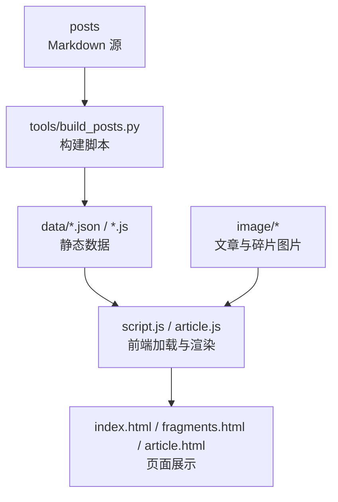
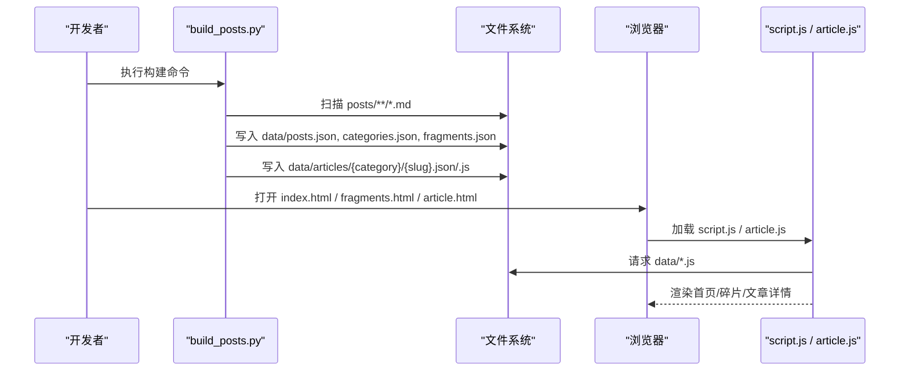
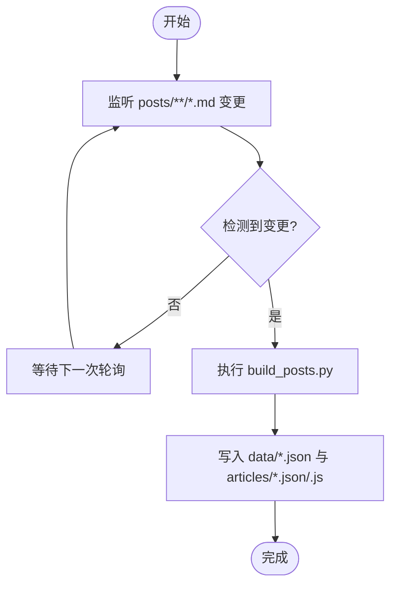
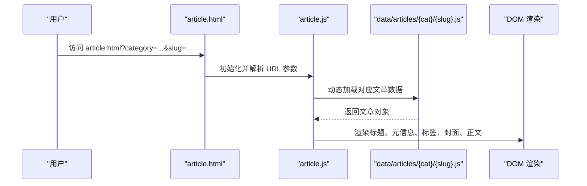
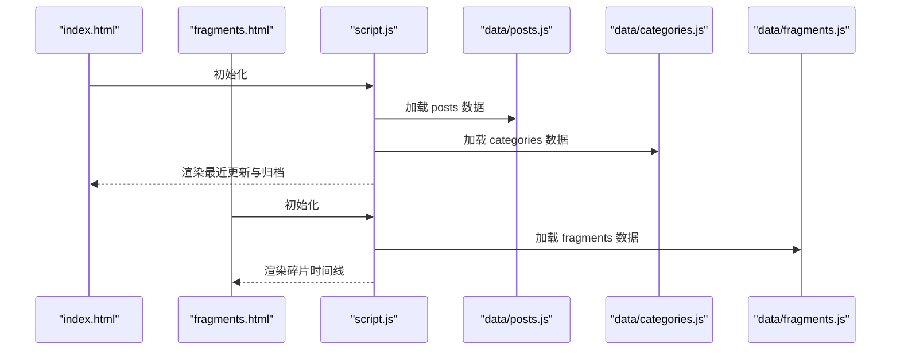
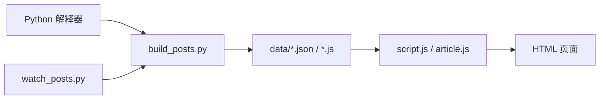

# 快速开始

<cite>
**本文引用的文件**   
- [tools/README.md](file://tools/README.md)
- [tools/build_posts.py](file://tools/build_posts.py)
- [tools/watch_posts.py](file://tools/watch_posts.py)
- [tools/start_post_watch.bat](file://tools/start_post_watch.bat)
- [index.html](file://index.html)
- [article.html](file://article.html)
- [fragments.html](file://fragments.html)
- [works.html](file://works.html)
- [shelf.html](file://shelf.html)
- [about.html](file://about.html)
- [script.js](file://script.js)
- [article.js](file://article.js)
- [header.js](file://header.js)
- [footer.js](file://footer.js)
</cite>

## 目录
1. [简介](#简介)
2. [项目结构](#项目结构)
3. [核心组件](#核心组件)
4. [架构总览](#架构总览)
5. [详细组件分析](#详细组件分析)
6. [依赖关系分析](#依赖关系分析)
7. [性能与体验建议](#性能与体验建议)
8. [故障排除指南](#故障排除指南)
9. [结论](#结论)

## 简介
本指南面向首次接触“五六七博客”的新手，帮助你在 30 分钟内完成环境准备、克隆仓库、构建数据、启动本地预览并发布文章。你将学会：
- 使用 Python 运行构建脚本，将 posts 下的 Markdown 生成 data 下的静态数据
- 通过任意现代浏览器直接打开 index.html 预览站点
- 使用监听器自动重建数据，提升写作效率
- 理解 posts 与 data 的职责分工以及图片资源存放约定

## 项目结构
- posts：作者编写 Markdown 的源目录。每个子目录代表一个分类（如 default、fragments、works），文件名即文章的 slug。
- data：由构建脚本生成的数据目录，包含 posts.json、categories.json、fragments.json 及其对应的 JS 全局变量文件，供前端页面动态渲染。
- image：按分类和文章名组织图片资源，便于在 Markdown 中引用。
- tools：Python 构建工具与说明文档，提供一次性构建与增量监听能力。
- 根目录 HTML/JS/CSS：站点页面与运行时逻辑。

图表来源
- [tools/build_posts.py:380-410](file://tools/build_posts.py#L380-L410)
- [script.js:12-61](file://script.js#L12-L61)
- [index.html:1-93](file://index.html#L1-L93)
- [fragments.html:1-23](file://fragments.html#L1-L23)
- [article.html:1-29](file://article.html#L1-L29)

章节来源
- [tools/README.md:1-83](file://tools/README.md#L1-L83)
- [tools/build_posts.py:380-410](file://tools/build_posts.py#L380-L410)
- [script.js:12-61](file://script.js#L12-L61)
- [index.html:1-93](file://index.html#L1-L93)
- [fragments.html:1-23](file://fragments.html#L1-L23)
- [article.html:1-29](file://article.html#L1-L29)

## 核心组件
- 构建脚本：读取 posts 下所有分类与文章，解析 Front Matter、正文、标签、封面等元信息，输出 JSON 与 JS 全局变量到 data 目录；同时为每篇文章生成独立的 JSON/JS 文件用于详情页加载。
- 监听器：轮询 posts 目录变化，自动触发构建，适合开发时持续预览。
- 前端运行时：页面按需加载 data 下的 JS 数据，渲染首页文章列表、归档、标签云、碎片时间线，以及文章详情页内容。

章节来源
- [tools/build_posts.py:380-410](file://tools/build_posts.py#L380-L410)
- [tools/watch_posts.py:38-71](file://tools/watch_posts.py#L38-L71)
- [script.js:12-61](file://script.js#L12-L61)
- [article.js:26-41](file://article.js#L26-L41)

## 架构总览
整体采用“静态站点 + 前端渲染”的轻量架构：
- 输入：Markdown 文章与图片
- 处理：Python 脚本解析并生成结构化数据
- 输出：JSON/JS 数据文件与 HTML 页面
- 运行：浏览器直接打开 HTML，通过 script.js/article.js 加载数据并渲染

图表来源
- [tools/build_posts.py:380-410](file://tools/build_posts.py#L380-L410)
- [script.js:12-61](file://script.js#L12-L61)
- [article.js:26-41](file://article.js#L26-L41)
- [index.html:1-93](file://index.html#L1-L93)
- [fragments.html:1-23](file://fragments.html#L1-L23)
- [article.html:1-29](file://article.html#L1-L29)

## 详细组件分析

### 构建与监听流程
- 一次性构建：运行构建脚本后，会遍历 posts 下各分类目录中的 .md 文件，解析 Front Matter 与正文，计算字数、阅读时长、摘要等，并输出到 data 目录。
- 监听模式：监听 posts 下所有 .md 文件的增删改，自动调用构建脚本，实现“写即见”。

图表来源
- [tools/watch_posts.py:38-71](file://tools/watch_posts.py#L38-L71)
- [tools/build_posts.py:380-410](file://tools/build_posts.py#L380-L410)

章节来源
- [tools/README.md:1-22](file://tools/README.md#L1-L22)
- [tools/watch_posts.py:1-71](file://tools/watch_posts.py#L1-L71)
- [tools/build_posts.py:1-414](file://tools/build_posts.py#L1-L414)

### 文章详情页加载与渲染
- 路由参数：通过 URL 查询参数 category 与 slug 定位文章。
- 数据加载：根据 category/slug 动态加载 data/articles/{category}/{slug}.js，校验全局对象后渲染。
- 内容渲染：对 Markdown 进行基础解析（标题、段落、列表、代码块、引用、链接、图片等），并修正相对路径以正确显示图片与站内链接。

图表来源
- [article.html:1-29](file://article.html#L1-L29)
- [article.js:26-41](file://article.js#L26-L41)
- [article.js:280-320](file://article.js#L280-L320)

章节来源
- [article.html:1-29](file://article.html#L1-L29)
- [article.js:1-346](file://article.js#L1-L346)

### 首页与碎片页渲染
- 首页：加载 posts.json 与 categories.json，渲染最近更新、归档列表、分类与标签筛选。
- 碎片页：加载 fragments.json，按时间倒序渲染时间线，支持图片与多段落文本。

图表来源
- [index.html:1-93](file://index.html#L1-L93)
- [fragments.html:1-23](file://fragments.html#L1-L23)
- [script.js:12-61](file://script.js#L12-L61)
- [script.js:677-701](file://script.js#L677-L701)

章节来源
- [index.html:1-93](file://index.html#L1-L93)
- [fragments.html:1-23](file://fragments.html#L1-L23)
- [script.js:1-701](file://script.js#L1-L701)

### 公共头部与底部注入
- header.js：动态注入站点导航、主题切换按钮、移动端菜单开关，并设置 favicon。
- footer.js：注入备案信息。

章节来源
- [header.js:1-110](file://header.js#L1-L110)
- [footer.js:1-36](file://footer.js#L1-L36)

## 依赖关系分析
- 构建脚本依赖 Python 标准库（pathlib、re、json、math、shutil、subprocess 等）。
- 前端依赖现代浏览器（ES6 Promise、URL API、Intl.DateTimeFormat 等）。
- 页面间通过 data 目录的 JS 全局变量共享数据，避免后端服务。

图表来源
- [tools/build_posts.py:1-20](file://tools/build_posts.py#L1-L20)
- [tools/watch_posts.py:1-12](file://tools/watch_posts.py#L1-L12)
- [script.js:12-61](file://script.js#L12-L61)
- [article.js:26-41](file://article.js#L26-L41)

章节来源
- [tools/build_posts.py:1-20](file://tools/build_posts.py#L1-L20)
- [tools/watch_posts.py:1-12](file://tools/watch_posts.py#L1-L12)
- [script.js:12-61](file://script.js#L12-L61)
- [article.js:26-41](file://article.js#L26-L41)

## 性能与体验建议
- 图片优化：尽量使用合适的尺寸与格式，减少首屏加载体积。
- 懒加载：碎片图片已启用 lazy loading，有助于滚动性能。
- 缓存策略：HTML 与 CSS/JS 可配合版本号或缓存头提升重复访问速度。
- 数据量控制：当文章数量较多时，可在首页分页或限制最近文章数量，降低 DOM 压力。

[本节为通用建议，不直接分析具体文件]

## 故障排除指南
- 无法运行构建脚本
  - 确认已安装 Python 且可通过命令行 py 调用。
  - 在项目根目录执行构建命令，参考工具说明。
- 监听器未生效
  - 确保 posts 目录下存在 .md 文件，且监听器进程未被中断。
  - 检查控制台输出是否有错误提示。
- 文章图片不显示
  - 确认图片路径符合约定：文章图片放在 image/{category}/{slug}/ 下，并在 Markdown 中使用相对路径引用。
- 文章详情页空白或报错
  - 先执行一次构建，确保 data/articles/{category}/{slug}.js 已生成。
  - 检查 URL 是否包含正确的 category 与 slug 参数。
- 首页无文章或分类为空
  - 检查 posts 下是否有 .md 文件及 Front Matter 字段是否正确。
  - 查看控制台是否有数据加载失败的错误信息。

章节来源
- [tools/README.md:1-22](file://tools/README.md#L1-L22)
- [tools/watch_posts.py:38-71](file://tools/watch_posts.py#L38-L71)
- [tools/build_posts.py:380-410](file://tools/build_posts.py#L380-L410)
- [article.js:322-340](file://article.js#L322-L340)
- [script.js:677-701](file://script.js#L677-L701)

## 结论
通过本指南，你已了解如何准备环境、运行构建与监听、预览站点，以及如何发布新文章。该博客采用极简的静态站点方案，无需复杂依赖即可高效写作与发布。若遇到任何问题，请参考故障排除部分或查阅工具说明。