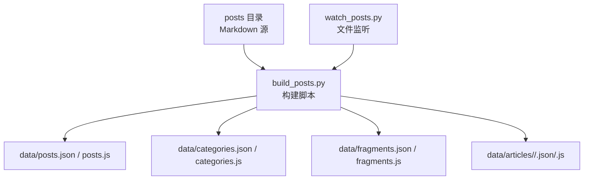
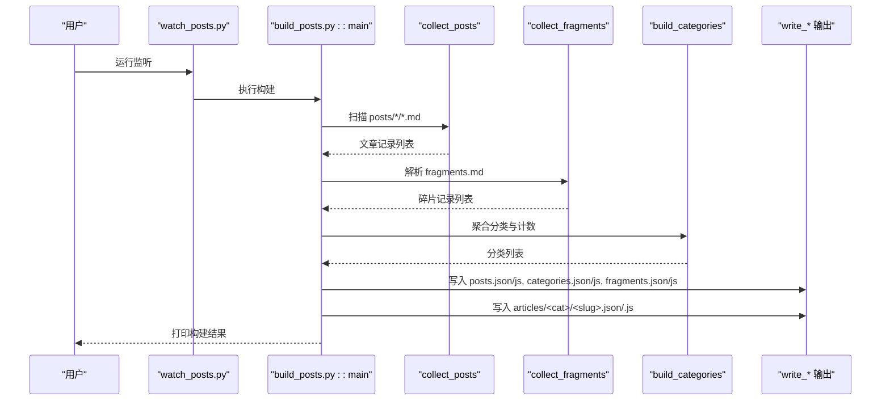
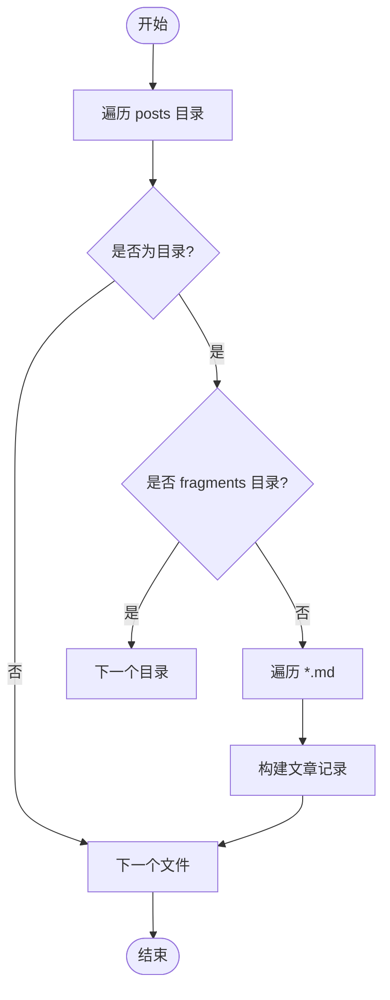
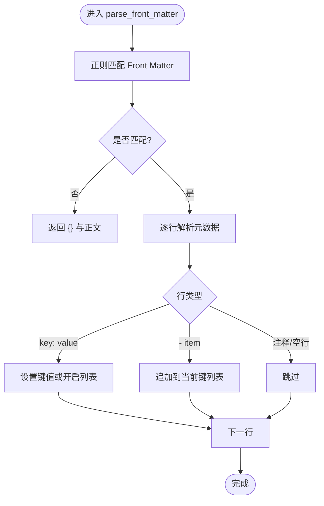
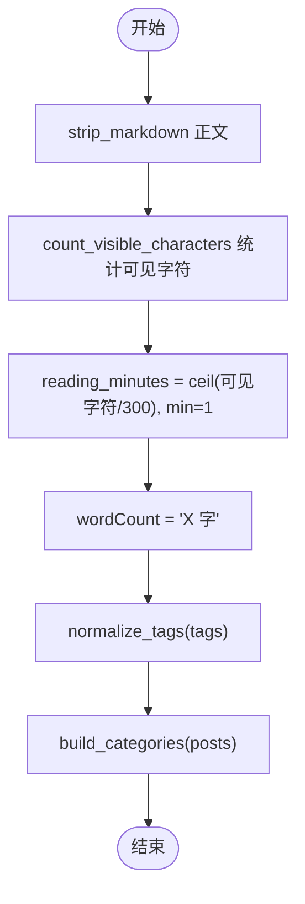
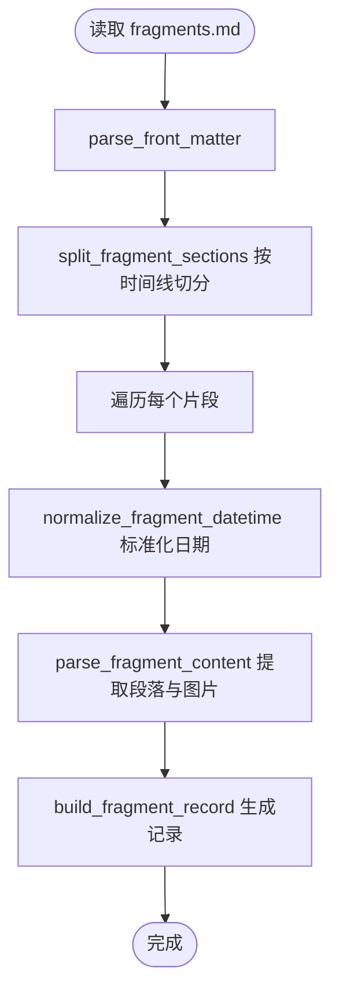
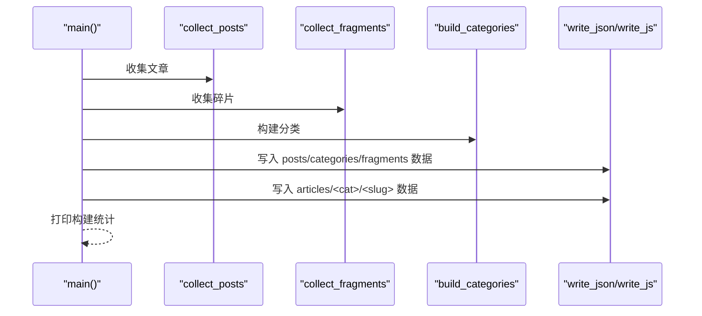
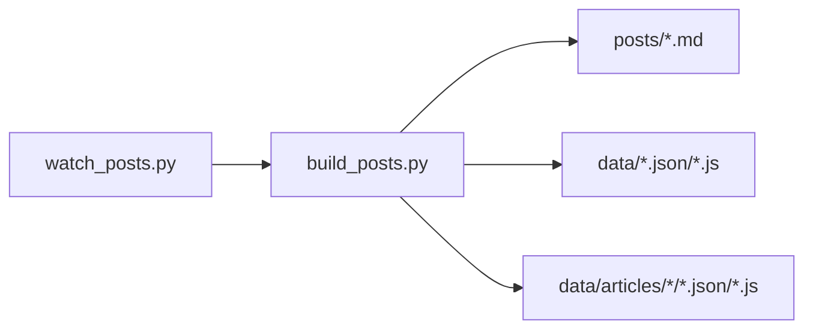

# 主构建脚本

<cite>
**本文引用的文件**   
- [tools/build_posts.py](file://tools/build_posts.py)
- [tools/watch_posts.py](file://tools/watch_posts.py)
- [tools/README.md](file://tools/README.md)
- [posts/default/about-site.md](file://posts/default/about-site.md)
- [posts/works/Radiator.md](file://posts/works/Radiator.md)
- [posts/fragments/fragments.md](file://posts/fragments/fragments.md)
- [data/posts.js](file://data/posts.js)
- [data/categories.js](file://data/categories.js)
- [data/fragments.js](file://data/fragments.js)
- [data/articles/default/about-site.json](file://data/articles/default/about-site.json)
</cite>

## 目录
1. [简介](#简介)
2. [项目结构](#项目结构)
3. [核心组件](#核心组件)
4. [架构总览](#架构总览)
5. [详细组件分析](#详细组件分析)
6. [依赖关系分析](#依赖关系分析)
7. [性能考量](#性能考量)
8. [故障排查指南](#故障排查指南)
9. [结论](#结论)
10. [附录：扩展指南](#附录扩展指南)

## 简介
本文件为博客“主构建脚本”的技术文档，聚焦于 Python 构建脚本的架构与实现细节。内容涵盖：
- 文件扫描算法与 Markdown 解析器
- Front Matter 解析器的元数据提取、类型转换与验证机制
- 内容统计（字数、阅读时间、分类计数、标签处理）
- 碎片内容的特殊处理（时间线格式、日期标准化、段落分割）
- 构建流程（输入输出路径、错误处理、性能优化）
- 扩展指南（新增内容类型、自定义统计指标、修改构建规则）

该构建脚本将 posts 目录下的 Markdown 源文件转换为 data 目录下的 JSON/JS 产物，供前端页面直接消费。

## 项目结构
- 源码入口位于 tools/build_posts.py，负责扫描 posts 目录、解析 Markdown、生成 data 产物。
- watch 工具位于 tools/watch_posts.py，用于监听 Markdown 变更并自动触发构建。
- 示例文章与碎片位于 posts 目录；生成的数据位于 data 目录。

图表来源
- [tools/build_posts.py:10-14](file://tools/build_posts.py#L10-L14)
- [tools/watch_posts.py:9-12](file://tools/watch_posts.py#L9-L12)

章节来源
- [tools/build_posts.py:10-14](file://tools/build_posts.py#L10-L14)
- [tools/watch_posts.py:9-12](file://tools/watch_posts.py#L9-L12)
- [tools/README.md:1-21](file://tools/README.md#L1-L21)

## 核心组件
- 文件扫描与收集
  - collect_posts：遍历 posts 下除 fragments 外的每个分类目录，收集 *.md 文件并构建文章记录。
  - collect_fragments：读取 posts/fragments/fragments.md，按二级标题的时间线切分片段，生成碎片记录。
- Markdown 解析器
  - parse_front_matter：基于正则匹配前后分隔符，逐行解析键值对与列表项，支持字符串、布尔、数字、浮点、数组等标量类型。
  - strip_markdown：去除代码块、链接、图片、标题、引用、列表、加粗等标记，得到纯文本。
  - excerpt_from_body：从正文中抽取首个非空段落作为摘要。
- 内容统计
  - count_visible_characters：统计可见字符数（去空白）。
  - reading_minutes：按每 300 字一分钟估算阅读时长，最小为 1 分钟。
  - normalize_tags：统一 tags 为字符串数组，支持逗号分隔或 YAML 列表。
- 碎片处理
  - split_fragment_sections：以二级标题且内容为日期时间格式的段落为边界进行分段。
  - normalize_fragment_datetime：标准化日期时间，补全时分秒与时区，生成 timeLabel 与 year。
  - parse_fragment_content：提取段落与图片信息。
- 数据写入
  - write_json/write_js：将数据序列化为 JSON 或挂载到 window 全局变量的 JS 文件。
- 构建编排
  - main：汇总文章、碎片、分类，清理并重建 articles 目录，输出各数据文件。

章节来源
- [tools/build_posts.py:146-197](file://tools/build_posts.py#L146-L197)
- [tools/build_posts.py:200-298](file://tools/build_posts.py#L200-L298)
- [tools/build_posts.py:300-321](file://tools/build_posts.py#L300-L321)
- [tools/build_posts.py:337-350](file://tools/build_posts.py#L337-L350)
- [tools/build_posts.py:353-377](file://tools/build_posts.py#L353-L377)
- [tools/build_posts.py:380-410](file://tools/build_posts.py#L380-L410)

## 架构总览
构建过程由 main 函数驱动，整体流程如下：

图表来源
- [tools/build_posts.py:380-410](file://tools/build_posts.py#L380-L410)
- [tools/watch_posts.py:23-35](file://tools/watch_posts.py#L23-L35)

## 详细组件分析

### 文件扫描算法
- 文章收集
  - 遍历 POSTS_DIR 下所有子目录，跳过 fragments 目录。
  - 对每个分类目录中的 *.md 文件调用 build_post_record 生成文章记录。
- 碎片收集
  - 读取 posts/fragments/fragments.md，先解析 Front Matter，再按二级标题的时间线切分正文。
  - 若无时间线标题但存在正文，则以文件名为默认标签创建单段。

图表来源
- [tools/build_posts.py:337-350](file://tools/build_posts.py#L337-L350)

章节来源
- [tools/build_posts.py:337-350](file://tools/build_posts.py#L337-L350)

### Markdown 解析器与 Front Matter 解析器
- Front Matter 模式
  - 使用正则匹配首尾 --- 包裹的元数据区域与正文。
  - 无匹配时返回空字典与原始正文。
- 标量解析
  - 支持带引号字符串、内联数组、布尔、整数、浮点数与自由文本。
- 键值与列表
  - 遇到 key: value 时设置键值；若值为空则开启列表模式，后续以 - item 追加元素。
- 正文清洗
  - strip_markdown 移除代码块、行内代码、图片、链接、标题、引用、列表、加粗等，并将多余空白归一化。
- 摘要抽取
  - excerpt_from_body 按双换行切分段落，跳过代码块，取第一个非空段落并按长度截断。

图表来源
- [tools/build_posts.py:17-88](file://tools/build_posts.py#L17-L88)
- [tools/build_posts.py:101-129](file://tools/build_posts.py#L101-L129)

章节来源
- [tools/build_posts.py:17-88](file://tools/build_posts.py#L17-L88)
- [tools/build_posts.py:101-129](file://tools/build_posts.py#L101-L129)

### 内容统计功能
- 字数统计
  - 通过 strip_markdown 得到纯文本后，count_visible_characters 去除空白计算可见字符数。
- 阅读时间估算
  - 按每 300 字 1 分钟向上取整，至少 1 分钟。
- 分类计数
  - build_categories 根据 folder 聚合文章，维护 name、order、count 等信息，并按 order 与 name 排序。
- 标签处理
  - normalize_tags 兼容 YAML 列表与逗号分隔字符串，过滤空项并转为字符串数组。

图表来源
- [tools/build_posts.py:132-164](file://tools/build_posts.py#L132-L164)
- [tools/build_posts.py:353-377](file://tools/build_posts.py#L353-L377)

章节来源
- [tools/build_posts.py:132-164](file://tools/build_posts.py#L132-L164)
- [tools/build_posts.py:353-377](file://tools/build_posts.py#L353-L377)

### 碎片内容特殊处理
- 时间线格式解析
  - FRAGMENT_HEADING_PATTERN 匹配二级标题；FRAGMENT_DATE_PATTERN 校验日期时间格式。
- 段落分割
  - split_fragment_sections 以符合日期时间的二级标题为边界，将正文切分为多个片段。
- 日期标准化
  - normalize_fragment_datetime 将 YYYY-MM-DD[ T HH:mm:ss] 标准化为 ISO 8601 形式，并生成 timeLabel 与 year。
- 内容与图片提取
  - parse_fragment_content 提取段落与图片对象（src、alt/caption）。

图表来源
- [tools/build_posts.py:230-298](file://tools/build_posts.py#L230-L298)
- [tools/build_posts.py:300-321](file://tools/build_posts.py#L300-L321)

章节来源
- [tools/build_posts.py:230-298](file://tools/build_posts.py#L230-L298)
- [tools/build_posts.py:300-321](file://tools/build_posts.py#L300-L321)

### 构建流程与输出
- 输入路径
  - posts 目录及其子目录，包含文章与碎片 Markdown。
- 输出路径
  - data/posts.json 与 data/posts.js
  - data/categories.json 与 data/categories.js
  - data/fragments.json 与 data/fragments.js
  - data/articles/<category>/<slug>.json 与 .js（含完整 content）
- 构建步骤
  - 收集文章与碎片，构建分类，清理并重建 articles 目录，写入所有数据文件。
- 错误处理
  - 构建失败时，watch 工具会打印退出码并提示失败；构建脚本本身未捕获异常，建议外部监控。

图表来源
- [tools/build_posts.py:380-410](file://tools/build_posts.py#L380-L410)

章节来源
- [tools/build_posts.py:380-410](file://tools/build_posts.py#L380-L410)

## 依赖关系分析
- 模块内聚与耦合
  - 构建脚本内部函数职责清晰：解析、统计、切片、写入，耦合度低，便于扩展。
- 外部依赖
  - 仅依赖标准库（re、json、math、shutil、pathlib），无第三方包，部署简单。
- 产物依赖
  - 前端通过 window.__BLOG_POSTS__/__BLOG_CATEGORIES__/__BLOG_FRAGMENTS__/__BLOG_ARTICLE__ 消费数据。

图表来源
- [tools/build_posts.py:10-14](file://tools/build_posts.py#L10-L14)
- [tools/watch_posts.py:9-12](file://tools/watch_posts.py#L9-L12)

章节来源
- [tools/build_posts.py:10-14](file://tools/build_posts.py#L10-L14)
- [tools/watch_posts.py:9-12](file://tools/watch_posts.py#L9-L12)

## 性能考量
- I/O 与正则
  - 主要开销在文件读取与正则匹配，适合中小规模博客；可通过增量构建减少重复工作。
- 内存占用
  - 构建过程中将所有文章与碎片加载至内存，对于大型站点可考虑流式处理或分页输出。
- 并行化
  - 当前为顺序处理，可在文件扫描阶段引入并发以提升吞吐（注意线程安全与文件系统竞争）。
- 缓存策略
  - 可对已解析的 Markdown 与统计结果做缓存，避免重复计算。

## 故障排查指南
- 常见问题
  - 构建失败：检查 Markdown 语法与 Front Matter 格式是否正确；确认 posts 目录结构与权限。
  - 标签为空：确保 tags 字段为 YAML 列表或逗号分隔字符串，避免空项。
  - 阅读时间为 1 分钟：当正文为空或不可见字符数为 0 时，默认返回 1 分钟。
  - 碎片未显示：确认二级标题为日期时间格式，否则不会按时间线切分。
- 调试建议
  - 使用 watch 工具观察变更日志与构建状态。
  - 查看 data 目录下对应 JSON/JS 产物，核对字段是否符合预期。

章节来源
- [tools/watch_posts.py:23-35](file://tools/watch_posts.py#L23-L35)
- [tools/build_posts.py:136-144](file://tools/build_posts.py#L136-L144)
- [tools/build_posts.py:200-223](file://tools/build_posts.py#L200-L223)

## 结论
该构建脚本以轻量、易用的方式实现了 Markdown 到结构化数据的转换，提供完整的文章、分类与碎片数据产物，满足静态博客的前端渲染需求。其模块化设计与清晰的职责划分，使得扩展新内容类型与统计指标变得直观可行。

## 附录：扩展指南
- 添加新的内容类型
  - 在 posts 目录下新增分类目录与 Markdown 文件，遵循现有 Front Matter 约定。
  - 如需自定义字段，可在 build_post_record 中增加字段映射与默认值逻辑。
- 自定义统计指标
  - 在统计相关函数中新增计算逻辑，例如新增“代码行数统计”、“图片数量统计”，并在记录对象中输出。
- 修改构建规则
  - 调整 excerpt_from_body 的截取策略、strip_markdown 的清洗规则、normalize_tags 的规范化行为。
  - 在 main 中增加新的输出目标或调整输出路径。
- 参考示例
  - 文章 Front Matter 示例：[posts/default/about-site.md](file://posts/default/about-site.md)
  - 作品文章示例：[posts/works/Radiator.md](file://posts/works/Radiator.md)
  - 碎片时间线示例：[posts/fragments/fragments.md](file://posts/fragments/fragments.md)
  - 产物示例：
    - [data/posts.js](file://data/posts.js)
    - [data/categories.js](file://data/categories.js)
    - [data/fragments.js](file://data/fragments.js)
    - [data/articles/default/about-site.json](file://data/articles/default/about-site.json)

章节来源
- [tools/README.md:23-83](file://tools/README.md#L23-L83)
- [posts/default/about-site.md:1-17](file://posts/default/about-site.md#L1-L17)
- [posts/works/Radiator.md:1-17](file://posts/works/Radiator.md#L1-L17)
- [posts/fragments/fragments.md:1-11](file://posts/fragments/fragments.md#L1-L11)
- [data/posts.js:1-95](file://data/posts.js#L1-L95)
- [data/categories.js:1-19](file://data/categories.js#L1-L19)
- [data/fragments.js:1-14](file://data/fragments.js#L1-L14)
- [data/articles/default/about-site.json:1-33](file://data/articles/default/about-site.json#L1-L33)