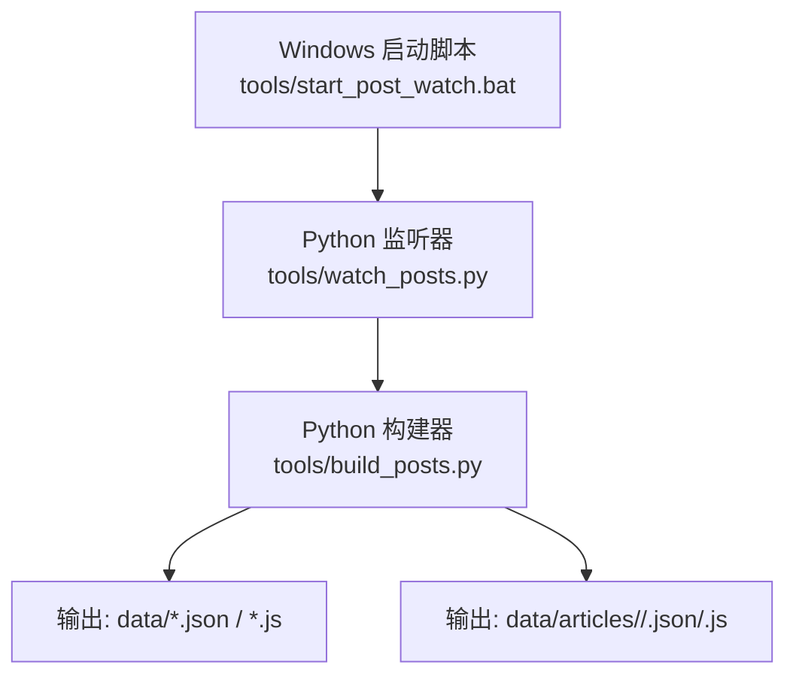
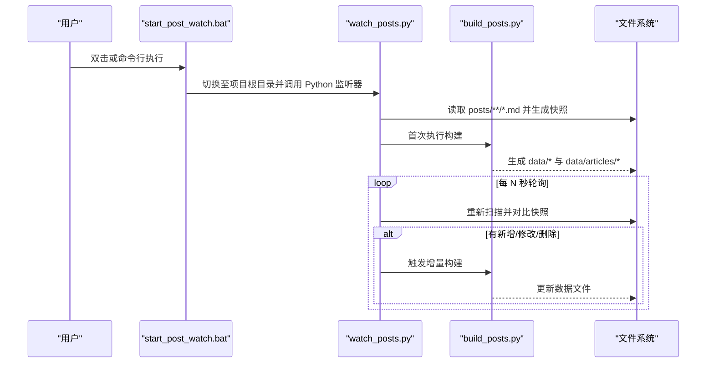
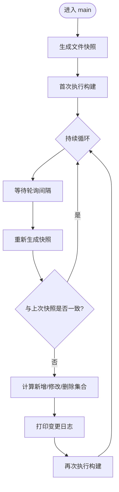
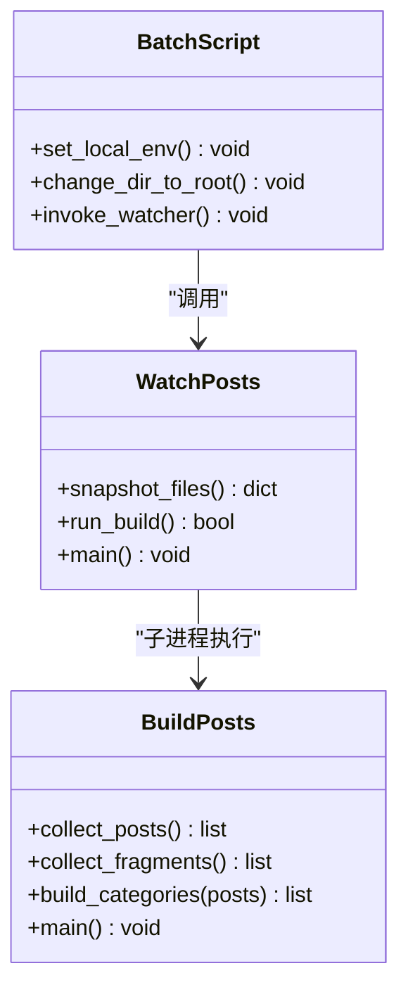
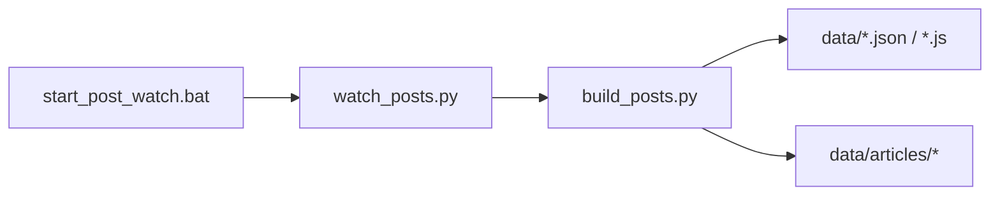

# 启动脚本

<cite>
**本文引用的文件**   
- [tools/start_post_watch.bat](file://tools/start_post_watch.bat)
- [tools/watch_posts.py](file://tools/watch_posts.py)
- [tools/build_posts.py](file://tools/build_posts.py)
- [tools/README.md](file://tools/README.md)
- [data/posts.json](file://data/posts.json)
- [data/categories.json](file://data/categories.json)
</cite>

## 目录
1. [简介](#简介)
2. [项目结构](#项目结构)
3. [核心组件](#核心组件)
4. [架构总览](#架构总览)
5. [详细组件分析](#详细组件分析)
6. [依赖关系分析](#依赖关系分析)
7. [性能与行为特征](#性能与行为特征)
8. [跨平台与容器化](#跨平台与容器化)
9. [常见问题排查](#常见问题排查)
10. [CI/CD 集成指南](#cicd-集成指南)
11. [结论](#结论)

## 简介
本技术文档聚焦于博客项目的“启动脚本”体系，围绕 Windows 批处理脚本 start_post_watch.bat 的功能、执行流程、错误处理与用户提示进行说明，并解释其如何驱动 Python 构建与监听逻辑。同时提供 Linux/macOS 下的等效命令、Docker 容器化部署方案、常见问题解决方案以及 CI/CD 流水线集成建议，帮助读者在本地开发与自动化环境中稳定使用。

## 项目结构
与启动脚本相关的核心文件位于 tools 目录，包含：
- Windows 启动脚本：start_post_watch.bat
- 监听器：watch_posts.py（轮询 posts 目录变化并触发构建）
- 构建器：build_posts.py（解析 Markdown，生成 data 与 articles 数据）
- 工具说明：README.md（使用说明与示例）

图表来源
- [tools/start_post_watch.bat:1-5](file://tools/start_post_watch.bat#L1-L5)
- [tools/watch_posts.py:1-71](file://tools/watch_posts.py#L1-L71)
- [tools/build_posts.py:380-414](file://tools/build_posts.py#L380-L414)

章节来源
- [tools/README.md:1-22](file://tools/README.md#L1-L22)

## 核心组件
- Windows 启动脚本（start_post_watch.bat）
  - 作用：将工作目录切换到项目根目录，并通过 py 调用 watch_posts.py。
  - 关键点：使用相对路径定位脚本；依赖系统 PATH 中的 py 可执行文件。
- 监听器（watch_posts.py）
  - 作用：轮询 posts 目录的 Markdown 文件变更，首次运行即执行一次构建，随后在检测到变更时再次构建。
  - 关键点：基于时间戳与文件大小快照对比差异；通过子进程调用构建器。
- 构建器（build_posts.py）
  - 作用：扫描 posts 目录，解析 Front Matter、正文、标签、日期等元信息，生成 JSON 与 JS 数据文件，并写入 data 与 data/articles 目录。
  - 关键点：支持片段（fragments）、分类聚合、文章图片路径映射、阅读时长估算等。

章节来源
- [tools/start_post_watch.bat:1-5](file://tools/start_post_watch.bat#L1-L5)
- [tools/watch_posts.py:1-71](file://tools/watch_posts.py#L1-L71)
- [tools/build_posts.py:1-414](file://tools/build_posts.py#L1-L414)

## 架构总览
整体流程由 Windows 启动脚本触发，进入 Python 监听器，监听器负责变更检测与构建调度，构建器完成数据生成与落盘。

图表来源
- [tools/start_post_watch.bat:1-5](file://tools/start_post_watch.bat#L1-L5)
- [tools/watch_posts.py:15-66](file://tools/watch_posts.py#L15-L66)
- [tools/build_posts.py:380-414](file://tools/build_posts.py#L380-L414)

## 详细组件分析

### Windows 启动脚本（start_post_watch.bat）
- 功能要点
  - 设置本地环境并切换工作目录到项目根目录。
  - 通过 py 命令调用 tools/watch_posts.py。
- 执行流程
  - 初始化控制台输出开关。
  - 计算脚本所在目录并切换到上级目录（项目根）。
  - 以当前环境的 Python 解释器执行监听器。
- 错误处理与用户提示
  - 若 py 不可用或 Python 未安装，将返回非零退出码并在控制台显示错误。
  - 若监听器抛出异常，批处理会终止并返回相应状态码。
- 注意事项
  - 依赖系统 PATH 中存在 py 可执行文件（Python Launcher for Windows）。
  - 建议使用 PowerShell 或 CMD 在项目根目录直接执行该脚本。

章节来源
- [tools/start_post_watch.bat:1-5](file://tools/start_post_watch.bat#L1-L5)

### 监听器（watch_posts.py）
- 功能要点
  - 定义根目录、posts 目录、构建脚本路径与轮询间隔。
  - 对 posts 目录下所有 .md 文件生成快照（相对路径、修改时间纳秒、大小）。
  - 首次运行立即执行一次构建，之后周期性比较快照差异。
  - 当检测到新增、修改或删除的文件时，打印变更日志并触发构建。
- 关键数据结构与复杂度
  - 快照为字典，键为相对路径，值为 (mtime_ns, size)。
  - 每次轮询需遍历 posts 下所有 .md 文件，时间复杂度 O(N)，N 为 Markdown 文件数量。
- 进程管理与错误处理
  - 使用子进程调用构建器，捕获返回码并打印成功/失败信息。
  - 捕获键盘中断信号，优雅退出并提示已停止。
- 性能考虑
  - 轮询间隔固定为 1 秒，适合本地开发；对于大量文件场景可适当调整。
  - 全量快照对比简单可靠，但存在重复 IO；如需优化可引入更高效的文件事件机制。

图表来源
- [tools/watch_posts.py:38-66](file://tools/watch_posts.py#L38-L66)
- [tools/watch_posts.py:15-20](file://tools/watch_posts.py#L15-L20)
- [tools/watch_posts.py:23-35](file://tools/watch_posts.py#L23-L35)

章节来源
- [tools/watch_posts.py:1-71](file://tools/watch_posts.py#L1-L71)

### 构建器（build_posts.py）
- 功能要点
  - 解析 Markdown 文件的 Front Matter 与正文，提取标题、摘要、标签、日期、封面等信息。
  - 统计可见字符数、估算阅读时间与字数。
  - 收集文章与片段（fragments），按分类聚合生成 categories。
  - 输出 posts.json、categories.json、fragments.json 及对应的 JS 全局变量文件。
  - 为每篇文章生成 data/articles/<category>/<slug>.json 与 .js。
- 数据处理流程
  - 扫描 posts 目录，跳过 fragments 目录，逐类逐文件构建记录。
  - 对 fragments 文件按二级标题日期分段，解析段落与图片。
  - 清理 Markdown 标记，生成纯文本与摘要。
- 输出结构与示例
  - posts.json 包含文章列表（不含 content 字段）。
  - categories.json 包含分类信息与计数。
  - fragments.json 包含片段数组。
  - 各文件均对应同名的 .js 文件，挂载到 window 全局对象。

图表来源
- [tools/build_posts.py:380-414](file://tools/build_posts.py#L380-L414)
- [tools/watch_posts.py:38-66](file://tools/watch_posts.py#L38-L66)
- [tools/start_post_watch.bat:1-5](file://tools/start_post_watch.bat#L1-L5)

章节来源
- [tools/build_posts.py:1-414](file://tools/build_posts.py#L1-L414)
- [data/posts.json:1-95](file://data/posts.json#L1-L95)
- [data/categories.json:1-19](file://data/categories.json#L1-L19)

## 依赖关系分析
- 外部依赖
  - Python 运行时（通过 py 调用）
  - 标准库：subprocess、sys、time、pathlib、re、json、math、shutil
- 内部依赖
  - start_post_watch.bat 依赖 watch_posts.py
  - watch_posts.py 依赖 build_posts.py
  - build_posts.py 读写 posts、data、data/articles 目录

图表来源
- [tools/start_post_watch.bat:1-5](file://tools/start_post_watch.bat#L1-L5)
- [tools/watch_posts.py:1-71](file://tools/watch_posts.py#L1-L71)
- [tools/build_posts.py:380-414](file://tools/build_posts.py#L380-L414)

章节来源
- [tools/start_post_watch.bat:1-5](file://tools/start_post_watch.bat#L1-L5)
- [tools/watch_posts.py:1-71](file://tools/watch_posts.py#L1-L71)
- [tools/build_posts.py:1-414](file://tools/build_posts.py#L1-L414)

## 性能与行为特征
- 轮询策略
  - 固定间隔 1 秒，适合本地快速反馈；在高 I/O 环境下可能产生较多磁盘访问。
- 构建开销
  - 全量扫描 posts 目录，时间复杂度与 Markdown 文件数量线性相关。
  - 正则解析与字符串处理为主要 CPU 消耗点。
- 优化建议
  - 减少不必要的日志输出。
  - 在文件数量较大时考虑引入更高效的事件监听机制（如 watchdog）。
  - 合理调整轮询间隔，平衡响应速度与资源占用。

[本节为通用性能讨论，不直接分析具体文件]

## 跨平台与容器化

### Linux/macOS 等效命令
- 一次性构建
  - 使用 Python 解释器直接运行构建脚本：python3 tools/build_posts.py
- 监听模式
  - 使用 Python 解释器运行监听脚本：python3 tools/watch_posts.py
- 说明
  - 上述命令与 Windows 下 py tools/watch_posts.py 的行为等价，区别在于解释器名称与环境配置。

章节来源
- [tools/README.md:5-13](file://tools/README.md#L5-L13)

### Docker 容器化部署方案
- 基础镜像
  - 选择官方 Python 镜像作为基础环境。
- 构建步骤
  - 复制项目代码到容器工作目录。
  - 安装必要依赖（本项目仅使用标准库，无需额外 pip 包）。
  - 暴露静态站点端口（例如 8080，用于后续 Web 服务）。
- 运行方式
  - 开发阶段：在容器中运行监听脚本，以便实时重建数据。
  - 生产阶段：先执行一次性构建，再启动静态站点服务器。
- 示例思路（概念性描述）
  - Dockerfile 中设置工作目录、复制代码、执行构建。
  - docker-compose 中定义服务，挂载源码卷以实现热更新。

[本节为概念性指导，不直接分析具体文件]

## 常见问题排查

- Python 路径配置问题
  - 现象：双击批处理无反应或报错找不到 py。
  - 原因：系统 PATH 未包含 Python Launcher（py）。
  - 解决：安装 Python 并确保 py 可执行；或在环境变量中添加 Python 安装路径。
- 权限问题
  - 现象：构建器无法写入 data 或 data/articles 目录。
  - 原因：目标目录权限不足或被占用。
  - 解决：确保当前用户对 data 目录具有写权限；关闭占用文件的编辑器或进程。
- 端口冲突（与站点服务相关）
  - 现象：本地静态站点服务无法启动或端口被占用。
  - 原因：其他进程占用了相同端口。
  - 解决：更换站点服务端口或终止占用进程。
- 监听无效
  - 现象：修改 Markdown 后未触发重建。
  - 原因：文件未被保存或未落在 posts 目录下；轮询间隔过长。
  - 解决：确认文件路径与扩展名；适当缩短轮询间隔；检查控制台输出是否有变更日志。

章节来源
- [tools/start_post_watch.bat:1-5](file://tools/start_post_watch.bat#L1-L5)
- [tools/watch_posts.py:23-35](file://tools/watch_posts.py#L23-L35)
- [tools/build_posts.py:380-414](file://tools/build_posts.py#L380-L414)

## CI/CD 集成指南
- 构建阶段
  - 在流水线中安装 Python 环境。
  - 执行一次性构建：python3 tools/build_posts.py。
  - 验证生成的 data 与 data/articles 文件是否存在且非空。
- 监听与热更新（可选）
  - 在开发型流水线中，可在容器中运行监听脚本，配合卷挂载实现热更新。
- 产物发布
  - 将 data 与前端静态资源打包为站点产物，部署到静态托管服务。
- 并行与缓存
  - 利用缓存加速 Python 环境准备。
  - 对大仓库可分步执行构建与测试，提升流水线效率。

[本节为通用集成指导，不直接分析具体文件]

## 结论
本启动脚本体系通过简单的批处理入口与 Python 监听/构建模块，实现了 Markdown 内容到结构化数据的自动转换与实时更新。其设计简洁、易于维护，适合本地开发与轻量级自动化场景。结合跨平台命令与容器化方案，可在多种环境中稳定运行，并可通过 CI/CD 流水线进一步集成构建与发布流程。