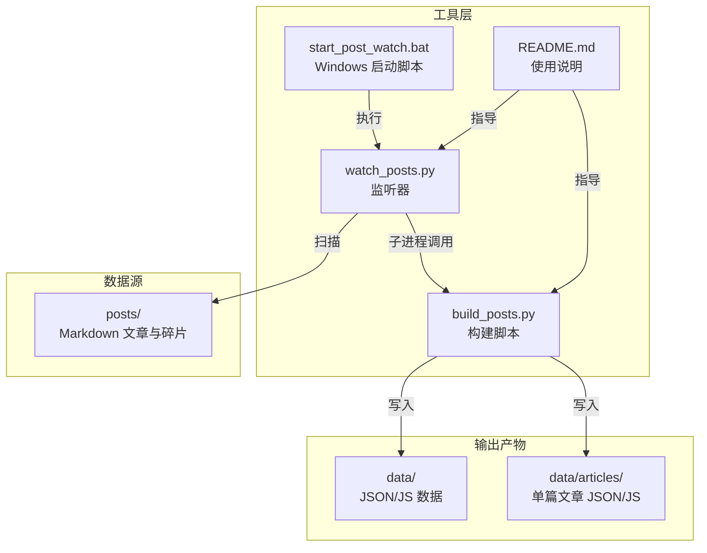
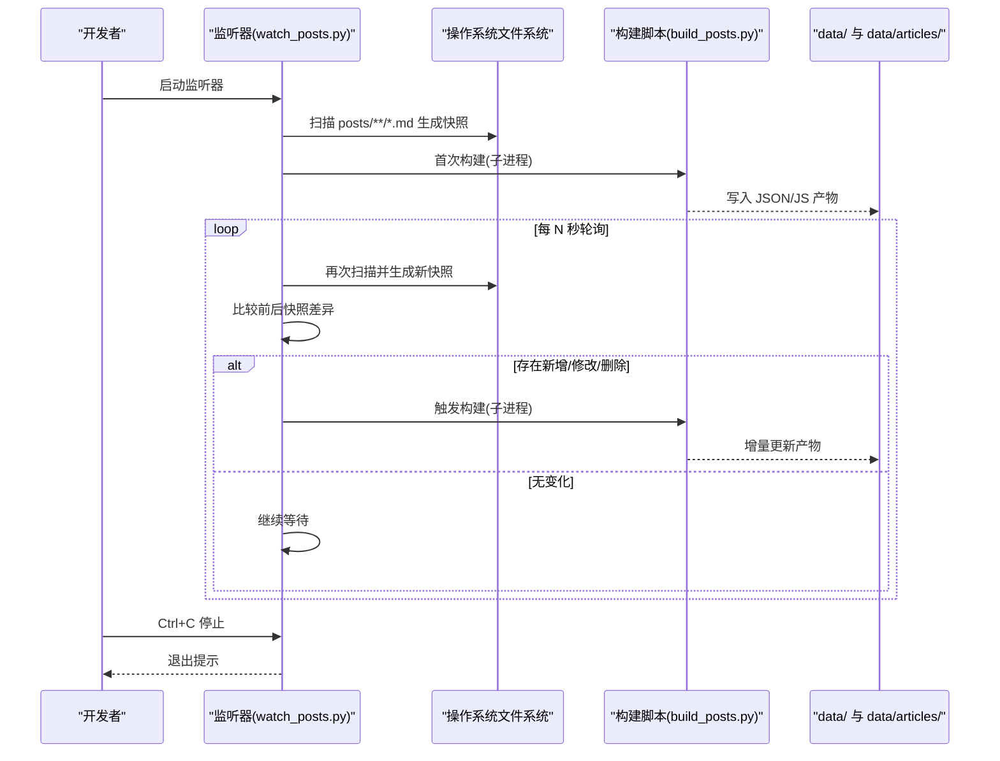
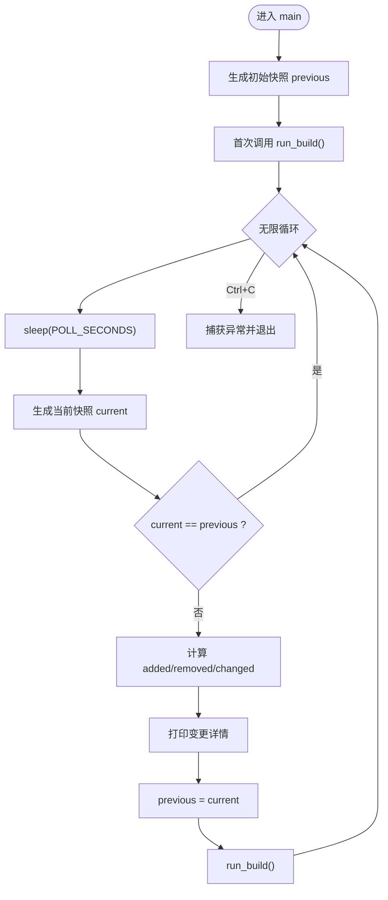
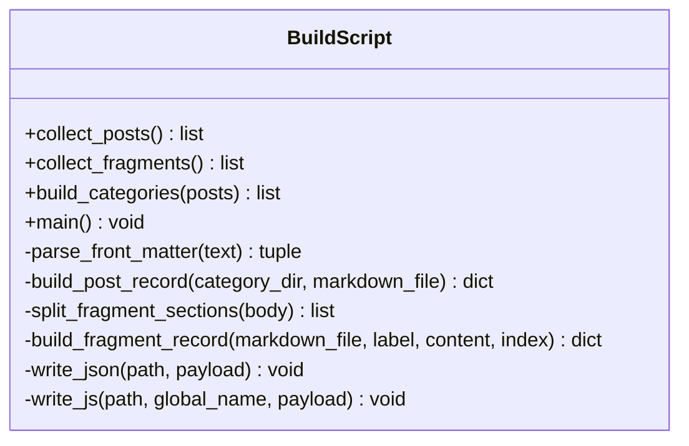
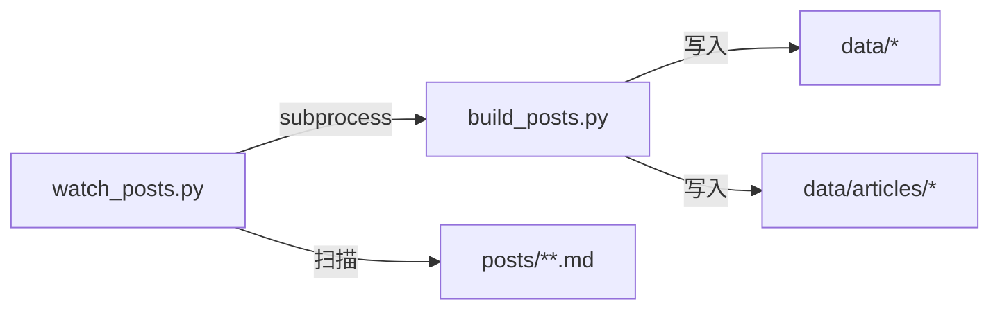

# 文件监听器

<cite>
**本文引用的文件**   
- [tools/watch_posts.py](file://tools/watch_posts.py)
- [tools/build_posts.py](file://tools/build_posts.py)
- [tools/start_post_watch.bat](file://tools/start_post_watch.bat)
- [tools/README.md](file://tools/README.md)
</cite>

## 目录
1. [简介](#简介)
2. [项目结构](#项目结构)
3. [核心组件](#核心组件)
4. [架构总览](#架构总览)
5. [详细组件分析](#详细组件分析)
6. [依赖关系分析](#依赖关系分析)
7. [性能考量](#性能考量)
8. [故障排除指南](#故障排除指南)
9. [结论](#结论)
10. [附录](#附录)

## 简介
本技术文档围绕博客项目的“文件监听器”展开，重点解释其实现原理与工作机制：基于轮询的文件变更检测、增量构建触发、与主构建脚本的集成方式，以及开发环境的使用与调优。该监听器通过周期性扫描 posts 目录下的 Markdown 文件，对比快照差异，并在检测到新增、修改或删除时调用构建脚本生成数据产物，从而支持快速迭代与热重载体验。

## 项目结构
与文件监听相关的核心代码位于 tools 目录下，包含监听器、构建脚本、启动批处理与使用说明。

图表来源
- [tools/watch_posts.py:1-71](file://tools/watch_posts.py#L1-L71)
- [tools/build_posts.py:1-414](file://tools/build_posts.py#L1-L414)
- [tools/start_post_watch.bat:1-5](file://tools/start_post_watch.bat#L1-L5)
- [tools/README.md:1-83](file://tools/README.md#L1-L83)

章节来源
- [tools/watch_posts.py:1-71](file://tools/watch_posts.py#L1-L71)
- [tools/build_posts.py:1-414](file://tools/build_posts.py#L1-L414)
- [tools/start_post_watch.bat:1-5](file://tools/start_post_watch.bat#L1-L5)
- [tools/README.md:1-83](file://tools/README.md#L1-L83)

## 核心组件
- 监听器（watch_posts.py）
  - 职责：周期扫描 posts 目录，维护文件状态快照，计算变更集合，触发构建。
  - 关键能力：快照生成、差异计算、子进程构建调用、异常与中断处理。
- 构建脚本（build_posts.py）
  - 职责：解析 Markdown 元信息与正文，聚合分类与碎片，生成 data 与 articles 产物。
  - 关键能力：Front Matter 解析、片段拆分、内容清洗、统计信息计算、JSON/JS 输出。
- Windows 启动脚本（start_post_watch.bat）
  - 职责：便捷启动监听器，设置工作目录并运行 Python 脚本。
- 使用说明（README.md）
  - 职责：提供一次性构建与监听模式命令，说明图片与碎片组织约定。

章节来源
- [tools/watch_posts.py:1-71](file://tools/watch_posts.py#L1-L71)
- [tools/build_posts.py:1-414](file://tools/build_posts.py#L1-L414)
- [tools/start_post_watch.bat:1-5](file://tools/start_post_watch.bat#L1-L5)
- [tools/README.md:1-83](file://tools/README.md#L1-L83)

## 架构总览
监听器与构建脚本采用“监听-构建”解耦架构：监听器仅负责变更检测与调度，构建脚本专注数据处理与产物生成。两者通过子进程通信，避免共享内存与复杂同步。

图表来源
- [tools/watch_posts.py:1-71](file://tools/watch_posts.py#L1-L71)
- [tools/build_posts.py:1-414](file://tools/build_posts.py#L1-L414)

## 详细组件分析

### 监听器（watch_posts.py）
- 启动流程
  - 初始化根路径、监控目录、构建脚本路径与轮询间隔。
  - 打印监控提示，生成初始快照，立即执行一次构建以产出基础数据。
- 事件注册与变更检测
  - 使用 rglob 递归匹配 *.md 文件，收集相对路径到 (mtime_ns, size) 的映射作为快照。
  - 每次轮询后对比新旧快照：
    - 新增：在新快照中存在而旧快照中不存在的路径集合。
    - 删除：在旧快照中存在而新快照中不存在的路径集合。
    - 变更：键相同但元组值不同的路径集合。
  - 将变更路径按类型分别打印，便于定位问题。
- 增量构建机制
  - 当前实现为“全量重建”策略：只要检测到任何变更，即调用构建脚本重新生成所有产物。
  - 未实现细粒度选择性重建（例如仅重建受影响的文章），但可通过扩展 snapshot 与构建脚本参数化来优化。
- 与主构建脚本的集成
  - 通过 subprocess.run 以独立进程调用 build_posts.py，工作目录设置为项目根目录，确保相对路径一致。
  - 根据返回码判断构建成功与否，并输出相应日志。
- 异常处理
  - 捕获 KeyboardInterrupt，优雅退出并输出停止提示。
  - 未显式捕获其他异常；若构建脚本抛出未处理异常，子进程会返回非零退出码，监听器会记录失败日志。

图表来源
- [tools/watch_posts.py:38-66](file://tools/watch_posts.py#L38-L66)

章节来源
- [tools/watch_posts.py:1-71](file://tools/watch_posts.py#L1-L71)

### 构建脚本（build_posts.py）
- 输入与输出
  - 输入：posts 目录下的 Markdown 文件（含 Front Matter）。
  - 输出：
    - data/posts.json、data/posts.js
    - data/categories.json、data/categories.js
    - data/fragments.json、data/fragments.js
    - data/articles/{category}/{slug}.json 与 .js
- 核心逻辑
  - 解析 Front Matter：支持标量、布尔、数字、列表等简单类型，忽略注释行。
  - 文章记录构建：提取标题、分类、日期、标签、摘要、阅读时间、封面、路径等信息，生成结构化记录。
  - 片段处理：按二级标题中的日期格式分割段落，提取图片与文本块，生成片段记录。
  - 分类聚合：按文件夹维度聚合文章，计算数量与排序。
  - 产物写入：统一通过 write_json/write_js 函数写入目标路径，必要时创建父目录。
- 错误处理与健壮性
  - 读取文件时使用 UTF-8 编码。
  - 对缺失或空字段提供默认值与容错逻辑。
  - 清理并重建 articles 目录，避免残留旧产物。

图表来源
- [tools/build_posts.py:15-414](file://tools/build_posts.py#L15-L414)

章节来源
- [tools/build_posts.py:1-414](file://tools/build_posts.py#L1-L414)

### Windows 启动脚本（start_post_watch.bat）
- 作用：切换至项目根目录，调用 Python 解释器执行监听器脚本。
- 适用场景：双击即可启动监听，适合本地开发环境快速开始。

章节来源
- [tools/start_post_watch.bat:1-5](file://tools/start_post_watch.bat#L1-L5)

### 使用说明（README.md）
- 提供一次性构建与监听模式的命令示例。
- 说明文章图片存放约定与碎片组织方式。
- 明确监听范围与自动重建行为。

章节来源
- [tools/README.md:1-83](file://tools/README.md#L1-L83)

## 依赖关系分析
- 模块内聚与耦合
  - 监听器与构建脚本通过命令行接口松耦合，职责清晰。
  - 监听器不直接访问文件系统产物，仅依赖构建脚本的输出。
- 外部依赖
  - Python 标准库：subprocess、sys、time、pathlib、re、json、math、shutil。
  - 无第三方依赖，便于跨平台部署。
- 潜在循环依赖
  - 监听器与构建脚本之间无相互导入，不存在循环依赖。

图表来源
- [tools/watch_posts.py:1-71](file://tools/watch_posts.py#L1-L71)
- [tools/build_posts.py:1-414](file://tools/build_posts.py#L1-L414)

章节来源
- [tools/watch_posts.py:1-71](file://tools/watch_posts.py#L1-L71)
- [tools/build_posts.py:1-414](file://tools/build_posts.py#L1-L414)

## 性能考量
- 轮询间隔
  - 当前 POLL_SECONDS=1.0，兼顾响应速度与系统开销。可根据磁盘 I/O 与 CPU 负载调整。
- 快照复杂度
  - 快照生成遍历 posts 下所有 *.md 文件，时间复杂度 O(N)，N 为 Markdown 文件数。
  - 差异计算为集合与字典比较，近似 O(N)。
- 构建成本
  - 构建脚本为全量重建，当文章数量较多时可能耗时较长。
  - 建议：
    - 减少无关文件的干扰（如临时文件、备份文件）。
    - 合理组织 posts 目录结构，避免过深嵌套。
    - 未来可引入增量构建：仅重建受影响的单篇文章与相关索引。
- 资源占用
  - 监听器常驻进程，CPU 占用极低，主要开销在磁盘扫描与子进程启动。
  - 在高并发写入场景下，建议适当增大轮询间隔以避免抖动。

[本节为通用性能讨论，无需特定文件引用]

## 故障排除指南
- 监听器未检测到变更
  - 检查 posts 目录结构与文件命名是否符合 *.md 规则。
  - 确认文件修改时间是否更新（某些编辑器保存行为可能导致 mtime 不变）。
  - 调整 POLL_SECONDS 观察是否因轮询过快导致遗漏。
- 构建失败
  - 查看控制台输出的退出码与错误信息。
  - 手动运行构建脚本定位具体错误：py tools\build_posts.py。
  - 检查 Markdown 语法与 Front Matter 格式是否符合预期。
- 产物未更新
  - 确认 data 与 data/articles 目录权限可写。
  - 清理缓存或临时文件后重试。
- 中文与编码问题
  - 构建脚本使用 UTF-8 读写文件，确保编辑器与终端编码一致。
- 停止监听
  - 在控制台按下 Ctrl+C，监听器会输出停止提示并退出。

章节来源
- [tools/watch_posts.py:23-35](file://tools/watch_posts.py#L23-L35)
- [tools/build_posts.py:323-334](file://tools/build_posts.py#L323-L334)
- [tools/README.md:1-83](file://tools/README.md#L1-L83)

## 结论
该文件监听器以简洁可靠的轮询机制实现了 Markdown 驱动的增量构建流程，配合构建脚本完成数据聚合与产物生成，满足日常开发与热重载需求。通过清晰的职责划分与低耦合设计，系统在易用性与可维护性之间取得良好平衡。后续可在差异检测与选择性重建方面进一步优化，以提升大规模内容场景下的构建效率。

[本节为总结性内容，无需特定文件引用]

## 附录

### 开发环境使用指南
- 启动监听器
  - 命令行：py tools\watch_posts.py
  - Windows 双击：tools\start_post_watch.bat
- 一次性构建
  - 命令行：py tools\build_posts.py
- 调试技巧
  - 在监听器中增加更详细的日志输出（如变更路径明细、构建耗时）。
  - 在构建脚本中针对特定文章添加断点或条件打印，验证解析逻辑。
- 性能调优
  - 调整 POLL_SECONDS 以平衡响应速度与系统开销。
  - 合并小批量频繁修改，减少构建触发次数。
  - 考虑引入增量构建策略，仅重建受影响的文章与索引。

章节来源
- [tools/README.md:1-83](file://tools/README.md#L1-L83)
- [tools/start_post_watch.bat:1-5](file://tools/start_post_watch.bat#L1-L5)
- [tools/watch_posts.py:12-12](file://tools/watch_posts.py#L12-L12)