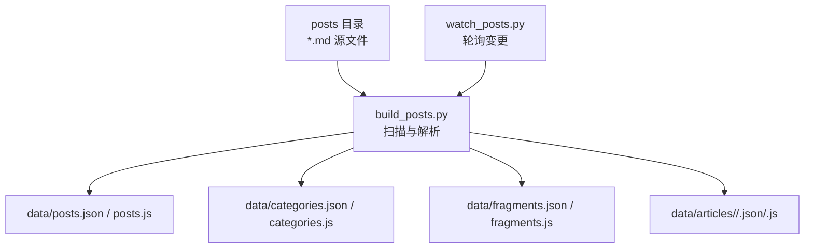
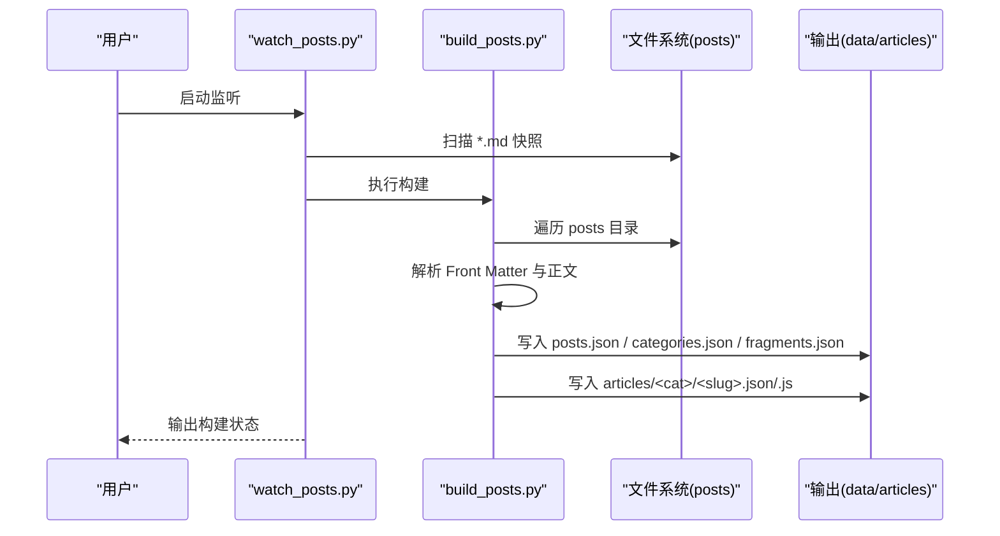
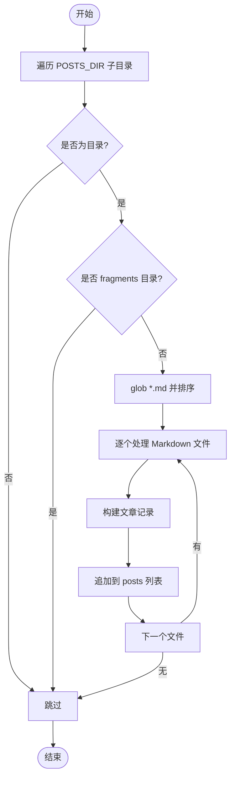
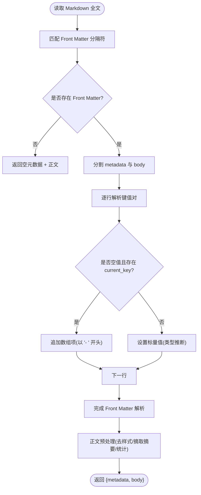
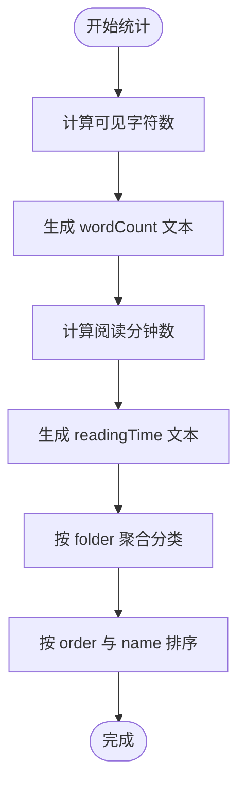
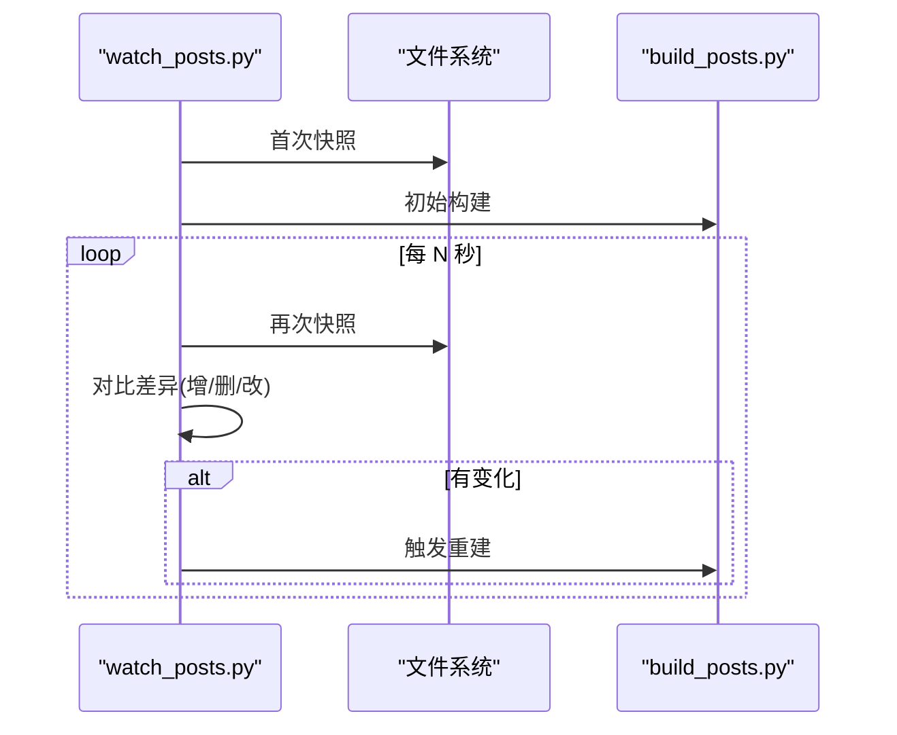
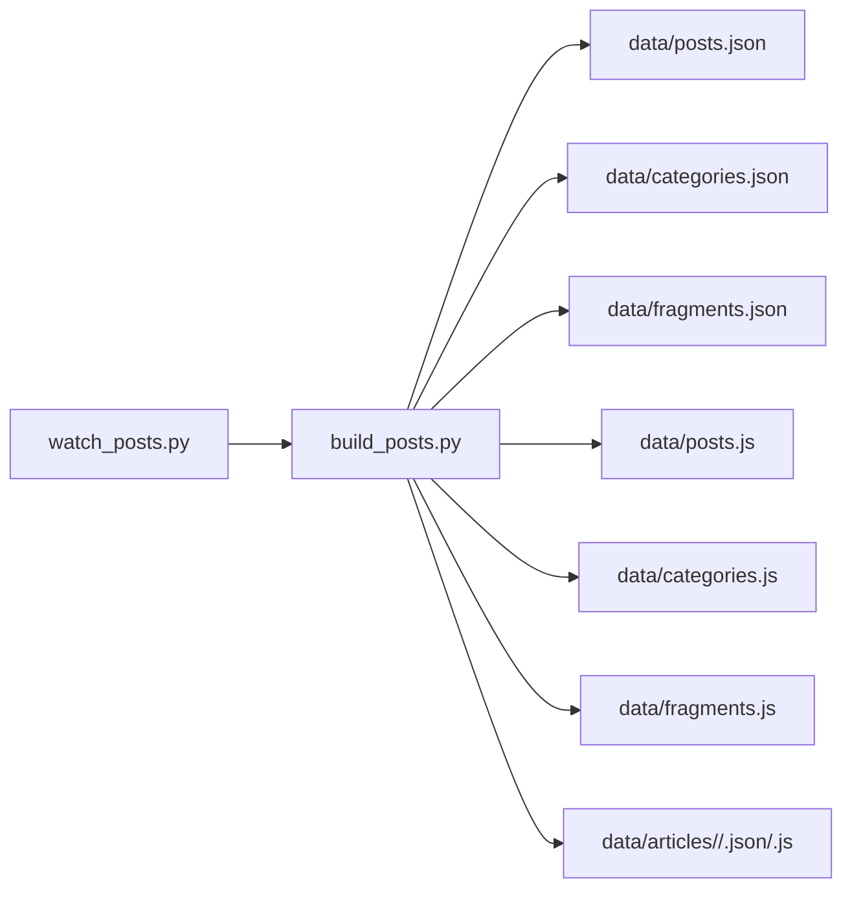

# 构建工具链

<cite>
**本文引用的文件**
- [tools/build_posts.py](file://tools/build_posts.py)
- [tools/watch_posts.py](file://tools/watch_posts.py)
- [tools/README.md](file://tools/README.md)
- [data/posts.json](file://data/posts.json)
- [data/categories.json](file://data/categories.json)
</cite>

## 目录
1. [简介](#简介)
2. [项目结构](#项目结构)
3. [核心组件](#核心组件)
4. [架构总览](#架构总览)
5. [详细组件分析](#详细组件分析)
6. [依赖关系分析](#依赖关系分析)
7. [性能考量](#性能考量)
8. [故障排查指南](#故障排查指南)
9. [结论](#结论)
10. [附录：扩展与优化指南](#附录扩展与优化指南)

## 简介
本技术文档面向博客构建工具链，聚焦 Python 构建脚本的核心能力与实现细节。内容涵盖：
- 文件扫描算法与 Markdown 解析流程
- Front Matter（YAML 风格）元数据提取与处理
- 内容统计指标计算（字数、阅读时间、分类计数）
- 文件监听器与增量构建、热重载支持
- 错误处理机制与调试方法
- 扩展指南：新增内容类型、自定义统计指标、构建性能优化

该工具链以 posts 目录为输入源，输出 data 与 articles 下的 JSON/JS 数据，供前端页面渲染使用。

## 项目结构
构建相关的关键目录与文件如下：
- tools/build_posts.py：一次性构建入口，负责扫描 posts、解析 Markdown、生成数据
- tools/watch_posts.py：文件监听器，轮询 posts 变更并触发重建
- tools/README.md：使用说明与约定（文章图片路径、碎片格式等）
- data/posts.json、data/categories.json：构建产物（列表与分类）
- posts/**/*.md：Markdown 内容源
- image/**/*：文章与碎片的图片资源

图表来源
- [tools/build_posts.py:336-414](file://tools/build_posts.py#L336-L414)
- [tools/watch_posts.py:38-70](file://tools/watch_posts.py#L38-L70)

章节来源
- [tools/README.md:1-83](file://tools/README.md#L1-L83)
- [tools/build_posts.py:10-22](file://tools/build_posts.py#L10-L22)

## 核心组件
- 构建主流程：遍历 posts 下各分类目录，收集文章与碎片，生成分类索引与文章详情，写入 data 与 articles 目录
- Front Matter 解析器：基于正则匹配与逐行解析，支持标量、数组、布尔、数字等基础类型
- 内容统计：可见字符数、字数显示、阅读分钟估算、分类计数
- 文件监听器：基于文件系统快照对比的增量检测，调用构建脚本进行重建

章节来源
- [tools/build_posts.py:336-414](file://tools/build_posts.py#L336-L414)
- [tools/build_posts.py:51-88](file://tools/build_posts.py#L51-L88)
- [tools/build_posts.py:145-197](file://tools/build_posts.py#L145-L197)
- [tools/build_posts.py:353-377](file://tools/build_posts.py#L353-L377)
- [tools/watch_posts.py:15-35](file://tools/watch_posts.py#L15-L35)

## 架构总览
整体构建流程由 watch 或手动触发，统一进入 build_posts.py 的主流程，完成扫描、解析、统计与输出。

图表来源
- [tools/watch_posts.py:38-70](file://tools/watch_posts.py#L38-L70)
- [tools/build_posts.py:336-414](file://tools/build_posts.py#L336-L414)

## 详细组件分析

### 文件扫描算法
- 扫描范围：POSTS_DIR 下所有子目录（排除 fragments 单独处理），按目录名作为分类文件夹
- 文件选择：每个分类目录下匹配 *.md 文件，排序后逐个处理
- 输出组织：
  - data/posts.json：文章列表（不含 content 字段）
  - data/categories.json：分类汇总（名称、顺序、计数）
  - data/fragments.json：碎片集合
  - data/articles/<category>/<slug>.json/.js：单篇文章完整数据

图表来源
- [tools/build_posts.py:336-350](file://tools/build_posts.py#L336-L350)

章节来源
- [tools/build_posts.py:336-350](file://tools/build_posts.py#L336-L350)

### Markdown 解析器与 Front Matter 解析器
- Front Matter 边界：以 --- 包裹的头部区域，其后为正文
- 解析策略：
  - 正则匹配前后分隔符，分离 metadata 与 body
  - 逐行解析 key:value；空值表示后续行属于当前 key 的数组项（以 "- " 开头）
  - 标量类型推断：字符串、布尔、整数、浮点数、逗号分隔数组
- 标签规范化：支持字符串逗号分隔或数组形式，统一清洗为空项过滤
- 正文处理：
  - strip_markdown：移除代码块、内联代码、链接、图片、标题标记、引用、列表、加粗斜体等，仅保留纯文本
  - excerpt_from_body：按段落切分，跳过代码块，取首个非空段落截断为摘要
  - count_visible_characters：去除空白后的字符数用于统计

图表来源
- [tools/build_posts.py:51-88](file://tools/build_posts.py#L51-L88)
- [tools/build_posts.py:25-49](file://tools/build_posts.py#L25-L49)
- [tools/build_posts.py:91-113](file://tools/build_posts.py#L91-L113)
- [tools/build_posts.py:115-133](file://tools/build_posts.py#L115-L133)

章节来源
- [tools/build_posts.py:51-88](file://tools/build_posts.py#L51-L88)
- [tools/build_posts.py:25-49](file://tools/build_posts.py#L25-L49)
- [tools/build_posts.py:91-113](file://tools/build_posts.py#L91-L113)
- [tools/build_posts.py:115-133](file://tools/build_posts.py#L115-L133)

### 内容统计计算方法
- 字数统计：
  - visible_characters = 去除空白后的字符长度
  - wordCount 默认显示为 "{visible_characters} 字"，可被 Front Matter 覆盖
- 阅读时间估算：
  - reading_minutes = max(1, ceil(visible_characters / 300))
  - readingTime 默认显示为 "{reading_minutes} 分钟"，可被 Front Matter 覆盖
- 分类计数：
  - 遍历文章记录，按 folder 聚合，维护 name、order、count
  - order 取最小 categoryOrder，最终按 (order, name) 排序

图表来源
- [tools/build_posts.py:131-164](file://tools/build_posts.py#L131-L164)
- [tools/build_posts.py:353-377](file://tools/build_posts.py#L353-L377)

章节来源
- [tools/build_posts.py:131-164](file://tools/build_posts.py#L131-L164)
- [tools/build_posts.py:353-377](file://tools/build_posts.py#L353-L377)

### 文章记录构建与输出
- 字段映射：
  - id/title/category/date/tags/excerpt/summary/description/cover 等来自 Front Matter 或推导
  - path/sourcePath/sourceDir/imageDir 基于目录结构与 slug 生成
  - featured/pinned/showInRecent/showInArchive 等布尔开关支持多种真值表达
  - content 字段仅在文章详情中输出，列表数据会剔除 content 以降低体积
- 输出目标：
  - data/posts.json：文章列表（不含 content）
  - data/articles/<category>/<slug>.json/.js：文章详情（含 content）

章节来源
- [tools/build_posts.py:145-197](file://tools/build_posts.py#L145-L197)
- [tools/build_posts.py:380-414](file://tools/build_posts.py#L380-L414)

### 碎片（Fragments）处理
- 位置：posts/fragments/fragments.md
- 分段规则：二级标题 ## 日期时间 作为片段分隔，如 "## 2026-06-01 17:54:24"
- 日期归一化：
  - 若匹配日期时间模式，生成 ISO 时间与本地展示时间
  - 否则回退为原始字符串，并尝试提取年份
- 内容解析：
  - 段落：按双换行切分，去除图片占位后清理 Markdown 标记
  - 图片：提取 alt/caption 与 src，自动根据年份归档至 image/Fragment/<year>/
- 输出：
  - data/fragments.json / fragments.js

章节来源
- [tools/build_posts.py:200-298](file://tools/build_posts.py#L200-L298)
- [tools/build_posts.py:300-321](file://tools/build_posts.py#L300-L321)
- [tools/README.md:51-83](file://tools/README.md#L51-L83)

### 文件监听器与增量构建
- 工作原理：
  - 定时轮询 posts 目录，生成包含相对路径与 (mtime_ns, size) 的快照
  - 比较新旧快照，识别新增、删除、修改的文件
  - 检测到变化时，调用 build_posts.py 重新构建
- 优点：
  - 无需额外依赖，跨平台兼容
  - 简单可靠，适合小型仓库
- 局限：
  - 轮询间隔固定，无法做到毫秒级响应
  - 全量重建而非真正增量更新（但通过只写必要文件减少开销）

图表来源
- [tools/watch_posts.py:15-35](file://tools/watch_posts.py#L15-L35)
- [tools/watch_posts.py:38-70](file://tools/watch_posts.py#L38-L70)

章节来源
- [tools/watch_posts.py:15-35](file://tools/watch_posts.py#L15-L35)
- [tools/watch_posts.py:38-70](file://tools/watch_posts.py#L38-L70)

## 依赖关系分析
- 模块依赖：
  - build_posts.py 依赖标准库 json、math、re、shutil、pathlib
  - watch_posts.py 依赖 subprocess、sys、time、pathlib
- 外部产物：
  - data/posts.json、data/categories.json、data/fragments.json
  - data/posts.js、data/categories.js、data/fragments.js
  - data/articles/<category>/<slug>.json/.js

图表来源
- [tools/watch_posts.py:23-35](file://tools/watch_posts.py#L23-L35)
- [tools/build_posts.py:380-414](file://tools/build_posts.py#L380-L414)

章节来源
- [tools/build_posts.py:380-414](file://tools/build_posts.py#L380-L414)
- [tools/watch_posts.py:23-35](file://tools/watch_posts.py#L23-L35)

## 性能考量
- 构建阶段：
  - 列表数据剔除 content 字段，显著降低 JSON 体积
  - 分类聚合与排序在内存中进行，复杂度 O(n log n)，n 为文章数量
- 监听阶段：
  - 轮询间隔可调（POLL_SECONDS），建议根据开发环境磁盘 IO 调整
  - 快照对比为 O(m)，m 为 Markdown 文件数量
- 优化建议：
  - 大仓库可考虑引入增量构建（仅重建受影响的文章）
  - 使用更快的文件系统事件 API（如 watchdog）替代轮询
  - 并行解析（线程池）提升多核利用率

[本节为通用指导，不直接分析具体文件]

## 故障排查指南
- 常见错误定位：
  - 构建失败：查看 watch 输出的退出码与日志，确认 build_posts.py 的执行结果
  - 元数据缺失：检查 Front Matter 分隔符是否正确，key:value 格式是否符合规范
  - 图片路径问题：遵循 README 约定，将图片放置于对应 image 目录
- 调试技巧：
  - 在命令行直接运行构建脚本，观察打印信息
  - 临时增加 print 语句输出中间变量（如 metadata、body、统计值）
  - 校验生成的 data/posts.json 与 data/categories.json 是否符合预期

章节来源
- [tools/watch_posts.py:23-35](file://tools/watch_posts.py#L23-L35)
- [tools/README.md:23-49](file://tools/README.md#L23-L49)

## 结论
该构建工具链以简洁可靠的 Python 脚本为核心，实现了从 Markdown 源到结构化数据的完整流水线。Front Matter 解析器轻量高效，统计指标满足日常需求，文件监听器提供便捷的增量体验。对于更大规模的项目，可在现有基础上引入真正的增量构建与事件驱动监听以提升性能。

[本节为总结性内容，不直接分析具体文件]

## 附录：扩展与优化指南

### 添加新的内容类型
- 步骤建议：
  - 在 posts 下新增目录（如 posts/tutorials）
  - 在 collect_posts 或新增收集函数中遍历新目录
  - 复用 build_post_record 或创建专用 record 构建函数
  - 在 main 中写入新的 JSON/JS 产物
- 参考路径：
  - [tools/build_posts.py:336-350](file://tools/build_posts.py#L336-L350)
  - [tools/build_posts.py:380-414](file://tools/build_posts.py#L380-L414)

### 自定义统计指标
- 示例思路：
  - 新增指标（如“代码行数”、“外链数量”）在 build_post_record 中计算
  - 在 Front Matter 中允许覆盖默认值
  - 在输出中暴露新字段，并在前端消费
- 参考路径：
  - [tools/build_posts.py:145-197](file://tools/build_posts.py#L145-L197)
  - [tools/build_posts.py:131-164](file://tools/build_posts.py#L131-L164)

### 优化构建性能
- 建议：
  - 使用增量构建：仅重建受影响的文件
  - 引入事件监听：替换轮询，降低延迟
  - 并行处理：多线程/进程池解析大量 Markdown
- 参考路径：
  - [tools/watch_posts.py:15-35](file://tools/watch_posts.py#L15-L35)
  - [tools/build_posts.py:336-414](file://tools/build_posts.py#L336-L414)

### 错误处理与健壮性
- 建议：
  - 对文件读写异常进行捕获与日志记录
  - 对 Front Matter 解析失败给出明确提示
  - 对缺失必填字段提供默认值或警告
- 参考路径：
  - [tools/build_posts.py:51-88](file://tools/build_posts.py#L51-L88)
  - [tools/watch_posts.py:23-35](file://tools/watch_posts.py#L23-L35)