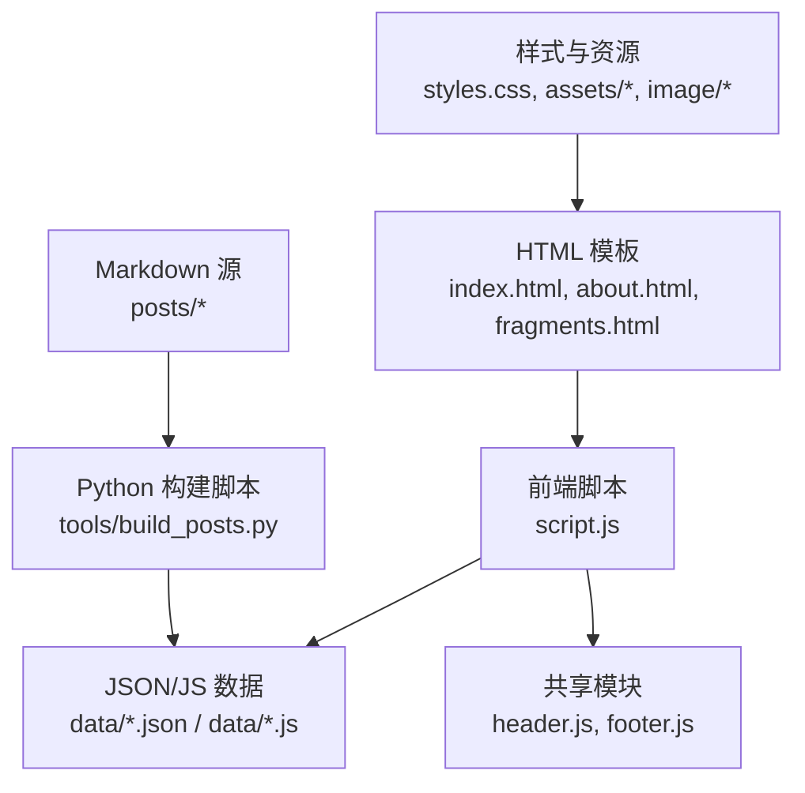
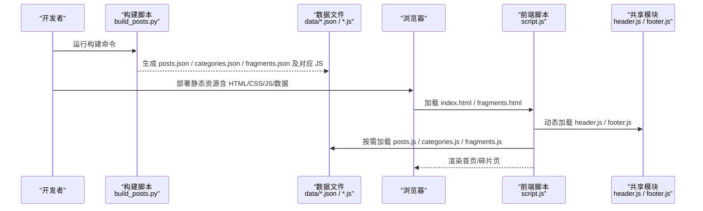
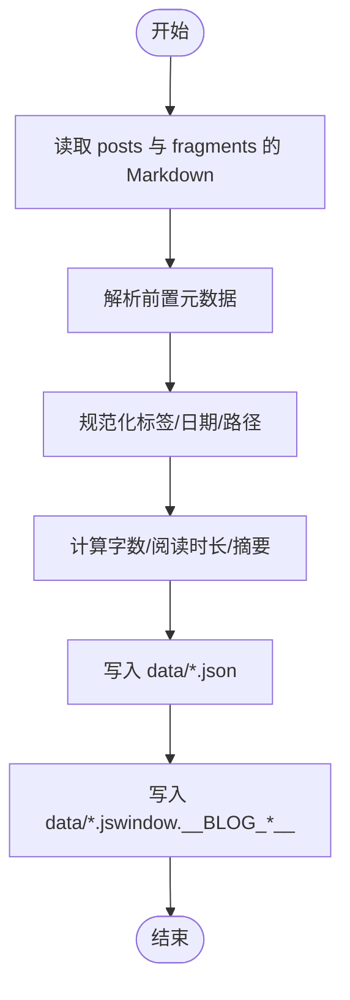
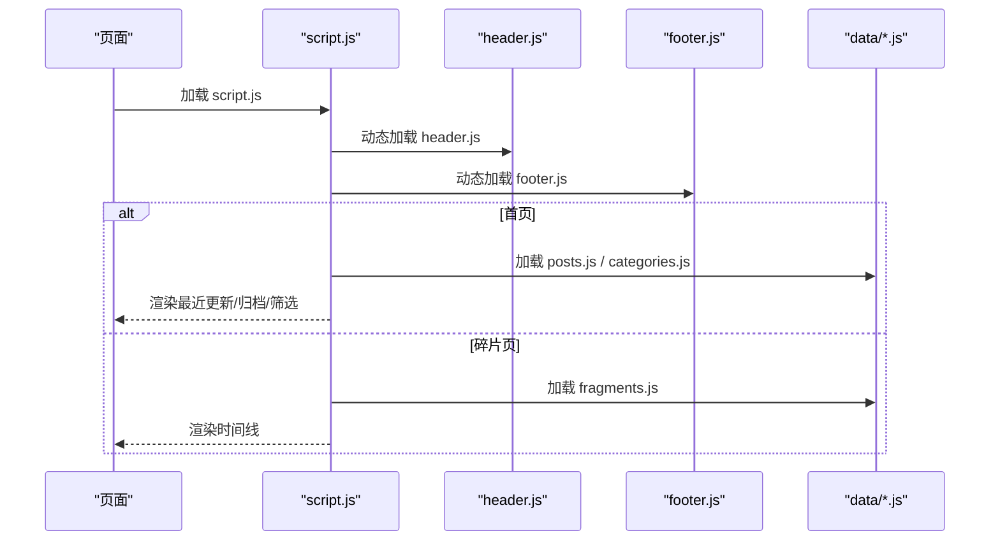
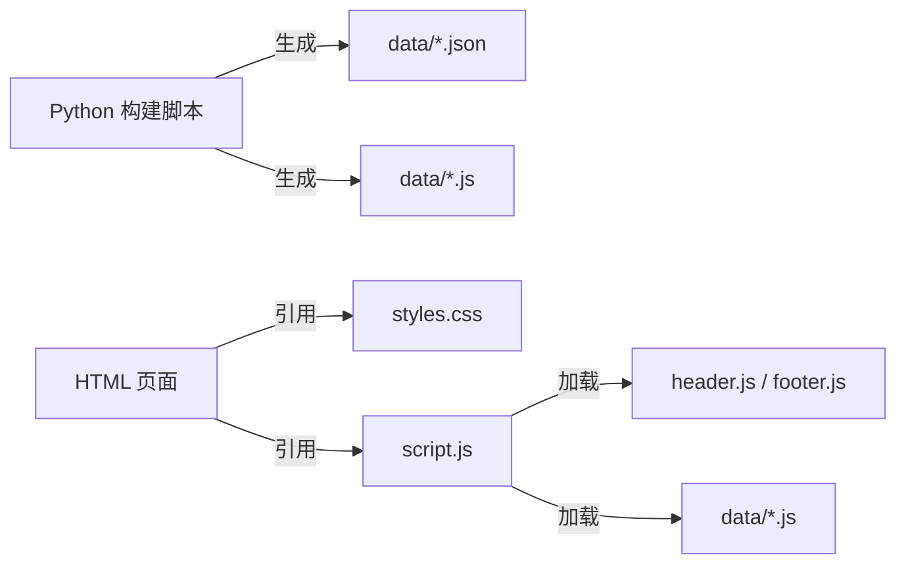

# 部署指南

<cite>
**本文引用的文件**
- [index.html](file://Blog/index.html)
- [about.html](file://Blog/about.html)
- [styles.css](file://Blog/styles.css)
- [script.js](file://Blog/script.js)
- [header.js](file://Blog/header.js)
- [footer.js](file://Blog/footer.js)
- [build_posts.py](file://Blog/tools/build_posts.py)
- [README.md（工具说明）](file://Blog/tools/README.md)
- [posts.json](file://Blog/data/posts.json)
- [categories.json](file://Blog/data/categories.json)
- [fragments.json](file://Blog/data/fragments.json)
</cite>

## 目录
1. [简介](#简介)
2. [项目结构](#项目结构)
3. [核心组件](#核心组件)
4. [架构总览](#架构总览)
5. [详细组件分析](#详细组件分析)
6. [依赖关系分析](#依赖关系分析)
7. [性能优化最佳实践](#性能优化最佳实践)
8. [CDN 加速与缓存策略](#cdn-加速与缓存策略)
9. [SEO 优化指南](#seo-优化指南)
10. [平台部署配置](#平台部署配置)
11. [域名与 SSL 证书](#域名与-ssl-证书)
12. [监控与告警](#监控与告警)
13. [故障排除指南](#故障排除指南)
14. [结论](#结论)

## 简介
本指南面向将本博客静态站点部署到 GitHub Pages、Netlify、Vercel 等主流平台的读者，提供从构建、发布到上线后的 CDN、SEO、性能优化、域名与 SSL、监控告警以及故障排除的完整流程。本项目为纯静态站点，由 Python 脚本将 Markdown 文章与碎片内容编译为 JSON/JS 数据文件，再由前端脚本在浏览器中动态渲染页面。

## 项目结构
- 站点根目录位于 Blog 下，包含 HTML/CSS/JS 资源与 data 生成的数据文件。
- 源码与内容：
  - posts 目录存放 Markdown 文章与碎片；tools 下的 Python 脚本负责解析并生成 data 目录中的 posts.json、categories.json、fragments.json 及对应的 JS 全局变量文件。
  - assets 目录存放头像、背景图等静态资源。
  - image 目录按分类与年份组织图片资源。
- 运行时依赖：
  - script.js 负责加载 header.js、footer.js 与数据脚本，并在首页和碎片页进行渲染。
  - styles.css 定义主题、布局与响应式样式。

图表来源
- [build_posts.py:380-414](file://Blog/tools/build_posts.py#L380-L414)
- [script.js:666-701](file://Blog/script.js#L666-L701)
- [index.html:1-93](file://Blog/index.html#L1-L93)

章节来源
- [README.md（工具说明）:1-83](file://Blog/tools/README.md#L1-L83)
- [build_posts.py:380-414](file://Blog/tools/build_posts.py#L380-L414)
- [script.js:666-701](file://Blog/script.js#L666-L701)

## 核心组件
- 构建器（Python）
  - 解析 Markdown 前置元数据与正文，生成 posts.json、categories.json、fragments.json 及其对应 JS 全局变量文件。
  - 输出路径约定：data/posts.json、data/categories.json、data/fragments.json、data/posts.js、data/categories.js、data/fragments.js。
- 前端运行时（JavaScript）
  - 动态加载 header.js、footer.js 与数据脚本，根据页面 data-page 属性执行不同逻辑。
  - 首页：加载 posts.json、categories.json，渲染“最近更新”、“归档列表”、“分类/标签筛选”。
  - 碎片页：加载 fragments.json，渲染时间线。
- 样式与主题（CSS）
  - 使用 CSS 变量实现明暗主题切换，通过 body[data-theme] 控制。
- 共享 UI（header.js、footer.js）
  - 注入站点头部导航与底部备案信息，支持移动端菜单与主题切换按钮。

章节来源
- [build_posts.py:380-414](file://Blog/tools/build_posts.py#L380-L414)
- [script.js:12-87](file://Blog/script.js#L12-L87)
- [script.js:677-701](file://Blog/script.js#L677-L701)
- [header.js:1-110](file://Blog/header.js#L1-L110)
- [footer.js:1-36](file://Blog/footer.js#L1-L36)
- [styles.css:1-80](file://Blog/styles.css#L1-L80)

## 架构总览
下图展示了从 Markdown 到浏览器渲染的端到端流程，包括构建产物与前端运行时的交互。

图表来源
- [build_posts.py:380-414](file://Blog/tools/build_posts.py#L380-L414)
- [script.js:666-701](file://Blog/script.js#L666-L701)
- [index.html:1-93](file://Blog/index.html#L1-L93)

## 详细组件分析

### 构建器（Python）
- 功能要点
  - 解析 Markdown 前置元数据（标题、分类、日期、标签、封面、排序等）。
  - 计算字数、阅读时长、摘要与描述。
  - 生成 posts.json、categories.json、fragments.json 与同名 .js 文件（挂载到 window.__BLOG_*__）。
  - 输出 article 详情 JSON/JS 至 data/articles/{folder}/{slug}.json|.js。
- 关键路径参考
  - 主流程入口与写入逻辑：[build_posts.py:380-414](file://Blog/tools/build_posts.py#L380-L414)
  - 文章记录构建：[build_posts.py:146-197](file://Blog/tools/build_posts.py#L146-L197)
  - 片段解析与时间处理：[build_posts.py:200-298](file://Blog/tools/build_posts.py#L200-L298)

图表来源
- [build_posts.py:380-414](file://Blog/tools/build_posts.py#L380-L414)
- [build_posts.py:146-197](file://Blog/tools/build_posts.py#L146-L197)
- [build_posts.py:200-298](file://Blog/tools/build_posts.py#L200-L298)

章节来源
- [build_posts.py:146-197](file://Blog/tools/build_posts.py#L146-L197)
- [build_posts.py:200-298](file://Blog/tools/build_posts.py#L200-L298)
- [build_posts.py:380-414](file://Blog/tools/build_posts.py#L380-L414)

### 前端运行时（script.js）
- 功能要点
  - 动态加载 header.js、footer.js 与数据脚本（带版本参数避免缓存）。
  - 首页：加载 posts.json、categories.json，渲染“最近更新”、“归档”，支持分类与标签筛选。
  - 碎片页：加载 fragments.json，渲染时间线与图片。
  - 主题持久化：localStorage 保存 theme，body[data-theme] 驱动 CSS 变量。
- 关键路径参考
  - 数据加载与错误处理：[script.js:12-87](file://Blog/script.js#L12-L87)
  - 首页初始化与事件绑定：[script.js:448-495](file://Blog/script.js#L448-L495)
  - 页面分支逻辑：[script.js:677-701](file://Blog/script.js#L677-L701)

图表来源
- [script.js:666-701](file://Blog/script.js#L666-L701)
- [script.js:448-495](file://Blog/script.js#L448-L495)
- [script.js:12-87](file://Blog/script.js#L12-L87)

章节来源
- [script.js:12-87](file://Blog/script.js#L12-L87)
- [script.js:448-495](file://Blog/script.js#L448-L495)
- [script.js:677-701](file://Blog/script.js#L677-L701)

### 共享 UI（header.js、footer.js）
- 功能要点
  - 注入站点头部导航与移动端菜单开关。
  - 设置 favicon（若未存在则创建 link 节点）。
  - 注入底部备案信息。
- 关键路径参考
  - 头部注入与图标设置：[header.js:1-110](file://Blog/header.js#L1-L110)
  - 底部注入：[footer.js:1-36](file://Blog/footer.js#L1-L36)

章节来源
- [header.js:1-110](file://Blog/header.js#L1-L110)
- [footer.js:1-36](file://Blog/footer.js#L1-L36)

### 样式与主题（styles.css）
- 功能要点
  - 使用 CSS 变量定义明暗主题色板。
  - 通过 body[data-theme="dark"] 覆盖变量实现主题切换。
  - 响应式布局与卡片、网格、侧边栏等组件样式。
- 关键路径参考
  - 主题变量与覆盖：[styles.css:1-80](file://Blog/styles.css#L1-L80)

章节来源
- [styles.css:1-80](file://Blog/styles.css#L1-L80)

## 依赖关系分析
- 构建期依赖
  - Python 标准库：re、json、math、shutil、pathlib。
- 运行期依赖
  - 浏览器原生 API：DOM、LocalStorage、URL、Intl.DateTimeFormat。
- 外部资源
  - 字体与图片资源位于 assets 与 image 目录，路径由脚本与构建器共同维护。

图表来源
- [build_posts.py:380-414](file://Blog/tools/build_posts.py#L380-L414)
- [script.js:666-701](file://Blog/script.js#L666-L701)
- [index.html:1-93](file://Blog/index.html#L1-L93)

章节来源
- [build_posts.py:380-414](file://Blog/tools/build_posts.py#L380-L414)
- [script.js:666-701](file://Blog/script.js#L666-L701)

## 性能优化最佳实践
- 资源体积与传输
  - 压缩与合并：对 CSS/JS 进行压缩与合并（可在 CI 中完成），减少请求数与体积。
  - 启用 Gzip/Brotli：在托管平台或反向代理层开启压缩。
- 缓存与版本化
  - 文件名哈希：建议将 CSS/JS 文件名加入哈希（如 styles.[hash].css），配合长期缓存头。
  - 当前项目已在 HTML 中通过查询参数 v=... 做简单版本化，可迁移为文件名哈希以获得更优缓存效果。
- 图片优化
  - 使用现代格式（WebP/AVIF）、按需尺寸、懒加载（部分图片已使用 loading="lazy"）。
  - 合理设置图片宽高与 aspect-ratio，避免布局抖动。
- 代码分割与按需加载
  - 当前为单页多模板结构，可按需拆分大脚本（例如将首页与碎片页逻辑分离），减少首屏负载。
- 预连接与预取
  - 对第三方字体或重要资源添加 rel="preconnect"/rel="dns-prefetch"。
- 渲染优化
  - 减少重排重绘，避免在首屏执行重型任务；将非关键逻辑延迟执行。

## CDN 加速与缓存策略
- 选择 CDN
  - 若托管平台自带 CDN（GitHub Pages、Netlify、Vercel），可直接利用其全球边缘网络。
  - 如需更强自定义能力，可将静态资源上传至对象存储 + CDN（如阿里云 OSS+CDN、腾讯云 COS+CDN、Cloudflare R2+CDN）。
- 缓存策略
  - 静态资源（CSS/JS/图片/字体）：Cache-Control: public, max-age=31536000, immutable（配合文件名哈希）。
  - HTML 文档：Cache-Control: no-cache 或短缓存（max-age=60），确保更新及时生效。
  - 数据脚本（data/*.js）：与对应 HTML 同策略，或采用短缓存+版本号。
- 版本控制
  - 推荐文件名哈希（如 styles.a1b2c3.css），避免使用 URL 查询参数作为唯一版本标识。
  - 构建阶段自动替换引用路径，保证缓存命中与更新一致性。
- 回源与降级
  - 配置 CDN 回源规则与失败重试；对关键资源设置 fallback 地址。

## SEO 优化指南
- Meta 标签
  - 每个页面设置独立的 title、description、viewport、charset。
  - 建议补充 canonical、robots、author、keywords（可选）。
- Open Graph 与 Twitter Card
  - 添加 og:title、og:description、og:image、og:url、og:type。
  - 添加 twitter:card、twitter:title、twitter:description、twitter:image。
- 结构化数据
  - 使用 JSON-LD 标注 WebSite、BreadcrumbList、Article 等类型，提升搜索引擎理解度。
- 社交媒体分享优化
  - 确保 og:image 尺寸适中（建议 1200x630），路径绝对或相对一致。
  - 提供清晰的摘要与缩略图，避免空值。
- 站点地图与 robots.txt
  - 生成 sitemap.xml 并提交至搜索引擎控制台。
  - 配置 robots.txt 允许抓取必要资源。

## 平台部署配置

### GitHub Pages
- 准备
  - 将 Blog 目录内容推送到仓库根或指定子目录。
- 构建
  - 在本地或 CI 中运行构建脚本，生成 data 目录产物。
  - 示例（Windows PowerShell）：py tools\build_posts.py
- 发布
  - 在仓库 Settings → Pages 中选择 Source 为 GitHub Actions 或直接选择分支与目录。
  - 若使用 Actions，可在 workflow 中安装 Python 并执行构建脚本，再提交产物。
- 注意事项
  - 确保所有资源路径为相对路径。
  - 若使用自定义域名，需在 CNAME 文件中配置并正确解析 DNS。

章节来源
- [README.md（工具说明）:1-20](file://Blog/tools/README.md#L1-L20)
- [build_posts.py:380-414](file://Blog/tools/build_posts.py#L380-L414)

### Netlify
- 准备
  - 将 Blog 目录内容推送至仓库。
- 构建
  - 在 Netlify 中添加环境变量 PYTHON_VERSION（如需），构建命令：py tools\build_posts.py。
  - 发布目录：Blog（或你放置静态资源的目录）。
- 发布
  - 新建站点 → 选择 Git 仓库 → 配置构建命令与发布目录 → 保存并发布。
- 注意事项
  - 若使用自定义域名，可在 Domains 中配置并验证 DNS。
  - 可启用 Edge Functions 或 Redirects 以增强路由与缓存控制。

章节来源
- [README.md（工具说明）:1-20](file://Blog/tools/README.md#L1-L20)
- [build_posts.py:380-414](file://Blog/tools/build_posts.py#L380-L414)

### Vercel
- 准备
  - 将 Blog 目录内容推送至仓库。
- 构建
  - 在 Vercel 项目中设置 Build Command：py tools\build_posts.py。
  - Output Directory：Blog。
- 发布
  - 导入项目后直接 Deploy，Vercel 会自动构建并分发。
- 注意事项
  - 可通过 vercel.json 配置 headers 与 redirects，实现缓存与路由优化。

章节来源
- [README.md（工具说明）:1-20](file://Blog/tools/README.md#L1-L20)
- [build_posts.py:380-414](file://Blog/tools/build_posts.py#L380-L414)

## 域名与 SSL 证书
- 自定义域名
  - 在托管平台中绑定域名，并按提示添加 CNAME/A 记录。
  - 若使用自有 CDN，需在 CDN 控制台绑定域名并配置回源。
- SSL 证书
  - 大多数平台默认提供 HTTPS（Let's Encrypt 自动签发）。
  - 若使用自有 CDN，可选择平台托管证书或上传自有证书。
- 强制 HTTPS
  - 在平台或 CDN 中启用“强制跳转 HTTPS”，避免 HTTP 访问。
- 安全头
  - 建议配置 HSTS、X-Content-Type-Options、X-Frame-Options 等安全响应头。

## 监控与告警
- 可用性监控
  - 使用 UptimeRobot、Pingdom、阿里云云监控等定期探测站点可达性。
- 性能监控
  - 接入前端性能采集（如 Lighthouse CI、Web Vitals 上报），关注 LCP、FID、CLS。
- 日志与错误追踪
  - 收集前端异常（console.error 捕获），上报至 Sentry 或自建日志系统。
- 告警通知
  - 配置邮件/短信/企业微信/钉钉告警通道，确保异常及时触达。

## 故障排除指南
- 常见问题
  - 页面空白或数据不显示
    - 检查 data/*.js 是否成功生成且被加载。
    - 查看浏览器控制台是否有加载错误或跨域问题。
  - 图片无法加载
    - 确认图片路径与 image 目录结构一致。
    - 检查构建器输出的 imageDir 与 resolveAssetPath 逻辑。
  - 主题切换无效
    - 检查 localStorage 中 blog-theme 键值与 body[data-theme] 同步。
  - 分类/标签筛选无结果
    - 检查 posts.json 与 categories.json 的数据完整性与字段名。
- 调试步骤
  - 打开浏览器开发者工具，查看 Network 面板确认资源加载状态。
  - 在 Console 中定位错误堆栈，优先处理 Promise 拒绝与 DOM 元素缺失。
  - 使用断点调试 script.js 中的数据加载与渲染函数。

章节来源
- [script.js:12-87](file://Blog/script.js#L12-L87)
- [script.js:677-701](file://Blog/script.js#L677-L701)
- [build_posts.py:380-414](file://Blog/tools/build_posts.py#L380-L414)

## 结论
本博客采用“Markdown 源 + Python 构建 + 前端动态渲染”的轻量架构，适合快速迭代与低成本部署。通过合理的构建与发布流程、CDN 缓存策略、SEO 优化与性能调优，可实现稳定高效的线上体验。建议在 CI 中集成构建与质量检查，结合监控与告警体系，保障站点长期可靠运行。