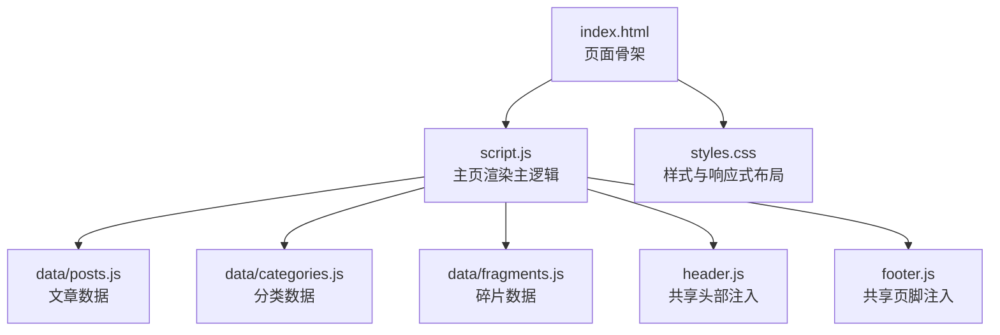
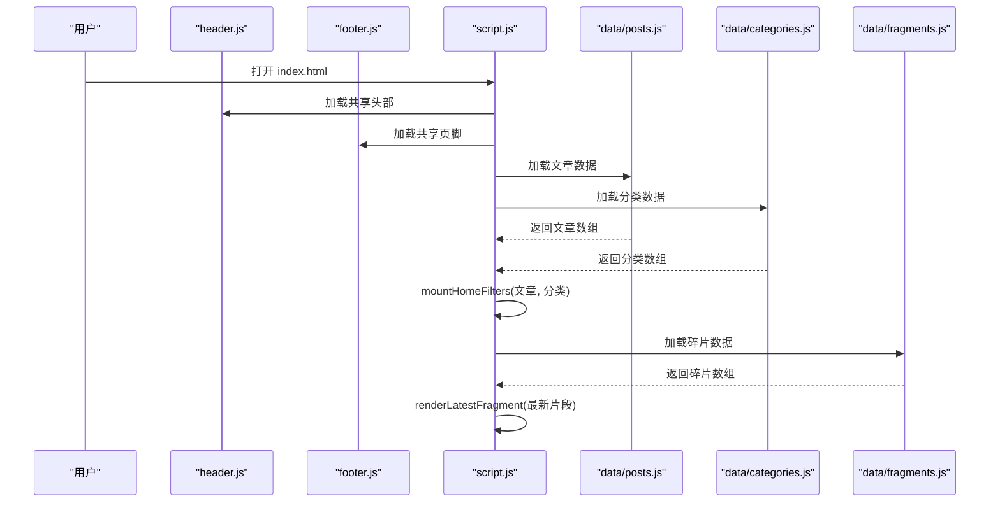
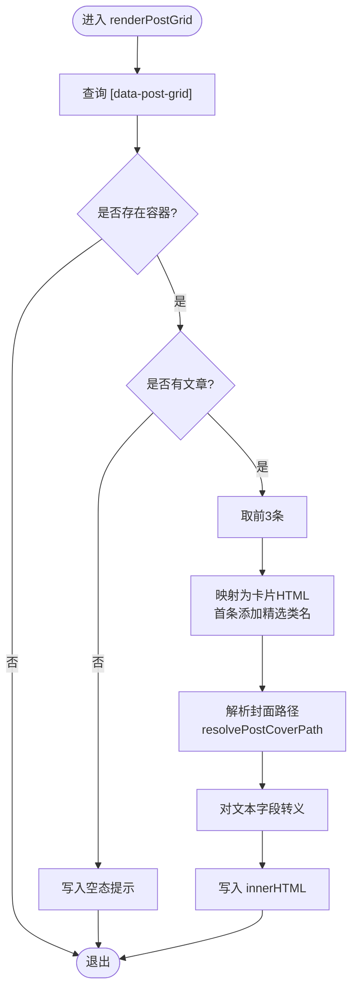
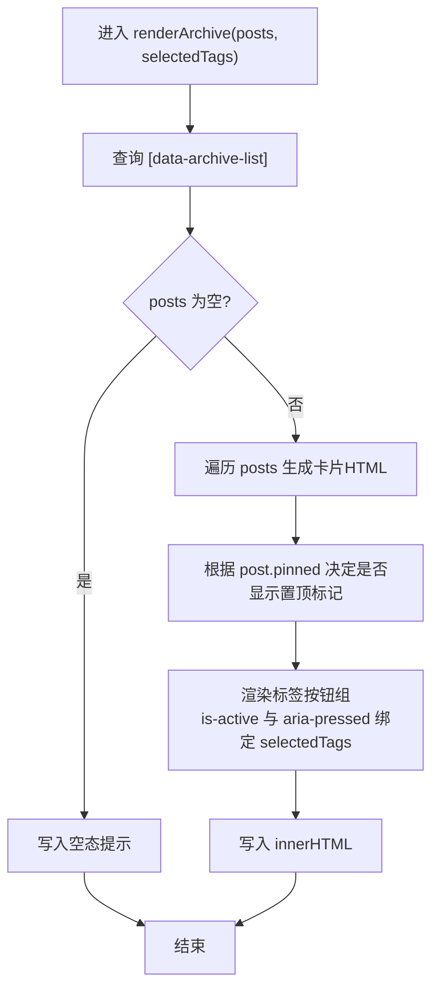
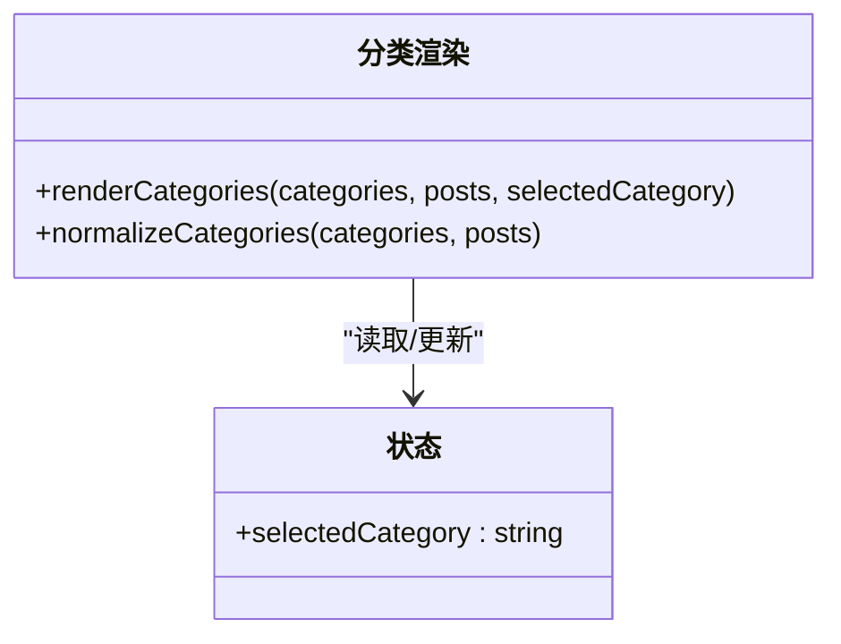
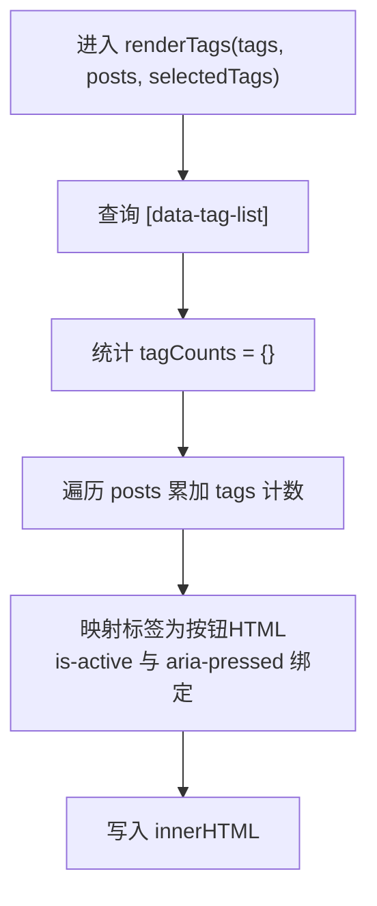
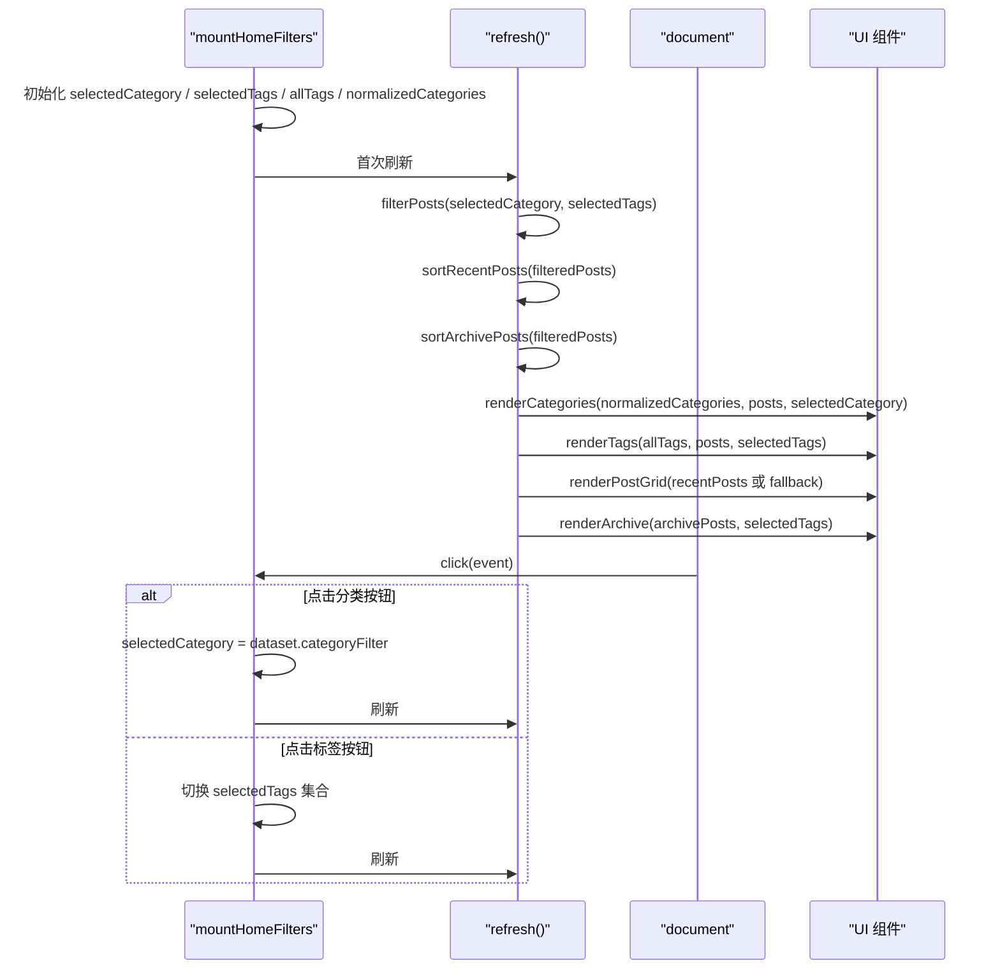
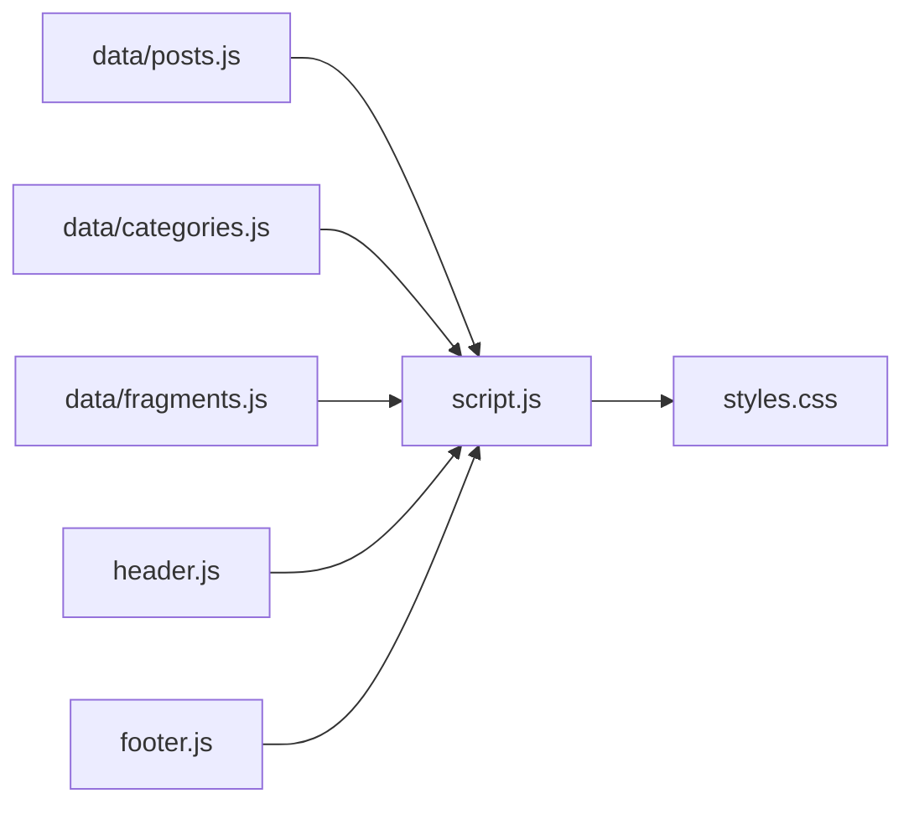

# 主页渲染系统

<cite>
**本文引用的文件**   
- [index.html](file://index.html)
- [script.js](file://script.js)
- [header.js](file://header.js)
- [footer.js](file://footer.js)
- [styles.css](file://styles.css)
- [data/posts.js](file://data/posts.js)
- [data/categories.js](file://data/categories.js)
- [data/fragments.js](file://data/fragments.js)
</cite>

## 目录
1. [简介](#简介)
2. [项目结构](#项目结构)
3. [核心组件](#核心组件)
4. [架构总览](#架构总览)
5. [详细组件分析](#详细组件分析)
6. [依赖关系分析](#依赖关系分析)
7. [性能考量](#性能考量)
8. [故障排查指南](#故障排查指南)
9. [结论](#结论)

## 简介
本技术文档聚焦博客“主页”的渲染系统，围绕数据加载、文章网格渲染、归档列表、分类导航与标签云等关键模块进行系统化说明。重点覆盖以下能力：
- 异步数据获取流程：loadPosts()、loadCategories()、loadFragments()
- 文章网格渲染逻辑：renderPostGrid()（含置顶/精选处理、封面路径解析、响应式布局）
- 归档列表渲染：renderArchive()（排序算法 sortRecentPosts、sortArchivePosts、标签过滤、统计信息）
- 分类导航动态更新：renderCategories()（计数统计、激活状态管理）
- 标签云系统：renderTags()（计数计算、多标签筛选）
- 交互挂载：mountHomeFilters()（事件委托模式、状态管理）

## 项目结构
主页由 HTML 骨架、JS 渲染脚本、共享头尾、样式表以及数据脚本组成。HTML 提供 DOM 占位符，JS 负责动态加载数据并渲染到页面；CSS 实现响应式布局与主题切换。

图表来源
- [index.html:1-93](file://index.html#L1-L93)
- [script.js:1-701](file://script.js#L1-L701)
- [header.js:1-110](file://header.js#L1-L110)
- [footer.js:1-36](file://footer.js#L1-L36)
- [styles.css:1-200](file://styles.css#L1-L200)

章节来源
- [index.html:1-93](file://index.html#L1-L93)
- [script.js:1-701](file://script.js#L1-L701)
- [header.js:1-110](file://header.js#L1-L110)
- [footer.js:1-36](file://footer.js#L1-L36)
- [styles.css:1-200](file://styles.css#L1-L200)

## 核心组件
- 数据加载器
  - loadDataScript(): 通用脚本加载器，支持校验与错误处理
  - loadPosts()/loadCategories()/loadFragments(): 分别加载文章、分类、碎片数据
- 渲染器
  - renderPostGrid(): 渲染最近更新的文章网格（最多展示前3条，首条为精选卡片）
  - renderArchive(): 渲染归档列表（支持置顶、日期排序、标签按钮）
  - renderCategories(): 渲染分类导航（包含“全部”项与各类别计数）
  - renderTags(): 渲染标签云（显示每个标签的出现次数）
  - renderLatestFragment(): 渲染首页“今天在想什么”的最新片段
- 过滤器与交互
  - mountHomeFilters(): 维护当前分类与标签选择状态，基于事件委托统一处理点击，刷新各区域
- 工具函数
  - escapeHtml(), sanitizeSegment(), normalizePath(), isSpecialUrl(), resolveAssetPath()
  - getPostFolder(), getAllTags(), filterPosts(), sortPostsByDate(), sortRecentPosts(), sortArchivePosts()
  - updateProfileStats(): 更新侧边栏统计（文章数、标签数）

章节来源
- [script.js:12-37](file://script.js#L12-L37)
- [script.js:39-61](file://script.js#L39-L61)
- [script.js:129-186](file://script.js#L129-L186)
- [script.js:197-299](file://script.js#L197-L299)
- [script.js:301-436](file://script.js#L301-L436)
- [script.js:438-495](file://script.js#L438-L495)
- [script.js:649-664](file://script.js#L649-L664)

## 架构总览
主页初始化时，先加载共享头尾，再并行加载文章与分类数据以驱动过滤器与渲染；同时异步加载最新片段用于首页 Hero 区展示。

图表来源
- [script.js:666-691](file://script.js#L666-L691)
- [script.js:63-87](file://script.js#L63-L87)
- [script.js:39-61](file://script.js#L39-L61)
- [script.js:649-664](file://script.js#L649-L664)

## 详细组件分析

### 数据加载机制
- loadDataScript(relativePath, globalName, validator)
  - 若全局变量已存在且通过校验则直接返回 Promise.resolve(data)
  - 否则动态创建 script 标签加载目标脚本，onload/onerror 回调中完成解析或报错
  - 使用 URL 拼接版本号参数避免缓存
- loadPosts()/loadCategories()/loadFragments()
  - 分别调用 loadDataScript 加载 data/posts.js、data/categories.js、data/fragments.js
  - 校验目标全局变量是否为数组
- 启动流程
  - 优先加载 header.js/footer.js，失败不影响后续渲染
  - 在 home 页面下并行加载 posts 与 categories，成功后进入 mountHomeFilters
  - 单独加载 fragments 并渲染最新片段

章节来源
- [script.js:12-37](file://script.js#L12-L37)
- [script.js:39-61](file://script.js#L39-L61)
- [script.js:666-691](file://script.js#L666-L691)

### 文章网格渲染：renderPostGrid()
- 功能要点
  - 取最近文章（按 sortRecentPosts），若无则回退到按日期排序
  - 仅展示前 3 条，第一条附加“精选”类名 post-card-featured
  - 封面图片路径通过 resolvePostCoverPath(post) 解析，兼容相对路径与绝对路径
  - 标题、摘要、分类均经 escapeHtml 转义
- 封面路径解析
  - resolveAssetPath 支持特殊 URL、assets/data/posts/image 前缀、html 链接与相对路径归一化
  - resolvePostCoverPath 根据 post.cover 与 post.imageDir/sourceDir 组合生成最终路径
- 响应式布局
  - CSS 使用 grid 三列布局，移动端媒体查询降为一列
  - 图片采用 aspect-ratio 与 object-fit 保持比例与裁剪

图表来源
- [script.js:301-327](file://script.js#L301-L327)
- [script.js:168-186](file://script.js#L168-L186)
- [script.js:197-199](file://script.js#L197-L199)
- [styles.css:355-384](file://styles.css#L355-L384)

章节来源
- [script.js:301-327](file://script.js#L301-L327)
- [script.js:168-186](file://script.js#L168-L186)
- [script.js:197-199](file://script.js#L197-L199)
- [styles.css:355-384](file://styles.css#L355-L384)

### 归档列表渲染：renderArchive()
- 功能要点
  - 接收已过滤后的文章列表与当前选中标签集合
  - 每条归档卡片包含标题、置顶标记、元信息（日期、分类）、标签按钮组、摘要、字数与阅读时长
  - 标签按钮根据是否选中设置 is-active 与 aria-pressed
- 排序算法
  - sortRecentPosts: 过滤 showInRecent !== false，按 recentOrder 升序，其次按 date 倒序
  - sortArchivePosts: 过滤 showInArchive !== false，按 archiveOrder 升序，其次 pinned 置顶优先，最后按 date 倒序
- 标签过滤
  - 归档卡片内的标签按钮可触发标签筛选（见 mountHomeFilters 的事件委托）
- 统计信息显示
  - 卡片内显示 wordCount 与 readingTime

图表来源
- [script.js:329-370](file://script.js#L329-L370)
- [script.js:272-299](file://script.js#L272-L299)

章节来源
- [script.js:329-370](file://script.js#L329-L370)
- [script.js:272-299](file://script.js#L272-L299)

### 分类导航系统：renderCategories()
- 功能要点
  - 始终插入“全部”项，count 为当前 posts 总数
  - 其余分类来自 normalizeCategories(categories, posts)，其 count 由 posts 的 folder 统计得出
  - 根据 selectedCategory 设置 is-active 高亮
- 分类计数统计
  - normalizeCategories 遍历 posts 统计每文件夹数量，合并显式定义的分类，并按 order 与名称排序
- 激活状态管理
  - 由 mountHomeFilters 中的 selectedCategory 状态驱动，点击分类按钮后刷新

图表来源
- [script.js:372-406](file://script.js#L372-L406)
- [script.js:205-249](file://script.js#L205-L249)
- [script.js:448-495](file://script.js#L448-L495)

章节来源
- [script.js:372-406](file://script.js#L372-L406)
- [script.js:205-249](file://script.js#L205-L249)
- [script.js:448-495](file://script.js#L448-L495)

### 标签云系统：renderTags()
- 功能要点
  - 从 posts 中聚合所有标签并去重排序
  - 计算每个标签在当前 posts 中的出现次数
  - 根据 selectedTags 设置 is-active 与 aria-pressed
- 多标签筛选
  - 点击标签按钮会切换 selectedTags 集合，随后刷新视图

图表来源
- [script.js:408-436](file://script.js#L408-L436)
- [script.js:251-255](file://script.js#L251-L255)

章节来源
- [script.js:408-436](file://script.js#L408-L436)
- [script.js:251-255](file://script.js#L251-L255)

### 过滤器挂载与交互：mountHomeFilters()
- 状态管理
  - selectedCategory: 字符串，默认 "all"
  - selectedTags: Set，保存当前选中的多个标签
  - allTags: 从 posts 提取的全量标签集合
  - normalizedCategories: 规范化后的分类列表（含计数）
- 刷新流程 refresh()
  - 基于 selectedCategory 与 selectedTags 过滤 posts
  - 分别生成近期文章与归档文章（不同排序策略）
  - 依次渲染分类、标签、文章网格、归档列表
- 事件委托
  - 监听 document 的 click 事件
  - 通过 closest("[data-category-filter]") 识别分类按钮，更新 selectedCategory 并刷新
  - 通过 closest("[data-tag-filter]") 识别标签按钮，切换 selectedTags 并刷新
- 初始渲染
  - 首次调用 refresh() 完成初次渲染

图表来源
- [script.js:448-495](file://script.js#L448-L495)
- [script.js:257-266](file://script.js#L257-L266)
- [script.js:272-299](file://script.js#L272-L299)

章节来源
- [script.js:448-495](file://script.js#L448-L495)
- [script.js:257-266](file://script.js#L257-L266)
- [script.js:272-299](file://script.js#L272-L299)

### 首页“今天在想什么”：renderLatestFragment()
- 从 fragments 中选取时间最新的条目
- 将段落内容渲染为 hero 区域的若干段文本
- 若没有可用段落则不覆盖默认文案

章节来源
- [script.js:637-664](file://script.js#L637-L664)

## 依赖关系分析
- 模块耦合
  - script.js 作为中枢，依赖数据脚本与共享头尾，并通过 DOM 占位符与 CSS 类名协同工作
  - 渲染函数之间通过共享状态（selectedCategory、selectedTags）解耦
- 外部依赖
  - 数据脚本通过 window 全局变量暴露数据
  - 样式表通过 CSS 类名控制布局与交互反馈
- 潜在循环依赖
  - 无直接循环依赖；数据加载与渲染单向流动

图表来源
- [script.js:666-691](file://script.js#L666-L691)
- [script.js:63-87](file://script.js#L63-L87)

章节来源
- [script.js:666-691](file://script.js#L666-L691)
- [script.js:63-87](file://script.js#L63-L87)

## 性能考量
- 数据加载
  - 使用 Promise.all 并行加载文章与分类，减少首屏等待
  - loadDataScript 增加版本参数避免缓存导致的数据陈旧
- 渲染优化
  - 文章网格仅展示前 3 条，降低 DOM 节点数量
  - 使用 innerHTML 批量写入，减少多次 DOM 操作
- 交互效率
  - 事件委托在 document 层统一处理，避免为每个按钮绑定事件
- 资源加载
  - 图片 lazy loading 在碎片图片渲染中使用，提升滚动性能
- 建议
  - 当文章数量增长时，考虑分页或虚拟列表
  - 对频繁更新的标签/分类计数可引入增量更新策略

[本节为通用指导，无需源码引用]

## 故障排查指南
- 数据未加载
  - 检查 data/*.js 是否正确挂载到 window 全局变量
  - 查看控制台错误输出，确认 loadDataScript 的 onerror 分支
- 渲染空白
  - 确认 index.html 中对应 data-* 占位元素存在
  - 检查 filterPosts 条件是否过于严格导致结果为空
- 封面图片不显示
  - 核对 cover 字段与 imageDir/sourceDir 的组合路径
  - 确认 resolveAssetPath 规则是否符合实际路径结构
- 分类/标签点击无效
  - 确认按钮带有 data-category-filter 或 data-tag-filter 属性
  - 检查事件委托是否在 document 上正确注册

章节来源
- [script.js:12-37](file://script.js#L12-L37)
- [script.js:257-266](file://script.js#L257-L266)
- [script.js:168-186](file://script.js#L168-L186)
- [script.js:448-495](file://script.js#L448-L495)

## 结论
该主页渲染系统以轻量脚本为核心，通过模块化数据加载与集中式渲染函数，实现了文章网格、归档列表、分类导航与标签云的联动交互。整体架构清晰、职责分离明确，具备良好的可扩展性与可维护性。建议在数据规模增大时引入分页与增量更新策略，进一步提升性能与用户体验。