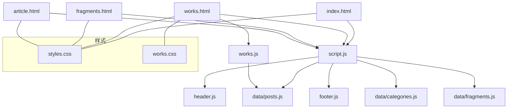
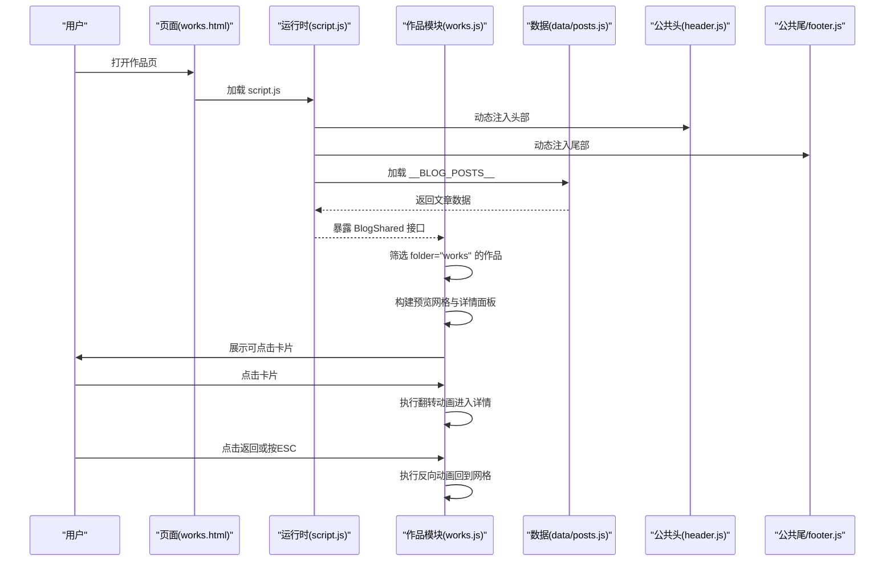
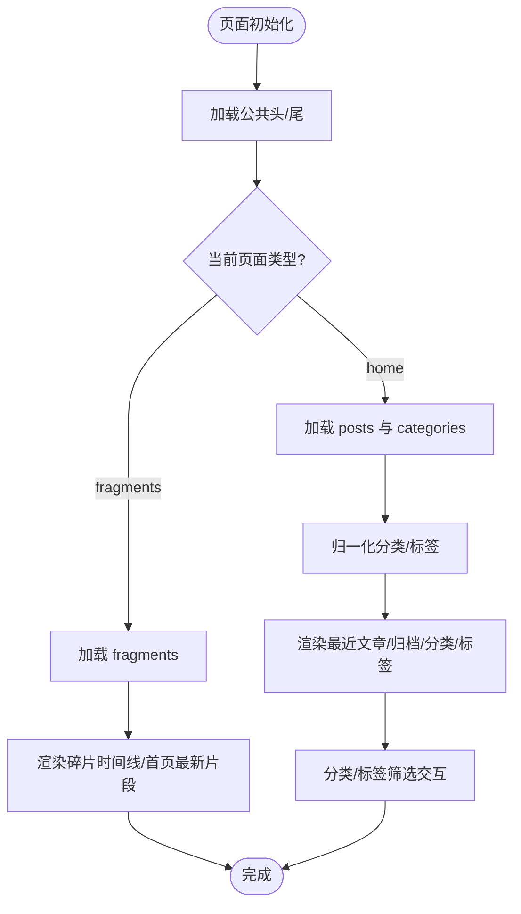
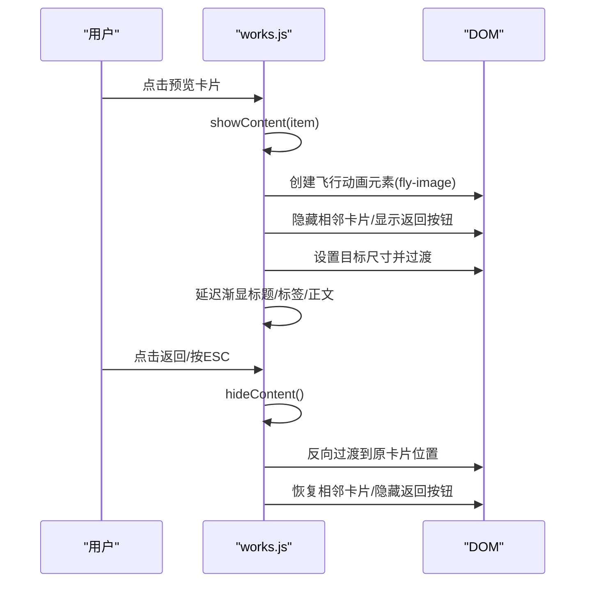
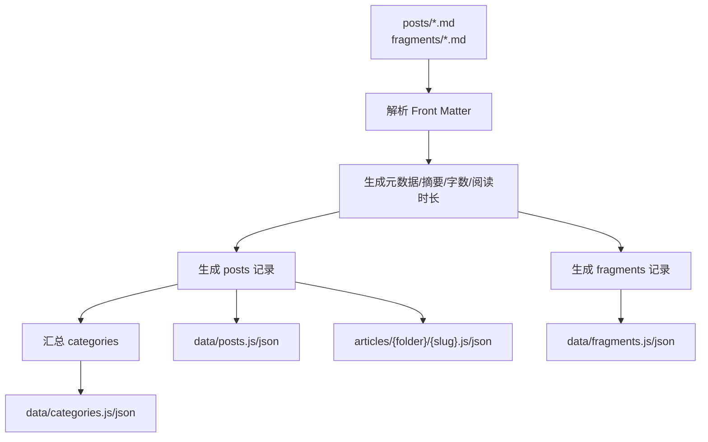
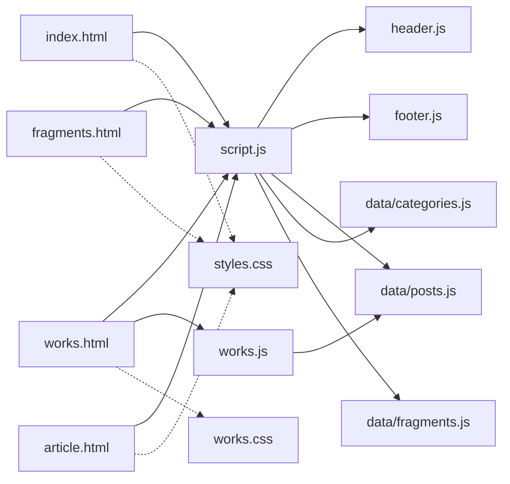

# 作品画廊系统

<cite>
**本文引用的文件**   
- [index.html](file://index.html)
- [works.html](file://works.html)
- [fragments.html](file://fragments.html)
- [article.html](file://article.html)
- [script.js](file://script.js)
- [works.js](file://works.js)
- [header.js](file://header.js)
- [footer.js](file://footer.js)
- [styles.css](file://styles.css)
- [works.css](file://works.css)
- [data/posts.js](file://data/posts.js)
- [data/categories.js](file://data/categories.js)
- [data/fragments.js](file://data/fragments.js)
- [tools/build_posts.py](file://tools/build_posts.py)
</cite>

## 目录
1. [简介](#简介)
2. [项目结构](#项目结构)
3. [核心组件](#核心组件)
4. [架构总览](#架构总览)
5. [详细组件分析](#详细组件分析)
6. [依赖关系分析](#依赖关系分析)
7. [性能与体验优化](#性能与体验优化)
8. [故障排查指南](#故障排查指南)
9. [结论](#结论)
10. [附录：数据模型与构建流程](#附录数据模型与构建流程)

## 简介
本仓库是一个静态站点型“作品画廊系统”，以纯前端（HTML/CSS/JS）为主，配合一个 Python 构建脚本将 Markdown 内容编译为浏览器可直接加载的 JS 数据。系统包含以下页面与能力：
- 首页：展示最新文章、归档列表、分类与标签筛选、最新碎片摘要
- 作品页：以卡片网格展示作品，点击后触发图片翻转动画进入详情面板，支持滚动视差与键盘返回
- 碎片页：按时间线展示短记录（含可选图片）
- 文章详情页：通过 URL 参数加载对应文章数据并渲染

整体采用“数据驱动 + 动态注入”的方式，避免服务端渲染，适合个人博客与作品集展示。

## 项目结构
- 页面入口
  - index.html：首页骨架与挂载点
  - works.html：作品页骨架与挂载点
  - fragments.html：碎片页骨架与挂载点
  - article.html：文章详情页骨架与挂载点
- 样式
  - styles.css：全局主题、布局、组件样式
  - works.css：作品页专属样式与动画
- 脚本
  - script.js：共享逻辑（主题切换、导航、数据加载、渲染、过滤排序等）
  - works.js：作品页交互（预览/详情翻转、视差、事件绑定）
  - header.js / footer.js：动态注入公共头部与底部
- 数据
  - data/posts.js：文章元数据数组
  - data/categories.js：分类元数据数组
  - data/fragments.js：碎片数据数组
- 工具
  - tools/build_posts.py：从 posts 目录下的 Markdown 生成 data/*.js 与 articles/* 资源

图表来源
- [index.html:1-93](file://index.html#L1-L93)
- [works.html:1-30](file://works.html#L1-L30)
- [fragments.html:1-23](file://fragments.html#L1-L23)
- [article.html:1-29](file://article.html#L1-L29)
- [script.js:1-737](file://script.js#L1-L737)
- [works.js:1-523](file://works.js#L1-L523)
- [header.js:1-110](file://header.js#L1-L110)
- [footer.js:1-36](file://footer.js#L1-L36)
- [styles.css:1-800](file://styles.css#L1-L800)
- [works.css:1-345](file://works.css#L1-L345)
- [data/posts.js:1-95](file://data/posts.js#L1-L95)
- [data/categories.js:1-19](file://data/categories.js#L1-L19)
- [data/fragments.js:1-14](file://data/fragments.js#L1-L14)

章节来源
- [index.html:1-93](file://index.html#L1-L93)
- [works.html:1-30](file://works.html#L1-L30)
- [fragments.html:1-23](file://fragments.html#L1-L23)
- [article.html:1-29](file://article.html#L1-L29)
- [styles.css:1-800](file://styles.css#L1-L800)
- [works.css:1-345](file://works.css#L1-L345)

## 核心组件
- 共享运行时（script.js）
  - 主题持久化与切换
  - 动态加载共享头/尾
  - 动态加载数据脚本（posts/categories/fragments）
  - 路径解析与资源安全转义
  - 分类归一化、标签聚合、文章过滤与排序
  - 首页最近文章、归档列表、分类与标签渲染
  - 碎片时间线渲染与首页最新片段展示
- 作品页交互（works.js）
  - 从 posts 中筛选 folder=works 的作品
  - 构建预览网格与详情面板 DOM
  - 图片翻转过渡（FLIP 风格），相邻卡片滑出/回归
  - 滚动视差（基于 getBoundingClientRect 与 requestAnimationFrame）
  - ESC 键与返回按钮关闭详情
- 构建工具（build_posts.py）
  - 解析 Markdown Front Matter
  - 生成 posts.json、categories.json、fragments.json 及对应的 window.* 变量
  - 生成 articles 目录下的单篇文章 JSON/JS 资源

章节来源
- [script.js:1-737](file://script.js#L1-L737)
- [works.js:1-523](file://works.js#L1-L523)
- [tools/build_posts.py:1-414](file://tools/build_posts.py#L1-L414)

## 架构总览
系统采用“静态 HTML + 动态数据脚本 + 轻量运行时”的架构。页面在加载时按需注入公共头/尾，再根据当前页面类型加载所需数据脚本，最后由渲染函数将数据写入 DOM。

图表来源
- [works.html:1-30](file://works.html#L1-L30)
- [script.js:1-737](file://script.js#L1-L737)
- [works.js:1-523](file://works.js#L1-L523)
- [header.js:1-110](file://header.js#L1-L110)
- [footer.js:1-36](file://footer.js#L1-L36)
- [data/posts.js:1-95](file://data/posts.js#L1-L95)

## 详细组件分析

### 共享运行时（script.js）
- 主题与导航
  - 读取 localStorage 中的主题偏好，设置 body[data-theme]
  - 注入公共头/尾，处理移动端菜单展开与 aria 状态
- 数据加载
  - loadDataScript 动态插入 <script> 标签，校验全局变量存在性
  - loadPosts/loadCategories/loadFragments 分别加载三类数据
- 路径与安全
  - escapeHtml/sanitizeSegment/normalizePath/isSpecialUrl/resolveAssetPath 提供安全的资源路径解析与输出
- 分类与标签
  - normalizeCategories 统计每类文章数并补齐未声明的分类
  - getAllTags 收集所有标签并按中文排序
  - filterPosts 按分类与标签集合过滤
- 排序
  - sortRecentPosts 优先 recentOrder，其次日期
  - sortArchivePosts 优先 archiveOrder，置顶项在前，其次日期
- 渲染
  - renderPostGrid 渲染首页最近文章卡片
  - renderArchive 渲染归档列表，内嵌标签筛选按钮
  - renderCategories/renderTags 渲染侧边栏分类与标签云
  - mountHomeFilters 组合上述渲染并提供交互刷新
  - 碎片相关：renderFragments、getLatestFragment、renderLatestFragment

图表来源
- [script.js:1-737](file://script.js#L1-L737)

章节来源
- [script.js:1-737](file://script.js#L1-L737)

### 作品页（works.js）
- 数据准备
  - 使用 BlogShared.loadDataScript 加载 posts，筛选 folder="works" 的记录
  - padWorks 用于不足数量时填充占位条目，保证网格稳定
- DOM 构建
  - buildPreviews 生成预览卡片（封面图+标题+摘要）
  - buildContents 生成详情面板（大图+标题+标签+正文+缩略图占位）
- 动画与交互
  - showContent/hideContent：创建飞行动画元素，计算源/目标矩形，执行 FLIP 式过渡；同时隐藏相邻卡片、显示返回按钮、延迟渐显文本
  - updateParallax：基于滚动位置对每个卡片的背景缩放与标题位移做视差
  - initEvents：点击卡片展开、返回按钮/ESC 收起
- 状态管理
  - previewItems、currentItem、isAnimating、flyingImage、scrollTicking 控制动画与滚动节流

图表来源
- [works.js:1-523](file://works.js#L1-L523)

章节来源
- [works.js:1-523](file://works.js#L1-L523)

### 构建工具（build_posts.py）
- 输入
  - posts 目录下各分类子文件夹中的 .md 文件
  - fragments.md 中的带时间标题的段落
- 处理
  - parse_front_matter：解析 YAML 风格的 Front Matter
  - strip_markdown/excerpt_from_body：提取纯文本与摘要
  - collect_posts/collect_fragments：遍历生成文章与碎片记录
  - build_categories：汇总分类信息
- 输出
  - data/posts.js、data/categories.js、data/fragments.js（window.* 变量）
  - data/posts.json、data/categories.json、data/fragments.json
  - articles/{folder}/{slug}.json 与 .js（单篇文章资源）

图表来源
- [tools/build_posts.py:1-414](file://tools/build_posts.py#L1-L414)

章节来源
- [tools/build_posts.py:1-414](file://tools/build_posts.py#L1-L414)

### 公共头/尾（header.js / footer.js）
- 动态注入
  - 查找 .page-shell 内的 [data-shared-header] 或现有 .site-header 进行替换
  - 设置 favicon、导航链接、主题切换按钮、移动端菜单按钮
- 主题切换
  - 切换 body[data-theme] 并在 localStorage 中持久化

章节来源
- [header.js:1-110](file://header.js#L1-L110)
- [footer.js:1-36](file://footer.js#L1-L36)

## 依赖关系分析
- 页面与脚本
  - index.html → script.js → header.js / footer.js → data/posts.js / data/categories.js / data/fragments.js
  - works.html → script.js + works.js → data/posts.js
  - fragments.html → script.js → data/fragments.js
  - article.html → script.js + article.js → data/articles/*（由构建工具生成）
- 样式依赖
  - 全局样式 styles.css 被所有页面引用
  - 作品页额外引入 works.css

图表来源
- [index.html:1-93](file://index.html#L1-L93)
- [works.html:1-30](file://works.html#L1-L30)
- [fragments.html:1-23](file://fragments.html#L1-L23)
- [article.html:1-29](file://article.html#L1-L29)
- [script.js:1-737](file://script.js#L1-L737)
- [works.js:1-523](file://works.js#L1-L523)
- [header.js:1-110](file://header.js#L1-L110)
- [footer.js:1-36](file://footer.js#L1-L36)
- [styles.css:1-800](file://styles.css#L1-L800)
- [works.css:1-345](file://works.css#L1-L345)
- [data/posts.js:1-95](file://data/posts.js#L1-L95)
- [data/categories.js:1-19](file://data/categories.js#L1-L19)
- [data/fragments.js:1-14](file://data/fragments.js#L1-L14)

章节来源
- [script.js:1-737](file://script.js#L1-L737)
- [works.js:1-523](file://works.js#L1-L523)
- [header.js:1-110](file://header.js#L1-L110)
- [footer.js:1-36](file://footer.js#L1-L36)
- [styles.css:1-800](file://styles.css#L1-L800)
- [works.css:1-345](file://works.css#L1-L345)
- [data/posts.js:1-95](file://data/posts.js#L1-L95)
- [data/categories.js:1-19](file://data/categories.js#L1-L19)
- [data/fragments.js:1-14](file://data/fragments.js#L1-L14)

## 性能与体验优化
- 首屏加载
  - 使用异步加载数据脚本与公共头/尾，减少阻塞
  - 图片使用 background-size cover 与懒加载策略（碎片图片已设置 loading="lazy"）
- 动画与滚动
  - 视差更新使用 requestAnimationFrame 节流，避免频繁重排
  - 翻转动画使用 CSS transition 与 will-change 提示，提升合成层性能
- 渲染优化
  - 批量 innerHTML 拼接，减少多次 DOM 操作
  - 仅渲染必要区域（如最近文章只取前 3 条）
- 可访问性
  - 导航按钮维护 aria-expanded/aria-label
  - 关键元素提供语义化标签与 alt 描述

[本节为通用建议，不直接分析具体文件]

## 故障排查指南
- 数据未加载
  - 检查 data/*.js 是否由构建工具正确生成，且 window.__BLOG_* 变量存在
  - 查看控制台是否有“Failed to load data script”错误
- 图片路径异常
  - 确认 resolveAssetPath 规则与相对路径一致，必要时使用绝对路径或 assets/ 前缀
- 主题切换无效
  - 检查 localStorage 中 blog-theme 值与 body[data-theme] 同步
- 作品页无内容
  - 确认 posts.js 中存在 folder="works" 的记录，否则会被占位填充
- 构建产物不一致
  - 重新运行构建脚本，确保 posts 与 fragments 目录内容已更新

章节来源
- [script.js:1-737](file://script.js#L1-L737)
- [works.js:1-523](file://works.js#L1-L523)
- [tools/build_posts.py:1-414](file://tools/build_posts.py#L1-L414)

## 结论
该系统以极简的前端架构实现了“内容即数据”的博客与作品集展示方案。通过 Python 构建脚本将 Markdown 转化为浏览器友好的 JS 数据，再由统一的运行时负责加载、渲染与交互。作品页的翻转动画与视差效果提升了浏览体验，同时保持了良好的可维护性与扩展性。

[本节为总结性内容，不直接分析具体文件]

## 附录：数据模型与构建流程

### 文章数据模型（posts）
- 关键字段
  - id/title/excerpt/summary/description：标识与文案
  - category/categoryOrder/folder：分类与排序
  - date/dateLabel：时间信息
  - tags：标签数组
  - readingTime/readingMinutes/wordCount/wordCountValue：阅读统计
  - featured/pinned/showInRecent/recentOrder/showInArchive/archiveOrder：展示控制
  - cover/path/sourcePath/sourceDir/imageDir：资源与来源路径
  - content：完整正文（仅构建产物保留）

章节来源
- [data/posts.js:1-95](file://data/posts.js#L1-L95)
- [tools/build_posts.py:146-197](file://tools/build_posts.py#L146-L197)

### 分类数据模型（categories）
- 关键字段
  - id/name/folder/description/order/count：分类信息与计数

章节来源
- [data/categories.js:1-19](file://data/categories.js#L1-L19)
- [tools/build_posts.py:353-377](file://tools/build_posts.py#L353-L377)

### 碎片数据模型（fragments）
- 关键字段
  - id/date/timeLabel/year：时间与年份
  - sourcePath：来源文件
  - paragraphs/images：正文段落与图片信息

章节来源
- [data/fragments.js:1-14](file://data/fragments.js#L1-L14)
- [tools/build_posts.py:285-297](file://tools/build_posts.py#L285-L297)