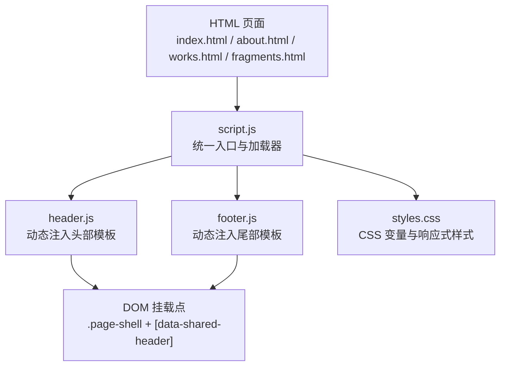
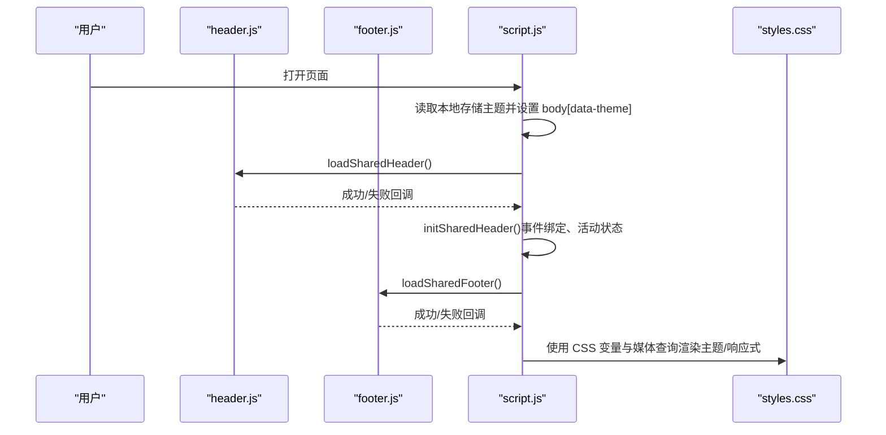
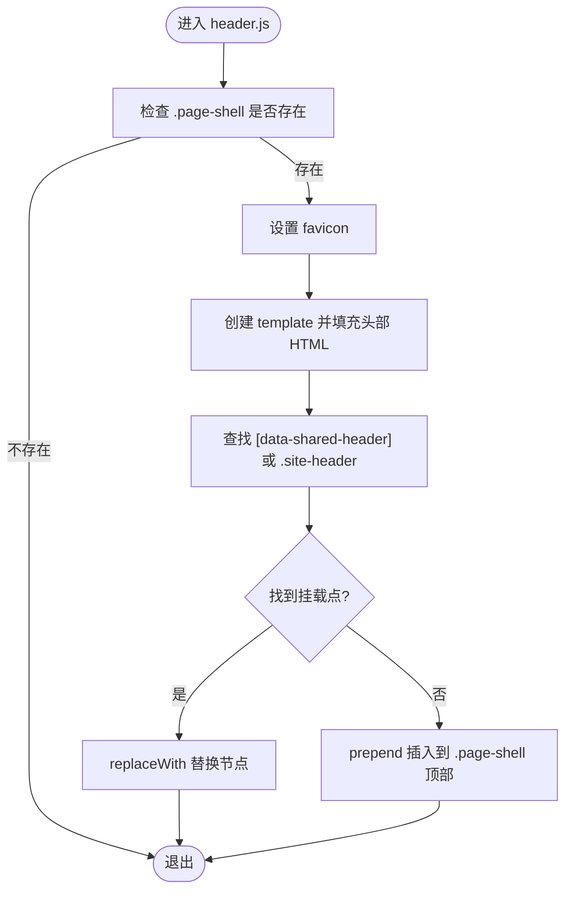
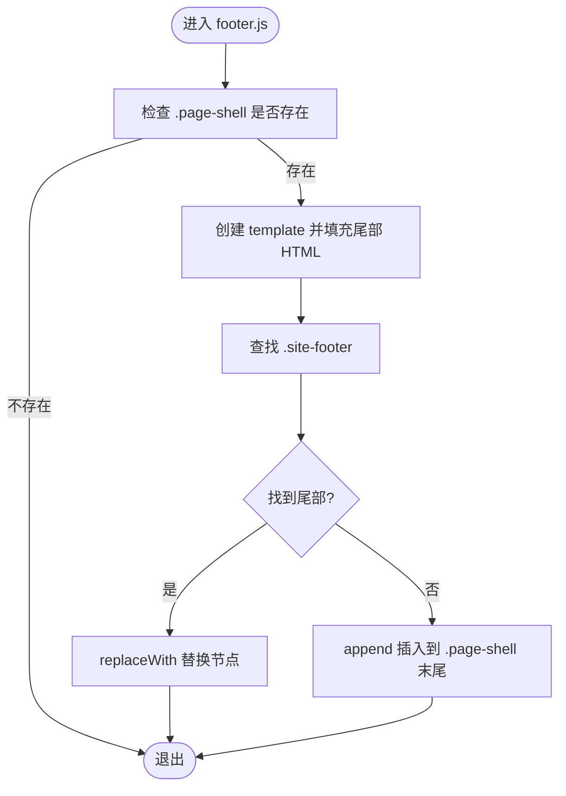
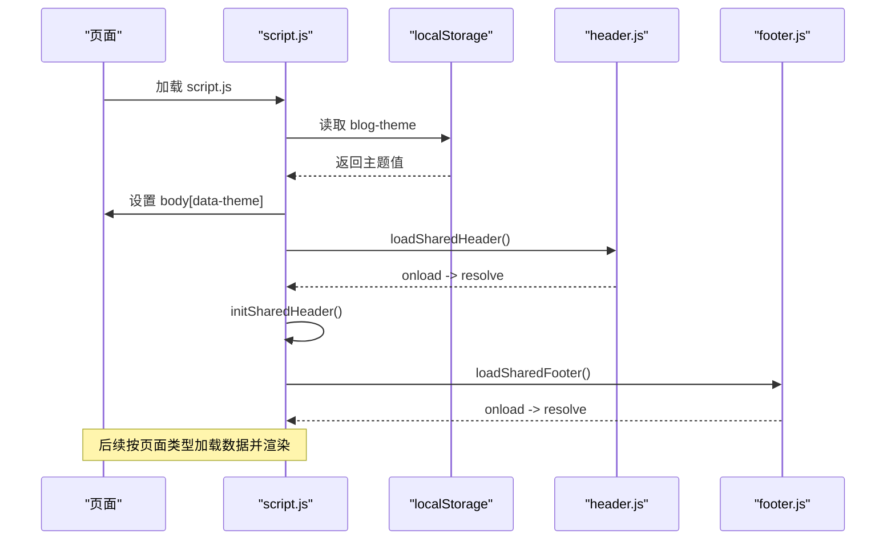
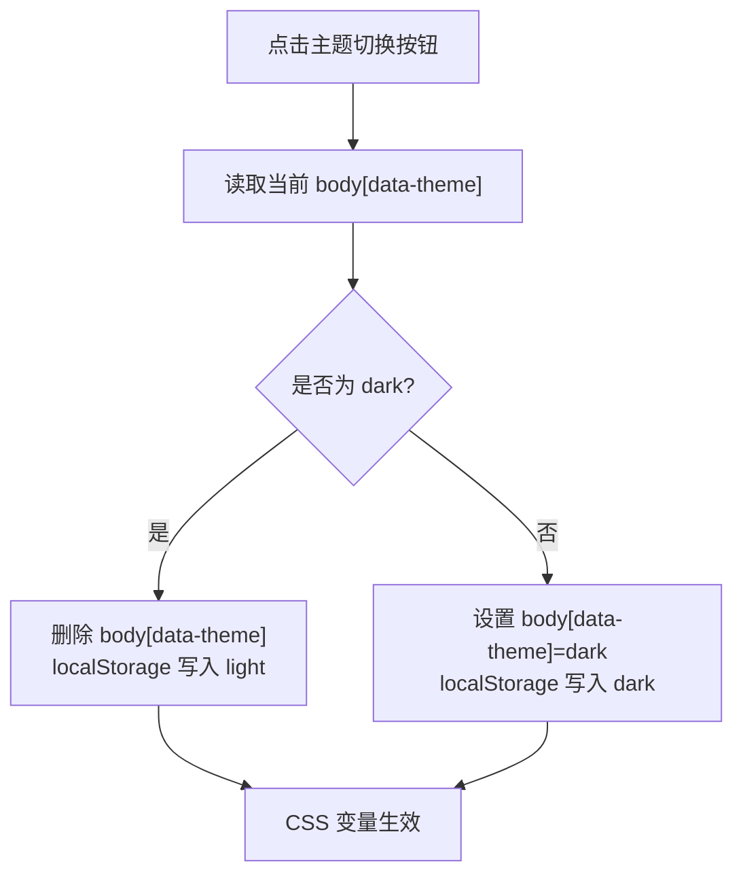
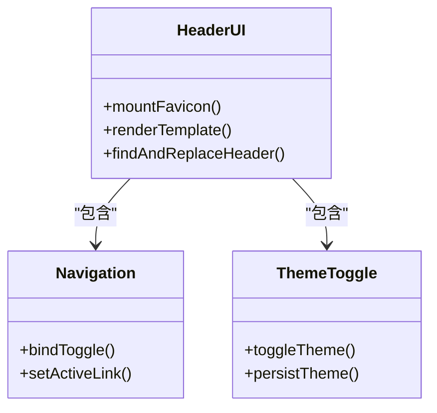
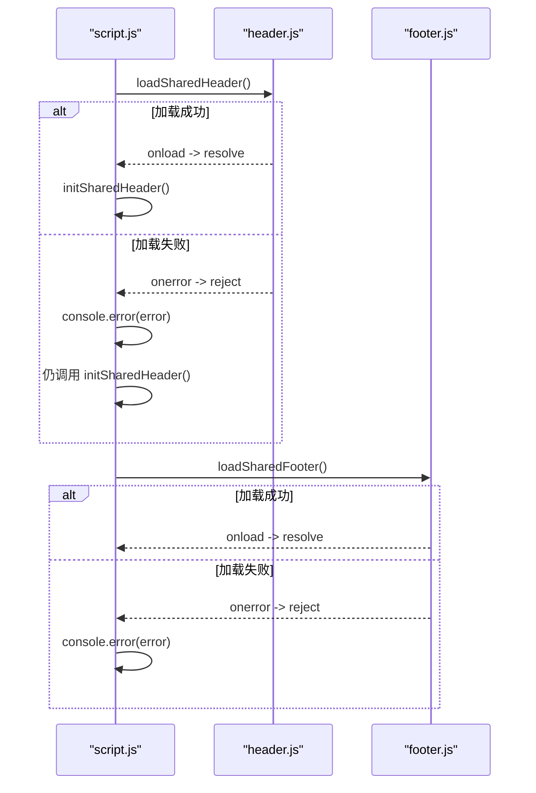
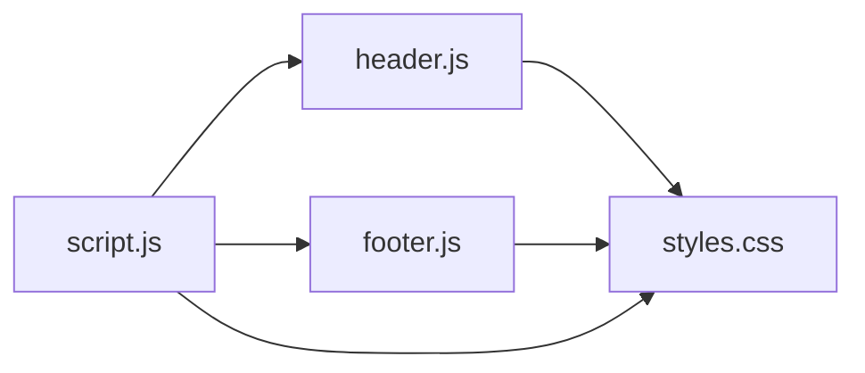

# 共享组件系统

<cite>
**本文引用的文件**   
- [header.js](file://header.js)
- [footer.js](file://footer.js)
- [script.js](file://script.js)
- [styles.css](file://styles.css)
- [index.html](file://index.html)
- [about.html](file://about.html)
- [works.html](file://works.html)
- [fragments.html](file://fragments.html)
</cite>

## 目录
1. [简介](#简介)
2. [项目结构](#项目结构)
3. [核心组件](#核心组件)
4. [架构总览](#架构总览)
5. [详细组件分析](#详细组件分析)
6. [依赖关系分析](#依赖关系分析)
7. [性能考量](#性能考量)
8. [故障排查指南](#故障排查指南)
9. [结论](#结论)
10. [附录：扩展与复用指南](#附录扩展与复用指南)

## 简介
本技术文档围绕博客项目的“共享组件系统”展开，重点解析 header.js 与 footer.js 的组件化设计、主题切换机制、导航响应式行为与移动端适配、异步加载策略与错误处理、初始化流程（DOM 操作、事件绑定、状态同步），以及可复用的模式与扩展开发指南。目标是帮助开发者快速理解并安全地扩展该共享组件体系。

## 项目结构
本项目采用“页面骨架 + 动态注入”的方式组织前端资源：
- HTML 页面提供最小化的 DOM 占位（如 data-shared-header）和页面级数据标记（body[data-page]）。
- script.js 负责统一的主题初始化、共享组件的动态加载与初始化、以及各页面的业务渲染逻辑。
- header.js 与 footer.js 以 IIFE 形式运行，按需将头部/尾部模板挂载到页面中。
- styles.css 通过 CSS 变量与媒体查询实现主题与响应式布局。

图表来源
- [script.js:63-87](file://script.js#L63-L87)
- [header.js:1-110](file://header.js#L1-L110)
- [footer.js:1-36](file://footer.js#L1-L36)
- [styles.css:1-31](file://styles.css#L1-L31)
- [index.html:10-21](file://index.html#L10-L21)

章节来源
- [index.html:1-93](file://index.html#L1-L93)
- [about.html:1-23](file://about.html#L1-L23)
- [works.html:1-23](file://works.html#L1-L23)
- [fragments.html:1-23](file://fragments.html#L1-L23)
- [script.js:1-128](file://script.js#L1-L128)
- [header.js:1-110](file://header.js#L1-L110)
- [footer.js:1-36](file://footer.js#L1-L36)
- [styles.css:1-1186](file://styles.css#L1-L1186)

## 核心组件
- 头部组件（header.js）
  - 职责：生成站点头部模板（品牌、主导航、搜索按钮、主题切换按钮、移动端菜单按钮），并将模板挂载到 .page-shell 中的指定位置；同时设置 favicon。
  - 关键特性：基于 template 内容克隆节点，避免重复创建；优先替换已有占位或现有 header，否则插入到 pageShell 顶部。
- 尾部组件（footer.js）
  - 职责：生成站点尾部模板（当前为备案信息展示），并将其挂载到 .page-shell 底部。
  - 关键特性：若页面已存在 .site-footer，则直接替换，否则追加到末尾。
- 统一入口（script.js）
  - 职责：主题初始化、共享组件异步加载与错误处理、导航交互与活动状态管理、页面数据加载与渲染。
  - 关键特性：loadSharedHeader/loadSharedFooter 返回 Promise，initSharedHeader 完成事件绑定与当前页高亮。

章节来源
- [header.js:1-110](file://header.js#L1-L110)
- [footer.js:1-36](file://footer.js#L1-L36)
- [script.js:63-127](file://script.js#L63-L127)

## 架构总览
整体采用“轻量 HTML 骨架 + 运行时注入 + 全局脚本协调”的架构。页面仅声明挂载点与页面类型，所有 UI 结构与交互由脚本在运行时构建与绑定。

图表来源
- [script.js:7-10](file://script.js#L7-L10)
- [script.js:63-87](file://script.js#L63-L87)
- [script.js:89-127](file://script.js#L89-L127)
- [header.js:1-110](file://header.js#L1-L110)
- [footer.js:1-36](file://footer.js#L1-L36)
- [styles.css:1-31](file://styles.css#L1-L31)

## 详细组件分析

### 头部组件（header.js）
- 组件化设计
  - 使用 IIFE 隔离作用域，避免污染全局。
  - 通过 document.createElement("template") 定义头部 HTML 片段，减少字符串拼接开销，提升可读性与维护性。
  - 路径解析：基于当前脚本 URL 计算相对资源路径，确保在不同目录下引用资源时正确解析。
- 挂载策略
  - 优先查找 .page-shell 内的 [data-shared-header] 占位符进行替换；
  - 其次查找已有的 .site-header 进行替换；
  - 最后将新头部插入到 .page-shell 的开头。
- 功能要点
  - 自动设置 favicon，若已存在 link[rel~="icon"] 则更新 href，否则新增。
  - 包含品牌区、主导航、动作区（搜索、主题切换、移动端菜单）。
- 无障碍支持
  - 导航区域使用 aria-label 标注语义；
  - 图标按钮使用 aria-hidden 避免屏幕阅读器误读；
  - 移动端菜单按钮使用 aria-expanded 控制展开状态。

图表来源
- [header.js:1-110](file://header.js#L1-L110)

章节来源
- [header.js:1-110](file://header.js#L1-L110)

### 尾部组件（footer.js）
- 组件化设计
  - 同样采用 IIFE 与 template 方式生成尾部模板。
  - 当前模板包含备案信息链接，便于合规展示。
- 挂载策略
  - 若页面已存在 .site-footer，则直接替换；
  - 否则追加到 .page-shell 末尾。
- SEO 与可访问性
  - 使用 aria-label 描述区域语义；
  - 外链使用 target="_blank" 与 rel="noreferrer" 保证安全与隐私。

图表来源
- [footer.js:1-36](file://footer.js#L1-L36)

章节来源
- [footer.js:1-36](file://footer.js#L1-L36)

### 统一入口与初始化（script.js）
- 主题初始化
  - 启动时从 localStorage 读取 blog-theme，若为 dark 则在 body 上设置 data-theme="dark"，从而触发 CSS 变量覆盖。
- 共享组件加载
  - loadSharedHeader()/loadSharedFooter() 动态创建 script 标签并插入 head，async=false 保证顺序执行；onload/onerror 分别 resolve/reject。
  - 错误处理：加载失败时打印错误日志，但不会阻断页面其他功能。
- 初始化流程 initSharedHeader()
  - 事件绑定：
    - 主题切换按钮点击：切换 body[data-theme] 并在 localStorage 中持久化。
    - 移动端菜单按钮点击：切换 .main-nav.is-open，并同步更新按钮的 aria-expanded 与 aria-label。
  - 当前页检测与活动状态：
    - 根据 body[data-page] 判断当前页面，为对应导航项添加 is-active 类与 aria-current="page"。
- 页面数据加载与渲染
  - 首页：并行加载 posts 与 categories，渲染分类、标签、最近更新与归档列表；加载 fragments 渲染最新碎片。
  - 碎片页：加载 fragments 并按时间倒序渲染时间线。

图表来源
- [script.js:7-10](file://script.js#L7-L10)
- [script.js:63-87](file://script.js#L63-L87)
- [script.js:89-127](file://script.js#L89-L127)

章节来源
- [script.js:1-127](file://script.js#L1-L127)

### 主题切换系统
- 实现机制
  - 通过 body[data-theme="dark"] 选择器覆盖 :root 下的 CSS 变量，实现一键换肤。
  - 切换逻辑：点击主题按钮时，切换 body.dataset.theme 的值，并写入 localStorage 以便下次加载保持。
- CSS 变量覆盖
  - 浅色与深色两套变量集，涵盖背景、面板、文本、强调色、阴影等。
  - 背景图与渐变在深色模式下通过 filter 与新的渐变组合适配。
- 浏览器兼容性
  - 使用现代 CSS 变量与 backdrop-filter，对不支持的环境会优雅降级（无毛玻璃效果但不影响功能）。
  - 使用 dataset 与 localStorage API，兼容主流现代浏览器。

图表来源
- [script.js:95-106](file://script.js#L95-L106)
- [styles.css:1-31](file://styles.css#L1-L31)
- [styles.css:72-80](file://styles.css#L72-L80)

章节来源
- [script.js:95-106](file://script.js#L95-L106)
- [styles.css:1-31](file://styles.css#L1-L31)
- [styles.css:72-80](file://styles.css#L72-L80)

### 导航系统与移动端适配
- 响应式行为
  - 桌面端：主导航水平排列，悬停与活动态有下划线指示。
  - 移动端（<=768px）：隐藏主导航，显示汉堡菜单按钮；点击后通过 .is-open 将导航以垂直列形式展开，并置顶分隔线。
- 交互逻辑
  - 点击菜单按钮：切换 .main-nav.is-open，并同步更新按钮的 aria-expanded 与 aria-label，提升可访问性。
- 当前页检测与活动状态
  - 根据 body[data-page] 匹配导航项的 data-nav，为当前页添加 is-active 与 aria-current="page"。

图表来源
- [header.js:1-110](file://header.js#L1-L110)
- [script.js:89-127](file://script.js#L89-L127)
- [styles.css:1076-1117](file://styles.css#L1076-L1117)

章节来源
- [header.js:1-110](file://header.js#L1-L110)
- [script.js:89-127](file://script.js#L89-L127)
- [styles.css:1076-1117](file://styles.css#L1076-L1117)

### 组件加载机制与错误处理
- 异步加载策略
  - loadSharedHeader()/loadSharedFooter() 动态创建 script 元素，设置 async=false 保证顺序执行，onload 成功后 resolve，onerror 失败 reject。
  - 调用方使用 Promise.then/catch 处理结果，失败时记录错误日志但不中断页面渲染。
- 错误处理
  - 加载失败：console.error 输出具体错误信息，initSharedHeader 仍会被调用以保证基本交互可用。
  - 数据加载失败：例如文章或碎片数据加载失败时，渲染函数会回退到空状态提示，避免白屏。

图表来源
- [script.js:63-87](file://script.js#L63-L87)
- [script.js:666-675](file://script.js#L666-L675)

章节来源
- [script.js:63-87](file://script.js#L63-L87)
- [script.js:666-675](file://script.js#L666-L675)

### 初始化流程（initSharedHeader）
- DOM 操作
  - 获取主题切换按钮、导航链接集合、移动端菜单按钮与主导航容器。
- 事件绑定
  - 主题切换：切换 body[data-theme] 并持久化到 localStorage。
  - 菜单切换：切换 .main-nav.is-open，并更新按钮的 aria-expanded 与 aria-label。
- 状态同步
  - 根据 body[data-page] 计算当前页面标识，为匹配的导航项添加 is-active 与 aria-current="page"。

章节来源
- [script.js:89-127](file://script.js#L89-L127)

## 依赖关系分析
- 模块耦合
  - header.js 与 footer.js 仅依赖 DOM API 与 CSS 类名约定，不引入外部库，耦合度低。
  - script.js 作为协调层，负责加载与初始化两个组件，并暴露工具方法给页面逻辑使用。
- 外部依赖
  - 主要依赖浏览器原生能力：document、localStorage、Promise、URL、Intl.DateTimeFormat 等。
- 潜在循环依赖
  - 无循环依赖，组件间通过 DOM 挂载点与类名约定通信。

图表来源
- [script.js:63-87](file://script.js#L63-L87)
- [header.js:1-110](file://header.js#L1-L110)
- [footer.js:1-36](file://footer.js#L1-L36)
- [styles.css:1-1186](file://styles.css#L1-L1186)

章节来源
- [script.js:63-87](file://script.js#L63-L87)
- [header.js:1-110](file://header.js#L1-L110)
- [footer.js:1-36](file://footer.js#L1-L36)
- [styles.css:1-1186](file://styles.css#L1-L1186)

## 性能考量
- 首屏优化
  - 使用 template 与 replaceWith/prepend/append 减少重排重绘次数。
  - 动态加载脚本时 async=false 保证顺序，避免阻塞渲染的关键路径过长。
- 主题切换
  - 通过 CSS 变量切换，无需重新加载样式表，切换即时生效。
- 图片与资源
  - 碎片图片使用 loading="lazy" 延迟加载，降低首屏压力。
- 可缓存性
  - 资源 URL 附带版本号参数（如 styles.css?v=...），利于缓存失效控制。

## 故障排查指南
- 头部未显示
  - 检查页面是否包含 .page-shell 与 [data-shared-header] 占位；确认 header.js 已成功加载且无控制台报错。
- 主题无效
  - 检查 localStorage 中 blog-theme 的值是否正确；确认 body[data-theme] 是否被设置；查看 CSS 变量覆盖是否生效。
- 移动端菜单无法展开
  - 检查 .nav-toggle 与 .main-nav 的类名是否存在；确认 initSharedHeader 的事件绑定是否执行；查看 aria-expanded 是否随点击更新。
- 当前页高亮异常
  - 检查 body[data-page] 的值是否与导航项 data-nav 一致；确认 initSharedHeader 的活动状态逻辑是否执行。
- 数据加载失败
  - 检查 data/*.js 是否成功加载；查看控制台错误信息；确认渲染函数是否有空状态兜底。

章节来源
- [script.js:63-87](file://script.js#L63-L87)
- [script.js:89-127](file://script.js#L89-L127)
- [script.js:666-675](file://script.js#L666-L675)

## 结论
该共享组件系统以极简的 HTML 骨架配合运行时注入，实现了高度可复用的头部与尾部组件。通过 CSS 变量与 data 属性驱动的主题切换、基于 data-page 的导航活动状态管理、以及 Promise 驱动的异步加载与错误处理，系统在易用性、可维护性与用户体验之间取得了良好平衡。遵循本文提供的扩展指南，可在不破坏现有契约的前提下平滑扩展更多共享功能。

## 附录：扩展与复用指南
- 新增共享区块
  - 在 HTML 中增加占位（如 [data-shared-banner]），在对应脚本中以 template 生成内容并通过 replaceWith/append 挂载。
  - 在 script.js 中新增 loadSharedXxx() 与初始化函数，遵循 Promise 模式与错误处理约定。
- 扩展主题
  - 在 :root 与 body[data-theme="xxx"] 中补充 CSS 变量，确保所有组件样式均通过变量引用。
- 增强导航
  - 在导航项上增加 data-nav 与 aria-current 管理，确保与 body[data-page] 保持一致。
- 无障碍优化
  - 为所有交互控件提供合适的 aria-* 属性，确保键盘可达与屏幕阅读器友好。
- 版本与缓存
  - 为静态资源附加版本号参数，便于灰度发布与缓存失效控制。