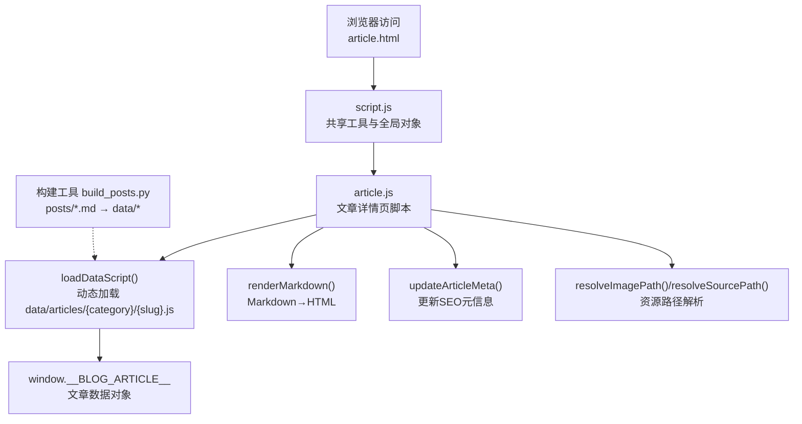
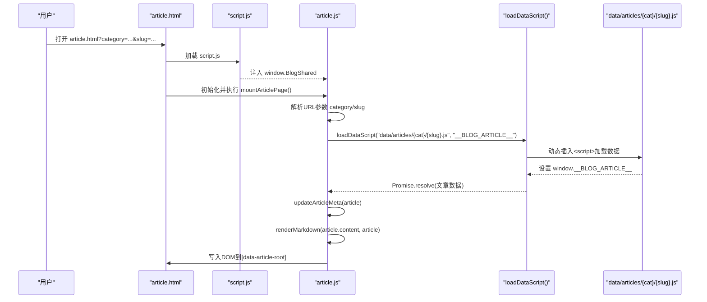
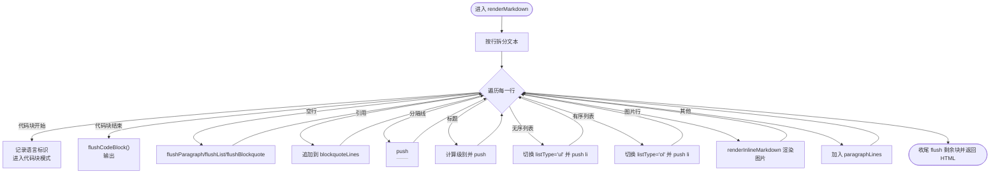
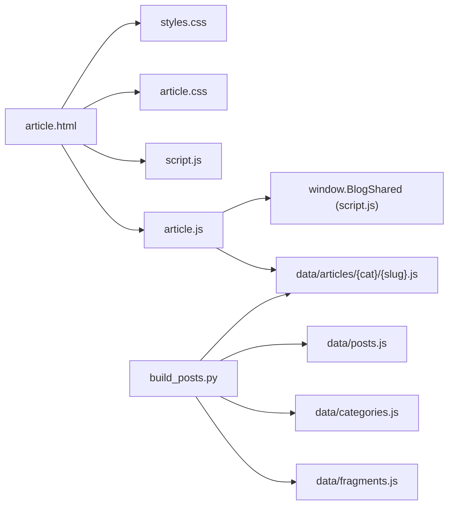

# 文章详情渲染器

<cite>
**本文引用的文件**   
- [article.js](file://article.js)
- [article.html](file://article.html)
- [article.css](file://article.css)
- [script.js](file://script.js)
- [data/posts.js](file://data/posts.js)
- [data/categories.js](file://data/categories.js)
- [data/fragments.js](file://data/fragments.js)
- [data/articles/default/about-site.js](file://data/articles/default/about-site.js)
- [data/articles/works/Radiator.js](file://data/articles/works/Radiator.js)
- [posts/default/about-site.md](file://posts/default/about-site.md)
- [tools/build_posts.py](file://tools/build_posts.py)
</cite>

## 目录
1. [简介](#简介)
2. [项目结构](#项目结构)
3. [核心组件](#核心组件)
4. [架构总览](#架构总览)
5. [详细组件分析](#详细组件分析)
6. [依赖关系分析](#依赖关系分析)
7. [性能考虑](#性能考虑)
8. [故障排除指南](#故障排除指南)
9. [结论](#结论)
10. [附录](#附录)

## 简介
本技术文档聚焦“文章详情渲染器”，围绕以下目标展开：
- URL 参数解析机制（category、slug）的提取与校验
- Markdown 内容渲染引擎 renderMarkdown() 的实现细节，包括自定义语法扩展、代码块处理、链接与图片处理
- 文章元数据处理流程（标题、日期、分类、标签等 SEO 信息动态设置）
- 图片资源处理机制（封面图、相对路径解析、错误处理）
- 代码块渲染功能（语言识别、行号显示、复制按钮实现现状与建议）
- 文章内导航生成逻辑（目录树构建与锚点链接）
- 性能优化策略（内容分片加载、内存管理）
- 常见问题调试方法与故障排除

## 项目结构
该博客采用“静态数据 + 前端渲染”的架构。构建期将 Markdown 源文件编译为 JS 数据模块；运行期由 article.js 根据 URL 参数动态加载对应文章数据并渲染页面。



图表来源
- [article.js:1-346](file://article.js#L1-L346)
- [script.js:12-37](file://script.js#L12-L37)
- [tools/build_posts.py:380-414](file://tools/build_posts.py#L380-L414)

章节来源
- [article.html:1-29](file://article.html#L1-L29)
- [article.js:1-346](file://article.js#L1-L346)
- [script.js:1-701](file://script.js#L1-L701)
- [tools/build_posts.py:1-414](file://tools/build_posts.py#L1-L414)

## 核心组件
- 共享工具层（script.js）
  - 提供 loadDataScript、escapeHtml、sanitizeSegment、normalizePath、isSpecialUrl、resolveAssetPath 等基础能力，并通过 window.BlogShared 暴露给 article.js 使用。
- 文章详情页（article.js）
  - 负责 URL 参数解析、文章数据加载、Markdown 渲染、元信息更新、资源路径解析与 DOM 渲染。
- 构建工具（build_posts.py）
  - 扫描 posts 目录下的 Markdown，解析 Front Matter 与正文，生成 data/posts.js、data/categories.js、data/fragments.js 以及 data/articles/{category}/{slug}.js 等产物。

章节来源
- [script.js:128-195](file://script.js#L128-L195)
- [article.js:26-41](file://article.js#L26-L41)
- [tools/build_posts.py:146-197](file://tools/build_posts.py#L146-L197)

## 架构总览
文章详情的运行时流程如下：



图表来源
- [article.js:322-340](file://article.js#L322-L340)
- [script.js:12-37](file://script.js#L12-L37)

## 详细组件分析

### URL 参数解析与验证
- 参数提取
  - 通过 new URL(window.location.href).searchParams.get("category") 与 get("slug") 获取参数。
- 安全校验
  - 使用 sanitizeSegment 对 category 和 slug 进行清洗，仅保留字母数字、下划线与连字符，去除首尾空白。
- 数据加载
  - 调用 loadDataScript 动态加载 data/articles/{safeCategory}/{safeSlug}.js，并以 __BLOG_ARTICLE__ 作为全局变量名，同时用 isValid 校验其是否为非空对象且非数组。
- 失败处理
  - 若缺少参数或加载失败，渲染占位提示。

章节来源
- [article.js:322-340](file://article.js#L322-L340)
- [article.js:26-41](file://article.js#L26-L41)
- [script.js:138-140](file://script.js#L138-L140)
- [script.js:12-37](file://script.js#L12-L37)

### Markdown 渲染引擎 renderMarkdown()
整体思路：逐行扫描 Markdown 文本，维护段落、列表、引用、代码块等状态，遇到边界时 flush 输出 HTML。

- 支持的语法
  - 标题 h1-h6
  - 无序列表（-、*、+）
  - 有序列表（数字.）
  - 引用块（>）
  - 分隔线（---、***、___）
  - 行内代码（反引号）、加粗（**、__）、斜体（*、_）、删除线（~~）
  - 图片 
  - 链接 [label](href)
- 代码块处理
  - 以 ``` 开始/结束，支持在首行指定语言标识（如 ```js），会输出 class="language-xxx" 以便外部高亮库匹配。
  - 当前未内置行号与复制按钮，但已预留 language-* 类名供后续集成。
- 链接与图片处理
  - 链接：若 href 以 .md 结尾，则转换为 article.html?category=...&slug=... 的内部路由；否则视为普通资源路径，交由 resolveSourcePath 解析。
  - 图片：统一走 resolveImagePath，结合 article.imageDir 或 sourceDir 解析相对路径。
- 行内渲染
  - renderInlineMarkdown 负责转义、图片、链接、行内样式转换。
- 复杂度
  - 时间复杂度 O(n)，n 为行数；空间复杂度 O(n) 用于累积 HTML 片段。



图表来源
- [article.js:96-266](file://article.js#L96-L266)

章节来源
- [article.js:65-94](file://article.js#L65-L94)
- [article.js:96-266](file://article.js#L96-L266)

### 文章元数据处理流程（SEO）
- 标题与描述
  - 动态设置 document.title 为 “{title} | 五六七”。
  - 查找 meta[name="description"]，优先使用 article.description，其次 fallback 至 excerpt、summary、title。
- 展示信息
  - 渲染分类、日期、字数、阅读时长、标签、封面图等。
- 数据来源
  - 构建期从 Markdown Front Matter 解析得到 title、excerpt、summary、description、tags、cover、date 等字段，并写入 data/articles/{category}/{slug}.js。

章节来源
- [article.js:268-278](file://article.js#L268-L278)
- [article.js:280-320](file://article.js#L280-L320)
- [tools/build_posts.py:146-197](file://tools/build_posts.py#L146-L197)
- [data/articles/default/about-site.js:1-33](file://data/articles/default/about-site.js#L1-L33)

### 图片资源处理机制
- 封面图
  - 若 article.cover 存在，则通过 resolveImagePath 解析后渲染 img 元素。
- 正文图片
  - 在 renderInlineMarkdown 中匹配 ，同样走 resolveImagePath。
- 路径解析规则（resolveAssetPath）
  - 特殊 URL（协议开头、绝对路径、哈希）直接返回。
  - assets/data/posts/image 开头的路径直接规范化。
  - *.html 链接保持原样。
  - 其余情况拼接 baseDir（优先 imageDir，其次 sourceDir）。
- 错误处理
  - 若图片路径为空，返回空字符串；渲染层不会输出无效 src。
  - 网络加载失败由浏览器默认行为处理，可在 CSS 中补充占位样式。

章节来源
- [article.js:43-49](file://article.js#L43-L49)
- [article.js:65-94](file://article.js#L65-L94)
- [script.js:168-186](file://script.js#L168-L186)

### 代码块渲染功能现状与扩展建议
- 现状
  - 支持语言标识（class="language-xxx"），便于第三方高亮库（如 Prism、Highlight.js）自动识别。
  - 未内置行号与复制按钮。
- 扩展建议
  - 行号：在 flushCodeBlock 前对 codeLines 编号，包裹 <span class="line-number">...</span>。
  - 复制按钮：在 pre 外层添加一个按钮，点击时读取 innerText 并调用 Clipboard API。
  - 高亮：引入 Prism/Highlight.js，并在渲染完成后触发 highlightAll。

章节来源
- [article.js:143-157](file://article.js#L143-L157)

### 文章内导航生成逻辑（目录树与锚点）
- 现状
  - 当前 renderMarkdown 仅生成 <hN> 节点，未自动生成目录树与锚点 ID。
- 建议方案
  - 在渲染标题时，为每个 <hN> 生成唯一 id（基于标题文本去重），并在侧边栏构建目录树，点击跳转。
  - 可使用 IntersectionObserver 监听滚动位置，高亮当前目录项。

章节来源
- [article.js:206-215](file://article.js#L206-L215)

### 构建流程与数据模型
- 输入
  - posts/{category}/*.md，包含 Front Matter 与正文。
- 处理
  - 解析 Front Matter，生成摘要、字数、阅读时长、路径、目录等信息。
  - 生成 data/posts.js、data/categories.js、data/fragments.js 以及 data/articles/{category}/{slug}.js。
- 输出
  - 文章数据对象包含 id、title、excerpt、summary、description、category、folder、date、tags、readingTime、wordCount、cover、path、sourceDir、imageDir、content 等字段。

章节来源
- [tools/build_posts.py:146-197](file://tools/build_posts.py#L146-L197)
- [tools/build_posts.py:380-414](file://tools/build_posts.py#L380-L414)
- [data/posts.js:1-95](file://data/posts.js#L1-L95)
- [data/categories.js:1-19](file://data/categories.js#L1-L19)
- [data/fragments.js:1-14](file://data/fragments.js#L1-L14)

## 依赖关系分析
- 页面入口
  - article.html 引入 styles.css、article.css、script.js、article.js。
- 运行时依赖
  - article.js 依赖 script.js 提供的 window.BlogShared。
  - 文章数据通过 loadDataScript 动态加载 data/articles/{category}/{slug}.js。
- 构建期依赖
  - tools/build_posts.py 负责生成所有 data/* 与 data/articles/* 产物。



图表来源
- [article.html:1-29](file://article.html#L1-L29)
- [script.js:188-195](file://script.js#L188-L195)
- [tools/build_posts.py:380-414](file://tools/build_posts.py#L380-L414)

章节来源
- [article.html:1-29](file://article.html#L1-L29)
- [script.js:188-195](file://script.js#L188-L195)
- [tools/build_posts.py:380-414](file://tools/build_posts.py#L380-L414)

## 性能考虑
- 内容分片加载
  - 当前 article.js 一次性加载整篇文章数据并渲染，适合中小型文章。对于超长文章，可考虑分页或按需加载（例如按章节懒加载）。
- 内存管理
  - 避免在循环中创建大量中间字符串，尽量复用数组与模板。
  - 清理不再使用的 DOM 引用，防止内存泄漏。
- 渲染优化
  - 使用 DocumentFragment 批量插入 DOM。
  - 对长列表（如标签、目录）使用虚拟滚动。
- 资源加载
  - 图片使用 loading="lazy"（碎片页已有示例），封面图可按需延迟加载。
  - 利用缓存版本参数（v=Date.now()）避免旧缓存影响。

[本节为通用指导，不直接分析具体文件]

## 故障排除指南
- 页面提示“基础脚本未加载，无法渲染文章”
  - 检查 script.js 是否成功加载，确认 window.BlogShared 是否存在。
- 页面提示“缺少文章参数，无法加载内容”
  - 检查 URL 是否包含 category 与 slug 参数，并确保值经过 sanitizeSegment 后非空。
- 页面提示“文章加载失败，请确认数据已经重新生成”
  - 确认 data/articles/{category}/{slug}.js 是否存在且包含 window.__BLOG_ARTICLE__。
  - 运行构建工具重新生成数据。
- 图片不显示
  - 检查 cover 与正文图片路径是否符合 resolveAssetPath 规则，确认 imageDir/sourceDir 配置正确。
- 链接跳转异常
  - 内部 .md 链接会被转换为 article.html?category=&slug= 形式，确保目标文章存在。
- 代码块无高亮
  - 当前仅输出 language-* 类名，需引入高亮库并在渲染后触发高亮。

章节来源
- [article.js:13-16](file://article.js#L13-L16)
- [article.js:322-340](file://article.js#L322-L340)
- [script.js:168-186](file://script.js#L168-L186)
- [tools/build_posts.py:380-414](file://tools/build_posts.py#L380-L414)

## 结论
文章详情渲染器通过“构建期生成数据 + 运行期动态加载与渲染”的方式，实现了轻量、可扩展的博客文章展示。其核心优势在于：
- 清晰的职责划分：共享工具、文章渲染、构建工具各司其职
- 灵活的 Markdown 扩展：通过语言标识与行内语法支持，易于对接第三方高亮与交互
- 稳健的路径解析与安全校验：保障资源与路由的正确性与安全性

未来可在代码块增强（行号、复制）、目录导航、长文分片加载等方面进一步优化体验与性能。

[本节为总结性内容，不直接分析具体文件]

## 附录

### 关键函数与路径参考
- URL 参数解析与加载
  - [mountArticlePage:322-340](file://article.js#L322-L340)
  - [loadArticle:26-41](file://article.js#L26-L41)
- Markdown 渲染
  - [renderMarkdown:96-266](file://article.js#L96-L266)
  - [renderInlineMarkdown:65-94](file://article.js#L65-L94)
- 资源路径解析
  - [resolveAssetPath:168-186](file://script.js#L168-L186)
  - [resolveImagePath:47-49](file://article.js#L47-L49)
  - [resolveSourcePath:43-45](file://article.js#L43-L45)
- 元信息更新
  - [updateArticleMeta:268-278](file://article.js#L268-L278)
- 构建工具
  - [build_post_record:146-197](file://tools/build_posts.py#L146-L197)
  - [main:380-414](file://tools/build_posts.py#L380-L414)

章节来源
- [article.js:26-41](file://article.js#L26-L41)
- [article.js:65-94](file://article.js#L65-L94)
- [article.js:96-266](file://article.js#L96-L266)
- [article.js:268-278](file://article.js#L268-L278)
- [script.js:168-186](file://script.js#L168-L186)
- [tools/build_posts.py:146-197](file://tools/build_posts.py#L146-L197)
- [tools/build_posts.py:380-414](file://tools/build_posts.py#L380-L414)