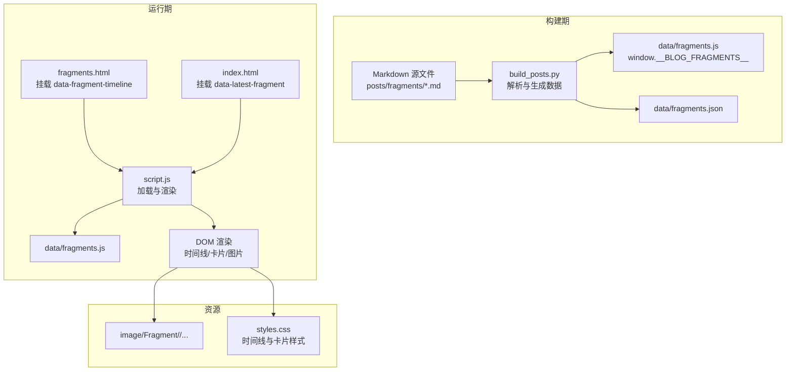
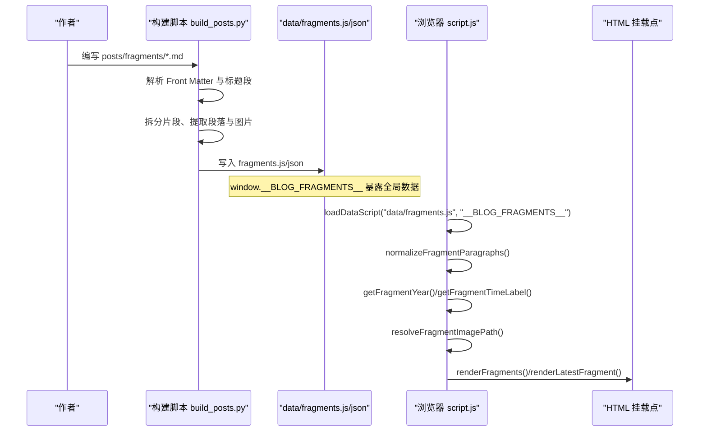
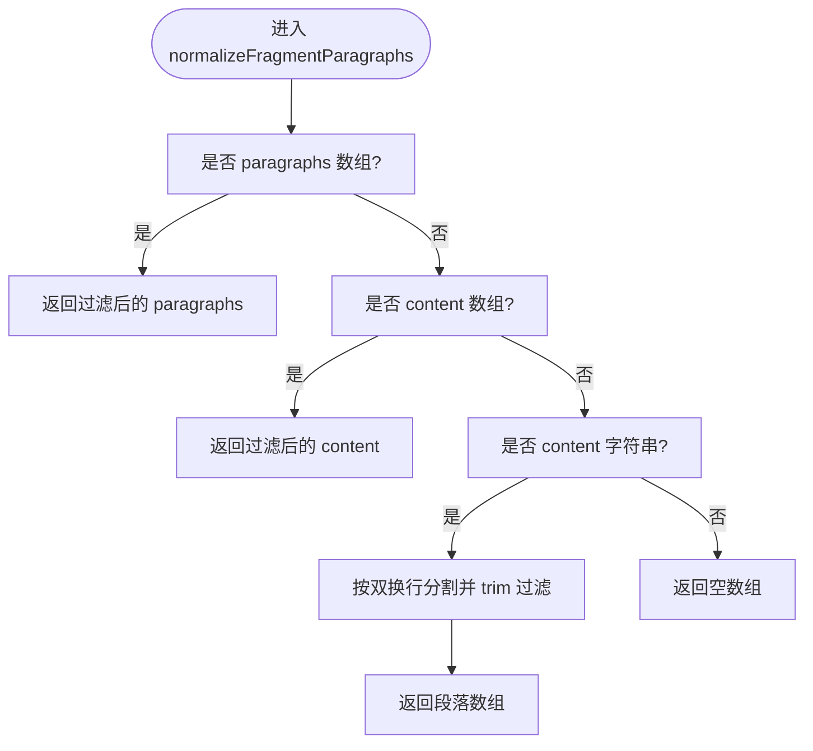
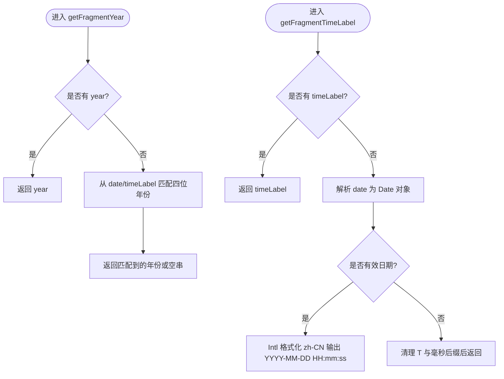
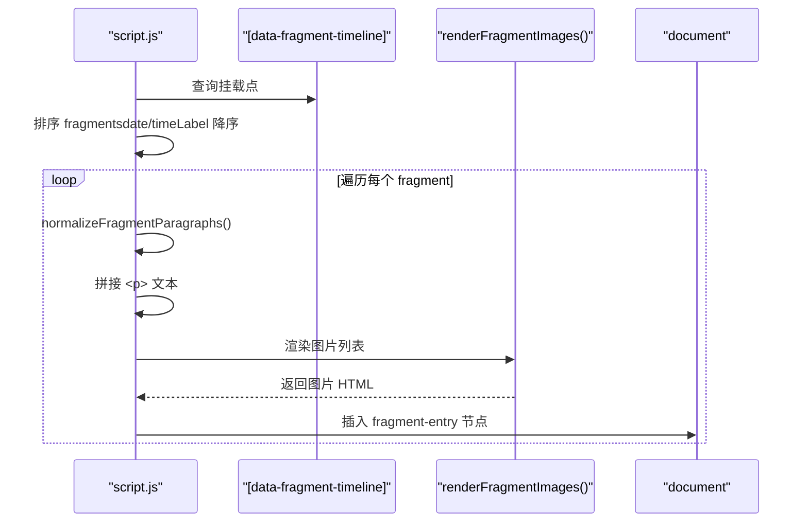
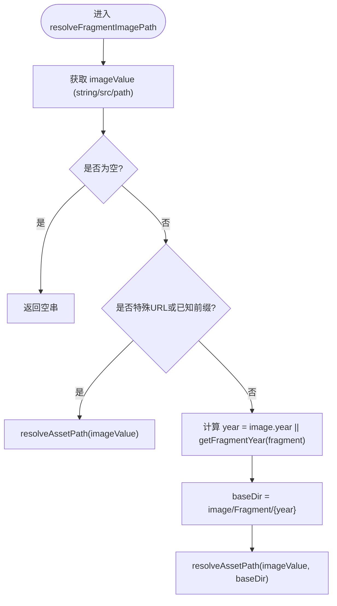
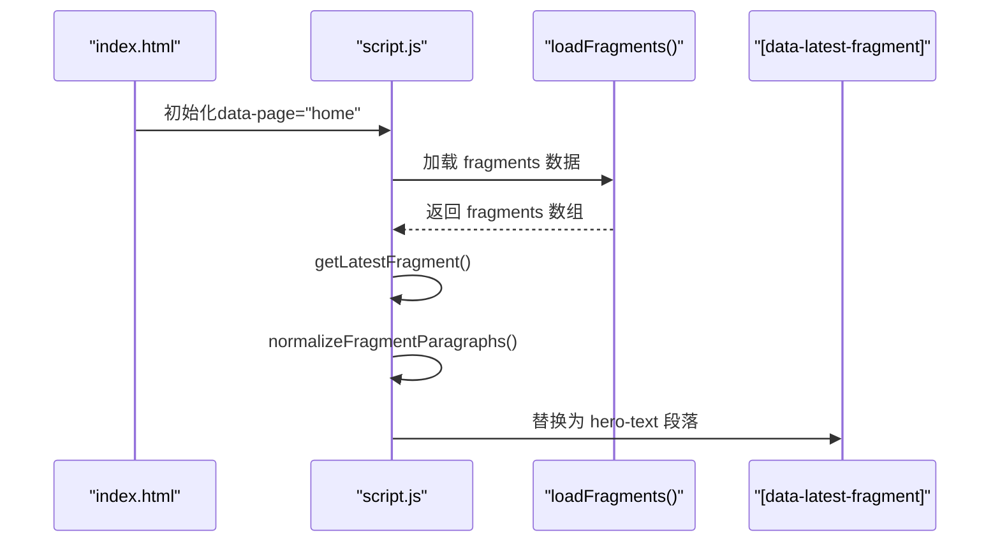
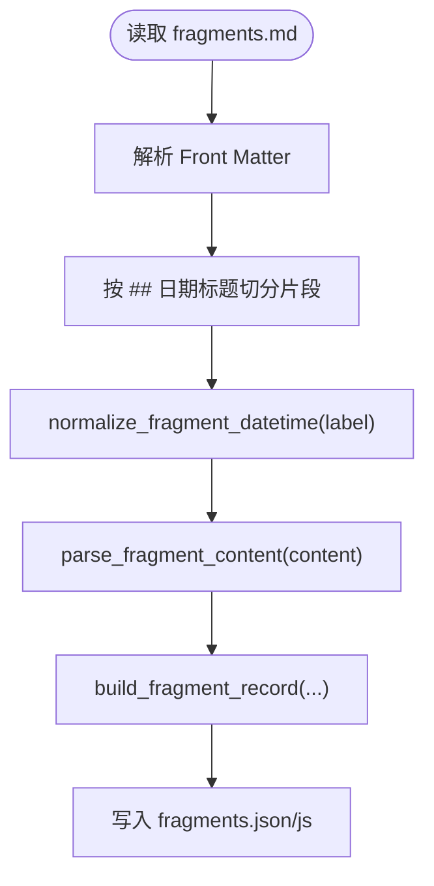
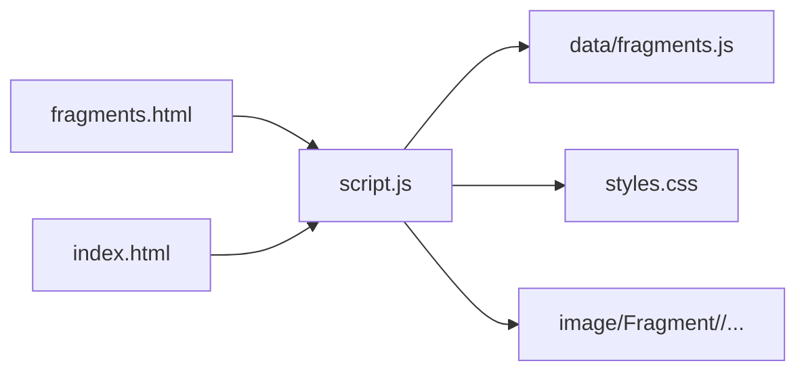

# 碎片时间线系统

<cite>
**本文引用的文件**   
- [script.js](file://script.js)
- [fragments.html](file://fragments.html)
- [index.html](file://index.html)
- [data/fragments.js](file://data/fragments.js)
- [data/fragments.json](file://data/fragments.json)
- [posts/fragments/fragments.md](file://posts/fragments/fragments.md)
- [tools/build_posts.py](file://tools/build_posts.py)
- [styles.css](file://styles.css)
</cite>

## 目录
1. [简介](#简介)
2. [项目结构](#项目结构)
3. [核心组件](#核心组件)
4. [架构总览](#架构总览)
5. [详细组件分析](#详细组件分析)
6. [依赖关系分析](#依赖关系分析)
7. [性能考虑](#性能考虑)
8. [故障排查指南](#故障排查指南)
9. [结论](#结论)
10. [附录：最佳实践与数据规范](#附录：最佳实践与数据规范)

## 简介
本技术文档围绕“碎片时间线系统”的实现，系统性阐述以下方面：
- 碎片数据的标准化处理流程，包括 normalizeFragmentParagraphs() 对多种内容格式的支持
- 时间线排序算法 getFragmentYear() 和 getFragmentTimeLabel() 的实现细节（日期解析、格式化与本地化）
- 碎片卡片渲染逻辑 renderFragments() 的工作机制（时间戳显示、段落处理、媒体嵌入）
- 图片处理系统 resolveFragmentImagePath() 的路径解析规则、年份推断与懒加载优化
- 最新碎片展示功能 renderLatestFragment() 在首页英雄区域的动态更新
- 碎片数据结构设计（paragraphs、content、images 等字段的灵活支持）
- 提供碎片内容的最佳实践与性能优化建议

## 项目结构
该系统的核心由三部分构成：
- 构建期：Python 脚本将 Markdown 源文件解析为结构化 JSON/JS 数据
- 运行期：浏览器端脚本负责加载数据、标准化、排序与渲染
- 页面容器：HTML 提供挂载点与样式

图表来源
- [tools/build_posts.py:285-320](file://tools/build_posts.py#L285-L320)
- [script.js:55-61](file://script.js#L55-L61)
- [script.js:600-635](file://script.js#L600-L635)
- [fragments.html:14-17](file://fragments.html#L14-L17)
- [index.html:18-34](file://index.html#L18-L34)
- [styles.css:882-949](file://styles.css#L882-L949)

章节来源
- [tools/build_posts.py:285-320](file://tools/build_posts.py#L285-L320)
- [script.js:55-61](file://script.js#L55-L61)
- [fragments.html:14-17](file://fragments.html#L14-L17)
- [index.html:18-34](file://index.html#L18-L34)
- [styles.css:882-949](file://styles.css#L882-L949)

## 核心组件
- 数据加载器：loadDataScript / loadFragments，动态注入并校验 window.__BLOG_FRAGMENTS__
- 标准化器：normalizeFragmentParagraphs，兼容 paragraphs、content 数组或字符串
- 时间处理器：getFragmentYear、getFragmentTimeLabel，负责年份提取与时间标签格式化
- 图片处理器：resolveFragmentImagePath、renderFragmentImages，路径解析与懒加载
- 渲染器：renderFragments、renderLatestFragment，时间线卡片与首页英雄区动态更新
- 工具函数：escapeHtml、sanitizeSegment、normalizePath、isSpecialUrl、resolveAssetPath

章节来源
- [script.js:12-37](file://script.js#L12-L37)
- [script.js:55-61](file://script.js#L55-L61)
- [script.js:532-549](file://script.js#L532-L549)
- [script.js:497-530](file://script.js#L497-L530)
- [script.js:551-598](file://script.js#L551-L598)
- [script.js:600-664](file://script.js#L600-L664)
- [script.js:129-186](file://script.js#L129-L186)

## 架构总览
从 Markdown 到最终页面的端到端流程如下：

图表来源
- [tools/build_posts.py:230-297](file://tools/build_posts.py#L230-L297)
- [tools/build_posts.py:300-320](file://tools/build_posts.py#L300-L320)
- [script.js:55-61](file://script.js#L55-L61)
- [script.js:532-549](file://script.js#L532-L549)
- [script.js:497-530](file://script.js#L497-L530)
- [script.js:551-598](file://script.js#L551-L598)
- [script.js:600-664](file://script.js#L600-L664)

## 详细组件分析

### 碎片数据标准化：normalizeFragmentParagraphs()
- 目标：统一输入为段落数组，便于后续渲染
- 支持格式：
  - fragment.paragraphs 为数组时直接过滤空项
  - fragment.content 为数组时直接过滤空项
  - fragment.content 为字符串时按双换行分割并 trim 过滤
  - 其他情况返回空数组
- 复杂度：O(n)，n 为段落数量或字符串长度
- 健壮性：对空值、非字符串类型进行安全处理

图表来源
- [script.js:532-549](file://script.js#L532-L549)

章节来源
- [script.js:532-549](file://script.js#L532-L549)

### 时间线排序与时间标签：getFragmentYear() 与 getFragmentTimeLabel()
- getFragmentYear(fragment)
  - 优先使用 fragment.year
  - 否则从 date/timeLabel 中匹配四位年份
  - 用于图片路径推断与分组
- getFragmentTimeLabel(fragment)
  - 若已有 timeLabel 则直接使用
  - 否则尝试解析 date：
    - 可被 Date 构造的 ISO 字符串：使用 Intl.DateTimeFormat("zh-CN") 格式化
    - 不可解析：回退为原始字符串清理 T 与毫秒后缀
  - 输出形如 YYYY-MM-DD HH:mm:ss

图表来源
- [script.js:497-501](file://script.js#L497-L501)
- [script.js:503-530](file://script.js#L503-L530)

章节来源
- [script.js:497-501](file://script.js#L497-L501)
- [script.js:503-530](file://script.js#L503-L530)

### 碎片卡片渲染：renderFragments()
- 挂载点：[data-fragment-timeline]
- 排序：按 date 或 timeLabel 降序（新在前）
- 渲染步骤：
  - 标准化段落
  - 将每个段落包裹为 
 并转义
  - 渲染图片区域（见下文）
  - 组装 <article class="fragment-entry"> + <time> + 

- 空状态：无数据时显示提示文案

图表来源
- [script.js:600-635](file://script.js#L600-L635)
- [script.js:565-598](file://script.js#L565-L598)

章节来源
- [script.js:600-635](file://script.js#L600-L635)
- [script.js:565-598](file://script.js#L565-L598)

### 图片处理系统：resolveFragmentImagePath() 与 renderFragmentImages()
- 路径解析规则：
  - 若 imageValue 为空，返回空串
  - 特殊 URL（协议开头、绝对路径、锚点）或已包含 assets/data/posts/image 前缀，直接走 resolveAssetPath
  - 否则根据年份推断 baseDir：image/Fragment/{year}
    - 优先使用 image.year
    - 否则使用 getFragmentYear(fragment)
- 懒加载优化：
  - 所有  均设置 loading="lazy"
- 图注与替代文本：
  - alt 优先级：image.alt > fragment.imageAlt > 默认文案
  - caption 来自 image.caption（字符串形式图片不携带 caption）

图表来源
- [script.js:551-563](file://script.js#L551-L563)
- [script.js:168-186](file://script.js#L168-L186)
- [script.js:497-501](file://script.js#L497-L501)

章节来源
- [script.js:551-563](file://script.js#L551-L563)
- [script.js:168-186](file://script.js#L168-L186)
- [script.js:497-501](file://script.js#L497-L501)

### 最新碎片展示：renderLatestFragment()
- 挂载点：[data-latest-fragment]（首页英雄区域）
- 逻辑：
  - 取 fragments 中最新一条（同排序规则）
  - 标准化段落并渲染为多个 

  - 若无段落则保持原占位内容不变
- 触发时机：当页面 data-page="home" 时异步加载 fragments 并渲染

图表来源
- [script.js:637-664](file://script.js#L637-L664)
- [script.js:677-691](file://script.js#L677-L691)
- [index.html:18-34](file://index.html#L18-L34)

章节来源
- [script.js:637-664](file://script.js#L637-L664)
- [script.js:677-691](file://script.js#L677-L691)
- [index.html:18-34](file://index.html#L18-L34)

### 构建期数据处理：build_posts.py 中的碎片解析
- 关键流程：
  - 读取 posts/fragments/*.md
  - 解析 Front Matter 与正文
  - 按 ## 日期标题切分片段
  - 规范化日期：
    - 支持 YYYY-MM-DD、YYYY-MM-DD HH:mm:ss、ISO 带时区
    - 生成 date（ISO+08:00）、timeLabel（本地可读）、year
  - 内容解析：
    - 提取段落（去除 Markdown 语法）
    - 提取图片（alt/caption/src）
  - 输出：
    - data/fragments.json
    - data/fragments.js（window.__BLOG_FRAGMENTS__）

图表来源
- [tools/build_posts.py:230-297](file://tools/build_posts.py#L230-L297)
- [tools/build_posts.py:300-320](file://tools/build_posts.py#L300-L320)

章节来源
- [tools/build_posts.py:230-297](file://tools/build_posts.py#L230-L297)
- [tools/build_posts.py:300-320](file://tools/build_posts.py#L300-L320)

## 依赖关系分析
- 模块耦合
  - script.js 依赖 data/fragments.js 提供的 window.__BLOG_FRAGMENTS__
  - fragments.html 与 index.html 通过 data-* 属性作为渲染挂载点
  - styles.css 提供时间线与卡片视觉样式
- 外部依赖
  - 浏览器原生 API：Date、Intl.DateTimeFormat、Promise、DOM API
  - 无第三方库依赖，轻量且可移植性强

图表来源
- [fragments.html:14-17](file://fragments.html#L14-L17)
- [index.html:18-34](file://index.html#L18-L34)
- [script.js:55-61](file://script.js#L55-L61)
- [styles.css:882-949](file://styles.css#L882-L949)

章节来源
- [fragments.html:14-17](file://fragments.html#L14-L17)
- [index.html:18-34](file://index.html#L18-L34)
- [script.js:55-61](file://script.js#L55-L61)
- [styles.css:882-949](file://styles.css#L882-L949)

## 性能考虑
- 懒加载：所有图片使用 loading="lazy"，减少首屏带宽与渲染压力
- 最小化 DOM 操作：一次性 innerHTML 批量插入，避免频繁重排
- 文本转义：escapeHtml 防止 XSS 同时避免额外解析开销
- 本地化格式化：Intl.DateTimeFormat 仅对必要条目执行，避免重复计算
- 静态资源缓存：HTML 引入的 script.js 与 CSS 带有版本参数，利于缓存命中
- 图片路径推断：基于年份目录组织，CDN/缓存友好

[本节为通用指导，无需源码引用]

## 故障排查指南
- 常见问题
  - 未显示任何碎片：检查 data/fragments.js 是否正确加载，window.__BLOG_FRAGMENTS__ 是否存在
  - 时间显示异常：确认 fragment.date 或 timeLabel 是否为合法日期字符串；无效时将回退为原始字符串清理
  - 图片无法加载：确认 resolveFragmentImagePath 计算的 baseDir 是否正确，图片实际位于 image/Fragment/{year}/ 下
  - 首页英雄区未更新：确保 index.html 中存在 [data-latest-fragment] 挂载点，且页面 data-page="home"
- 定位方法
  - 控制台查看 Promise 错误日志（加载失败会抛出错误）
  - 在浏览器开发者工具中检查 DOM 挂载点是否存在
  - 验证 data/fragments.js 的 JSON 结构与字段完整性

章节来源
- [script.js:666-701](file://script.js#L666-L701)
- [script.js:600-635](file://script.js#L600-L635)
- [script.js:551-563](file://script.js#L551-L563)
- [index.html:18-34](file://index.html#L18-L34)

## 结论
碎片时间线系统以“构建期解析 + 运行期渲染”的轻量架构实现。通过标准化的段落与图片处理、灵活的日期解析与本地化、以及安全的渲染策略，系统在易用性与性能之间取得良好平衡。遵循本文的数据规范与最佳实践，可进一步提升稳定性与可维护性。

[本节为总结，无需源码引用]

## 附录：最佳实践与数据规范

### 推荐的数据结构
- 基础字段
  - id：唯一标识（可由构建期自动生成）
  - date：ISO 8601 字符串（含时区），例如 2026-07-03T16:44:24+08:00
  - timeLabel：本地化可读时间，例如 2026-07-03 16:44:24
  - year：四位年份，用于图片路径推断
  - sourcePath：Markdown 源文件相对路径
- 内容字段（二选一或两者并存）
  - paragraphs：字符串数组，每段为一个元素
  - content：字符串或字符串数组；若为字符串，将按双换行分割为段落
- 图片字段
  - images：数组，元素可为字符串或对象
    - 字符串：表示图片路径，alt 使用 fragment.imageAlt 或默认文案
    - 对象：{ src, alt?, caption?, year? }
      - src：图片路径
      - alt：替代文本
      - caption：图注
      - year：覆盖默认年份推断

章节来源
- [data/fragments.js:1-14](file://data/fragments.js#L1-L14)
- [data/fragments.json:1-14](file://data/fragments.json#L1-L14)
- [script.js:532-549](file://script.js#L532-L549)
- [script.js:551-563](file://script.js#L551-L563)

### 构建期写作规范
- 使用 ## 日期标题划分片段，日期格式支持：
  - YYYY-MM-DD
  - YYYY-MM-DD HH:mm:ss
  - ISO 带时区（构建期会转换为 +08:00）
- 图片使用标准 Markdown 语法，alt 将作为 caption 自动填充
- 如需自定义图片年份，可在构建产物中为 image 指定 year 字段

章节来源
- [tools/build_posts.py:230-297](file://tools/build_posts.py#L230-L297)
- [posts/fragments/fragments.md:1-11](file://posts/fragments/fragments.md#L1-L11)

### 前端渲染注意事项
- 确保 HTML 中存在正确的挂载点：
  - fragments.html：[data-fragment-timeline]
  - index.html：[data-latest-fragment]
- 图片路径建议使用 image/Fragment/{year}/ 目录组织，便于缓存与 CDN 管理
- 避免在段落中插入未转义的 HTML，系统会自动转义文本内容

章节来源
- [fragments.html:14-17](file://fragments.html#L14-L17)
- [index.html:18-34](file://index.html#L18-L34)
- [script.js:600-635](file://script.js#L600-L635)
- [script.js:129-136](file://script.js#L129-L136)