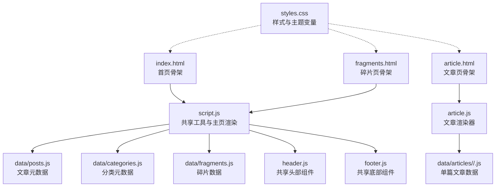
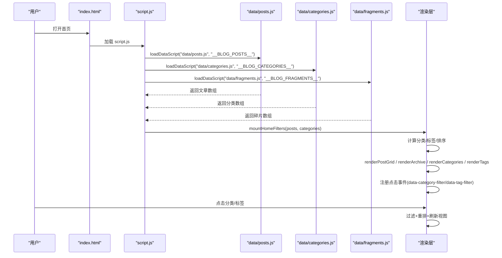
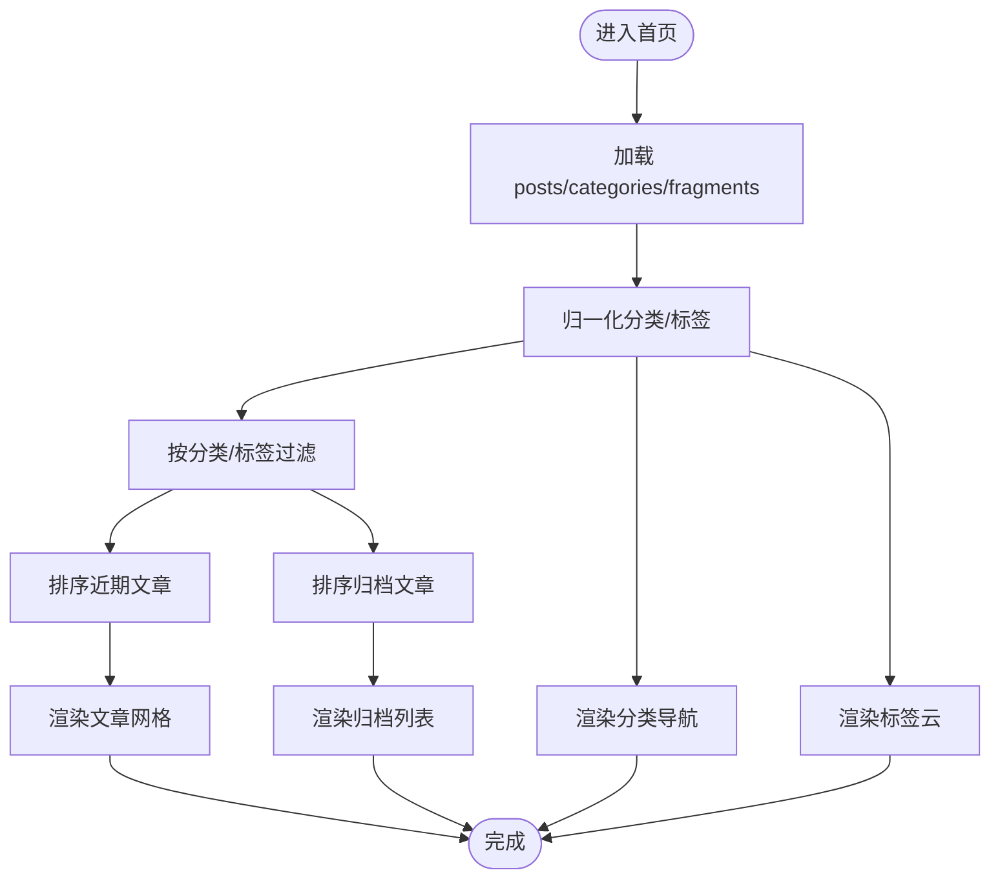
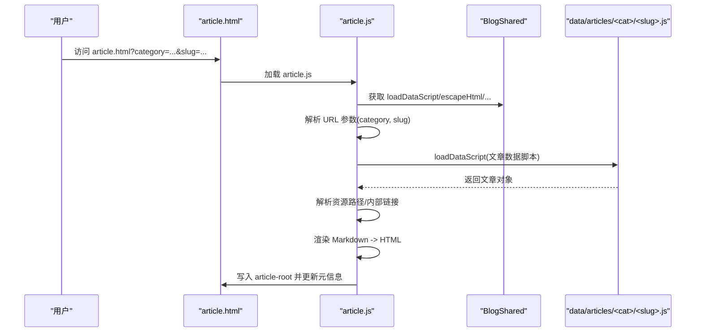
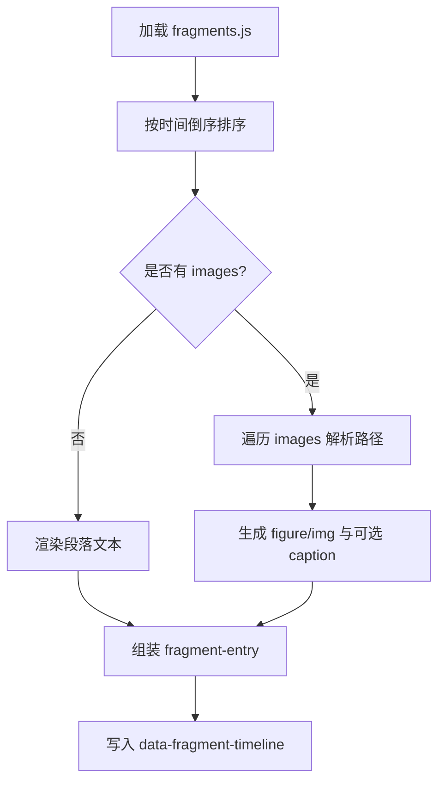
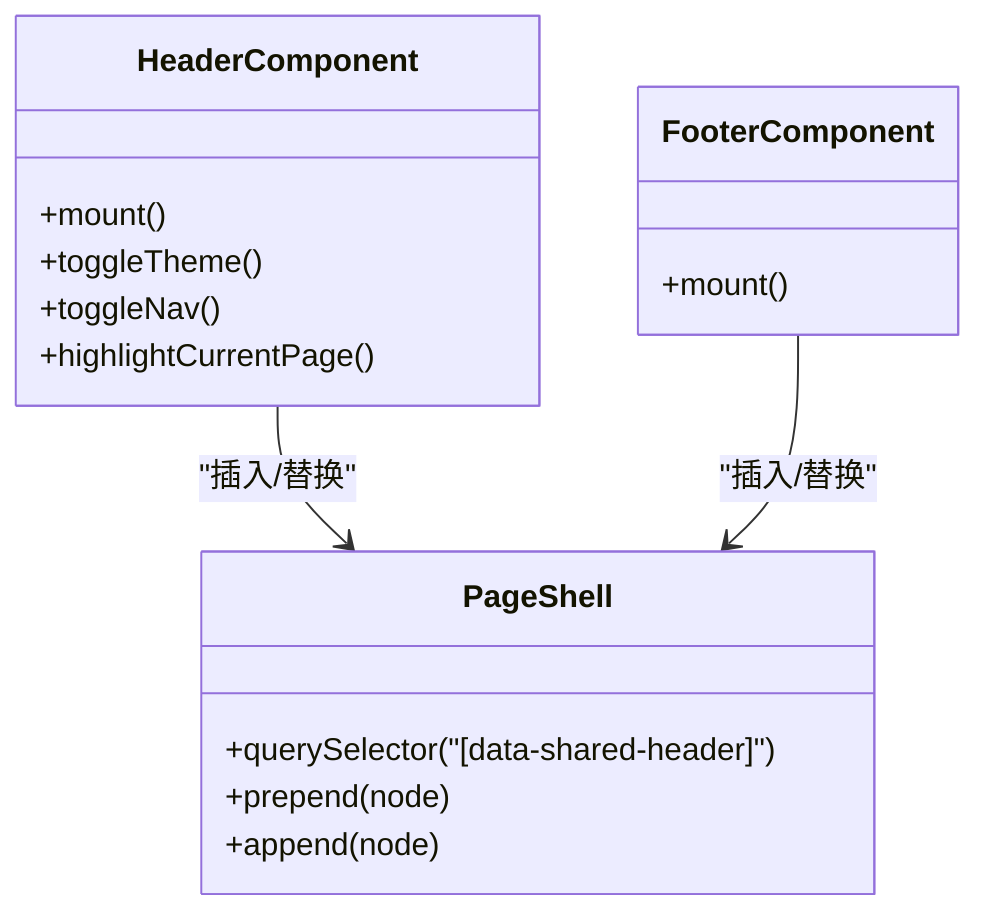
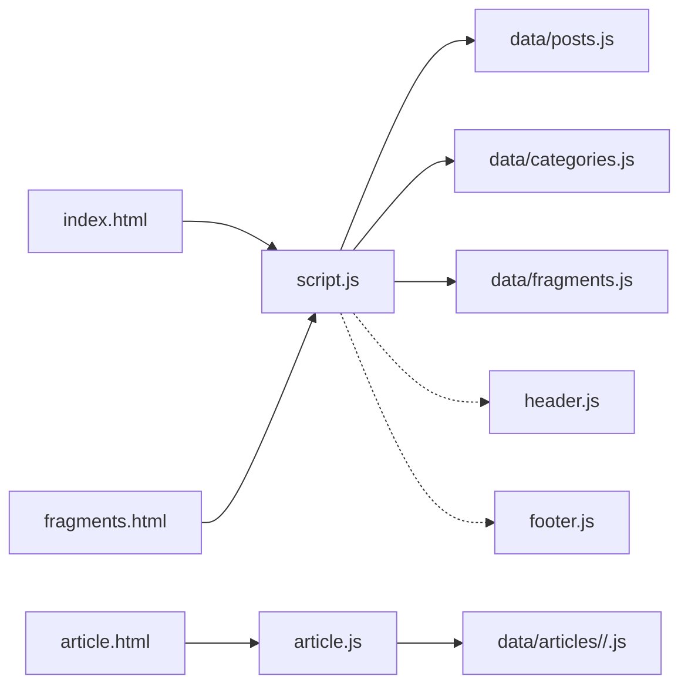

# 页面渲染引擎

<cite>
**本文引用的文件**   
- [index.html](file://index.html)
- [script.js](file://script.js)
- [article.html](file://article.html)
- [article.js](file://article.js)
- [header.js](file://header.js)
- [footer.js](file://footer.js)
- [fragments.html](file://fragments.html)
- [data/posts.js](file://data/posts.js)
- [data/categories.js](file://data/categories.js)
- [data/fragments.js](file://data/fragments.js)
- [data/articles/default/about-site.js](file://data/articles/default/about-site.js)
- [data/articles/works/Radiator.js](file://data/articles/works/Radiator.js)
- [styles.css](file://styles.css)
</cite>

## 目录
1. [简介](#简介)
2. [项目结构](#项目结构)
3. [核心组件](#核心组件)
4. [架构总览](#架构总览)
5. [详细组件分析](#详细组件分析)
6. [依赖关系分析](#依赖关系分析)
7. [性能考量](#性能考量)
8. [故障排查指南](#故障排查指南)
9. [结论](#结论)
10. [附录](#附录)

## 简介
本技术文档面向博客页面的前端渲染引擎，聚焦于基于 JavaScript 的动态页面渲染机制。内容涵盖：
- DOM 操作模式与事件驱动架构
- 数据加载与绑定实现（通过动态脚本注入全局数据）
- 主页渲染逻辑（文章网格、归档列表、分类导航的动态更新）
- 文章详情页渲染流程（URL 参数解析到内容展示）
- 碎片时间线实现（排序与媒体嵌入）
- 组件化复用模式（header.js 与 footer.js）
- 性能优化建议与调试技巧

## 项目结构
仓库采用“静态 HTML + 动态 JS 渲染”的轻量架构。HTML 提供骨架与挂载点，JS 负责加载数据并渲染 DOM。数据以独立 JS 文件暴露全局变量，由运行时按需注入。

图表来源
- [index.html:1-93](file://index.html#L1-L93)
- [script.js:1-701](file://script.js#L1-L701)
- [article.html:1-29](file://article.html#L1-L29)
- [article.js:1-346](file://article.js#L1-L346)
- [header.js:1-110](file://header.js#L1-L110)
- [footer.js:1-36](file://footer.js#L1-L36)
- [fragments.html:1-23](file://fragments.html#L1-L23)
- [data/posts.js:1-95](file://data/posts.js#L1-L95)
- [data/categories.js:1-19](file://data/categories.js#L1-L19)
- [data/fragments.js:1-14](file://data/fragments.js#L1-L14)
- [data/articles/default/about-site.js:1-33](file://data/articles/default/about-site.js#L1-L33)
- [data/articles/works/Radiator.js:1-33](file://data/articles/works/Radiator.js#L1-L33)
- [styles.css:1-200](file://styles.css#L1-L200)

章节来源
- [index.html:1-93](file://index.html#L1-L93)
- [script.js:1-701](file://script.js#L1-L701)
- [article.html:1-29](file://article.html#L1-L29)
- [article.js:1-346](file://article.js#L1-L346)
- [header.js:1-110](file://header.js#L1-L110)
- [footer.js:1-36](file://footer.js#L1-L36)
- [fragments.html:1-23](file://fragments.html#L1-L23)
- [data/posts.js:1-95](file://data/posts.js#L1-L95)
- [data/categories.js:1-19](file://data/categories.js#L1-L19)
- [data/fragments.js:1-14](file://data/fragments.js#L1-L14)
- [data/articles/default/about-site.js:1-33](file://data/articles/default/about-site.js#L1-L33)
- [data/articles/works/Radiator.js:1-33](file://data/articles/works/Radiator.js#L1-L33)
- [styles.css:1-200](file://styles.css#L1-L200)

## 核心组件
- 共享工具与数据加载器（script.js）
  - 动态脚本注入：loadDataScript 通过创建 <script> 标签加载 data/*.js，并以 Promise 形式返回校验后的全局数据。
  - 路径解析与安全：escapeHtml、sanitizeSegment、normalizePath、resolveAssetPath 等工具确保输出安全与资源路径正确。
  - 共享 API：window.BlogShared 暴露通用方法供 article.js 复用。
- 主页渲染器（script.js）
  - 数据装配：loadPosts、loadCategories、loadFragments 分别加载文章、分类与碎片数据。
  - 过滤与排序：filterPosts、sortRecentPosts、sortArchivePosts、normalizeCategories、getAllTags。
  - 视图渲染：renderPostGrid、renderArchive、renderCategories、renderTags、mountHomeFilters。
  - 事件驱动：统一 click 监听，按 data-category-filter 与 data-tag-filter 触发筛选刷新。
- 文章详情页渲染器（article.js）
  - URL 解析：从 location.search 读取 category 与 slug，构造文章数据脚本路径。
  - Markdown 渲染：行级状态机解析段落、标题、列表、引用、代码块、分隔线，内联支持图片、链接、粗体、斜体、删除线、行内代码。
  - 资源解析：根据 sourceDir/imageDir 解析相对路径，自动将 .md 内部链接转换为 article.html?category=...&slug=...。
- 碎片时间线（script.js）
  - 时间线渲染：按 date/timeLabel 倒序排列，支持多段文本与图片集合，图片路径按 year 或 fragment.year 定位。
  - 首页最新片段：取最近一条片段渲染至 data-latest-fragment。
- 共享组件（header.js、footer.js）
  - 模板注入：使用 <template> 生成 DOM，优先替换 data-shared-header 占位，否则回退到现有 header/footer 或直接插入 page-shell。
  - 交互：主题切换、移动端菜单展开收起、当前页面高亮。

章节来源
- [script.js:12-37](file://script.js#L12-L37)
- [script.js:129-196](file://script.js#L129-L196)
- [script.js:205-300](file://script.js#L205-L300)
- [script.js:301-495](file://script.js#L301-L495)
- [script.js:497-664](file://script.js#L497-L664)
- [article.js:26-94](file://article.js#L26-L94)
- [article.js:96-266](file://article.js#L96-L266)
- [article.js:268-346](file://article.js#L268-L346)
- [header.js:1-110](file://header.js#L1-L110)
- [footer.js:1-36](file://footer.js#L1-L36)

## 架构总览
系统采用“骨架 HTML + 运行时渲染”的模式，数据以独立 JS 模块暴露全局对象，主脚本在页面初始化时按需加载并渲染。

图表来源
- [index.html:1-93](file://index.html#L1-L93)
- [script.js:12-37](file://script.js#L12-L37)
- [script.js:39-61](file://script.js#L39-L61)
- [script.js:448-495](file://script.js#L448-L495)

## 详细组件分析

### 主页渲染逻辑
- 数据装配与校验
  - 使用 loadDataScript 动态注入 posts、categories、fragments 三个全局数据，并通过 isValid 回调进行类型校验。
- 分类与标签归一化
  - normalizeCategories 统计各 folder 的文章数，合并显式配置与隐式发现，按 order 与名称排序。
  - getAllTags 收集所有 tag 并去重排序。
- 过滤与排序
  - filterPosts 同时支持按分类与多标签交集过滤。
  - sortRecentPosts 优先 recentOrder，其次日期；sortArchivePosts 优先 archiveOrder，再置顶，最后日期。
- 视图渲染
  - renderPostGrid 仅展示前 3 条作为“最近更新”。
  - renderArchive 渲染完整归档卡片，包含标签按钮与阅读信息。
  - renderCategories 渲染“全部 + 各分类”，带计数。
  - renderTags 渲染标签云，显示命中次数。
- 事件驱动
  - 统一 click 监听，识别 data-category-filter 与 data-tag-filter，维护 selectedCategory 与 selectedTags Set，调用 refresh 刷新所有区域。

图表来源
- [script.js:205-300](file://script.js#L205-L300)
- [script.js:301-495](file://script.js#L301-L495)

章节来源
- [script.js:205-300](file://script.js#L205-L300)
- [script.js:301-495](file://script.js#L301-L495)
- [data/posts.js:1-95](file://data/posts.js#L1-L95)
- [data/categories.js:1-19](file://data/categories.js#L1-L19)

### 文章详情页渲染流程
- URL 参数解析
  - 从 window.location.search 获取 category 与 slug，校验后拼接 data/articles/{category}/{slug}.js 路径。
- 数据加载
  - 使用 loadDataScript 加载对应文章数据，要求为对象且非数组。
- 资源与链接解析
  - resolveSourcePath 与 resolveImagePath 基于 sourceDir/imageDir 解析相对路径。
  - resolveMarkdownLink 将 .md 内部链接转换为 article.html?category=...&slug=...。
- Markdown 渲染
  - 行级状态机处理段落、标题、无序/有序列表、引用、代码块、分隔线。
  - 内联支持图片、链接、粗体、斜体、删除线、行内代码。
- 元信息与正文渲染
  - 更新 document.title 与 meta description，渲染封面、标签、元信息、正文。

图表来源
- [article.html:1-29](file://article.html#L1-L29)
- [article.js:26-94](file://article.js#L26-L94)
- [article.js:96-266](file://article.js#L96-L266)
- [article.js:268-346](file://article.js#L268-L346)
- [data/articles/default/about-site.js:1-33](file://data/articles/default/about-site.js#L1-L33)
- [data/articles/works/Radiator.js:1-33](file://data/articles/works/Radiator.js#L1-L33)

章节来源
- [article.js:26-94](file://article.js#L26-L94)
- [article.js:96-266](file://article.js#L96-L266)
- [article.js:268-346](file://article.js#L268-L346)

### 碎片时间线实现机制
- 数据模型
  - 支持 paragraphs/content 字段，兼容字符串与数组；images 支持字符串或对象（含 src/path、alt、caption）。
- 时间线排序
  - 按 date 或 timeLabel 转为 Date 后倒序排列。
- 文本与媒体渲染
  - 文本段落包裹 
，图片渲染为 figure/img，支持 lazy loading 与 caption。
  - 图片路径解析：若为绝对/特殊 URL 或 assets/data/posts/image 开头则直接解析；否则基于 fragment.year 或 getFragmentYear(fragment) 定位 image/Fragment/{year}。
- 首页“最新碎片”
  - 取最近一条片段，将其段落渲染至 data-latest-fragment。

图表来源
- [script.js:497-664](file://script.js#L497-L664)
- [data/fragments.js:1-14](file://data/fragments.js#L1-L14)

章节来源
- [script.js:497-664](file://script.js#L497-L664)
- [data/fragments.js:1-14](file://data/fragments.js#L1-L14)

### 组件化设计最佳实践（header.js 与 footer.js）
- 模板注入
  - 使用 <template> 构建 DOM，避免重复字符串拼接，提升可读性与可维护性。
- 挂载策略
  - 优先替换 data-shared-header 占位节点；若无占位但存在旧 header，则替换；否则插入 page-shell 首尾。
- 交互与可访问性
  - 主题切换持久化到 localStorage，移动端菜单通过 aria-expanded 与 aria-label 控制。
  - 根据 body[data-page] 设置导航高亮与 aria-current。

图表来源
- [header.js:1-110](file://header.js#L1-L110)
- [footer.js:1-36](file://footer.js#L1-L36)

章节来源
- [header.js:1-110](file://header.js#L1-L110)
- [footer.js:1-36](file://footer.js#L1-L36)

## 依赖关系分析
- 页面与脚本
  - index.html 与 fragments.html 均引入 script.js，article.html 额外引入 article.js。
- 数据脚本
  - data/posts.js、data/categories.js、data/fragments.js 通过 loadDataScript 动态加载。
  - 文章详情数据位于 data/articles/{category}/{slug}.js，由 article.js 按需加载。
- 共享 API
  - script.js 暴露 window.BlogShared，article.js 解构复用。

图表来源
- [index.html:1-93](file://index.html#L1-L93)
- [fragments.html:1-23](file://fragments.html#L1-L23)
- [article.html:1-29](file://article.html#L1-L29)
- [script.js:12-37](file://script.js#L12-L37)
- [article.js:26-41](file://article.js#L26-L41)

章节来源
- [index.html:1-93](file://index.html#L1-L93)
- [fragments.html:1-23](file://fragments.html#L1-L23)
- [article.html:1-29](file://article.html#L1-L29)
- [script.js:12-37](file://script.js#L12-L37)
- [article.js:26-41](file://article.js#L26-L41)

## 性能考量
- 资源加载
  - 使用 async=false 同步加载数据脚本，保证执行顺序与数据可用性；对 header/footer 也采用同步加载以避免闪烁。
  - 为数据脚本添加 v 查询参数实现缓存失效，便于开发期快速更新。
- 渲染优化
  - 批量 innerHTML 一次性写入，减少多次回流；列表项使用 map/join 拼接，避免频繁 DOM 操作。
  - 图片启用 loading="lazy"，降低首屏压力。
- 主题切换
  - 通过 CSS 变量与 body[data-theme] 切换，避免大量 JS 样式操作。
- 建议
  - 对大数据量场景考虑虚拟滚动或分页；对复杂 Markdown 渲染可引入增量渲染或 Web Worker。
  - 使用 IntersectionObserver 替代懒加载属性以获得更细粒度控制。

[本节为通用指导，不直接分析具体文件]

## 故障排查指南
- 基础脚本未加载
  - 现象：控制台报错“基础脚本未加载，无法渲染文章。”
  - 原因：script.js 未成功加载或未暴露 BlogShared。
  - 处理：检查 script.js 是否被引入、网络请求是否成功、是否存在跨域或 CSP 限制。
- 数据脚本加载失败
  - 现象：控制台报错“Failed to load data script: ...”或“Missing data payload: ...”。
  - 原因：路径错误、文件名不匹配、全局变量名不一致、JSON/JS 语法错误。
  - 处理：核对 loadDataScript 的 relativePath 与 globalName，确认 window.__BLOG_* 已正确赋值。
- 文章参数缺失
  - 现象：文章页提示“缺少文章参数，无法加载内容。”
  - 原因：URL 缺少 category 或 slug。
  - 处理：检查跳转链接是否正确编码与传递参数。
- 资源路径异常
  - 现象：图片/附件 404。
  - 原因：相对路径未正确解析或 baseDir 不正确。
  - 处理：检查 resolveAssetPath 规则与 sourceDir/imageDir 配置。
- 主题/导航异常
  - 现象：主题不生效、导航高亮错乱。
  - 原因：body[data-page] 未设置或 header.js 未执行。
  - 处理：确认 HTML 中 data-page 值与 header.js 中的判断逻辑一致。

章节来源
- [article.js:13-16](file://article.js#L13-L16)
- [script.js:12-37](file://script.js#L12-L37)
- [article.js:322-340](file://article.js#L322-L340)
- [script.js:168-186](file://script.js#L168-L186)
- [header.js:89-109](file://header.js#L89-L109)

## 结论
该渲染引擎以极简的前端架构实现了高效、可扩展的博客页面渲染：
- 通过动态脚本注入与全局数据契约，实现数据与视图的松耦合。
- 利用统一的工具函数保障安全性与路径解析一致性。
- 事件驱动的过滤与排序机制使主页具备即时交互能力。
- 文章页内置轻量 Markdown 渲染器，满足常见排版需求。
- 组件化的 header/footer 提升了复用性与可维护性。
整体方案适合中小型个人博客，具备良好的可读性与扩展空间。

[本节为总结性内容，不直接分析具体文件]

## 附录
- 关键数据模型要点
  - 文章元数据：包含 id、title、excerpt/summary/description、category/folder、date/dateLabel、tags、readingTime/wordCount、cover、path/sourcePath/sourceDir/imageDir、showInRecent/recentOrder、showInArchive/archiveOrder、featured/pinned 等。
  - 分类元数据：id/name/folder/description/order/count。
  - 碎片数据：id/date/timeLabel/year/paragraphs(content)/images(src/path/alt/caption)。
- 样式与主题
  - 使用 CSS 变量定义明暗主题，body[data-theme="dark"] 覆盖变量，配合 backdrop-filter 与渐变背景营造质感。

章节来源
- [data/posts.js:1-95](file://data/posts.js#L1-L95)
- [data/categories.js:1-19](file://data/categories.js#L1-L19)
- [data/fragments.js:1-14](file://data/fragments.js#L1-L14)
- [styles.css:1-200](file://styles.css#L1-L200)