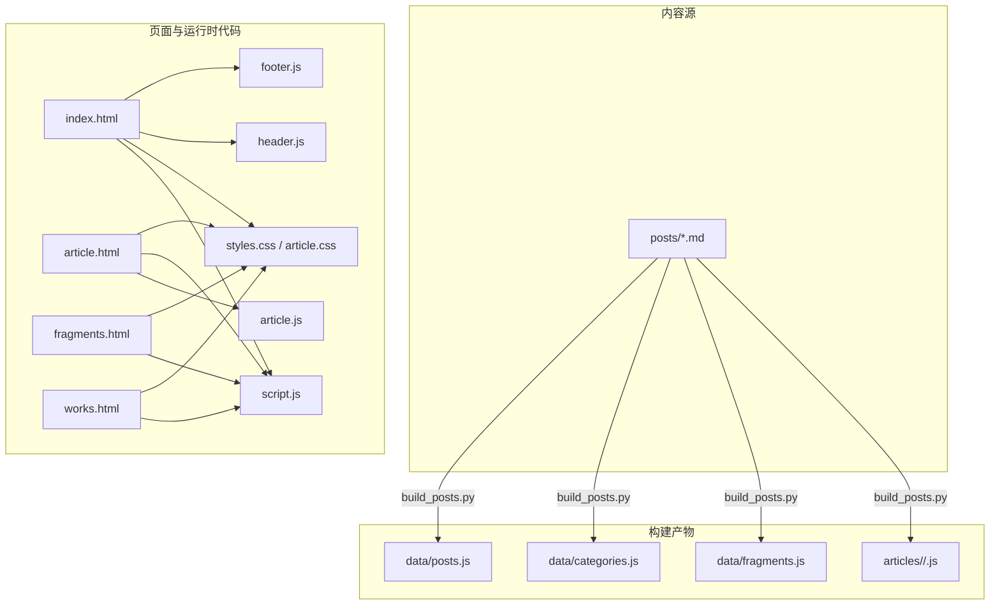
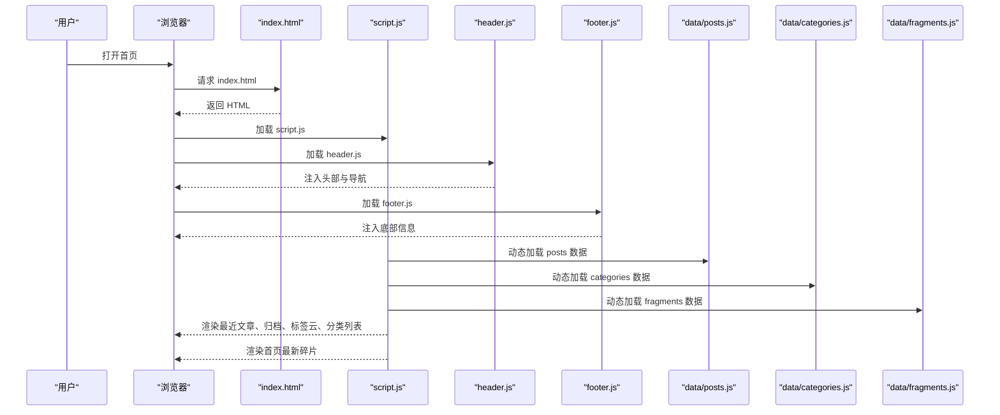
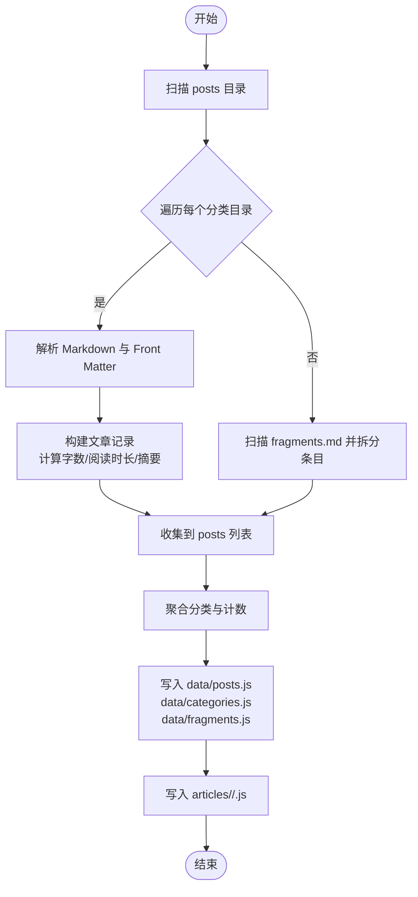
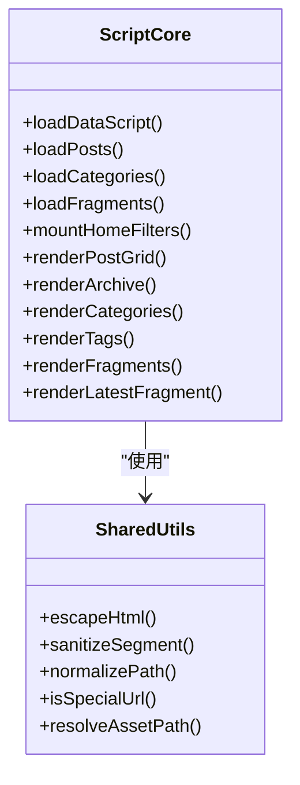
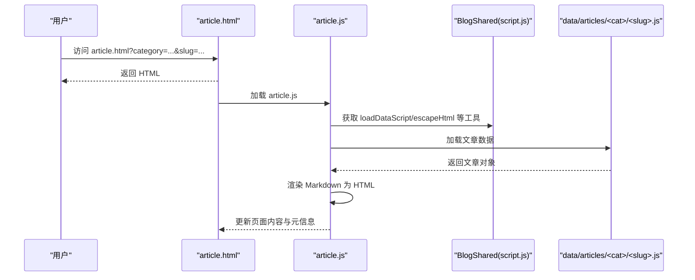
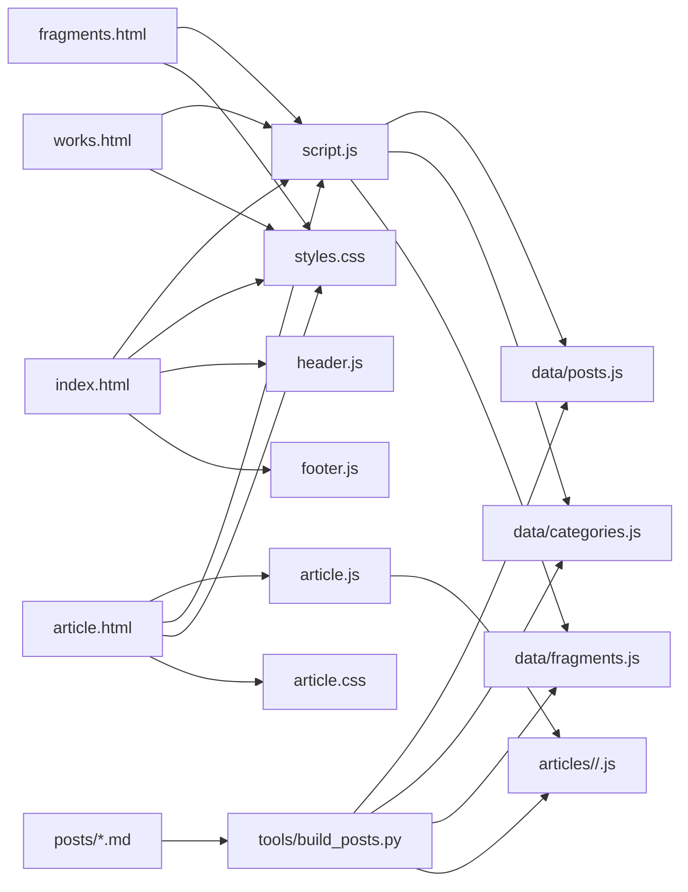

# 项目概述

<cite>
**本文引用的文件**   
- [index.html](file://index.html)
- [script.js](file://script.js)
- [styles.css](file://styles.css)
- [article.html](file://article.html)
- [article.js](file://article.js)
- [article.css](file://article.css)
- [fragments.html](file://fragments.html)
- [works.html](file://works.html)
- [header.js](file://header.js)
- [footer.js](file://footer.js)
- [data/posts.js](file://data/posts.js)
- [data/categories.js](file://data/categories.js)
- [data/fragments.js](file://data/fragments.js)
- [tools/build_posts.py](file://tools/build_posts.py)
</cite>

## 目录
1. [简介](#简介)
2. [项目结构](#项目结构)
3. [核心组件](#核心组件)
4. [架构总览](#架构总览)
5. [详细组件分析](#详细组件分析)
6. [依赖关系分析](#依赖关系分析)
7. [性能与可访问性](#性能与可访问性)
8. [快速开始](#快速开始)
9. [故障排查](#故障排查)
10. [结论](#结论)

## 简介
本项目是一个纯前端的静态博客系统，面向个人写作与分享。它采用 Markdown 作为内容来源，通过构建脚本将 Markdown 编译为前端可直接加载的数据与文章资源；页面在浏览器中动态渲染，支持分类、标签筛选、主题切换与响应式布局。整体设计强调轻量、无框架依赖、易维护与可扩展。

## 项目结构
仓库采用“内容 + 数据 + 页面 + 样式 + 工具”的分层组织方式：
- posts：Markdown 源文（按分类分目录）
- data：构建产物（posts、categories、fragments 的 JS/JSON）
- articles：单篇文章的 JSON/JS 产物（供详情页按需加载）
- 根目录 HTML/CSS/JS：站点页面、样式与运行时逻辑
- tools：Python 构建脚本，负责从 posts 生成 data 与 articles

图表来源
- [tools/build_posts.py:380-414](file://tools/build_posts.py#L380-L414)
- [index.html:1-93](file://index.html#L1-L93)
- [article.html:1-29](file://article.html#L1-L29)
- [fragments.html:1-23](file://fragments.html#L1-L23)
- [works.html:1-23](file://works.html#L1-L23)
- [script.js:1-701](file://script.js#L1-L701)
- [article.js:1-346](file://article.js#L1-L346)
- [header.js:1-110](file://header.js#L1-L110)
- [footer.js:1-36](file://footer.js#L1-L36)
- [styles.css:1-800](file://styles.css#L1-L800)
- [article.css:1-200](file://article.css#L1-L200)

章节来源
- [index.html:1-93](file://index.html#L1-L93)
- [tools/build_posts.py:380-414](file://tools/build_posts.py#L380-L414)

## 核心组件
- 构建器（Python）：扫描 posts 下的 Markdown，解析 Front Matter，生成 data 与 articles 产物，并输出 posts.json、categories.json、fragments.json 以及每篇文章的 JSON/JS。
- 首页运行时（script.js）：动态加载 data/posts.js、data/categories.js、data/fragments.js，实现分类/标签筛选、最近文章展示、归档列表、碎片时间线等。
- 文章页运行时（article.js）：根据 URL 参数 category 与 slug 加载对应文章的 JS 数据，进行简易 Markdown 渲染并更新页面元信息。
- 共享模块（header.js/footer.js）：注入全局头部导航、主题切换、移动端菜单与底部备案信息。
- 样式（styles.css/article.css）：提供响应式布局、卡片网格、侧边栏、暗色主题变量与交互动效。

章节来源
- [tools/build_posts.py:146-197](file://tools/build_posts.py#L146-L197)
- [script.js:12-37](file://script.js#L12-L37)
- [script.js:39-61](file://script.js#L39-L61)
- [script.js:448-495](file://script.js#L448-L495)
- [article.js:26-41](file://article.js#L26-L41)
- [article.js:96-266](file://article.js#L96-L266)
- [header.js:30-87](file://header.js#L30-L87)
- [footer.js:8-19](file://footer.js#L8-L19)
- [styles.css:1-31](file://styles.css#L1-L31)
- [article.css:1-62](file://article.css#L1-L62)

## 架构总览
本项目的数据流遵循“Markdown → 构建产物 → 浏览器动态渲染”的路径。页面不依赖服务端渲染或后端 API，所有数据以 JS 模块形式由浏览器加载，并在 DOM 中完成渲染与交互。

图表来源
- [index.html:1-93](file://index.html#L1-L93)
- [script.js:666-691](file://script.js#L666-L691)
- [header.js:1-110](file://header.js#L1-L110)
- [footer.js:1-36](file://footer.js#L1-L36)
- [data/posts.js:1-95](file://data/posts.js#L1-L95)
- [data/categories.js:1-19](file://data/categories.js#L1-L19)
- [data/fragments.js:1-14](file://data/fragments.js#L1-L14)

## 详细组件分析

### 构建器（tools/build_posts.py）
- 功能要点
  - 解析 Markdown 的 Front Matter，提取标题、分类、日期、标签、封面、排序等元信息。
  - 计算字数、阅读时长、摘要，并生成 posts 索引与分类统计。
  - 拆分“碎片”条目，基于二级标题的时间戳分割段落与图片。
  - 输出 data/posts.js、data/categories.js、data/fragments.js 以及 articles/<category>/<slug>.js。
- 复杂度与优化
  - 遍历 posts 目录与每个 Markdown 文件，时间复杂度 O(N)，N 为文章数量。
  - 正则处理与字符串操作为主，内存占用与文章体量线性相关。
  - 可通过增量构建与缓存减少重复解析开销（当前为全量构建）。

图表来源
- [tools/build_posts.py:337-350](file://tools/build_posts.py#L337-L350)
- [tools/build_posts.py:353-377](file://tools/build_posts.py#L353-L377)
- [tools/build_posts.py:380-414](file://tools/build_posts.py#L380-L414)

章节来源
- [tools/build_posts.py:52-88](file://tools/build_posts.py#L52-L88)
- [tools/build_posts.py:146-197](file://tools/build_posts.py#L146-L197)
- [tools/build_posts.py:300-320](file://tools/build_posts.py#L300-L320)
- [tools/build_posts.py:380-414](file://tools/build_posts.py#L380-L414)

### 首页运行时（script.js）
- 关键职责
  - 动态加载 data/posts.js、data/categories.js、data/fragments.js。
  - 提供分类与标签筛选、最近文章与归档排序、片段时间线渲染。
  - 暴露 BlogShared 工具集（escapeHtml、sanitizeSegment、normalizePath、resolveAssetPath 等），供其他页面复用。
  - 初始化共享头部与主题切换、移动端菜单。
- 数据结构与算法
  - normalizeCategories：合并显式分类与自动发现分类，按 order 与名称排序。
  - filterPosts：按分类与标签集合过滤文章。
  - sortRecentPosts/sortArchivePosts：分别用于“最近更新”和“归档”排序，支持置顶与自定义顺序。
- 错误处理
  - 使用 Promise.all 并行加载数据，失败时打印错误并降级渲染空状态。

图表来源
- [script.js:12-37](file://script.js#L12-L37)
- [script.js:188-195](file://script.js#L188-L195)
- [script.js:205-249](file://script.js#L205-L249)
- [script.js:257-299](file://script.js#L257-L299)
- [script.js:301-370](file://script.js#L301-L370)
- [script.js:448-495](file://script.js#L448-L495)
- [script.js:600-635](file://script.js#L600-L635)
- [script.js:649-664](file://script.js#L649-L664)

章节来源
- [script.js:12-37](file://script.js#L12-L37)
- [script.js:39-61](file://script.js#L39-L61)
- [script.js:205-249](file://script.js#L205-L249)
- [script.js:257-299](file://script.js#L257-L299)
- [script.js:448-495](file://script.js#L448-L495)
- [script.js:600-635](file://script.js#L600-L635)
- [script.js:649-664](file://script.js#L649-L664)

### 文章页运行时（article.js）
- 关键职责
  - 从 URL 参数读取 category 与 slug，加载对应 articles/<category>/<slug>.js。
  - 将 Markdown 文本转换为 HTML，支持标题、列表、引用、代码块、图片与内联格式。
  - 更新文档标题与 meta description，渲染标签、封面与正文。
- 安全与路径解析
  - 使用 escapeHtml 防止 XSS。
  - resolveMarkdownLink 将相对 .md 链接转为 article.html?category=...&slug=... 路由。
  - resolveImagePath/resolveSourcePath 统一资源路径解析。

图表来源
- [article.html:1-29](file://article.html#L1-L29)
- [article.js:1-41](file://article.js#L1-L41)
- [article.js:96-266](file://article.js#L96-L266)
- [script.js:188-195](file://script.js#L188-L195)

章节来源
- [article.js:26-41](file://article.js#L26-L41)
- [article.js:96-266](file://article.js#L96-L266)
- [article.js:268-320](file://article.js#L268-L320)

### 共享头部与底部（header.js / footer.js）
- 功能要点
  - 动态注入站点 Logo、品牌名、主导航、搜索按钮、主题切换与移动端菜单。
  - 设置 favicon，兼容不同页面的挂载点。
  - 底部注入备案号与外链。
- 交互
  - 主题切换：读写 localStorage，切换 body[data-theme]。
  - 移动端菜单：切换 aria-expanded 与类名控制展开/收起。

章节来源
- [header.js:30-87](file://header.js#L30-L87)
- [header.js:89-109](file://header.js#L89-L109)
- [footer.js:8-19](file://footer.js#L8-L19)
- [script.js:89-127](file://script.js#L89-L127)

### 样式与主题（styles.css / article.css）
- 设计要点
  - 使用 CSS 变量定义明/暗两套主题，body[data-theme="dark"] 覆盖变量值。
  - 响应式布局：hero 区域、卡片网格、侧边栏与归档列表适配多屏。
  - 文章页排版：标题层级、引用、代码块、图片与分隔线样式。
- 可访问性
  - 导航按钮提供 aria-label 与 aria-expanded。
  - 隐藏标题使用 visually-hidden 类提升屏幕阅读器体验。

章节来源
- [styles.css:1-31](file://styles.css#L1-L31)
- [styles.css:90-110](file://styles.css#L90-L110)
- [styles.css:248-324](file://styles.css#L248-L324)
- [styles.css:436-516](file://styles.css#L436-L516)
- [article.css:1-62](file://article.css#L1-L62)
- [article.css:115-157](file://article.css#L115-L157)

## 依赖关系分析
- 页面与脚本
  - index.html 依赖 script.js、styles.css、header.js、footer.js。
  - article.html 依赖 article.js、script.js、styles.css、article.css。
  - fragments.html 依赖 script.js、styles.css。
  - works.html 依赖 script.js、styles.css（占位页面）。
- 数据依赖
  - script.js 动态加载 data/posts.js、data/categories.js、data/fragments.js。
  - article.js 动态加载 articles/<category>/<slug>.js。
- 构建依赖
  - tools/build_posts.py 读取 posts 目录，生成 data 与 articles 产物。

图表来源
- [index.html:1-93](file://index.html#L1-L93)
- [article.html:1-29](file://article.html#L1-L29)
- [fragments.html:1-23](file://fragments.html#L1-L23)
- [works.html:1-23](file://works.html#L1-L23)
- [script.js:39-61](file://script.js#L39-L61)
- [article.js:26-41](file://article.js#L26-L41)
- [tools/build_posts.py:380-414](file://tools/build_posts.py#L380-L414)

章节来源
- [index.html:1-93](file://index.html#L1-L93)
- [article.html:1-29](file://article.html#L1-L29)
- [fragments.html:1-23](file://fragments.html#L1-L23)
- [works.html:1-23](file://works.html#L1-L23)
- [script.js:39-61](file://script.js#L39-L61)
- [article.js:26-41](file://article.js#L26-L41)
- [tools/build_posts.py:380-414](file://tools/build_posts.py#L380-L414)

## 性能与可访问性
- 性能
  - 首屏仅加载必要脚本与样式，数据按需异步加载，避免阻塞渲染。
  - 图片使用 loading="lazy" 延迟加载，降低初始带宽压力。
  - 使用 CSS 变量与 backdrop-filter 实现主题切换与毛玻璃效果，注意低端设备兼容性。
- 可访问性
  - 导航按钮具备 aria-label 与 aria-expanded，主题切换按钮语义清晰。
  - 隐藏标题使用 visually-hidden 类，便于屏幕阅读器识别。
  - 建议为图片补充 alt 描述，增强无障碍体验。

[本节为通用指导，无需特定文件来源]

## 快速开始
- 环境要求
  - Python 3.x（用于执行构建脚本）
  - 任意静态服务器（如 Nginx、Apache、VS Code Live Server 等）
- 基本使用
  - 在 posts 目录下按分类创建 Markdown 文件，并在文件头添加 Front Matter（title、category、date、tags、cover 等）。
  - 运行构建脚本生成 data 与 articles 产物：
    - 示例命令：python tools/build_posts.py
  - 启动静态服务器，访问 index.html 即可预览。
- 部署步骤
  - 将仓库根目录（包含 index.html、data、articles、assets、image 等）部署至静态托管平台（GitHub Pages、Vercel、Netlify 等）。
  - 确保构建产物已提交至仓库，或直接在前端托管平台的 CI 中集成构建步骤。

章节来源
- [tools/build_posts.py:380-414](file://tools/build_posts.py#L380-L414)
- [index.html:1-93](file://index.html#L1-L93)

## 故障排查
- 常见问题
  - 文章无法加载：检查 URL 参数 category 与 slug 是否正确，确认 articles/<category>/<slug>.js 是否存在。
  - 数据未更新：修改 posts 后需重新运行构建脚本，刷新浏览器缓存。
  - 图片路径异常：确认 cover 与图片路径符合 resolveAssetPath 规则，必要时使用绝对路径或 assets/image 前缀。
  - 主题切换无效：检查 localStorage 是否被浏览器策略限制，或手动清除 blog-theme 键值。
- 调试建议
  - 打开浏览器控制台查看网络请求与错误日志。
  - 在 script.js 与 article.js 的关键分支处增加 console.log 辅助定位。

章节来源
- [script.js:666-701](file://script.js#L666-L701)
- [article.js:322-345](file://article.js#L322-L345)

## 结论
本项目以极简的前端技术栈实现了完整的静态博客能力：Markdown 内容管理、动态页面渲染、分类与标签筛选、主题切换与响应式布局。通过 Python 构建脚本将内容转化为前端可直接消费的数据，既保证了开发体验，又维持了部署与运行的轻量化。对于初学者而言，它是理解静态站点生成与前端渲染流程的良好实践；对于有经验的开发者，其模块化结构与清晰的职责划分也为二次扩展提供了便利。